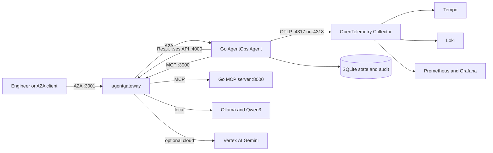

# AgentOps Open Course

Learn the complete lifecycle of a production-shaped AI agent in Go: build it with Google ADK, govern traffic with agentgateway, run it with kagent, and collect OpenTelemetry traces, logs, metrics, and evaluation evidence.

This checkout is a complete local reference and Hugo evaluation build. It is not published from this repository; release, repository identity, DNS, and documentation publication remain owner-gated.

## What makes the course practical?

- **One executable reference:** every chapter inspects and runs the same AgentOps Agent, then the capstone adapts it to a learner-owned domain.
- **Go from runtime to gates:** the agent, black-box evaluation harness, and repository maintenance tools are separate Go modules.
- **Account-free default:** local Qwen3 through Ollama requires no mandatory SaaS, provider account, or usage fee.
- **Typed operational boundaries:** tools, Agent Skills, MCP, A2A, confirmation, redaction, append-only audit evidence, persistent sessions, and recovery are implemented.
- **Bounded orchestration:** the conversational agent plans multi-step investigations; a runnable workflow enforces plan, investigate, evidence review, and recommendation.
- **One governed data plane:** agentgateway routes MCP, A2A, and OpenAI-compatible Responses API traffic.
- **One container contract:** the same static distroless image runs on the host, local k3d, and the optional GKE laboratory.
- **One observability stack:** OTLP fans out to Tempo, Loki, Prometheus, Alertmanager, and Grafana.
- **Evidence at the wire:** the standalone evaluator folds ADK REST and A2A events into the same typed turn and emits sanitized JSON plus OpenTelemetry evidence.
- **Source-linked teaching:** critical excerpts are rendered directly from named regions in `agents/go`, `evals`, `tools`, and infrastructure sources.

The required path is open source and uses open-weight model artifacts. Gemini, Vertex AI, GKE, GCS, Artifact Registry, and hosted repository services are optional proprietary comparisons.

The course's defensible difference is scope, not a “best course” claim: one Go application and one wire-only Go evaluator cover typed tools, safety, gateway policy, Kubernetes, recovery, telemetry, and release evidence without requiring hosted evaluation.

## What will you build?

The AgentOps Agent is an on-call assistant for a fictional platform. Ask it to investigate `INC-002` and initiate a guarded restart only if the evidence supports one:

```text
> Investigate INC-002. If the evidence supports it, initiate a guarded inventory restart.
  -> get_incident(incident_id="INC-002")
  -> get_service_status(name="inventory")
  -> search_service_logs(service="inventory")
  -> get_runbook(slug="service-down")
  -> restart_service(name="inventory")
     ADK requests confirmation; the function has not run.
  [awaiting human approval and rationale; no state change]
```

Every domain claim must come from a tool result. The guarded call creates a confirmation request; only a later confirmed execution with a rationale can mutate state and append an audit record.



**Diagram in words:** An engineer reaches the Go agent through agentgateway. The agent uses the same gateway for MCP, A2A, and model traffic; it writes controlled SQLite state and exports optional telemetry to the OpenTelemetry backends.

## Local quickstart

You need a Unix-like shell, Git, and [mise](https://mise.jdx.dev/). Install and activate mise, then run the model-free gates:

```bash
mise run install
mise run doctor
mise run check:core
mise run test
```

The learner gate does not start a model, container, cluster, collector, paid API, or cloud resource.

No Go coverage threshold is enforced because the owner has not selected one. `mise run coverage` reports measured coverage as evidence; it is not a pass policy.

For the first grounded turn, install [Ollama](https://ollama.com/download), then run:

```bash
ollama pull qwen3:4b-instruct
mise run doctor:model
cd agents/go
mise run web
```

Open the ADK web UI on `http://127.0.0.1:8002/ui/`, ask `List the open incidents`, and inspect the event stream for `list_incidents(status="open")`, its returned seed rows, and the final answer. Matching seed IDs without the observed call and result is only a plausible answer, not grounding evidence. `mise run run` is a faster console preview but cannot prove the trajectory. The first CPU turn can be slow while the model loads; a connection error usually means `ollama serve` is not running.

Model-backed commands are observations, not offline gate proof. They may vary across runs even with temperature zero.

Continue with the [canonical roughly three-hour build-first route](./content/0.%20Overview/0.0.%20Course.md#what-is-the-roughly-three-hour-build-first-route) before entering the longer production-operations track.

## Which learning path should you choose?

| Path                | Model                | Infrastructure     | Best for                                                   |
| ------------------- | -------------------- | ------------------ | ---------------------------------------------------------- |
| Offline engineering | None                 | Host process       | Source, tests, tools, policy, state, and docs              |
| Required OSS path   | Qwen3 through Ollama | Host, then k3d     | Completing core outcomes without an account or fee         |
| Optional provider   | Gemini               | Host process       | Comparing ADK's native provider after the local path works |
| Optional cloud lab  | Gemini on Vertex AI  | Zonal GKE Standard | Workload Identity, GCS artifacts, and cloud delivery       |

The GKE path is a billable, interruptible laboratory, not a production architecture. [7.3. Costs](./content/7.%20Observability/7.3.%20Costs.md) owns the current estimate and verification date.

## Course map

| Chapter                                                      | Outcome                                                                              |
| ------------------------------------------------------------ | ------------------------------------------------------------------------------------ |
| [0. Overview](./content/0.%20Overview/_index.md)             | Choose the architecture, stack, and learning path.                                   |
| [1. Setup](./content/1.%20Setup/_index.md)                   | Install only the prerequisites needed for the current checkpoint.                    |
| [2. Agents](./content/2.%20Agents/_index.md)                 | Run and understand the ADK Go agent on local Qwen3.                                  |
| [3. Capabilities](./content/3.%20Capabilities/_index.md)     | Inspect typed tools, skills, MCP, memory, workflows, and A2A.                        |
| [4. Quality](./content/4.%20Quality/_index.md)               | Enforce types, tests, black-box evaluations, guardrails, and adversarial regression. |
| [5. Gateway](./content/5.%20Gateway/_index.md)               | Govern MCP, A2A, and Responses API traffic with agentgateway.                        |
| [6. Platform](./content/6.%20Platform/_index.md)             | Deliver the same static image to k3d and the optional GKE lab.                       |
| [7. Observability](./content/7.%20Observability/_index.md)   | Trace, measure, evaluate, audit, and recover the system.                             |
| [8. Community](./content/8.%20Community/_index.md)           | Maintain, document, and prepare an open-source agent project.                        |
| [8.7. Capstone](./content/8.%20Community/8.7.%20Capstone.md) | Adapt the completed reference into an evidence-backed platform.                      |

## Repository layout

```text
agents/go/     Go ADK agent, protocols, policy, state, tests, and image
agents/data/   Immutable SQLite, runbook, skill, and log seed data
evals/         Standalone black-box Go evaluation module and assets
tools/         Standalone Go repository-maintenance commands
clients/web/   Minimal dependency-free A2A web client
load/          k6 load tests and latency budgets
content/       76 FAQ-based Hugo course pages
layouts/       Hugo templates, source includes, and accessibility helpers
data/nav.yaml  Explicit hand-ordered learning path
infra/         agentgateway, kagent, k3d/GKE, and observability resources
skills/        Portable Agent Skills distilled from the course
```

The root `go.mod` exists only for the Hextra Hugo Module. Application, evaluation, and repository-tool dependencies stay in their own modules.

## Everyday commands

From the repository root:

```bash
mise run install
mise run doctor
mise run format
mise run check:core
mise run check
mise run test
mise run scan
mise run build:docs
mise run serve
```

From `agents/go`:

```bash
mise run check
mise run test
mise run coverage
mise run build
mise run run
mise run workflow
mise run coordinator
mise run web
mise run a2a
mise run mcp
mise run mcp:http
mise run data:reset
```

From `evals`:

```bash
mise run eval:validate # offline
mise run check
mise run test
mise run eval:policy-trial     # exact-source REST calibration samples
mise run eval:a2a:policy-trial # exact-source A2A calibration samples
mise run eval:judge-calibration:trial # judge evidence before policy approval
mise run eval                  # approved-policy REST qualification
mise run eval:a2a              # approved-policy A2A qualification
```

`release-policy.json` is currently `calibration-required`, so canonical qualification and judge calibration fail closed until reviewed Go trials establish and approve the pass and judge-agreement floors, repeat count, mandatory outcomes, and usage budgets. Trial tasks collect evidence but cannot qualify a release.

Resetting agent state removes only `agents/go/.state`; it never changes `agents/data/incidents.db`.

## What does release evidence contain?

Model-backed evaluation produces sanitized handoffs at the `evals` module root:

- `eval-results.json`
- `judge-calibration-results.json`
- `cost-observed.json`

The schema-3 run artifact carries separate source mode, identity, revision, tree digest, dirty/shallow state, platform identity, model identity, evalset digest, policy identity, transport, repeated trajectory/judge/control scores, and usage. The schema-3 calibration handoff carries the same source and policy plus typed judge provider/name/digest and the exact policy floor.

Other campaigns use separate result filenames so they cannot overwrite the core release artifact. See [evals/README.md](./evals/README.md) for the exact schema and task mapping.

Release qualification requires all three handoffs plus the repository policy and expected source tree. The qualifier—not the candidate artifact—requires policy status `approved`, recomputes mandatory outcomes, requires judge and control-specific scorer coverage, binds source/tree/platform/model/judge/evalset/calibration/cost identities, and enforces the approved pass, agreement, repeat, and usage floors.

Local files are not release proof by themselves. Exact-head hosted CI, runtime storage, artifact attestation, and public publication are separate boundaries.

## How do you preview the course?

```bash
mise run serve
# open http://localhost:8003
```

The Hugo build treats warnings and bad references as errors, derives canonical routes from reviewed page and section slugs, checks rendered canonical/Open Graph/search/sitemap/navigation/fragment parity, and extracts code from named source regions. Every changed Mermaid diagram needs equivalent prose.

This checkout does not publish the site. A successful local build proves rendering only.

## Reuse and contribution

The top-level [`skills/`](./skills/) directory packages telemetry, guardrails, resilience, token budgets, least privilege, evaluation, and incident-response patterns in the portable Agent Skills format.

Course prose is [CC BY 4.0](./static/LICENSE.txt); software and repository automation are [MIT](./LICENSE). Read [SUPPORT.md](./SUPPORT.md), [CONTRIBUTING.md](./CONTRIBUTING.md), [GOVERNANCE.md](./GOVERNANCE.md), [ACCESSIBILITY.md](./ACCESSIBILITY.md), and [SECURITY.md](./SECURITY.md) before proposing a change.
