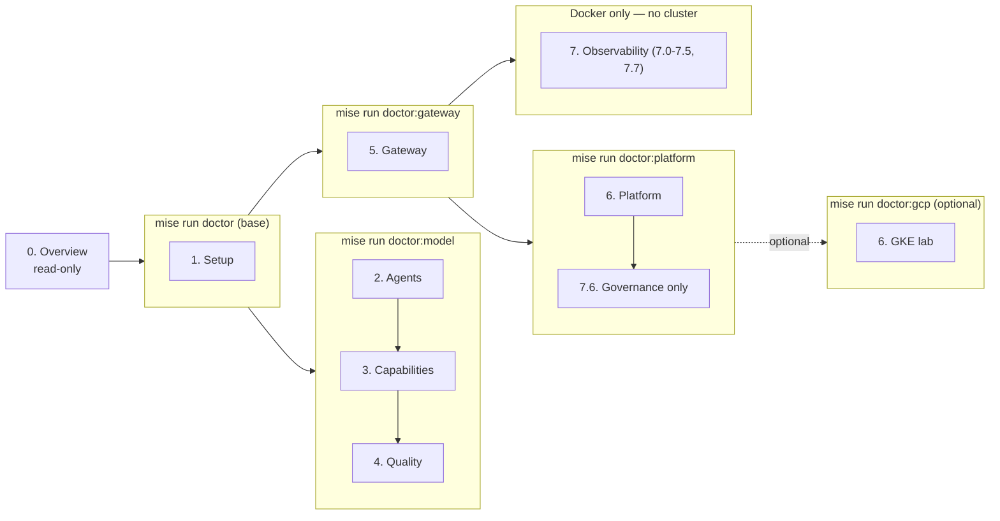

{}

- **You will:** Understand the course contract and pick the learning path you will follow.
- **You need:** Nothing beyond this course page.
- **Time:** about 20 minutes, orientation. {}

## What will this course teach you?

This course teaches the engineering discipline around an AI agent, not only the model call. You are not expected to recognize the names in the list below yet: each gets its own chapter, and [0.7. Glossary]() defines the course's key terms one line at a time.

You will inspect, run, and extend one completed **AgentOps Agent** through the AgentOps lifecycle — the loop from building an agent to observing it in production:

- Design an agentic loop and choose where deterministic code is better.
- Add typed tools, least-privilege Agent Skills, MCP, retrieval, workflows, and A2A.
- Enforce tests, behavioral evaluations, PII redaction, human approval, and append-only auditing.
- Put agentgateway in front of model, tool, and agent traffic.
- Package the application once and run it on local k3d or an optional GKE lab with kagent.
- Export telemetry through OpenTelemetry to self-hosted Tempo, Loki, Prometheus, and Grafana, and keep sanitized offline evaluation artifacts.

The result is production-shaped: it uses real boundaries and operational tools, while every action and dataset remains deliberately local and fictional. `main` is the finished reference, not an empty scaffold. The final capstone asks you to preserve its platform contracts while replacing the example domain with your own.

Chapter 0 stays read-only. [1.0. System]() owns cloning the repository and installing its learner toolchain when you are ready.

## Who is this course for?

This course is written for four kinds of reader:

- **Software engineers** who can read Go and want more than a chatbot tutorial.
- **AI and ML engineers** who need repeatable evaluation, security, and delivery practices.
- **Platform and SRE teams** who will operate agent workloads and their data plane.
- **Technical leaders** who need to evaluate where agent autonomy creates value or risk.

You do not need prior ADK, Kubernetes, MCP, A2A, or GCP experience. You should be comfortable with Git, a terminal, and basic Go.

That single sentence is honest for Chapters 2-4 and an understatement for 5-7, so the course states two tiers rather than one:

| Tier                         | What you need to be comfortable with                                                                                       | Where it binds                                                |
| ---------------------------- | -------------------------------------------------------------------------------------------------------------------------- | ------------------------------------------------------------- |
| Chapters 0-4 and 8           | Git, a terminal, basic Go, reading a stack trace                                                                           | Every checkpoint is a `mise run` task and a file you can open |
| Chapters 5-7 and the GKE lab | Reading YAML you did not write, HTTP status codes and headers, and a shell that stays open while a background service runs | Their checkpoints ask for more than running a command         |

Concretely, the second tier's checkpoints ask you to read a `kubectl kustomize` render and say which overlay patched a field, name the NetworkPolicy that denies a call, read a `p(95)` off a Grafana panel, write a Prometheus query, follow a CEL authorization expression, and review a `tofu plan` before approving it. None of that is prerequisite _knowledge_ — every one of those is taught on the page that asks for it — but each is a new notation, and Chapters 5-7 introduce six of them in a row. Budget accordingly, and expect to reread more there than in Chapters 2-4.

## What reference will you use?

The AgentOps Agent helps an on-call engineer investigate incidents for a fictional service. It can inspect an immutable SQLite seed, search logs and Markdown runbooks, load scoped instructions from Agent Skills, and propose or execute mock remediation.

State-changing tools require human approval. A write updates a disposable runtime database and appends an audit record in one transaction. The committed seed is never modified, so `mise run data:reset` (from `agents/go`) always returns the lab to a known state.

## What is the roughly three-hour build-first route?

Plan about 190 focused minutes; downloads, cold compilation, and image pulls add machine-dependent waiting.

Use only the linked exercise or proof section during this route. Return for the surrounding explanations and production-operations track after the exact image runs.

| Time   | Milestone                                               | Existing page and learner action                                                                                                                                                                                                                                                                                                                           | Proof boundary                                                                                                        |
| ------ | ------------------------------------------------------- | ---------------------------------------------------------------------------------------------------------------------------------------------------------------------------------------------------------------------------------------------------------------------------------------------------------------------------------------------------------- | --------------------------------------------------------------------------------------------------------------------- |
| 20 min | Prepare the checkout                                    | Follow [1.0. System]() through `doctor`, `check:core`, and `test`.                                                                                                                                                                                                                                                | Deterministic host checks; no model, container, network service, cluster, or cloud.                                   |
| 25 min | Observe one grounded turn                               | Use [2.1. First Agent]() to bind one answer to its `list_incidents` call and returned rows.                                                                                                                                                                              | Live local model observation; wording and latency can vary.                                                           |
| 20 min | Break and restore one instruction                       | Complete [2.3. Instructions](), retaining the red result before restoring the source and proving green.                                                                                                                                                        | Deterministic offline regression; leave no temporary source edit.                                                     |
| 35 min | Add one typed read                                      | Complete [3.1. Tools]() without adding a generic database or filesystem escape hatch.                                                                                                                                                        | Deterministic offline tests over a bounded local fixture.                                                             |
| 40 min | Keep one adversarial evaluation                         | Complete [4.4. Evaluations](), making its focused fixture red before the validator makes it green.                                                                                                                               | Deterministic offline evaluation; no stochastic run or release claim.                                                 |
| 10 min | Confirm local write; deny A2A write                     | Read [the simulated action boundary](), then run the two focused tests below.                                                                                                                                                                                   | Temporary SQLite state only; the A2A denial is offline boundary proof, not a network call.                            |
| 37 min | Prepare the engine; execute one content-addressed image | Complete [the container-engine verification](), then follow [the local agent-image build](). Capture the built image ID and run `version` using that ID instead of its movable development tag. | Local engine checks and one local container artifact; no signature, registry publication, deployment, cluster, or CI. |

The write checkpoint exercises confirmation and authentication as separate controls:

```bash
cd agents/go
go test ./tools \
  -run '^(TestApprovedRestartFlipsTheStatusAndAudits|TestAConfirmedNetworkActionRequiresAnAuthenticatedPrincipal)$' \
  -count=1
```

The first test commits a confirmed simulated restart and its audit row to temporary state. The second models unauthenticated A2A provenance and proves refusal before mutation or audit; it does not start an A2A listener.

At the container checkpoint, first complete the linked engine verification. Then execute the inspected content address rather than trusting the tag to remain unchanged:

```bash
mise run build:agent-image
agent_image_id="$(docker image inspect --format '{{.Id}}' agentops-agent:dev)"
test -n "$agent_image_id"
docker run --rm --read-only "$agent_image_id" version | jq
```

Stop here for the core route. Gateway runtime, Kubernetes, observability, qualification, and cloud work remain in the longer production-operations track.

## How does `INC-002` connect the chapters?

One fictional incident provides a cumulative thread without replacing the course's other ambiguous, refusal, and adversarial cases.

| Stage                | What `INC-002` makes observable                                                                                                 |
| -------------------- | ------------------------------------------------------------------------------------------------------------------------------- |
| First Agent          | `list_incidents(status="open")` returns it before the final answer names it                                                     |
| Sessions and memory  | conversation events, durable operator notes, A2A task state, and intentionally forgotten context remain distinct                |
| Skills, MCP, and A2A | the injected catalog supplies procedure names; reviewed skills, governed reads, and protocol events retain separate authority   |
| Workflow/coordinator | a bounded plan and least-privilege specialists gather evidence before a reviewed recommendation                                 |
| Guarded action       | the inventory restart is a mock proposal until confirmation; identity, one transaction, replay, and fresh reads complete proof  |
| Evaluation           | trajectory, grounding, required safety cases, stochastic variance, and cost are measured separately                             |
| Gateway and platform | central routing and policy do not widen the Go runtime's guarded-write authority                                                |
| Observability        | telemetry operates the agent and collector handling the case; it does not become evidence about the fictional inventory failure |

## Which two incident domains must stay separate?

The agent diagnoses fictional records; the learner operates real failures of the agent stack.

Chapters 0-6 use immutable SQLite incidents, fixture logs, and Markdown runbooks as the agent's local domain. Its required tools do not query Prometheus, Loki, Tempo, or Grafana.

Chapter 7 instead handles failures such as an unavailable model route, rejected write path, exhausted budget, missing telemetry, or unhealthy collector. Prometheus, Loki, Tempo, Alertmanager, and Grafana help the learner diagnose that agent/runtime/collector boundary. They do not reveal the fictional root cause of `INC-002`.

An advanced learner could add a separately governed read-only observability MCP surface, but it is not part of the required agent and is never implied by the examples.

## Where does this course differ from adjacent agent courses?

The distinction is executable scope, not a claim that one curriculum is universally better.

| Course                                                                                                        | Verifiable emphasis                                                                                                                                                                               |
| ------------------------------------------------------------------------------------------------------------- | ------------------------------------------------------------------------------------------------------------------------------------------------------------------------------------------------- |
| AgentOps Open Course                                                                                          | One Go application and standalone Go evaluator; account-free required path; typed runtime through gateway, Kubernetes, recovery, telemetry, and release evidence                                  |
| [Hugging Face Agents Course](https://huggingface.co/learn/agents-course/unit0/introduction)                   | Python prerequisite, agent fundamentals, and several framework units; observability and evaluation live in a [bonus unit](https://huggingface.co/learn/agents-course/en/bonus-unit2/introduction) |
| [LangChain Academy: Building Reliable Agents](https://academy.langchain.com/courses/building-reliable-agents) | Python or TypeScript setup followed by LangSmith observation, datasets, experiments, judges, pairwise evaluation, online evals, and automations                                                   |
| [DeepLearning.AI: Evaluating AI Agents](https://corporate.deeplearning.ai/courses/evaluating-ai-agents)       | A focused evaluation course covering tracing, router and skill evaluation, trajectories, structured evaluation, judge improvement, and monitoring                                                 |

Choose by the boundary you need to learn. This course prioritizes full operational continuity and explicit safety/proof limits over framework breadth or a hosted evaluation workflow. The external curricula were checked on 2026-08-09 and must be rechecked before publication because their syllabi can change.

## Which learning path should you use?

Take the Required OSS path unless you already know you want another one. It runs the model on your own machine through **Ollama**, a local model server.

| Path                  | Requires a model?    | Requires cloud? | Purpose                                                                                                             |
| --------------------- | -------------------- | --------------- | ------------------------------------------------------------------------------------------------------------------- |
| Offline engineering   | No                   | No              | Install, inspect data, run static checks, and execute the deterministic test suite.                                 |
| **Required OSS path** | Qwen3 through Ollama | No              | Complete the agent, gateway, local platform, and observability outcomes account-free. **← take this one if unsure** |
| Optional provider     | Gemini               | Optional        | Compare ADK's native provider adapter after the local path works.                                                   |
| Optional cloud lab    | Gemini on Vertex AI  | Yes             | Practise GKE, Workload Identity Federation, GCS artifacts, and immutable delivery.                                  |

The required path uses the Apache-2.0 open-weight Qwen3 model. It needs no account, no mandatory SaaS, and no usage fee; it does use your machine's compute, storage, and electricity. Chapter 2 connects directly to Ollama. Chapter 5 changes only the OpenAI-compatible base URL to route the same model through agentgateway.

## Which prerequisite tier does each chapter need?

Each chapter admits exactly the tools it needs. A matching **`doctor` profile** — the `mise` task that checks one scoped set of prerequisites — verifies that boundary before you start. Profiles are diagnostics for a path, not one additive ladder; Chapter 5, for example, needs both the model and gateway profiles.



Note where Chapter 7 sits. Seven of its eight pages need only Docker and the host observability stack, so they do not wait on a Kubernetes cluster — only 7.6 Governance does, because its audit drill reads from the deployed platform. Tracing, cost attribution, monitoring, and incident response are the highest-transfer skills here; they should not be gated behind the heaviest chapter.

Chapter 8 starts from the base tier and adds profiles milestone by milestone. The optional GKE lab is the one path that adds `doctor:gcp` on top of the platform tier.

## How long should the course take?

That depends on which course you take. Reading the pages and clearing each chapter's checkpoint is roughly **12 to 19 focused hours**. Running every command on every page is closer to **29 hours** — that is what the per-page **Time** lines add up to, and the right-hand column below.

| Stage                           | Read + checkpoints | Every command on every page |
| ------------------------------- | ------------------ | --------------------------- |
| Overview and setup              | 1-2 hours          | 4.5 hours                   |
| Agent and capabilities          | 4-6 hours          | 5 hours                     |
| Quality and gateway             | 3-4 hours          | 7.5 hours                   |
| Platform and observability      | 3-5 hours          | 9 hours                     |
| Community and capstone planning | 1-2 hours          | 3 hours                     |

Neither column is a target. Take the left one if you want the ideas and the evidence, the right one if you want every boundary in your own hands.

Installation, image pulls, local model speed, and prior Kubernetes experience can change that substantially. A complete capstone implementation is intentionally open-ended and usually adds several focused sessions. The optional GKE lab adds provisioning time and should be completed separately.

## How much does it cost?

The course content and code are free to use under their respective licenses. The offline and local Qwen3 paths have no model API fee, but they use your own compute and electricity.

Gemini and GCP usage can be billed. Check the current [GKE pricing](https://cloud.google.com/kubernetes-engine/pricing) and the OpenTofu plan before creating anything.

[7.3. Costs]() exclusively owns the dated GKE estimate, its calculation, and the inputs to refresh immediately before an approved apply.

{}

One Spot node is interruptible and not highly available. The cloud chapter teaches identity, packaging, routing, persistence, and teardown. It does not claim to satisfy a production SLO. {}

## Is the whole stack open source?

Every required piece is; the optional integrations are not.

The required software stack is open source: Google ADK, agentgateway, kagent, OpenTelemetry, Tempo, Loki, Prometheus, Grafana, Ollama, the Apache-2.0 open-weight Qwen3 model, the standalone Go evaluation harness, and this repository.

{}

Gemini, Vertex AI, GKE, and GitHub hosting are proprietary services. They are optional integrations and are named as such. "Open-source course" means the course implementation is inspectable, modifiable, and self-hostable; it does not relabel a hosted model or cloud as open source. {}

## How should you work through each page?

Every page is organized around practical questions. Four conventions hold everywhere:

- Run commands from the repository root unless a block says otherwise.
- Critical Go excerpts are included directly from source and checked during the site build.
- Complete each checkpoint before enabling the next prerequisite tier.
- For infrastructure chapters, verify the result and run the scoped teardown when you finish.

A page checkpoint validates the result you just built before you continue. A chapter-index checkpoint is different: it is the exit recap for all sub-pages, so its links may point ahead while you are reading; run that checklist only after the chapter's pages.

## What proves this page worked?

There is nothing to run. Summarize your choices before Setup adds tools.

**You are done when:**

- You can state the course outcome and one case where deterministic software is better than an agent.
- You know the audience, expected time, local resource trade-offs, and optional costs.
- You can name the two prerequisite tiers and one notation Chapters 5-7 expect you to read that Chapters 2-4 never mention.
- You can name which of the four learning paths you are taking, and what it requires.
- You know that [1.0. System]() begins the installation.

Continue to [0.1. Agents]() when you can explain the outcome you want from the course.
