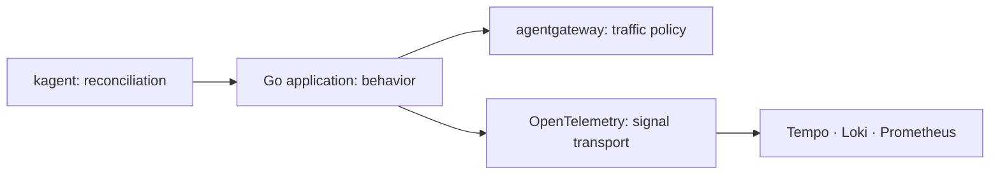
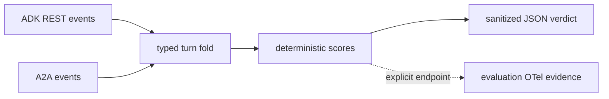
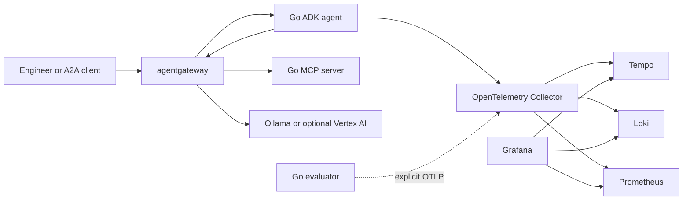

{}

- **You will:** Identify which component owns each runtime and evidence boundary.
- **You need:** [0.2. AgentOps]() read.
- **Time:** no reading time — this is a lookup page; about 15 minutes end to end. {}

## Which components form the stack?

| Boundary                            | Component                   | Repository owner                          |
| ----------------------------------- | --------------------------- | ----------------------------------------- |
| Agent loop, tools, sessions, policy | Google ADK for Go           | `agents/go/`                              |
| MCP, A2A, and model traffic         | agentgateway                | `infra/agentgateway/`                     |
| Kubernetes agent resources          | kagent                      | `infra/kagent/` and `infra/helmfile.yaml` |
| Local open-weight model             | Ollama and Qwen3            | validated environment and model catalog   |
| Black-box evaluation                | Standalone Go harness       | `evals/`                                  |
| Telemetry transport                 | OpenTelemetry               | agent and collector configuration         |
| Trace storage                       | Tempo                       | `infra/observability/`                    |
| Log storage                         | Loki                        | `infra/observability/`                    |
| Metrics and alerts                  | Prometheus and Alertmanager | `infra/observability/`                    |
| Visualization                       | Grafana                     | dashboards and datasources                |
| Optional cloud substrate            | GKE, Vertex AI, GCS         | `infra/gcp/` and GKE overlay              |

Each component owns one boundary. The repository composes them through public protocols instead of sharing implementation internals.

## Why keep responsibilities separate?

The Go application owns behavior. agentgateway owns traffic policy. kagent owns Kubernetes resource reconciliation. OpenTelemetry owns signal transport, while the backends own storage and query.



**Diagram in words:** kagent reconciles the Go application, which owns behavior and uses agentgateway for governed traffic. The application emits signals through OpenTelemetry, and Tempo, Loki, and Prometheus store the resulting traces, logs, and metrics.

That separation lets one layer change without rewriting the others, provided the pinned contract still passes its gate.

An all-in-one platform can reduce setup, but it also couples model routing, agent logic, storage, evaluation, and deployment. The course keeps those choices visible.

## What does Google ADK own?

ADK supplies agent and model interfaces, the model-and-tool loop, plugins, session services, confirmation, the development web surface, and A2A integration.

The repository supplies the domain, tools, policy, state rules, composition, and tests. `agents/go/go.mod` is the dependency authority.

The application passes a concrete `model.LLM`; ADK does not discover arbitrary model names from strings.

## What does agentgateway own?

agentgateway exposes three governed front doors:

- MCP reads on `:3000`.
- A2A traffic on `:3001`.
- OpenAI-compatible Responses API traffic on `:4000`.

It applies routing, authentication policy, rate limits, prompt guards, central masking, and metrics. Raw upstreams remain behind it and bound to loopback or cluster networking.

The agent does not delegate write authorization to the gateway. Confirmed write tools remain in process.

## What is the stable port contract?

Three ports are memorable: MCP `:3000`, A2A `:3001`, and model `:4000`. The full inventory is fixed so tasks and probes agree:

{}

| Port              | Service                | Scope                             |
| ----------------- | ---------------------- | --------------------------------- |
| `:3000`           | agentgateway MCP       | Governed MCP front door           |
| `:3001`           | agentgateway A2A       | Governed A2A front door           |
| `:4000`           | agentgateway model     | Responses API front door          |
| `:15020`          | agentgateway metrics   | Prometheus scrape target          |
| `:15021`          | host gateway readiness | Wrapper readiness probe           |
| `:8000`           | raw MCP server         | Upstream, not a LAN service       |
| `:8080`           | raw A2A server         | Agent serving and kagent probe    |
| `:8083`           | kagent control plane   | Agent-as-MCP and session/task API |
| `:8001`           | web client             | Local A2A client                  |
| `:8002`           | ADK development web UI | Local inspection UI               |
| `:8003`           | Hugo preview           | Local documentation reload        |
| `:11434`          | Ollama                 | Local model endpoint              |
| `:3200`           | Tempo                  | Trace query API                   |
| `:4317` / `:4318` | OTLP                   | Collector gRPC and HTTP receivers |
| `:8889`           | collector metrics      | Span-derived RED metrics          |
| `:13133`          | collector health       | Pod-local readiness and liveness  |
| `:9090`           | Prometheus             | Metric store and rules            |
| `:9093`           | Alertmanager           | Host alert routing                |
| `:3002`           | Grafana                | Host dashboards and Explore       |
| `:3100`           | Loki                   | Log store                         |
| `:5050`           | local registry         | k3d image registry                |

{}

Every host quickstart publishes on loopback. No course profile creates a public application endpoint.

## What does kagent own?

kagent translates declared agent resources into Kubernetes workloads. The course declares:

- A BYO Agent that runs the course image and probes its A2A card.
- A ModelConfig that points at the in-cluster gateway model listener.
- A RemoteMCPServer that exposes only governed read tools.

The application still owns logic, sessions, policy, and state. The same container runs without kagent during host development.

## What does the evaluation harness own?

`evals` calls only ADK REST or A2A. It folds both transports into one typed turn and scores required trajectories, usage budgets, recognized grounding, and strict report schemas.



**Diagram in words:** ADK REST and A2A events enter the same typed turn fold. Deterministic scorers evaluate that normalized turn, write a sanitized JSON verdict, and optionally export separate evaluation evidence through an explicitly configured OpenTelemetry endpoint.

An optional gateway judge is calibrated before use. Sanitized JSON and OTel evidence record the outcome without prompts, answers, tool payloads, rationales, endpoints, credentials, or provider errors.

Evaluation does not run inside the agent's collection pipeline.

## How do OpenTelemetry and evaluation fit together?

Runtime telemetry and evaluation evidence share OpenTelemetry standards but remain separate producers.

The agent exports model, tool, application, log, and metric signals when its OTLP endpoint is configured. The evaluator exports run, case, score, usage, and pass signals only through its explicit eval endpoint.

Tempo, Loki, Prometheus, and Grafana provide the comparison surface already taught in Chapter 7. Git owns the instruction version, and sanitized JSON remains the release handoff.

## How do the components fit at runtime?



**Diagram in words:** Clients and the Go agent use agentgateway for A2A, MCP, and model traffic. The agent and optional evaluator send distinct OpenTelemetry signals through one collector to the three storage backends, which Grafana queries.

## What do Prometheus and Grafana own?

Prometheus stores bounded time-series data and evaluates alert rules. Alertmanager routes firing alerts in the host profile.

Grafana reads Tempo, Loki, and Prometheus. It does not collect telemetry or change application state.

Trace-to-log and log-to-trace links work because the agent stamps trace and span ids on structured log records.

## Which open standards connect the stack?

- OpenAI Responses API shape between ADK's compatible adapter, Ollama, and agentgateway.
- MCP between agent and read-tool server.
- A2A between clients, gateway, agent, and kagent BYO resources.
- OTLP and OpenTelemetry semantic conventions between producers and collector.
- OCI images and attestations for artifact identity.
- Kubernetes APIs and OpenTofu plans for platform declaration.

Standards reduce coupling; they do not guarantee two pinned implementations are compatible. Contract tests still own that proof.

## How does this transfer to another framework?

Keep the boundaries even if the libraries change:

1. A typed model and tool loop.
1. A governed network data plane.
1. Black-box evaluation at a public transport.
1. Content-minimized telemetry through a standard collector.
1. Immutable seed and controlled runtime state.
1. One artifact identity from source to deployment.

Port the contracts, not framework-specific class names.

## What should you verify before upgrading?

Use each manifest as authority, then run the owning gate:

```bash
mise run format
mise run check
mise run test
```

For agent or model changes, run both Go module gates and model-backed evaluation on the exact candidate. For infrastructure changes, render and validate manifests before starting a cluster.

Never infer compatibility from a project name, shared foundation, or floating tag.

## What proves this page worked?

This lookup page needs no service running.

**You are done when:**

- You can name the owner of agent logic, traffic, Kubernetes reconciliation, evaluation, signal transport, and each storage backend.
- You can explain why model and deployment changes do not rewrite application logic.
- You know where to find every stable port and version authority.
- You can state how runtime telemetry and evaluation evidence share a stack without sharing a producer path.

Continue to [0.4. Providers]() when every boundary has one named owner.
