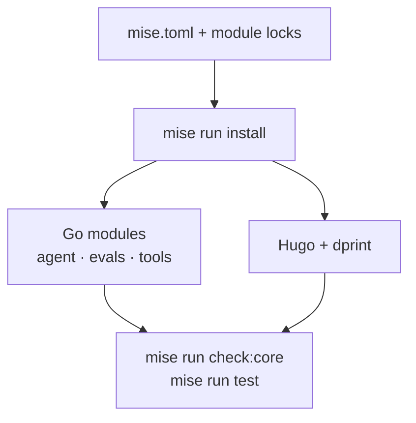

{}

- **You will:** Install the repository's pinned tools, diagnose the base environment, and run the model-free baseline.
- **You need:** Git, a Unix-like shell, and permission to install tools in your user account.
- **Time:** about 20 minutes, hands-on. {}

## What do you need before starting?

Start with Git, a terminal, and enough Go knowledge to read a function and a failing test.

The fully exercised path is Linux x86_64 with cgroup v2. Linux arm64, macOS, and WSL2 remain best-effort because the container and local-cluster paths cannot be proved identically on every host.

You do not need a model, API key, container engine, Kubernetes cluster, or cloud project for this page.

## How do you install mise safely?

Install [mise](https://mise.jdx.dev/) from its official instructions, then activate it in your shell.

```bash
mise --version
mise trust mise.toml
mise trust agents/go/mise.toml
mise trust agents/data/mise.toml
mise trust evals/mise.toml
mise trust tools/mise.toml
```

These commands avoid `--all`, which would also walk parent and unrelated nested directories. Mise can share trust for equivalent paths across linked Git worktrees, so inspect every named file before accepting it. The frozen Python reference is outside the learner and validation paths and is deliberately not trusted.

## Which operating systems are supported?

Support describes tested behavior, not a promise that every optional integration works everywhere.

| Host                        | Status          | Boundary                                                                    |
| --------------------------- | --------------- | --------------------------------------------------------------------------- |
| Linux x86_64 with cgroup v2 | Fully supported | Offline gates, containers, k3d, and host observability are exercised here.  |
| Linux arm64                 | Best-effort     | Go builds are portable; pinned third-party images and tools may differ.     |
| macOS                       | Best-effort     | Offline Go and docs work; container networking follows the desktop runtime. |
| WSL2                        | Best-effort     | File permissions, cgroups, and host networking depend on the WSL setup.     |

`SUPPORT.md` owns this matrix and its deprecation policy.

## Why does the course use mise?

One task vocabulary keeps local work, hooks, and CI aligned while the root tool table pins exact CLI versions.



**Diagram in words:** The root mise configuration and Go module locks drive installation. Installation prepares the agent, evaluation, repository-tool, and documentation dependencies. The same sources then feed the core check and test gates.

Mise does not start Ollama, Docker, Kubernetes, or cloud resources. Later pages opt into those services only when their evidence requires them.

## How do you install the repository toolchain?

Run the guarded sequence from the repository root:

```bash
mise run install
mise run doctor
mise run check:core
mise run test
```

`install` resolves the three Go modules and installs hooks. `doctor` checks the base authoring tools. `check:core` and `test` are deterministic and make no model call.

## What does `mise run install` create on disk?

The install task resolves declared dependencies without creating a second language environment.

1. `agents/go/go.sum` records the reference agent's exact module resolution.
1. `evals/go.sum` records the standalone evaluation harness resolution.
1. `tools/go.sum` records the native repository-tool resolution.
1. `lefthook install` connects local hooks to the same `mise run` tasks used elsewhere.

Go's module cache is outside the repository. Generated agent state stays under `agents/go/.state`, and the built Hugo site stays under `site/`; neither is source authority.

## Which prerequisite tier should you install?

Install only the tier needed by the page you are following.

```bash
mise run doctor           # base Go and documentation path
mise run doctor:model     # adds Ollama and the pinned local model
mise run doctor:gateway   # adds the host agentgateway path
mise run doctor:platform  # adds k3d, kubectl, Helm, and Skaffold
mise run doctor:gcp       # optional Google Cloud path
```

These profiles are independent diagnostics. A passing base profile does not prove a model, gateway, cluster, or cloud account.

## What does each doctor profile actually check?

Each profile checks only its declared boundary and fails with an actionable missing prerequisite.



The base doctor checks mise-managed `actionlint`, `dprint`, Go, `golangci-lint`, `gotestsum`, Hugo, `jq`, `lychee`, `shellcheck`, `shfmt`, `sqlite3`, `trivy`, and Zizmor. Git, curl, a C compiler, `install`, Make, and tar remain reviewed host prerequisites for checkout and the verified SQLite source build.

- **model** adds Ollama and the configured local model.
- **gateway** adds Docker, OpenSSL, and mise-managed `yq` plus the pinned host gateway wrapper.
- **platform** checks `age-keygen`, `agentgateway`, `helm`, `helmfile`, `k3d`, `kube-linter`, `kubeconform`, `kubectl`, `promtool`, `rg`, `skaffold`, `sops`, plus the gateway tier.
- **gcp** checks `gcloud`, `gke-gcloud-auth-plugin`, `helm`, `helmfile`, `kubeconform`, `kubectl`, `rg`, `skaffold`, `tflint`, and `tofu` plus the gateway tier.

The repository does not install Google Cloud CLI components. Install `gcloud` and `gke-gcloud-auth-plugin` from the same reviewed Cloud SDK or host package source, run `mise run install:platform` for the repository-managed planning tools, then let `mise run doctor:gcp` verify the complete live prerequisite boundary.

A doctor result is prerequisite evidence. It is not application, model-quality, deployed-runtime, or release evidence.

## What usually goes wrong on a first install?

The common failures are path or scope mistakes.

- **Mise is installed but not activated.** A different tool version wins on `PATH`; restart the shell and re-run `mise --version`.
- **The checkout is not trusted.** Review and repeat the five explicit `mise trust <path>` commands above; do not broaden the operation with `--all`.
- **A task runs from the wrong module.** Use root tasks unless a page explicitly says `cd agents/go`, `cd evals`, or `cd tools`.
- **A heavy service is expected too early.** The base gate deliberately does not start a model, container, cluster, or cloud resource.

Use [0.7. Troubleshooting]() when the failing layer is not obvious.

## What proves this page worked?

Run the model-free checkpoint from the repository root:

```bash
mise run doctor
mise run format:core
mise run check:core
mise run build:docs
```

Formatting may update files; inspect those changes before keeping them. The Go suites do gate on coverage — 80% line coverage per package — but that floor only proves the tests reach the code, while correctness is enforced by the tests themselves, race detection, formatting, linting, and the repository contracts.

**You are done when:**

- `mise run doctor` reports the base profile ready.
- `mise run format:core` leaves only expected formatting changes.
- `mise run check:core` exits zero without starting a model or platform service.
- `mise run build:docs` renders `site/` with no warning.

Continue to [1.1. Go]() when the base profile and model-free gates pass.
