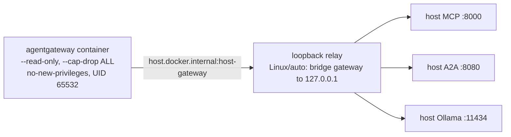

{}

- **You will:** Verify a container engine end to end, then run one throwaway container under the exact hardening the gateway wrapper uses.
- **You need:** Nothing from this chapter. On the local model path, skip straight to [1.4. Providers]() — [5.1. Gateway Setup]() brings you back here before it starts the gateway.
- **Time:** about 12 minutes, hands-on. {}

## A CLI is not an engine

A colleague sets up a fresh macOS laptop, installs the `docker` CLI, and never starts the virtual machine that is supposed to sit behind it. `docker` answers on `PATH`. `docker --help` is perfect. Then the first command that has to _run_ something hangs and dies, because the client is talking to nothing at all — and because a client is perfectly happy to exist on its own, nothing said so until a container tried to start.

That is the state this page exists to rule out, and it takes four commands rather than one, because each of them checks a different layer:

```bash
docker version
docker info
docker run --rm hello-world
docker compose version
```

`docker version` is the one that separates client from engine, and both halves have to be there:

```text
Client: Docker Engine - Community
 Version:           29.6.2
 API version:       1.55
 OS/Arch:           linux/amd64

Server: Docker Engine - Community
 Engine:
  Version:          29.6.2
  API version:      1.55 (minimum version 1.40)
  OS/Arch:          linux/amd64
```

That is one real run, trimmed to the fields that matter: a client-only install prints the `Client` block and then an error where `Server` should be. `docker run --rm hello-world` then proves the engine can pull an image and actually execute a container. This is a real first pull with the interleaved layer-progress lines cut and the greeting stopped after two of its twenty:

```text
Unable to find image 'hello-world:latest' locally
latest: Pulling from library/hello-world
4f55086f7dd0: Pull complete
Digest: sha256:7f4da0fc94bcece205a8c0b6f4d11c8196924654ffe5c4d1aa439b7f632048b2
Status: Downloaded newer image for hello-world:latest

Hello from Docker!
This message shows that your installation appears to be working correctly.
```

That `Digest:` line is the whole reason images travel well: it names the image by a hash of its own bytes, and Chapter 6 pins every base image by exactly that string.

`docker compose version` is not padding either. Chapter 7's local observability stack — the OpenTelemetry Collector, Tempo, Loki, Prometheus, Alertmanager, and Grafana — is a Compose project, so a missing Compose plugin does not surface here; it surfaces four chapters later, in the middle of something else.

When all four answer, the repository's own gateway profile agrees:

```bash
mise run doctor:gateway
```

```text
[doctor:gateway] $ ./scripts/doctor.sh gateway
gateway    ready
env        optional .env is absent
docker     ready
```

That last line is the whole check condensed: the doctor runs `docker info` and `docker compose version`, and confirms the host gateway wrapper is executable. When it cannot reach an engine it prints `docker     daemon is unavailable` instead, and exits non-zero.

**You now have a container engine you have actually exercised, rather than one you have installed.**

Any engine that implements the open-source Docker CLI, Engine API, and Compose specification works: [Docker Engine](https://docs.docker.com/engine/) on Linux, [Podman](https://podman.io/) with Podman machine, or [Colima](https://github.com/abiosoft/colima) behind a Docker-compatible CLI on macOS. Docker Desktop runs the same commands but is a proprietary product with its own licence terms, so it is optional rather than part of this course's open-source claim. Podman is adaptable but not the validated learner path, for the concrete reason in the section after next: the Chapter 5 wrapper shells out to `docker` and hardens the container in ways whose host-reachability behavior differs per engine.

## What the image freezes, and what stays outside it

The reason to package an agent at all is that the same bytes run on your laptop and in a cluster. One image runs on the local k3d cluster of Chapter 6 and on GKE, Google's hosted Kubernetes, with no re-install and no version drift.

An **OCI image** is the open container-image format Docker and Podman both produce. It freezes one statically linked Go binary, its A2A and MCP entrypoints, and the seed dataset into an immutable, content-addressable artifact — named by a hash of its own bytes, so one name can never mean two different things.

What deliberately stays outside is everything that changes per environment: provider keys, writable state, telemetry endpoints, and the model backend are all injected at runtime. Keep that split in mind and most of Chapter 6 stops being surprising.

The agent's own image — its build stages, its digest-pinned bases, its package pins, and the non-root UID it runs as — belongs to [6.1. Containers](), and that page owns it alone. Do not build it now; Chapter 6 validates the image, the local registry, and the Kubernetes deployment together, and reading it here would mean reading it twice.

## Five engine features the Chapter 5 wrapper depends on

The gateway container Chapter 5 runs is locked down, and the lock uses five standard Docker options. Your engine has to accept all of them:

- A **read-only root filesystem** (`--read-only`): the container cannot write into its own image.
- **Dropping every Linux capability** (`--cap-drop ALL`): capabilities are the individual pieces of root privilege, and the container keeps none of them.
- **`no-new-privileges`**: nothing inside can gain more privilege than it started with.
- A **`noexec` tmpfs**: a small in-memory scratch directory at `/tmp`, mounted so that nothing written there can be executed.
- The **`host.docker.internal:host-gateway` mapping**: the name the container uses to reach services on your host.

**agentgateway** is the proxy Chapter 5 puts in front of the agent, its tools, and the model ([0.8. Glossary]()). The `gateway:host*` tasks run one hardened agentgateway container that fronts host-loopback services: the agent's A2A server (`:8080`), its MCP server (`:8000`), and the model backend (Ollama `:11434`). The wrapper [`gateway-host.sh`](https://github.com/MLOps-Courses/agentops-open-course-go/blob/main/infra/scripts/gateway-host.sh) assembles that run as UID 65532, and every published port binds to loopback only, so the gateway never listens on a routable interface. [5.1. Gateway Setup]() prints the exact argument list and owns it.

The fifth requirement is the portability seam, and it is where engines genuinely differ. A container cannot reach host loopback services the same way everywhere: Docker Desktop already routes `host.docker.internal` to the host, while native Linux Docker resolves it to the bridge gateway address — where nothing is listening for services the host bound to its own loopback.

The wrapper closes that gap with a bounded Go relay in `tools/cmd/loopback-relay`, controlled by `AGENTOPS_GATEWAY_LOOPBACK_RELAY=auto`. On native Linux it binds the wrapper-owned bridge gateway and forwards MCP, A2A, and model traffic to host loopback; on Docker Desktop it is skipped entirely. Metrics never cross that seam, because Compose Prometheus scrapes the gateway container directly.



**Diagram in words:** The hardened gateway container reaches the host through the `host.docker.internal` mapping; on Linux a wrapper-owned relay listens on the bridge gateway and forwards the MCP, A2A, and model traffic to the host's own loopback ports.

## Your turn: run the hardened shape yourself

Reading a list of flags is not the same as knowing your engine honors them. This takes one throwaway container and about fifteen seconds.

Predict first: with a read-only root filesystem and a writable `/tmp`, which of the two writes below succeeds — and what should `host.docker.internal` resolve to inside the container on your host?

- **Mode**: `inspect` — `--rm` removes the container when it exits, and nothing is written outside it.
- **Goal**: confirm your engine accepts all five hardening options and wires the host mapping.
- **Files to touch**: none.
- **Preflight**: `mise run doctor:gateway` exits zero.
- **Steps**: run the command below. Its five hardening arguments are copied from the wrapper's own `hardened-container-args` block, so if your engine accepts these it accepts the gateway.

```bash
docker run --rm --user 65532:65532 --read-only --cap-drop ALL \
  --security-opt no-new-privileges=true \
  --tmpfs "/tmp:rw,noexec,nosuid,nodev,size=16m,mode=1777" \
  --add-host "host.docker.internal:host-gateway" \
  busybox:latest \
  sh -c 'id; echo probe > /probe 2>/dev/null || echo "root filesystem: read-only"; echo probe > /tmp/probe && echo "tmpfs: writable"; grep host.docker.internal /etc/hosts'
```

- **Gate that proves completion**: the run prints an unprivileged identity, refuses the write to `/`, accepts the write to `/tmp`, and resolves the host mapping to an address. On a native Linux engine it looks like this, with the shell's own error arriving wherever the two output streams interleave:

```text
sh: line 0: can't create /probe: Read-only file system
uid=65532 gid=65532 groups=65532
root filesystem: read-only
tmpfs: writable
172.17.0.1	host.docker.internal
```

- **Final state**: the container is already gone. Nothing on your host changed, and no agent image was built.

The address on the last line is your engine's bridge gateway, and it will differ on your machine — that is precisely the value the loopback relay exists to bridge. If instead your engine rejects one of the five options, you have found the real blocker four chapters before it would have surfaced as "the gateway will not start".

## What you can do now

- `docker version` shows both a client and a server, and `docker run --rm hello-world` actually executes a container.
- `mise run doctor:gateway` prints `docker     ready` rather than `docker     daemon is unavailable`.
- You ran a container under the exact hardening the gateway wrapper uses, and saw the read-only root refuse a write while `/tmp` accepted one.
- You have not built the agent image, and you can name the chapter that does.

An hour ago "Docker is installed" was a yes-or-no question. You can now tell a client from an engine, and you have proof that your engine accepts the specific restrictions this course's proxy runs under.

Return to [5.1. Gateway Setup]() now that `mise run doctor:gateway` reaches your engine. [1.3. Kubernetes]() waits until Chapter 6.
