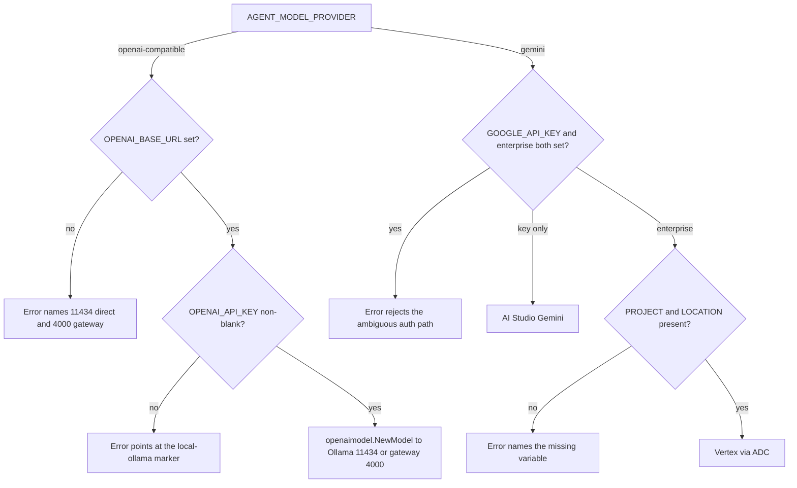
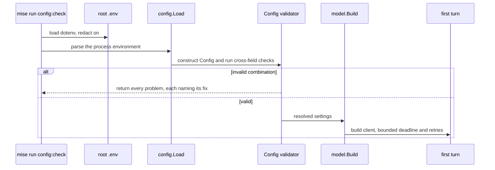

{}

- **You will:** Install Ollama, pull Qwen3, get `mise run doctor:model` green, and give the first call a deadline your hardware can actually meet.
- **You need:** The [1.1. Go]() checkpoint passing — `mise run check` and `mise run test`, both from `agents/go`.
- **Time:** about 30 minutes, hands-on. {}

## The download is not the slow part

Here is how the first hour usually goes wrong. The 2.5 GB of weights come down fine. The doctor is green. Then the first real question is asked, nothing happens for a minute, and the run dies with a timeout — three times over, because the client retries. It looks exactly like a broken installation, and it is not: a four-billion-parameter model on a laptop CPU simply takes longer than sixty seconds to load itself and read a prompt carrying every tool's schema, and sixty seconds is what the agent grants by default.

You are going to fix that on this page, before it bites, and it costs one line in one file. First, get the model serving.

Get Ollama from [ollama.com/download](https://ollama.com/download). On macOS and Windows the app installer starts the server for you; on Linux, review the official script before running it — the same curl-then-run pattern as mise, with the same rule of reading it first:

```bash
curl -fsSL https://ollama.com/install.sh -o /tmp/ollama-install.sh
sh /tmp/ollama-install.sh
```

With the daemon serving, pull the Apache-2.0 open-weight model and list what you have:

```bash
ollama pull qwen3:4b-instruct
ollama list
```

```text
NAME                       ID              SIZE      MODIFIED
nomic-embed-text:latest    0a109f422b47    274 MB    3 days ago
qwen3:4b-instruct          0edcdef34593    2.5 GB    3 days ago
```

The weights are fetched once and cached on disk, so a slow progress bar on a home connection is normal rather than stuck. The second entry is optional: `nomic-embed-text` is the embedding model behind Chapter 3's semantic runbook retrieval, and nothing before it needs the model.

Now verify the path the way CI does:

```bash
mise run doctor:model
```

```text
[doctor:model] $ ./scripts/doctor.sh model
model      ready
env        optional .env is absent
ollama     0.32.6 with qwen3:4b-instruct ready on 127.0.0.1:11434
```

**A language model is now running on your own hardware — no account, no API key, no per-token bill, and nothing you ask it will leave the machine.** The `env` line will read `.env available to explicit live/config tasks` instead once you create a `.env`, which is only necessary for the deadline below and the optional Gemini path.

## The doctor only looks; it starts nothing

That green line is worth more than `ollama list`, and it is worth reading why. The check is deliberately a probe rather than a launcher: it never starts Ollama, never pulls a model, and never sends a prompt. It asks the server two questions and refuses on either.



The first question is which version is answering. The agent reaches Ollama through ADK's OpenAI-compatible client, which speaks only the Responses API, and Ollama grew that API in 0.13.3 — so an older daemon returns 404 for every model call while looking perfectly healthy from every other angle. That is a genuinely miserable failure to diagnose, and the floor above turns it into one sentence.

The second question is whether the model is actually there: the check reads `/api/tags` and requires a served model name that starts with `qwen3:4b-instruct`. A stopped daemon and a never-pulled model therefore produce different messages rather than the same shrug — `start Ollama: it is not answering on 127.0.0.1:11434` when nothing responds on the port, and `start Ollama and run: ollama pull qwen3:4b-instruct` when the server is up but the model is absent.

Take the first message literally. Nothing in this repository starts Ollama for you: not the doctor, not a mise task, not the agent. Starting the model server is yours, and it stays that way so that no course command can quietly spin up a process it does not know how to stop.

## Give the first call more than sixty seconds

The shipped deadline is sixty seconds with two bounded retries, sized for a warm GPU. On a CPU-only laptop the first call also pays the model load, so the honest thing to do now is to raise it for your hardware.

The variable lives in a gitignored `.env` at the repository root — not beside the Go module, because the agent's model-backed tasks run from `agents/go` and load `../../.env`:

```bash
cp .env.example .env
chmod 600 .env
```

Then set one line in it: `AGENT_MODEL_TIMEOUT_S=180` for a CPU-only laptop, or `300` for a slow or memory-tight machine. Confirm the file was read at all with `mise run config:check`, which prints every resolved setting with secrets masked.

Predict what happens if you get greedy and set it to `900`. Then try it:

```bash
AGENT_MODEL_TIMEOUT_S=900 mise run config:check
```

```text
[config:check] $ cd agents/go && mise run config:check
[config:check] $ go run ./cmd/agent config:check
Agent configuration is invalid:
- AGENT_MODEL_TIMEOUT_S: must be greater than 0 and at most 600, got 900
exit status 1
[config:check] ERROR task failed
[config:check] ERROR task failed
```

The three lines in the middle are the agent talking; everything around them is mise, which echoes each command before running it and reports the failure once per level — the root task delegating into the module, then the module task running the binary.

Six hundred seconds is the ceiling, and it is a ceiling on purpose: a turn that never finishes under an unbounded deadline is a hang, not a slow model, and it deserves to be found rather than waited out. [0.7. Troubleshooting]() walks through timing one turn before you tune, if you would rather measure than guess.

The retry count is bounded for a sharper reason. A chat completion is not idempotent: a network failure _after_ inference means an SDK retry repeats the model work, the latency, and — on a hosted provider — the cost. Both provider branches therefore fix their own deadline and retry count rather than accepting SDK defaults, the gateway adds no retries of its own, and guarded write actions are never retried at all. [4.5. Guardrails]() owns that last rule.

Deterministic checks never see any of this. `mise run check:core` and `mise run test` load no dotenv, so nothing you write in `.env` can turn an offline check green or red.

## One variable picks the provider; one URL picks the topology

The defaults you have been using already select local Ollama, so on the required path you configure no provider variable at all. Two names still repay ten minutes, because Chapter 5 changes one of them and Chapter 5 is where people get confused.

`AGENT_MODEL_PROVIDER` is a two-value enum: `openai-compatible` (the default) or `gemini`. It selects the ADK client, and every other provider field is read only on its own branch. The `openai-compatible` branch reads `OPENAI_BASE_URL` (default `http://127.0.0.1:11434/v1`, direct Ollama) and `OPENAI_API_KEY` (default the non-secret marker `local-ollama` — the OpenAI SDK refuses an empty key even when nothing authenticates it).

The field is named for the client contract, not the deployment topology, and that is why the entire Chapter 5 gateway swap is a URL rather than a provider:

- `OPENAI_BASE_URL=http://127.0.0.1:11434/v1` points at Ollama directly.
- `OPENAI_BASE_URL=http://127.0.0.1:4000/v1` points at the agentgateway model route, which then owns policy and telemetry in front of the same Ollama.

The application-side provider value never changes across that switch. Naming the field `ollama` would have baked one topology into a contract deliberately built to outlive it.

{}

`agents/go/config/config.go` parses the environment once into a typed `Config`, so the defaults below are the ones the runtime really uses rather than prose that can drift:



The whole provider question is that one two-branch, four-leaf decision:



**Diagram in words:** The provider variable chooses one of two branches. The `openai-compatible` branch needs a base URL and a non-blank key before it builds an OpenAI-protocol client against direct Ollama or the gateway; the `gemini` branch needs exactly one authentication path — an AI Studio key, or enterprise mode with a project and a location.

Each error box is a real message from the validator quoted in the next collapsible, and each leaf is a real branch of `model.Build` in `agents/go/model/model.go`. {}

The optional Gemini path needs a Google account and changes three lines. For an AI Studio key:

```bash
AGENT_MODEL_PROVIDER=gemini
AGENT_MODEL=gemini-3.6-flash
GOOGLE_API_KEY=replace-me
```

For Vertex AI through **Application Default Credentials** — the credentials Google's SDKs find on the machine — use enterprise mode with an explicit project and location instead of a key:

```bash
gcloud auth application-default login
AGENT_MODEL_PROVIDER=gemini
AGENT_MODEL=gemini-3.6-flash
GOOGLE_GENAI_USE_ENTERPRISE=true
GOOGLE_CLOUD_PROJECT=your-gcp-project-id
GOOGLE_CLOUD_LOCATION=global
```

Verify that path against the same project before using it:

```bash
GCP_PROJECT_ID=your-gcp-project-id mise run doctor:gcp
```

The doctor reads `GCP_PROJECT_ID` and nothing else. Leave it unset and the check refuses with `ambient project fallback is disabled` rather than picking up whatever project `gcloud` happens to have configured — and if that ambient project disagrees with the approved one, it refuses again and names both. It also does not load `GOOGLE_CLOUD_PROJECT` from `.env`, so the variable that configures the agent and the variable that authorizes a cloud check stay separate on purpose.

One credentials habit is worth the story behind it. A key committed to Git is a bad afternoon: you rotate it, force the history, and move on. A key baked into a container image is worse, because an image is named by a hash of its own bytes — the layer carrying that key keeps its digest, gets pushed to a registry, pulled onto every node that ever schedules it, and cached there. Rotation does not reach those copies. So the key lives in `.env`, readable only by you, and the Trivy scan in `mise run secure` is told to skip that one file so a local secret never trips the scan and never becomes a reason to weaken it. Redaction is handled for you from there: `config:check` masks `Secret` fields and the mise dotenv loader runs with redaction on, so neither a resolved-config dump nor a task log echoes a key. Cloud workloads carry no key at all: the optional GKE overlay federates an identity instead of storing a service-account file. Prompts and tool arguments are a second copy of your data with a switch of their own, off by default, and [7.1. Tracing]() owns it.

{}

The validator itself, quoted from `agents/go/config/validate.go`:



What that rejects, and why each message earns its length:

- **`openai-compatible` with no `OPENAI_BASE_URL`** names both correct values in one line, so you never have to guess the port.
- **`openai-compatible` with a blank `OPENAI_API_KEY`** explains that the local path still needs a non-empty marker.
- **`gemini` with both an API key and enterprise mode** is rejected rather than silently preferring one, so an ambiguous intent becomes a failure instead of a guess.
- **`gemini` enterprise mode missing project or location** names each absent variable individually.
- **A removed `AGENT_GATEWAY_ENABLED`** produces a migration error instead of being ignored, pointing at the URL switch that replaced it.

Cross-field checks append to a list and raise together, so one run surfaces every problem in a phase at once instead of one failure per restart:



**Diagram in words:** A mise task loads the root environment and asks the typed loader to parse and cross-check it. Invalid combinations return all their problems before startup; valid configuration reaches model construction, and only then can a first turn run. {}

## Your turn: make the validator refuse, three ways

The cheapest way to trust a validator is to watch it reject things. None of this touches a file, and each command exits non-zero on its own.

Predict each answer before you run it: does a blank key fail, or fall back to a default? Do two bad settings produce two messages, or the first one only?

- **Mode**: `inspect` — every command below sets a variable for one process and changes nothing on disk.
- **Goal**: see that configuration is rejected at startup, with the fix named, before any model client exists.
- **Files to touch**: none.
- **Preflight**: `mise run config:check` currently exits zero and prints your resolved settings.
- **Steps**: run `OPENAI_API_KEY= mise run config:check`, then `AGENT_MODEL_TIMEOUT_S=900 AGENT_TOOL_TIMEOUT_S=700 AGENT_A2A_PORT=99999 mise run config:check`, and finally `AGENT_MODEL_PROVIDER=gemini mise run config:check`.
- **Gate that proves completion**: each run exits non-zero and names the exact variable to change. The second one reports all three problems in one pass, sorted, rather than dying on the first:

```text
[config:check] $ cd agents/go && mise run config:check
[config:check] $ go run ./cmd/agent config:check
Agent configuration is invalid:
- AGENT_A2A_PORT: must be between 1 and 65535, got 99999
- AGENT_MODEL_TIMEOUT_S: must be greater than 0 and at most 600, got 900
- AGENT_TOOL_TIMEOUT_S: must be greater than 0 and at most 600, got 700
exit status 1
[config:check] ERROR task failed
[config:check] ERROR task failed
```

- **Final state**: nothing changed. `mise run config:check` with no prefix still exits zero.

The third command is the interesting one. `gemini` with no credentials at all fails with a message that lists both ways to supply them — which is the difference between a validator that says "invalid configuration" and one that ends the conversation.

## What you can do now

- `mise run doctor:model` exits zero and names the Ollama version and the model serving on your machine.
- Your `.env` carries a model deadline your hardware can meet, and `mise run config:check` shows the resolved value with secrets masked.
- You can say what changes when Chapter 5 puts a gateway in front of the model, and what deliberately does not.
- You made the validator refuse three different ways and read the fix out of each message.

An hour ago running a model meant signing up for something. You now have one on your own hardware, a check that proves it without spending a token, and a deadline set from your machine's real behavior rather than from a default written for a GPU.

Continue to [1.5. Workspace](), the last page before the agent gets its first question.
