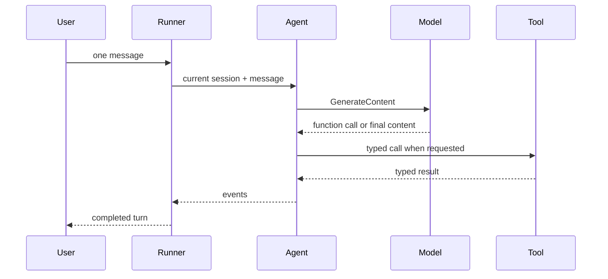

{}

- **You will:** Build a precise mental model of the Go ADK runtime before starting the first model-backed turn.
- **You need:** The deterministic setup checkpoint passing.
- **Time:** about 20 minutes, concept. {}

## What does ADK provide?

Google ADK for Go provides the interfaces and runtime machinery for agents, models, tools, runners, sessions, events, plugins, workflows, and service launchers.

The course supplies the domain behavior around those primitives: configuration, SQLite stores, incident tools, policy, telemetry, A2A durability, and the executable surfaces in one binary.

## What does the runner own?

The runner turns one user message into a stream of typed events.

It owns the interaction among the selected agent, model, tools, session service, and app-wide plugins. The command constructs those dependencies explicitly and closes resources when the runtime stops.



**Diagram in words:** A user gives one message to the runner. The runner invokes the agent with its session. The agent asks the model, may call a typed tool and return its result to the model, then emits events that form the completed turn.

## What does ADK not do for you?

The framework does not choose your authority, privacy, reliability, or evidence contracts.

You must decide which tools can write, how identity is proven, which content may reach telemetry, where state persists, which failures retry, and what qualifies a release. This repository makes each choice executable and testable.

## What is stored in a session?

A session stores conversation events and application state for one app, user, and session identity.

The Go agent uses a SQLite session service so a conversation can survive a process restart. Cross-session operator notes are a different memory boundary, and A2A task state is a different protocol boundary.

## What are events?

Events are the runner's typed record of one turn: authored messages, function calls, function responses, state changes, errors, and completion.

The standalone evaluation harness folds REST and A2A responses into its own captured `Turn` type. It excludes partial text from deterministic final-answer scoring, so transport framing cannot change the verdict.

## What is the difference between tools and policy hooks?

A tool is an explicit capability the model can select. A policy hook is an app-wide control that surrounds model and tool boundaries regardless of which agent is active.

The agent's read tools expose incident, log, runbook, and retrieval data. Guarded actions require confirmed, attributable identity. The policy plugin applies budget, compaction, redaction, injection hardening, and telemetry controls once at the application boundary.

## Where do workflows fit?

An ADK workflow is a declared sequence or parallel graph used when control flow should not be left to an open-ended model loop.

The reference `triage_workflow` follows plan, investigate, evidence review, and recommendation. It is read-only and bounded. The coordinator is separate: it delegates to specialists whose tool sets are structurally restricted.

## Where does A2A fit?

A2A exposes the composed agent as a discoverable network service with an agent card, tasks, messages, and streaming task events.

The deployed course surface is `agent a2a`, not ADK's in-memory demonstration launcher. The course server adds a persistent task store, verified-identity binding, readiness, cancellation, drain, and restore recovery.

## Where does each concept live in the repository?

| Concept                    | Go authority                                                           |
| -------------------------- | ---------------------------------------------------------------------- |
| Composition and root agent | `agents/go/compose/composition.go`                                     |
| Model boundary             | `agents/go/model/model.go`                                             |
| Runner and command wiring  | `agents/go/cmd/agent/`                                                 |
| Typed configuration        | `agents/go/config/`                                                    |
| Sessions and A2A tasks     | `agents/go/cmd/agent/`, `agents/go/state/`, and `agents/go/a2aserver/` |
| Tools and guarded writes   | `agents/go/tools/`                                                     |
| App-wide policy            | `agents/go/policy/`                                                    |
| Workflows and delegation   | `agents/go/compose/workflow.go` and `agents/go/compose/delegation.go`  |
| Black-box evaluation       | `evals/`                                                               |

Use these paths as source links. A copied SDK snippet is never version authority; `go.mod`, installed module source, and tests decide what the pinned API does.

## What proves this page worked?

Run the focused offline packages:

```bash
cd agents/go
go test ./compose ./cmd/agent ./state ./a2aserver
```

**You are done when:**

- You can distinguish a runner, session, event, tool, policy hook, workflow, and A2A task.
- You can point to the Go package that owns each concept.
- The focused packages pass without calling a model.

Continue to [2.1. First Agent]() when the boundaries are distinct in your own words.
