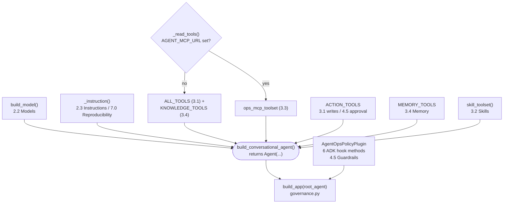

{}

- **You will:** Run the reference agent against your local model, check that its answer names the seed's three open incidents and no id outside the seed, then read the one file that assembles it.
- **You need:** `mise run doctor:model` passing and `qwen3:4b-instruct` pulled.
- **Time:** about 30 minutes, hands-on. {}

## What are you about to run?

The **AgentOps Agent** is an on-call assistant for a fictional platform. You ask it about an incident. It reads the incident record, the service status, the logs, and the matching runbook, then answers from what those tools returned.

This page runs it first and explains it second. That order is deliberate: the wiring makes far more sense once you have watched the thing work. Everything the agent can do is assembled in one module, `composition.py` — the model it calls, the instruction it follows, its tools, and the checks that run around them.

## How do you run it with local Qwen3?

The provider setup is already complete. Validate it from the repository root, then start ADK's local developer UI:

```bash
mise run doctor:model
cd agents/python
mise run web
```

Open `http://127.0.0.1:8002`, select the AgentOps Agent, and ask `List the open incidents`. This is the first live model request in the course. Stop the server with `Ctrl+C` when you finish.

No `.env` file and no account are needed. The defaults already use `AGENT_MODEL_PROVIDER=openai-compatible`, `AGENT_MODEL=qwen3:4b-instruct`, `OPENAI_BASE_URL=http://127.0.0.1:11434/v1`, and a non-secret local marker.

Open the **Events** timeline after the answer. A correct first turn contains this trajectory: the model asks for one tool, the runtime runs it against the seed, and the answer names only ids the tool returned.

```text
user  › List the open incidents

# 1. the model emits a tool call — it runs nothing itself (2.2)
tool  › list_incidents(status="open")

# 2. the runtime executes the read against the immutable seed and returns typed rows
tool  ‹ [INC-002 inventory SEV1 open, INC-005 search SEV3 open, INC-010 api-gateway SEV3 open]

# 3. the model summarizes ONLY what the tool returned, referring to incidents by id
model › There are three open incidents: INC-002 (inventory, SEV1) — inventory service
        unavailable; INC-005 (search, SEV3) — search results slow; and INC-010
        (api-gateway, SEV3) — gateway workers degrade over uptime. INC-002 is the most
        severe.
```

Those are exactly the three `open` rows from the table above. `INC-001` and `INC-009` are `investigating`, not `open`, so a correct run leaves them out — an answer naming five incidents is wrong even though it looks plausible. Wording can differ on every run; the tool call and the ids cannot.

If you later prefer a terminal-only conversation, use `mise run run`. It prints the answer but hides the tool-call events, which is why the first lesson uses `mise run web` ([2.5. Dev Loop]()).

{}

The first request loads the model into memory and runs inference on your own hardware. The first token can take tens of seconds on a CPU, and is much faster on a GPU or Apple Silicon. Later turns are quicker while the model stays warm.

If a run seems to hang, confirm with `ollama ps` or the Ollama server log rather than assuming either a failure or success. A loaded model means the turn is running.

But a slow turn is not free: the agent applies a **60-second deadline per model call**, with two retries, sized for a warm GPU. On a CPU-only machine a single turn can exceed it, and you get three timed-out attempts instead of an answer. If that is what you see, raise `AGENT_MODEL_TIMEOUT_S` to 180 — or 300 on a slow or memory-tight machine — in the gitignored root `.env`, and re-run. [0.6. Troubleshooting]() covers how to size it from one timed turn.

The serving window that also governs speed and truncation is covered in [3.4. Memory](). {}

{}

A run that answers `There are open incidents such as INC-042 and INC-101…`, or that names any id outside the seed table above, is a grounding failure. The model predicted a plausible-looking incident instead of reading one ([2.2. Models]()).

The ids are what you can check in `mise run run`. The tool call behind them is the real evidence, and `mise run web` shows it in the Events timeline: no call, no grounding. {}

{}

Slowness is normal; an immediate connection refusal is not. It means the agent could not reach the model endpoint at all, usually because `ollama serve` is not running, or because `OPENAI_BASE_URL` does not match your path. Use `http://127.0.0.1:11434/v1` for direct Ollama in this chapter; `http://127.0.0.1:4000/v1` applies only once the gateway is up in Chapter 5.

Re-run `mise run doctor:model` to confirm the endpoint and that `AGENT_MODEL` is pulled, then retry. See [0.6. Troubleshooting]() for the full checklist. {}

The optional Gemini path sets `AGENT_MODEL_PROVIDER=gemini`, an explicit Gemini model, and either `GOOGLE_API_KEY` or Application Default Credentials — see [2.2. Models](). It is not required to complete this page.

## What is in the dataset the agent reads?

Now compare the answer with the ground truth. Every example references ids from one immutable seed ([`agents/data`](https://github.com/MLOps-Courses/agentops-open-course/blob/main/agents/data/README.md)):

| Incident | Service     | Status        | Runbook slug      |
| -------- | ----------- | ------------- | ----------------- |
| INC-001  | checkout    | investigating | `high-latency`    |
| INC-002  | inventory   | open          | `service-down`    |
| INC-003  | payments    | resolved      | `elevated-errors` |
| INC-004  | auth        | resolved      | `elevated-errors` |
| INC-005  | search      | open          | `high-latency`    |
| INC-006  | checkout    | resolved      | `disk-full`       |
| INC-007  | cache       | resolved      | `memory-leak`     |
| INC-008  | database    | resolved      | `cascade-failure` |
| INC-009  | checkout    | investigating | `cascade-failure` |
| INC-010  | api-gateway | open          | `memory-leak`     |

**The `open` filter returns three seed rows.** A grounded answer names INC-002, INC-005, and INC-010, with no id outside that result.

{}

Eight services back those incidents: `api-gateway` and `checkout` are `degraded`, `inventory` is `down`, and `auth`, `cache`, `database`, `payments`, and `search` are `operational`. Seven runbooks form the knowledge base (`cascade-failure`, `deployment-rollback`, `disk-full`, `elevated-errors`, `high-latency`, `memory-leak`, `service-down`). Four services carry sample logs read by `search_service_logs` (`checkout`, `inventory`, `cache`, `database`), and two Agent Skills (`incident-triage`, `remediation`) hold the progressively-disclosed procedures of [3.2. Skills]().

Two details are deliberate. INC-007 → INC-008 → INC-009 is a cascade chain, and INC-010 is an ambiguous open incident used for retrieval evaluation. The negatives the eval set depends on — incident `INC-999` and service `warehouse` — are absent by design ([4.4. Evaluations]()). {}

## How is the root agent defined?

Now open the file behind what you just ran.

`composition.py` is the agent's _composition root_: the one place that assembles a system's dependencies, instead of scattering wiring decisions across the codebase. For the default Google ADK path, `build_conversational_agent()` returns the `Agent(...)`; the validated selector then exposes that result as `root_agent`.



The composition is declarative and build-checked against [`composition.py`](https://github.com/MLOps-Courses/agentops-open-course/blob/main/agents/python/src/agent/composition.py). Read top to bottom, it names the model, generation configuration, stable runtime name, description, instruction, and tool list. `build_generation_config()` fixes serving controls such as temperature and maximum output tokens from validated settings.

Two things follow from that. Nothing about the agent's behavior hides in a base class or decorator. Cross-cutting policy is intentionally absent here: `build_app(...)` attaches `AgentOpsPolicyPlugin` once at the application boundary rather than repeating callbacks on every agent.

## Which module owns each tool and policy hook?

Every symbol in that constructor resolves to exactly one sibling page, so this one object doubles as a map of the whole agent.

- `model=build_model()` — provider resolution and the OpenAI-compatible-versus-Gemini branch, owned by [2.2. Models]().
- `instruction=_instruction()` — returns the committed `INSTRUCTION` string, or a pinned prompt-registry version when `AGENT_PROMPT_URI` is set. The persona is [2.3. Instructions](); the registry mechanism is [7.0. Reproducibility]().
- `*_read_tools()` — the one behavioral switch in this file, covered in the next section.
- `*ACTION_TOOLS` — the two guarded writes `restart_service` and `resolve_incident`. The tools are [3.1. Tools](); their approval flow is [3.1. Tools]().
- `*MEMORY_TOOLS` — `recall_incident_context` and `save_incident_note`, the cross-session notes owned by [3.4. Memory]().
- `skill_toolset()` — progressive-disclosure Agent Skills, owned by [3.2. Skills]().

The diagram repeats that ownership visually:



**Diagram in words:** Model, instruction, read tools, write tools, memory tools, and skills feed the conversational agent. `governance.py` then combines that agent with one `AgentOpsPolicyPlugin` in the executable `App`.

The plugin's six hook methods are the deterministic policy boundary: they run whether or not the model cooperates. Their internal order is load-bearing because the first non-`None` result short-circuits the rest. The budget check runs first, compaction trims the surviving history, and redaction masks only what remains. On return, token recording yields no replacement so response redaction still runs.

| Plugin hook      | Functions, in order                                               | Role                                                                | Owner                  |
| ---------------- | ----------------------------------------------------------------- | ------------------------------------------------------------------- | ---------------------- |
| `before_model`   | `enforce_token_budget` → `compact_history` → `redact_request_pii` | refuse an over-budget turn, trim the window, then mask outbound PII | 4.5 / 3.4 (budget 7.3) |
| `after_model`    | `record_token_usage` → `redact_response_pii`                      | record cost, then mask inbound PII                                  | 4.5 (cost 7.3)         |
| `before_tool`    | `validate_actions`                                                | normalize or refuse write arguments                                 | 4.5                    |
| `after_tool`     | `secure_tool_output`                                              | neutralize injections, spotlight, redact                            | 4.5 / 4.6              |
| `on_model_error` | `handle_model_error`                                              | stable message to the client, real cause logged                     | 4.5                    |
| `on_tool_error`  | `handle_tool_error`                                               | stable message to the client, real cause logged                     | 4.5                    |

This page's job is to show the two boundaries: tools belong to the `Agent`, while cross-cutting policy belongs to the `App`. [4.5. Guardrails]() explains every hook; token budgeting and cost attribution are [7.3. Costs]().

## When does the agent use MCP instead of local tools?

Read tools can be in-process Python or a governed remote service, and the agent supports both without changing anything else in the object. `_read_tools()` is the single branch:

```python
# simplified
def _read_tools() -> list[ToolUnion]:
    """Use local tools by default and the governed MCP route when configured."""
    if settings.mcp_url:
        return [ops_mcp_toolset(settings.mcp_url)]
    return [*ALL_TOOLS, *KNOWLEDGE_TOOLS]
```

Quoted verbatim from [`composition.py`](https://github.com/MLOps-Courses/agentops-open-course/blob/main/agents/python/src/agent/composition.py). With `AGENT_MCP_URL` unset — the default you just ran — the agent registers six in-process functions: the four incident reads (`ALL_TOOLS`) plus the two runbook lookups (`KNOWLEDGE_TOOLS`).

Set `AGENT_MCP_URL=http://127.0.0.1:3000/mcp` and it registers one `ops_mcp_toolset(url)` instead, whose server re-exposes exactly those same six functions over MCP. Writes, memory, and skills are untouched: only the reads move behind the wire.

This is the one environment-dependent shape on the page, and it earns its place. It is where the local agent becomes a client of a governed data plane. A common pitfall is caught early: a non-`http(s)` URL is rejected at construction (`test_mcp_url_must_be_http`), not mid-turn.

What the flip trades, and why you would put agentgateway in front of it, is owned by [3.3. MCP]().

## How does the agent fail fast on bad configuration?

Set `AGENT_MODEL_PROVIDER=openai-compatible` and forget `OPENAI_BASE_URL`, and the agent refuses to start with a message naming the exact variable to set. It does not fail halfway through a conversation.

That is _parse, don't validate_: turn environment variables into a trusted, fully-checked object once at the boundary. `settings = Settings()` runs at import, and a cross-field validator rejects invalid combinations _before_ `root_agent` is ever built. The provider and model fields themselves are explained in [2.2. Models]().

{}

One illustrative branch of that `_actionable_cross_field_checks` validator, dedented from [`config.py`](https://github.com/MLOps-Courses/agentops-open-course/blob/main/agents/python/src/agent/config.py):

```python
# simplified
if self.model_provider is ModelProvider.OPENAI_COMPATIBLE and not self.openai_base_url:
    provider_problems.append(
        "AGENT_MODEL_PROVIDER=openai-compatible requires OPENAI_BASE_URL. Use "
        "http://127.0.0.1:11434/v1 for direct Ollama or http://127.0.0.1:4000/v1 "
        "for the host agentgateway model route."
    )
if self.model_provider is ModelProvider.OPENAI_COMPATIBLE and (
    not self.openai_api_key or not self.openai_api_key.get_secret_value().strip()
):
    provider_problems.append(
        "AGENT_MODEL_PROVIDER=openai-compatible requires OPENAI_API_KEY. Ollama and the open "
        "local gateway accept a non-secret marker such as local-ollama."
    )
```

The full validator covers every provider path: a missing Gemini auth path, an ambiguous API-key-plus-enterprise combination, a non-`prompts:/` prompt URI, a non-`http` MCP URL. Each message says what to set and why.

`test_config.py` pins the behavior with `test_openai_compatible_provider_requires_base_url`, `test_gemini_provider_requires_an_explicit_auth_path`, and `test_removed_gateway_flag_fails_with_migration_guidance`, among others. `test_default_settings_are_valid` proves the account-free defaults resolve to local Ollama. {}

## Why must importing the agent package stay side-effect-free?

Importing this package must never open a socket, run a migration, or write anything. Discovery tools, the test suite, and the pure data and MCP modules all import parts of it constantly, so anything that runs at import time fires every time anyone so much as inspects the package.

Two design choices follow: the package `__init__.py` loads ADK lazily, and the one function `composition.py` does call at import — `setup_telemetry()` — is a no-op until an exporter endpoint is configured. Which entrypoints are stable, and how the lazy import is arranged, is owned by [3.0. Packaging]().

{}

Lazy discovery. The package `__init__.py` does not eagerly import ADK:

```python
# simplified
__all__ = ["agent", "root_agent"]


def __getattr__(name: str) -> Any:
    """Load the selected ADK composition only when discovery requests it."""
    if name not in __all__:
        raise AttributeError(f"module {__name__!r} has no attribute {name!r}")
    module = import_module(f"{__name__}.composition")
    globals()["agent"] = module
    globals()["root_agent"] = module.root_agent
    return globals()[name]
```

The `adk` CLI receives `src/agent` and asks that package for `root_agent`. The lazy `__getattr__` imports `composition.py` only then, so pure data and MCP modules load without initializing ADK.

Safe import-time setup. `composition.py` does call one function at import, but a safe one:

```python
# simplified
# ADK CLI entrypoints import this module directly, so exporter configuration
# belongs here rather than only in the standalone A2A server.
setup_telemetry()
```

With no `OTEL_EXPORTER_OTLP_ENDPOINT`, `_otel_logging_configured()` returns `False` and `maybe_set_otel_providers()` installs nothing, so no socket is opened and no data leaves the process at import (see [`telemetry.py`](https://github.com/MLOps-Courses/agentops-open-course/blob/main/agents/python/src/agent/telemetry.py)). Configuring exporters is pure, reversible wiring that is fine to run at import; opening a connection, mutating the database, or approving an action is not. Keep that distinction when you extend the module. What telemetry actually exports is [7.1. Tracing](). {}

## Can you verify the agent without a model?

Yes, and this is the gate that actually counts. Construction, configuration errors, tools, app-level policy, MCP/A2A application wiring, and state are all covered offline:

```bash
mise run test
```

Interactive output is useful exploration, not proof. The model is non-deterministic, so a passing chat is a demo; the deterministic suite is the evidence.

{}

Three misreadings of this page recur, each corrected above:

- **Reading the composition root as behavior.** `composition.py` only assembles the agent and app. Policy implementation lives in the functions the `AgentOpsPolicyPlugin` methods call.
- **Assuming policy lives in the prompt.** The plugin is registered once on the `App`, not written into `INSTRUCTION`. Approval, budgeting, and PII redaction run whether or not the model cooperates.
- **Assuming the default commands run the workflow graph.** `mise run run`, `web`, and `a2a` launch the conversational agent. Use `mise run workflow` for the bounded graph described in [3.5. Workflows](). {}

## What proves this page worked?

```bash
mise run test
```

Then inspect `root_agent.tools` in a Python shell or a test.

**You are done when:**

- The agent answered `List the open incidents` with exactly INC-002, INC-005, and INC-010, and named no id outside the seed table.
- The Events timeline shows `list_incidents(status="open")` before that answer.
- `mise run test` passes, including the enforced branch-coverage threshold.
- `root_agent.tools` shows the read, knowledge, action, memory, and skill toolsets registered.
- You can name, for every tool and callback on the object, the chapter that owns it.

Continue to [2.2. Models]() when both provider branches look intentional to you rather than like environment-dependent surprises.
