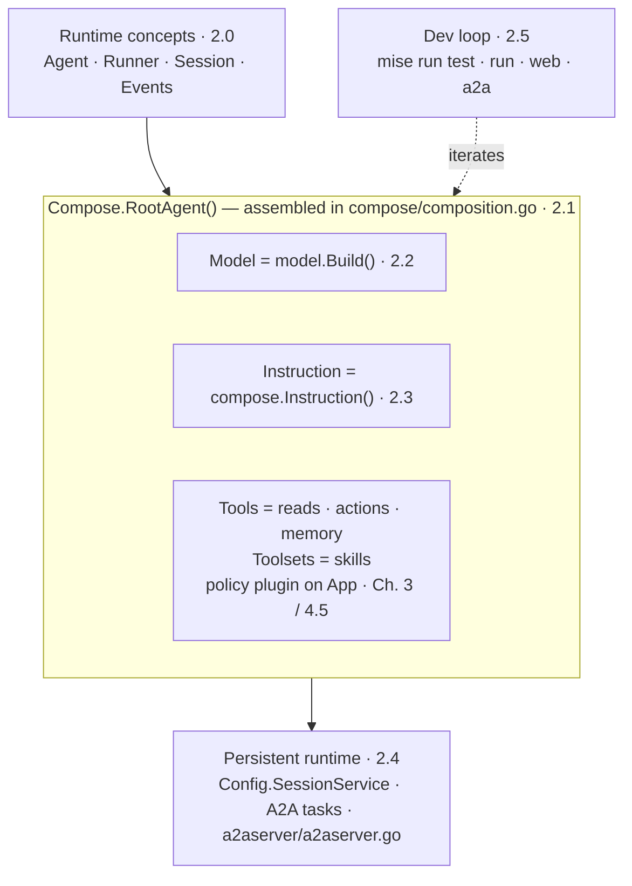

{}

- **You will:** See how the whole chapter fits together, then prove the agent assembles correctly without starting a model.
- **You need:** Chapter 1 finished, with `mise run doctor` and `mise run doctor:model` passing.
- **Time:** about 8 minutes, orientation. {}

## What will you understand in this chapter?

This chapter builds one object, the root agent `Compose.RootAgent()` returns. Every later chapter adds to that same object rather than replacing it.

That object is the **AgentOps Agent**, the single reference agent carried through the entire course. It is assembled once in `compose/composition.go` as a plain ADK `llmagent.Config`: a model, an instruction string, and a flat tool list, plus a set of **policy callbacks** attached once at the application level — code the runtime runs around every model call and tool call.

{}

Every later chapter instruments _this same object_: Chapter 3 hangs capabilities off it, Chapter 4 wraps it in quality gates, Chapters 5 and 6 put it behind a gateway and onto Kubernetes, and Chapter 7 observes it in production.

[Chapter 3]() deepens its tools, knowledge, workflows, and delegation; [Chapter 8.7]() asks you to adapt these boundaries to your own domain. {}

Read the sections by their kind, not just their order. **2.0 is conceptual**: the mental model you need before code makes sense. **2.1 and 2.5 are hands-on**: you run commands and see output. **2.2, 2.3, and 2.4 are reference**: the model, instruction, and runtime pieces you consult as you build.

- **[2.0. Concepts]()** _(concept)_: The ADK 2.x building blocks — Agent, Runner, Session, Events, Tools, and the graph Workflow.
- **[2.1. First Agent]()** _(hands-on)_: Inspect and run the AgentOps Agent end to end on local Qwen3.
- **[2.2. Models]()** _(reference)_: The default Ollama contract and the optional native Gemini branch.
- **[2.3. Instructions]()** _(hands-on)_: The system instruction, its enforcement map, and a deterministic red/green trajectory contract.
- **[2.4. Sessions]()** _(hands-on)_: Persistent ADK sessions, **A2A** tasks (units of work exchanged between agents across process boundaries), lifecycle ownership, and resettable runtime state.
- **[2.5. Dev Loop]()** _(hands-on)_: Offline gates, interactive modes, model-backed evaluations, and failure diagnosis.

By the end you will have run the agent on a model on your own laptop. You will know which file picks the model, which string sets its behavior, where a conversation is stored, and which command proves it all works without a model.

## Which page owns which part of the agent?

The `llmagent.Config` that `Compose.conversationalConfig()` assembles in `compose/composition.go` names each part of the reference agent. Each part is taught by exactly one sub-page, so when a behavior surprises you, there is one page and one module to open.

Concretely, each field of the root agent `Compose.RootAgent()` returns traces to one owner:

| Sub-page                                                              | What it teaches                                            | Owning module / symbol                                                                                                                     |
| --------------------------------------------------------------------- | ---------------------------------------------------------- | ------------------------------------------------------------------------------------------------------------------------------------------ |
| [2.0. Concepts]()         | The ADK runtime loop and its object vocabulary             | `google.golang.org/adk/v2` (framework)                                                                                                     |
| [2.1. First Agent]()   | Composing and running `Compose.RootAgent()`                | `compose/composition.go` (composition root)                                                                                                |
| [2.2. Models]()             | Provider selection behind `llmagent.Config.Model`          | `model/model.go` `model.Build`, `config/config.go` `ModelProvider`                                                                         |
| [2.3. Instructions]() | The persona and rules behind `llmagent.Config.Instruction` | `compose/composition.go` `compose.Instruction()`                                                                                           |
| [2.4. Sessions]()         | Persistent sessions and A2A task state                     | `a2aserver/a2aserver.go` `Config.SessionService`, `cmd/agent/session_store.go` `database.NewSessionService`, `config/config.go` `StateDir` |
| [2.5. Dev Loop]()         | The offline gates and interactive run modes                | `mise.toml` tasks                                                                                                                          |

Tools and policy hooks are named here, not taught here. Owned by [Chapter 3]() and [4.5. Guardrails]().

{}

This diagram maps the anatomy to its owners:



**Diagram in words:** Runtime concepts lead to one agent assembled from a model, instruction, tools, and an app-level policy plugin; persistent runtime and the dev loop surround it.

The `llmagent.Config.Tools` and `.Toolsets` lists and the app plugin belong to later chapters: 2.1 shows the wiring, [Chapter 3]() owns each tool, and [4.5. Guardrails]() owns policy. This page only names the seams. {}

## What proves this chapter worked?

Two things prove the chapter. The first is one command, and it never starts a model:

```bash
cd agents/go
mise run test
```

That is the offline test suite. The required drill in [2.3. Instructions]() is deterministic too: delete one instruction rule, watch the focused contract fail, then restore it. A live-model comparison remains optional evidence.

The whole run can take several minutes depending on the machine and cache state. It ends with the Go test result and one coverage line per package, and it fails when any package falls under the 80% line-coverage floor, which catches code that shipped without tests. Nothing in it needs a model or a network, so a red line is a real failure rather than a missing piece of setup.

A green run proves the agent is assembled correctly, not that it reasons well. Model-backed evaluation is a separate evidence lane, owned by [2.5. Dev Loop]().

{}

That is the umbrella gate (`go test` over the full suite). To verify just this chapter's seams in isolation, run the model and config tests directly:

```bash
cd agents/go
go test ./model ./config
```

That focused subset exits cleanly and gives fast feedback. `mise run test` adds race detection and a coverage profile around the complete suite, then rejects any package under 80% — a floor on how much code the tests reach, not on how good they are.

Those cover provider resolution and the fail-fast cross-field checks in `config/config.go` — a bad `AGENT_MODEL_PROVIDER` combination fails at construction with a message that names the fix, not deep inside a turn. Model-backed behavior stays a separate evidence path ([2.5. Dev Loop]()'s `mise run eval`), because a green offline suite proves the agent is assembled correctly, not that it reasons well. {}

**You are done when:**

- `mise run test` finishes in `agents/go` with no failures and reports the measured coverage.
- You finished the required drill in [2.3. Instructions](): the focused offline contract went red without the direct skill-load rule, green after the scoped restore, and the live-model comparison remained optional evidence.
- You can name the one object every later chapter adds to, and the file that assembles it.
- You can say which sub-page owns the model, which owns the instruction, which owns the session store, and which owns the dev loop.
- You know which two pages ask you to run something and which three you will come back to as reference.
- Without reopening Chapter 1: you can name the command that proves the environment offline and the directory you run it from, and say why a passing `mise run test` reads no `.env`.

Continue to [2.0. Concepts]() when `mise run test` passes on your machine, because every page after this one assumes the agent already builds.
