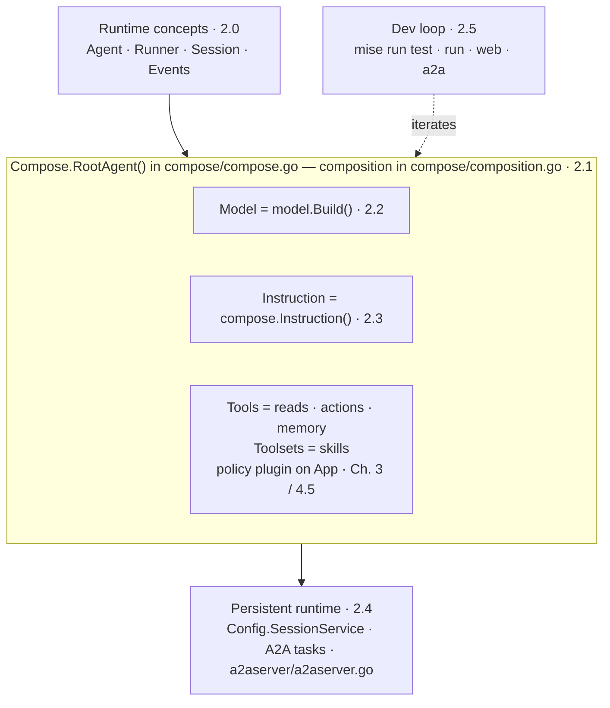

{}

- **You will:** See what this chapter assembles, watch it check out on your own machine without starting a model, and know which page to open when a behavior surprises you.
- **You need:** Chapter 1 finished, with `mise run doctor` and `mise run doctor:model` passing.
- **Time:** about 8 minutes, orientation. {}

## One object, built once, extended for six chapters

Somewhere in the next hour an incident is going to page a fictional on-call engineer named Ana, and an agent running on your laptop is going to read the actual record of it off your disk and tell her what to do. That agent is one Go value: a model, an instruction string, and a flat list of tools, assembled in `agents/go/compose/composition.go` as a plain ADK `llmagent.Config`. `Compose.RootAgent()` — which lives one file over, in `agents/go/compose/compose.go` — reads `AGENT_ENTRYPOINT` and builds exactly one of three compositions from it, the conversational agent by default. The policy callbacks sit a level higher again, on the application rather than on any single agent, which is why a sub-agent you add next month is governed the moment it exists.

Every chapter after this one adds to that same value rather than replacing it. Chapter 3 gives it capabilities, Chapter 4 wraps it in quality checks, Chapters 5 and 6 put it behind a gateway and onto Kubernetes, Chapter 7 watches it in production — and by 7.7 the agent itself is the incident. So the time you spend here learning where each part lives pays out five more times.

{}

[Chapter 3]() deepens its tools, knowledge, workflows, and delegation; the [8.7. Capstone]() asks you to move these same seams onto a domain of your own. Nothing in those chapters introduces a second agent application: one object, instrumented further each time. {}

## Check it assembles before you ask it anything

You proved this in [1.1. Go]() — if `mise run test` was green there, the agent assembles.

**Before you have run a single turn, the composition, the configuration, the persistence, and the policy plane have all been exercised on your machine — in well under a minute, with no account, no API key, and no network.**

What that green run does not tell you is whether the agent reasons well, because nothing in it called a model. Keeping those two kinds of green apart is what [0.2. Evidence]() is for.

## Which page owns which part of the agent

Each field of the root agent traces to exactly one page, so a surprising behavior has one place to go rather than six.

| Sub-page                                                              | What it teaches                                            | Owning module / symbol                                                                                                                     |
| --------------------------------------------------------------------- | ---------------------------------------------------------- | ------------------------------------------------------------------------------------------------------------------------------------------ |
| [2.0. Concepts]()         | The ADK runtime loop and its object vocabulary             | `google.golang.org/adk/v2` (framework)                                                                                                     |
| [2.1. First Agent]()   | Composing and running the conversational agent             | `compose/composition.go` (composition), `compose/compose.go` `Compose.RootAgent()`                                                         |
| [2.2. Models]()             | Provider selection behind `llmagent.Config.Model`          | `model/model.go` `model.Build`, `config/config.go` `ModelProvider`                                                                         |
| [2.3. Instructions]() | The persona and rules behind `llmagent.Config.Instruction` | `compose/composition.go` `compose.Instruction()`                                                                                           |
| [2.4. Sessions]()         | Persistent sessions and A2A task state                     | `a2aserver/a2aserver.go` `Config.SessionService`, `cmd/agent/session_store.go` `database.NewSessionService`, `config/config.go` `StateDir` |
| [2.5. Dev Loop]()         | The offline checks and interactive run modes               | `mise.toml` tasks                                                                                                                          |

Read them in order. **[2.0. Concepts]()** _(concept)_ is the only page that asks you to think before typing; **[2.1. First Agent]()** _(hands-on)_, **[2.2. Models]()** _(hands-on)_, **[2.3. Instructions]()** _(hands-on)_, **[2.4. Sessions]()** _(hands-on)_, and **[2.5. Dev Loop]()** _(hands-on)_ all put you at a terminal.

Tools and policy hooks are named in this chapter and taught in the next two: [Chapter 3]() owns each tool, and [4.5. Guardrails]() owns the policy plugin.

{}

**Diagram in words:** Runtime concepts lead to one agent assembled from a model, instruction, tools, and an app-level policy plugin; persistent runtime and the dev loop surround it. {}

## What this chapter proved

The other five pages are where you break things and watch them fail. This one has already settled four smaller questions, and you can check every answer:

- `mise run test` passes in `agents/go` and reports every package above the 80% floor, with no model and no network.
- You can name the file that assembles the agent, and the file that decides which of the three compositions gets built.
- You can say what that green run deliberately says nothing about, and where the course draws that line.
- When a later page surprises you, you can open the table above and pick the one page that owns the surprise instead of grepping six.

Continue to [2.0. Concepts]() once `mise run test` is green, because every page after this one assumes the agent already builds.
