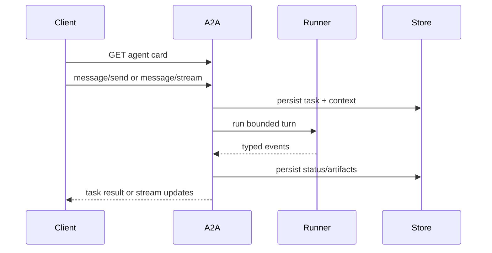

{}

- **You will:** Serve the agent over A2A, read its card and probes, submit a task and query its persisted state, and watch a confirmed network write refuse anyway.
- **You need:** [2.4. Sessions]() finished; a configured model only for the live task.
- **Time:** about 40 minutes, hands-on. {}

## An agent another team can call {#what-is-a2a-and-why-is-it-not-just-mcp-again}

Ana's agent is useful to Ana. The moment the platform team wants to trigger the same investigation from their own tooling, everything that made it convenient — a terminal, a session in memory, a human watching — stops being available. What they need is an address, a description of what lives there, and a task that outlives the connection.

A2A is a protocol for exactly that: discovering an agent and exchanging stateful tasks, messages, artifacts, status, streaming events, and cancellation. MCP exposes tools to a consumer; A2A exposes an agent as a peer service. This course uses MCP for six reads and A2A for the whole conversational surface, and neither replaces the other.

Start it from the Go module:

```bash
cd agents/go
mise run a2a
```

In a second terminal, read only the public metadata:

```bash
curl -s http://127.0.0.1:8080/.well-known/agent-card.json | jq .
```

```json
{
  "name": "AgentOps Agent",
  "description": "Runbook-grounded incident triage and guarded remediation for the AgentOps Open Course.",
  "version": "development",
  "skills": [
    { "id": "incident-triage", "name": "Incident triage", "tags": ["incident", "triage", "operations"] },
    { "id": "remediation", "name": "Guarded remediation", "tags": ["runbook", "remediation", "approval"] }
  ],
  "capabilities": { "streaming": true },
  "supportedInterfaces": [
    { "url": "http://localhost:8080/", "protocolBinding": "JSONRPC", "protocolVersion": "0.3" },
    { "url": "http://localhost:8080/a2a/v1/invoke", "protocolBinding": "JSONRPC", "protocolVersion": "1.0" }
  ],
  "url": "http://localhost:8080/",
  "preferredTransport": "JSONRPC"
}
```

That is the real card, with its input and output mode lists, its per-skill descriptions and examples, and a top-level `"protocolVersion": "0.3"` trimmed away for width. <a id="what-does-the-agent-card-declare"></a>Everything a client needs to decide whether to call this agent is in it: identity, description, advertised skills, both supported protocol interfaces, streaming capability, and the callable URL. That URL is assembled from `AGENT_A2A_PROTOCOL`, `AGENT_A2A_HOST`, and `AGENT_A2A_PORT`, and it never advertises a bind wildcard — the exercise below makes you check that yourself. Tests pin the stable fields and reject a request whose Host header falls outside the server's allowlist.

The probes answer the same two questions they answer for MCP, and here both say yes, because this is the process that publishes runtime state at startup:

```bash
curl -s http://127.0.0.1:8080/livez
curl -s http://127.0.0.1:8080/healthz
```

```text
{"status":"alive"}
{"status":"ready"}
```

**You just published the agent as a service another team could discover and call, with no account, no cloud, and no registry.**

## The task outlives the turn

A client discovers the card, sends a message carrying task or context identity, watches the task change state, and can reconnect, query, or cancel:



**Diagram in words:** The client first reads the agent card, then sends or streams a message. The server persists task and context state, runs one bounded ADK turn, persists status and artifacts from typed events, and returns either a final task or streaming updates.

Send one. This calls the configured model, so it is the slow command on this page:

```bash
curl -s -X POST http://127.0.0.1:8080/ -H 'Content-Type: application/json' \
  -d '{"jsonrpc":"2.0","id":1,"method":"message/send","params":{"message":{"role":"user","parts":[{"kind":"text","text":"What is the status of the inventory service?"}],"messageId":"m-1","kind":"message"}}}'
```

Predict what the server does when the model never answers: return nothing, hang until the client gives up, or write something down. Stop Ollama first if you want to see this for yourself — with a warm model you get the happy path instead. On a cold CPU-only laptop, the first attempt at that request produced this rather than an answer, and this is the task's status object with its ids and timestamp trimmed away:

```json
{
  "state": "failed",
  "message": {
    "role": "agent",
    "parts": [
      { "kind": "text", "text": "llm error response (code MODEL_UNAVAILABLE): \"Model request failed safely.\"" },
      {
        "kind": "text",
        "text": "The model provider is unavailable. Retry the request or inspect the provider endpoint logs."
      }
    ]
  }
}
```

The model had not been loaded yet and every attempt exceeded `AGENT_MODEL_TIMEOUT_S`. That is a bad turn and a good demonstration, because look at what survived it. The failure is a task in a terminal state with a sanitized message, not a truncated answer and not silence. Query it afterwards with the id from the response — no model involved:

```bash
curl -s -X POST http://127.0.0.1:8080/ -H 'Content-Type: application/json' \
  -d '{"jsonrpc":"2.0","id":9,"method":"tasks/get","params":{"id":"<your-task-id>"}}' | jq '.result.status.state'
```

```json
"failed"
```

The state is durable because the task store is SQLite under the configured state directory, alongside ADK's database session service, and both are opened during the same startup sequence that publishes the dataset [3.3. MCP]() found missing. Ask for a task that never existed and the answer is equally specific, here with the error's type URL, domain, and timestamp trimmed:

```json
{
  "error": { "code": -32001, "message": "failed to get task: task not found", "data": [{ "reason": "TASK_NOT_FOUND" }] }
}
```

That same message is what an authenticated caller gets for a task owned by somebody else. Task creation stores the verified subject, and get, update, and list all require the same owner — reported as "not found" rather than "forbidden", matching the pinned A2A store and refusing to act as an ownership oracle. Be honest about the limit of that: the account-free anonymous surface makes no multi-user confidentiality claim at all. Keep it on a reviewed private or loopback path and require gateway authentication before sharing it.

Several independent bounds keep one task from becoming an unbounded agent loop: `AGENT_A2A_MAX_LLM_CALLS` caps model calls in one invocation, model, tool, and drain timeouts are typed configuration, the session token budget can stop the next model call, the runner serializes one logical context while unrelated sessions run concurrently, and task state and error detail are persisted with the details sanitized. They bound work. None of them claims a quality score.

The card advertises `"streaming": true`, and a `message/stream` client always receives server-sent events of whole task updates. Whether the _model_ streams token by token is a separate switch:



That is the entire decision: `AGENT_A2A_STREAMING` chooses between ADK's SSE streaming mode and none, and the default is none. A client must therefore treat partial text as provisional and query the persisted task before deciding what completed — which is also why the evaluation harness ignores partial tokens for final-answer and schema scoring while still emitting sanitized transport and error detail, so a failed stream can never be mistaken for a successful empty answer.

Cancellation arrives as a canceled context, and so does shutdown, which is why one function handles both:



`Serve` starts the listener and then waits on two things: a listener error, or the context being done. Ctrl-C in a terminal and Kubernetes sending SIGTERM both arrive on the second branch and both return `nil`, because neither is a failure. What follows is the part worth copying: the drain context is built with `context.WithoutCancel`, since a shutdown context that is already canceled would drain for exactly zero seconds. In-flight turns get `DrainTimeout` to finish and then the process exits — which reduces avoidable interruption and nothing more. A turn that outlasts the window is still cut, so correctness comes from the transactional write in [3.1. Tools](), never from having enough drain time. A canceled task cannot leave a committed mutation without its matching audit row.

To exercise the whole A2A path against a model, use the black-box harness rather than a hand-rolled client. Transport is a flag on the one evaluation task:

```bash
mise run eval -- --transport a2a --output a2a-results.json
```

It folds task, status, and artifact events into the same captured `Turn` that REST produces, so one scorer grades either surface and transport equivalence compares normalized completed turns rather than frame layout. The `--output` override keeps the A2A artifact beside the REST one instead of overwriting it. That run is a model-backed observation, not an offline check — [0.2. Evidence]() draws the line.

{}

Start from the Go A2A SDK types already pinned in `agents/go/go.mod`, not from handwritten maps copied out of a tutorial. Fetch and validate the card, select one supported interface, send a read-only message with explicit ids, fold task, status, message, and artifact events into one typed local result, and treat partial text as provisional while handling cancellation. The executable version is `evals/client.go`, and `evals/turn_client_test.go` exercises the event folding without importing the agent implementation.

<a id="what-is-in-process-delegation"></a>Splitting is the harder decision. In-process delegation — [3.7. Multi-Agent]() — transfers work to a specialist inside the same process, sharing the policy plugin, model, and resource lifecycle. A2A adds discovery, authentication, persistence, transport failure, versioning, and deployment ownership. Pay for those when a split has an owner and a measurable reason: different data authority, release cadence, scaling profile, runtime, or availability objective. "Multi-agent" on its own is not a reason to add a network hop. {}

## Confirmation is not authentication

Here is the failure mode that makes network agents different from local ones. Confirmation approves a proposed action. It says nothing about who reached the service — and on an unauthenticated A2A request, the "user" is a synthetic identity derived from the context id, invented for session and memory scoping.

So the guarded writes ask for more. Even after a valid ADK confirmation, `restart_service` and `resolve_incident` refuse to mutate operational state unless a trusted gateway supplied a verified subject and that subject owns the invocation. Watch it happen with no model and no listener:

```bash
cd agents/go
go test ./a2aserver -run TestUnauthenticatedA2AConfirmationCannotMutateTheRealStore -count=1 -v
```

```text
=== RUN   TestUnauthenticatedA2AConfirmationCannotMutateTheRealStore
--- PASS: TestUnauthenticatedA2AConfirmationCannotMutateTheRealStore (0.90s)
PASS
ok  	github.com/MLOps-Courses/agentops-open-course-go/agents/go/a2aserver	0.930s
```

Those are four lines of about seventy-five. Between the `=== RUN` and the `--- PASS` come a `=== PAUSE`, a `=== CONT`, and then ADK's session store printing red-and-yellow GORM chatter — repeated `record not found` lines and the `SELECT * FROM app_states` queries behind them — because the test opens a brand-new temporary database, and the first lookup of anything in an empty table is correctly a miss. None of it is a failure; scroll to the last three lines.

The test completes the real confirmation flow against that temporary SQLite store, then checks that the service stayed down and no audit row was inserted. `AGENT_TRUSTED_IDENTITY_HEADER` is what turns a gateway-verified subject into that typed principal, and setting it is safe only behind a gateway that validates credentials and overwrites any client-supplied copy. Left unset — the default — no arbitrary header is ever trusted.

## Your turn: check what the card advertises when the bind address is wide

A service that binds every interface and then tells clients to call `0.0.0.0` has published an address no client can use and an invitation nobody should accept. The card is the artifact that decides which of those happens, so read it under the condition that would expose the mistake.

- **Mode**: `inspect` — every step is a read; nothing on disk changes.
- **Goal**: confirm the advertised URL comes from the advertised-host settings and never from the bind interface.
- **Files to touch**: none.
- **Preflight**: `cd agents/go && mise run build`, stop any A2A server already on `:8080`, and have `curl` and `jq` on your path.
- **Steps**: start the server with a wide bind and a spare port — `cd agents/go && AGENT_A2A_BIND_HOST=0.0.0.0 AGENT_A2A_PORT=8086 ./bin/agent a2a` — then fetch the card from `http://127.0.0.1:8086/.well-known/agent-card.json` and read `.url` and every entry of `.supportedInterfaces[].url`. Look at the startup log line too.
- **Gate that proves completion**: every advertised URL names `localhost:8086`, none of them contains `0.0.0.0`, and you can explain why the log line prints `address=<IP_ADDRESS>:8086` rather than the literal bind address.
- **Final state**: stop the server with Ctrl-C. No files changed.

The redacted log line is not an accident either: every record passes through the sanitizing handler, which masks IP addresses wherever they appear — including in the server's own startup message. When you need the bind address, read the configuration with `mise run config:check`, not the log.

## What you can do now

- You published the agent as a discoverable service and read its card, both protocol interfaces, and its two probes.
- You submitted a task, read its persisted state back with no model running, and can say what the server writes down when a turn fails instead of answering.
- You can explain why a confirmed action over an unauthenticated A2A request still changes nothing, and which setting turns a gateway-verified subject into an approver.
- `cd agents/go && go test ./a2aserver` passes — card, task persistence, concurrent sessions, streaming, cancellation, drain, and restore — and `cd evals && mise run eval:validate` validates the assets without importing agent internals.

The agent has an address now, and everything that made it safe locally still holds across the wire. Continue to [3.7. Multi-Agent](), where one agent becomes three and only one of them can act.
