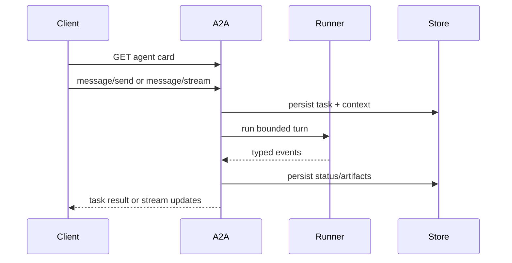

{}

- **You will:** Inspect the A2A card, persistent runtime, streaming and cancellation contracts, then prove them offline.
- **You need:** The session page and A2A package tests; a configured model only for a submitted live task.
- **Time:** about 40 minutes, hands-on. {}

## What is A2A, and why is it not just MCP again?

A2A is a protocol for discovering an agent and exchanging stateful tasks, messages, artifacts, status, streaming events, and cancellation.

```bash
cd agents/go
go test ./a2aserver
```

MCP exposes tools or context to a consumer. A2A exposes an agent as a peer service. The course uses MCP for six reads and A2A for the complete conversational boundary.

## How does an A2A interaction work?

A client discovers the agent card, sends a message with a task or context identity, observes task updates, and optionally reconnects, queries, or cancels.



**Diagram in words:** The client first reads the agent card, then sends or streams a message. The server persists task and context state, runs one bounded ADK turn, persists status and artifacts from typed events, and returns either a final task or streaming updates.

## How do you inspect the A2A contract?

Start the server from the Go module:

```bash
cd agents/go
mise run a2a
```

In another terminal, read only the public metadata and probes:

```bash
xh GET http://127.0.0.1:8080/.well-known/agent-card.json
xh GET http://127.0.0.1:8080/livez
xh GET http://127.0.0.1:8080/healthz
```

Those requests make no model call. Stop the server with `Ctrl-C` when finished.

## What does the agent card declare?

The card declares identity, description, skills, supported interfaces, streaming capability, input/output modes, and the callable URL.

The URL uses `AGENT_A2A_PROTOCOL`, `AGENT_A2A_HOST`, and `AGENT_A2A_PORT`. It never advertises the `0.0.0.0` bind wildcard. Tests pin the stable card fields and reject a request whose Host is outside the server allowlist.

## How does the server preserve tasks?

The server constructs ADK's database session service and the course SQLite task store under the configured state directory.



Startup recovers interrupted restore evidence before schema preflight or publication. A per-session gate serializes overlapping turns for the same context while allowing unrelated sessions to run concurrently.

For a verified caller, task creation stores the authenticated subject and get, update, and list require the same owner. An ownership mismatch is reported as “task not found,” matching the pinned A2A store without exposing an ownership oracle.

The account-free anonymous surface has no multi-user task-confidentiality claim. Keep it on the reviewed private or loopback path; require gateway authentication before shared exposure. This task-owner boundary is separate from guarded operational writes, which fail closed without a typed authenticated principal.

## What bounds one A2A task?

Several independent bounds prevent a task from becoming an unbounded agent loop.

- `AGENT_A2A_MAX_LLM_CALLS` limits model calls in one invocation.
- Model, tool, and drain timeouts are typed configuration.
- Session token budget can stop the next model call.
- The runner serializes one logical context and respects request cancellation.
- Task state and error evidence are persisted with sanitized details.

These bounds limit work; they do not claim a quality score.

## Why is confirmation not authentication?

Confirmation approves a proposed action; it does not prove who reached the network service.

An unauthenticated A2A request keeps a synthetic user for session and memory scoping, not guarded-action authority. Even after ADK confirmation, `restart_service` and `resolve_incident` refuse to mutate operational state unless a trusted gateway supplied a verified subject and that subject owns the invocation.

Prove the fail-closed boundary without a model or network listener:

```bash
cd agents/go
go test ./a2aserver -run TestUnauthenticatedA2AConfirmationCannotMutateTheRealStore -count=1
```

The test completes the real confirmation flow against a temporary SQLite store, then proves the service stayed down and no audit row was inserted. Setting `AGENT_TRUSTED_IDENTITY_HEADER` is safe only behind a gateway that validates credentials and overwrites any client-supplied copy; leaving it unset never trusts an arbitrary header.

## How do I stream a response through the gateway?

Use the canonical black-box harness after the raw A2A server and gateway routes are healthy:

```bash
mise run eval:a2a
```

This task calls the configured model. It sends A2A requests, folds task/status/artifact events into the same captured `Turn` used by REST, and writes `evals/a2a-results.json` without replacing release-bearing `eval-results.json`.

Partial text may be visible to a streaming client, but deterministic final-answer scorers exclude it. Transport equivalence compares normalized completed turns, not frame boundaries.

## How does a caller cancel an active task?

The server propagates protocol cancellation into the running context and persists the terminal canceled state.



Cancellation is cooperative: model or tool work must observe its context. A guarded write remains transactional, so cancellation cannot leave a committed mutation without its matching audit row.

## What happens when a stream fails mid-answer?

The client must treat partial output as provisional and query the persisted task before deciding what completed.

The server records the task's last durable status. The evaluation harness ignores partial tokens for final-answer and schema scoring. It still emits sanitized transport/error evidence so a failed stream cannot look like a successful empty answer.

## What is in-process delegation?

In-process delegation lets one composed Go agent transfer work to a specialist without creating a network task.

It shares the same process, policy plugin, model, and resource lifecycle. A2A instead introduces discovery, authentication, persistence, transport failure, versioning, and deployment ownership.

## When is A2A worth its cost?

Use A2A when an agent needs an independently deployable boundary, durable protocol task identity, cross-team ownership, or interoperable clients.

Keep delegation in-process when specialists release together, share trust, and do not need independent scaling or task persistence.

## When should an agent become a separate service?

Split only when the boundary has an owner and a measurable reason.

Good reasons include different data authority, release cadence, scaling profile, runtime, or availability objective. “Multi-agent” by itself is not a reason to add a network hop.

## How would you write a minimal A2A client?

Start with the Go A2A SDK types already pinned by `agents/go/go.mod`, not handwritten maps copied from a tutorial.

1. Fetch and validate the card.
1. Select one supported interface.
1. Send a read-only message with explicit ids.
1. Fold task, status, message, and artifact events into one typed local result.
1. Treat partial text as provisional and handle cancellation.

The executable capture path is `evals/client.go`; `evals/turn_client_test.go` proves event folding without importing the agent implementation.

## What proves this page worked?

Run the offline server and protocol tests:

```bash
cd agents/go
go test ./a2aserver
```

Then validate the standalone eval assets without a model:

```bash
cd ../../evals
mise run eval:validate
```

**You are done when:**

- Card, task persistence, concurrent-session, stream, cancel, drain, and restore tests pass.
- Authenticated task get and update cannot cross owners.
- An unauthenticated confirmed A2A action leaves operational state and audit rows unchanged.
- Evaluation assets validate without importing agent internals.
- You can explain why partial output is not a final verdict.
- Any live `eval:a2a` run is identified as model-backed evidence, not an offline gate.

Continue to [3.7. Multi-Agent]() when you can justify a network agent boundary separately from in-process delegation.
