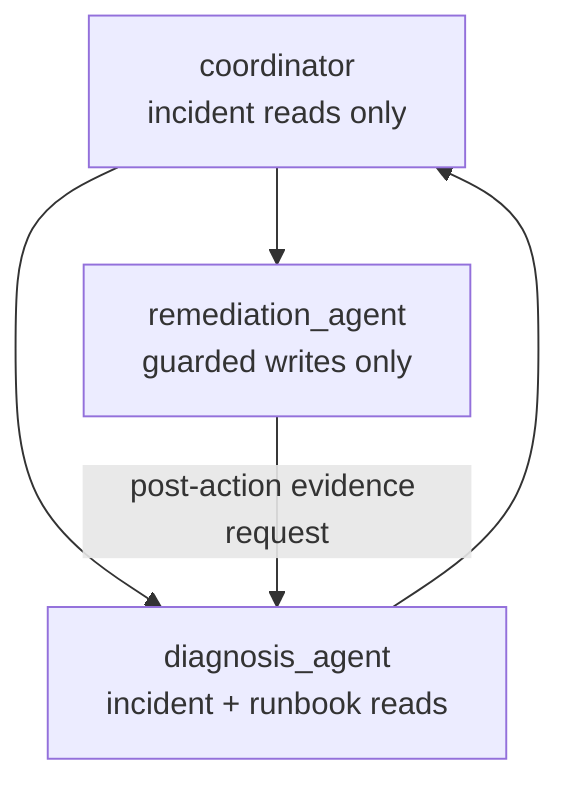

{}

- **You will:** Inspect delegation routing, prove specialist tool boundaries, and decide when one agent is simpler.
- **You need:** Tools, workflows, and A2A concepts from the preceding pages.
- **Time:** about 30 minutes, hands-on. {}

## Why would one agent become several?

Separate specialists can make authority, instructions, and evidence responsibilities smaller and reviewable.

```bash
cd agents/go
go test ./compose
```

The course coordinator triages. A diagnosis specialist reads incident, runbook, and service evidence. A remediation specialist holds only the two guarded actions. The coordinator itself cannot write.



**Diagram in words:** The coordinator delegates evidence work to the read-only diagnosis specialist and an approved action to the write-only remediation specialist. After an action, diagnosis reads current evidence again before the coordinator can summarize recovery.

## How does ADK decide which specialist gets the work?

ADK's transfer routing reads each sub-agent's name and description, while the coordinator instruction states the required sequence.

`agents/go/compose/delegation.go` constructs the two specialists first and passes them as typed sub-agents to the coordinator. Diagnosis precedes remediation; the action response is never accepted as recovery proof, so the coordinator delegates back to diagnosis for a fresh read.

The routing remains model behavior. Structural tests prove available transfers and tool sets; model-backed evaluation checks the expected trajectory.

## How does least privilege contain a prompt injection?

Authority is absent from the specialist that reads attacker-influenceable data.

The diagnosis specialist can read incidents, logs, service status, and runbooks, but it has no action tool. A hostile log line can still mislead reasoning, yet it cannot make that specialist call `restart_service` or `resolve_incident` because those tools are not in its request schema.

The remediation specialist has the inverse boundary: it sees only a diagnosed, runbook-backed handoff and the guarded actions. Each action still requires confirmation and verified identity.

## What does least privilege _not_ contain?

Least privilege limits reachable effects; it does not guarantee correct diagnosis, safe instruction text, honest handoffs, or an approved target.

The policy plugin still redacts and hardens tool data. Skills still require reviewed provenance. The coordinator can still make a poor delegation decision. Evaluation and human approval therefore remain separate controls.

## How do you run the coordinator locally?

Run the model-backed coordinator from the Go module:

```bash
cd agents/go
mise run coordinator
```

Ask it to investigate an incident first. If you ask for remediation, do not approve the action merely to complete the exercise. This command calls the configured model and is not an offline gate.

Prove composition without a model:

```bash
cd agents/go
go test ./compose -run 'Coordinator|Delegat|Privilege'
```

## Can specialists run in parallel?

Only independent work should run concurrently.

Diagnosis must precede remediation, and post-action verification must follow the action, so this reference path is sequential. Separate read-only evidence queries could fan out if their results join before review and tests accept nondeterministic event order.

Concurrency changes latency, ordering, cancellation, and budget use. Add it only with a measured benefit.

## When is a single agent better?

Use one agent when the tools share one trust boundary, the instruction is still understandable, and delegation adds no distinct ownership or safety property.

Every extra model-routed handoff adds tokens, latency, failure modes, and another place to lose context. A plain Go function or bounded workflow is better when routing rules are complete.

## How would you add a third specialist?

Start with its authority, not its persona.

1. Define one responsibility and a non-overlapping description.
1. Construct the smallest tool set required by that responsibility.
1. Add it to the coordinator topology in `compose/delegation.go`.
1. Add structural tests proving excluded tools as well as included ones.
1. Add a fixed evaluation case only if model routing matters.

Do not give a specialist all tools and rely on prose to avoid misuse.

## What proves this page worked?

Run the offline composition evidence:

```bash
cd agents/go
go test ./compose -run 'Coordinator|Delegat|Privilege'
```

**You are done when:**

- The coordinator has incident reads but no actions.
- Diagnosis has the six evidence reads but no writes.
- Remediation has the two guarded writes but no raw evidence reads.
- You can explain why action output is not recovery evidence.
- You can name a reason to keep a new capability inside one agent.

Continue to [4. Quality]() when specialist boundaries are enforced by construction, not only instruction text.
