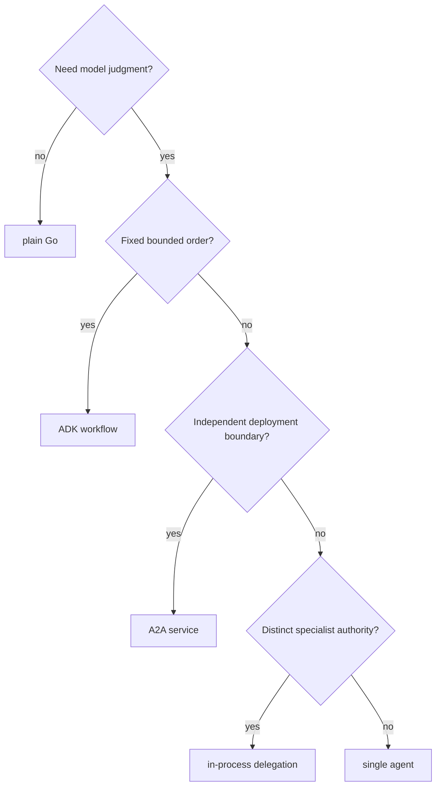

{}

- **You will:** Give the agent the capabilities Ana's incident actually needs — one at a time, each arriving with a limit you can check offline.
- **You need:** Chapter 2 finished, with `mise run test` green inside `agents/go`.
- **Time:** about 8 minutes, orientation. {}

## What the agent still cannot do at 02:14

The agent you ran in [2.1. First Agent]() can look up `INC-002` and tell Ana that inventory is crash-looping. That is where it stops. It cannot find the right runbook from a symptom nobody typed as a slug. It cannot restart anything, and you would not want it to yet. It cannot reach a tool that lives in another process, cannot remember what last night's engineer already tried, cannot be told to always challenge its own evidence before advising, cannot hand the write to a specialist that holds nothing else, and cannot say a word until it has finished thinking.

Chapter 3 closes each of those gaps. The interesting part is not that the agent gets more powerful — anything can be made more powerful by handing it more tools. It is that each capability arrives with a limit drawn around it, and most of those limits are decidable without a model. The two that are not — which skill the model loads, and which specialist the coordinator picks — are named plainly on the pages that own them.

- **[3.0. Packaging]()** _(hands-on)_: One Go module, one binary, and the four surfaces it serves.
- **[3.1. Tools]()** _(hands-on)_: Typed reads with deadlines, and writes that fail closed without a named human.
- **[3.2. Skills]()** _(hands-on)_: Reviewed procedures the model loads only when they apply.
- **[3.3. MCP]()** _(hands-on)_: The six reads moved into their own process, and the allowlist that keeps them six.
- **[3.4. Memory]()** _(hands-on)_: Six stores with different lifetimes, and retrieval you can watch rank.
- **[3.5. Workflows]()** _(hands-on)_: A four-stage investigation the model cannot shortcut.
- **[3.6. A2A]()** _(hands-on)_: The agent as a durable network service another team can call.
- **[3.7. Multi-Agent]()** _(hands-on)_: A coordinator whose specialists cannot borrow each other's authority.
- **[3.8. Streaming]()** _(hands-on)_: Token-by-token delivery, and the redaction window it opens.
- **[3.9. Incident Run]()** _(hands-on)_: One session that answers INC-002 with the default composition's tools, skills, and memory.

The ten pages below run to about five hours of hands-on work in total. The chapter has a seam in the middle: 3.0 to 3.4 give the agent more that it can do, while 3.5 to 3.9 change what it is. If you are working through this in evenings, [3.4. Memory]() is the natural place to stop for the day.

Every one of those pages adds an element to the same value you already read in Chapter 2 — a config with an instruction, a tool list, and a toolset list:



## Which composition should you reach for?

Adding a capability is easy. Choosing where it lives is the decision that survives contact with production, and there are only five real answers.



**Diagram in words:** Work needing no model judgment stays plain Go. Model-backed work with a fixed order becomes a workflow. A capability with its own deployment owner becomes an A2A service. Distinct authority inside one runtime becomes delegation. Everything else stays one agent.

MCP sits outside that tree on purpose. It moves a tool into another process without deciding the agent's orchestration shape, which is why 3.3 can change where the six reads execute and change nothing the model sees.

## Where each capability lives, and what it deliberately lacks

The module layout is the map you will edit all chapter. Each capability has one owning package, and its authority stops at that package's edge.

| Capability                 | Source authority                                           | Authority it does not get                      |
| -------------------------- | ---------------------------------------------------------- | ---------------------------------------------- |
| Packaging                  | `agents/go/go.mod`, `go.sum`, and `vendor/` when generated | no second binary per composition               |
| Incident tools and actions | `agents/go/tools`                                          | no generic SQL or filesystem escape hatch      |
| Skills                     | `agents/go/compose/skills.go`, `agents/data/skills`        | no arbitrary file reads from a skill directory |
| MCP server and client      | `agents/go/mcpserver`, `agents/go/compose/mcp.go`          | no write tool, in either direction             |
| Memory and retrieval       | `agents/go/memory`                                         | no silent context injection                    |
| Workflow and delegation    | `agents/go/compose/workflow.go`, `delegation.go`           | no write tool on any workflow stage            |
| A2A runtime                | `agents/go/a2aserver`                                      | no guarded write without a verified principal  |
| Black-box protocol runs    | `evals`                                                    | no import of the agent implementation          |

Typed configuration owns the switches that move those limits, and `mise run config:check` prints the resolved values with secrets masked: `AGENT_MCP_URL` moves conversational reads to a remote server, `AGENT_ENTRYPOINT` selects the agent, workflow, or coordinator composition, `AGENT_SEMANTIC_RETRIEVAL` swaps the retrieval scorer, `AGENT_MAX_HISTORY_MESSAGES` and `AGENT_MAX_TOKENS_PER_SESSION` bound context work, `AGENT_A2A_MAX_LLM_CALLS` and `AGENT_A2A_STREAMING` bound network execution, and `AGENT_WRITES_DISABLED` freezes actions without touching a read schema.

## What this chapter proved

Run the whole Go module suite, then the standalone evaluation assets. Neither needs a model:

```bash
cd agents/go
mise run check
mise run test
cd ../../evals
mise run eval:validate
```

`mise run test` ends by reading the coverage profile it just wrote. Here is the tail of a real run in this checkout, with fourteen of the twenty package lines cut for width:

```text
DONE 1815 tests, 1 skipped in 1.964s
[test] $ ../../scripts/check-coverage.sh coverage.out 80 agents/go
  ok      84.2%  agents/go/a2aserver
  ok      91.7%  agents/go/compose
  ok      88.6%  agents/go/mcpserver
  ok      87.6%  agents/go/memory
  ok      90.9%  agents/go/policy
  ok      98.5%  agents/go/tools
agents/go meets the 80% per-package coverage floor
```

Two seconds, no model, no network. The floor is applied per package rather than to a repository total, because a total lets a well-tested `domain` package carry an untested `mcpserver` — so a capability added without tests fails the run instead of quietly diluting an average.

**You are done when:**

- The tool, skill, MCP, retrieval, workflow, A2A, and delegation tests pass under the race detector, and the evaluation assets validate without importing the agent.
- You kept the read tool you prototyped in [3.1. Tools](), with parse-at-the-boundary input, bounded output, and an explicit MCP exposure decision.
- You can pick between plain Go, a workflow, one agent, delegation, and A2A for a new task, and say what each choice costs.
- You can name, for any capability in this chapter, the authority it deliberately lacks and the test that would fail the moment it gained one.

Every capability in this chapter arrives with a limit around it, and every limit is written down as something that runs in seconds.

Continue to [3.0. Packaging]() once `mise run test` is green inside `agents/go`, because every capability in this chapter is added to the one module that page builds.
