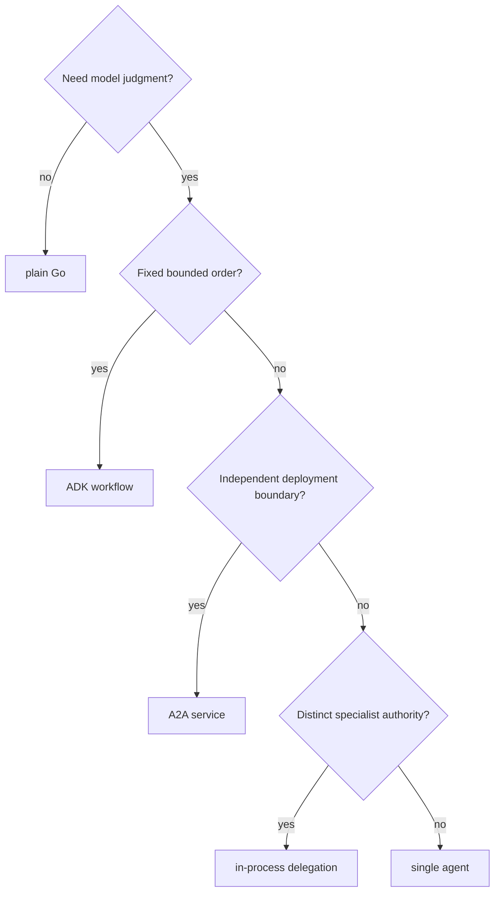

{}

- **You will:** Choose the smallest composition boundary for each capability and prove its authority offline.
- **You need:** Chapter 2's Go agent and development loop.
- **Time:** about 4 hours for the complete chapter, orientation. {}

## Which capabilities will you add?

Chapter 3 expands one composed agent without widening every boundary.

- **3.0. Packaging:** Go modules, tool directives, and optional vendoring.
- **3.1. Tools:** typed reads, confirmed writes, timeouts, circuits, and atomic audit.
- **3.2. Skills:** progressively disclosed reviewed instruction.
- **3.3. MCP:** a remote, filtered six-read tool surface.
- **3.4. Memory:** sessions, operator notes, runbooks, and bounded retrieval.
- **3.5. Workflows:** a fixed read-only investigation graph.
- **3.6. A2A:** durable network tasks, streaming, and cancellation.
- **3.7. Multi-Agent:** a coordinator with restricted specialists.



## Which composition should you reach for?

Choose by authority and control-flow need, not novelty.



**Diagram in words:** Work with no model judgment stays plain Go. Model-backed work with a fixed order uses a workflow. A real deployment boundary uses A2A. Distinct authority inside one runtime uses delegation. Everything else stays one agent.

MCP is orthogonal: it moves a tool boundary across a process or network without deciding the agent's orchestration shape.

## Which capability lives in which module?

| Capability                  | Source authority                                           |
| --------------------------- | ---------------------------------------------------------- |
| Packaging                   | `agents/go/go.mod`, `go.sum`, and `vendor/` when generated |
| Incident tools and actions  | `agents/go/tools/`                                         |
| Skills                      | `agents/go/compose/skills.go` and `agents/data/skills/`    |
| MCP server/client           | `agents/go/mcpserver/` and `agents/go/compose/mcp.go`      |
| Memory and retrieval        | `agents/go/memory/`                                        |
| Workflow and delegation     | `agents/go/compose/workflow.go` and `delegation.go`        |
| A2A runtime                 | `agents/go/a2aserver/`                                     |
| Black-box protocol evidence | `evals/`                                                   |

## Which switches change this chapter's behavior?

Typed configuration owns the switches.

- `AGENT_MCP_URL` moves conversational reads to remote MCP.
- `AGENT_ENTRYPOINT` selects agent, workflow, coordinator, or structured report composition.
- `AGENT_SEMANTIC_RETRIEVAL` enables the bounded embedding path.
- `AGENT_MAX_HISTORY_MESSAGES` and `AGENT_MAX_TOKENS_PER_SESSION` bound context work.
- `AGENT_A2A_MAX_LLM_CALLS` and `AGENT_A2A_STREAMING` bound A2A execution and publication.
- `AGENT_WRITES_DISABLED` disables action execution without changing read schemas.

Run `mise run config:check` after changing any of them.

## What proves this chapter worked?

Run the complete Go module evidence without a model:

```bash
cd agents/go
mise run check
mise run test
cd ../../evals
mise run eval:validate
```

The test task reports measured coverage; no percentage threshold is enforced because the owner has not selected one.

**You are done when:**

- Tools, skills, MCP, retrieval, workflow, A2A, and delegation tests pass under the race detector.
- You kept the [3.1. Tools]() read tool with parse-at-the-boundary input, bounded output, cancellation coverage, and an explicit MCP exposure decision.
- The focused tool diff contains no generated runtime state or unrelated change, and the complete Go module gate is green.
- Evaluation assets validate without importing the agent implementation.
- You can choose among plain Go, workflow, one agent, delegation, and A2A from the decision tree.
- You can name the authority that each capability intentionally lacks.

Continue to [4. Quality]() when the capabilities are narrow enough to score and secure.
