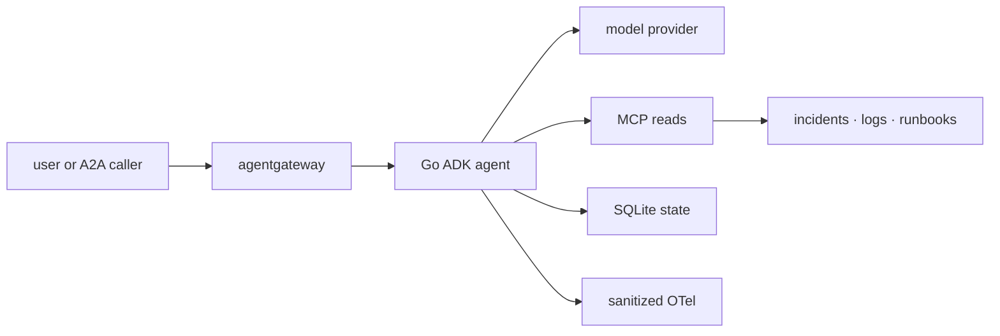

{}

- **You will:** Watch a write tool fail to exist, run the adversarial regression suite, and widen a least-privilege allowlist until the tests stop you.
- **You need:** [4.5. Guardrails]() finished. No model, cluster, or cloud account; the scanners may use the network.
- **Time:** about 28 minutes, hands-on. {}

## The tool that does not exist

Suppose the MCP server this agent reads through is compromised, or simply misconfigured by a hurried operator. A client connects and asks it to restart Ana's inventory service. Here is the answer — the response's `error` object, indented for reading:

```json
{ "code": -32602, "message": "unknown tool \"restart_service\"" }
```

Not "forbidden". Not "you are not authorized". _Unknown._ There is no permission check to bypass, because there is no tool to call.

Serve the reads with `mise run mcp:http` from `agents/go` and you can send that request yourself, with the same `curl` recipe you used in [3.3. MCP](). Try a path-traversal attempt through `get_runbook` while the server is up; the answer arrives as the call's `structuredContent`, and the surface never builds a file path from the string at all:

```json
{
  "error": "Invalid runbook slug \"../../../etc/passwd\". Available runbooks: cascade-failure, deployment-rollback, disk-full, elevated-errors, high-latency, memory-leak, service-down."
}
```

That is the whole strategy of this page. A guardrail refuses an action the system could take; removing authority means the action was never available. The second is cheaper to reason about, impossible to misconfigure at runtime, and testable offline:

```bash
cd agents/go
go test ./mcpserver -run TestServerNeverExposesTheGuardedWrites -count=1
```

```text
ok  	github.com/MLOps-Courses/agentops-open-course-go/agents/go/mcpserver	0.063s
```

**You just watched a restart request die of nonexistence. There was no permission to check, because there was no tool — and a test now fails the build if anyone adds one back.**

## The surface, and what is deliberately missing from it

Every place untrusted input, authority, state, or a dependency crosses a boundary belongs to the attack surface:



**Diagram in words:** A user or A2A caller reaches the Go agent through an optional gateway. The agent sends requests to a model, reads through local or MCP tools, writes only through guarded SQLite actions, consumes untrusted incident data, and exports sanitized telemetry.

The threats that live on those edges are the familiar ones: prompt injection in retrieved data, PII disclosure, credential leakage, path traversal, unsafe targets, replayed writes, unverified identity, tool-surface widening, denial of service, and dependency compromise.

Against each of them, the design's first move is subtraction rather than defense:

- The public MCP surface carries six reads and no writes.
- Workflow stages are read-only.
- Diagnosis cannot act; remediation cannot read raw logs or runbooks.
- The coordinator holds no action tools at all.
- Writes require confirmation, verified identity, target validation, and an atomic audit.
- Host listeners bind loopback; Kubernetes uses explicit NetworkPolicies and no public Service.
- The default model path is local and account-free.

Instruction text reinforces those boundaries; it does not create them. A sentence in a prompt is a request, and the whole premise of an adversarial reader is that requests can be ignored.

The clearest example of subtraction is the tool this course does not implement. A code executor would convert generated text into direct process, filesystem, and possibly network authority — the single largest privilege jump available in an agent design. If a future extension genuinely needs one, isolate it in an ephemeral sandbox with no credentials, no host mounts, closed egress, strict CPU, memory and time limits, an input/output allowlist, and disposable storage, and treat sandbox escape as its own threat model rather than a footnote in this one.

## Adversarial regressions that finish in a second

Everything the policy layer refuses is pinned by deterministic tests, under the race detector, with no model in sight:

```bash
mise run redteam
```

```text
[redteam] $ cd agents/go && go test -race ./policy -run 'Injection|Redact|PII|Credential|Prompt'
ok  	github.com/MLOps-Courses/agentops-open-course-go/agents/go/policy	1.079s
```

A little over a second, and the echoed command line is the only hint of what it covered. Ask it to say the names, and the filter's twenty-six tests introduce themselves — here are the first six a verbose run happened to finish:

```bash
cd agents/go
go test -race ./policy -run 'Injection|Redact|PII|Credential|Prompt' -v -count=1
```

```text
--- PASS: TestRedactionNeedsNothingFromTheContext (0.00s)
--- PASS: TestAfterModelCallbackRedactsFinalOutput (0.00s)
--- PASS: TestStreamedPartialChunksAreRedactedIndividually (0.00s)
--- PASS: TestRequestCallbackRedactsFunctionCallArguments (0.00s)
--- PASS: TestRequestCallbackRedactsCredentialsInTextAndStructuredValues (0.00s)
--- PASS: TestPersistedRedactionRecursesThroughSessionAndToolShapes (0.01s)
```

They run in parallel, so yours will arrive in a different order. Read the names rather than the order: each one is a specific way data or instructions get somewhere they do not belong — a streamed chunk that skipped redaction, a credential hiding inside a function-call argument, a saved session that kept what the response dropped. Other packages pin the rest — traversal, approval, identity, replay, state recovery, protocol allowlists — and none of them needs a model, a gateway, a cluster, a cloud resource, or an account. That is what makes this suite a merge gate rather than a report.

What it is not is penetration testing. These cases prove the code refuses the attacks _somebody already thought of_, in a deterministic harness. Live-model security testing is a different activity with a different budget: a separately authorized, cost-bounded campaign against a non-production target, with fixed hostile prompts, explicit expected refusals, sanitized captures, request and token caps, and a teardown plan. Do not call an external model from the offline suite, and do not turn probabilistic live behavior into a silent merge blocker — see [0.2. Evidence]() for why those two kinds of green cannot be merged.

## Secrets, pins, and the questions a scanner cannot answer

Credentials stay outside source and are masked at every reporting boundary: `.env` is gitignored, user-readable only, and loaded only by model-backed tasks; `config.Secret` masks values in `config:check`; Kubernetes uses encrypted secret workflows or Workload Identity rather than a committed cloud key; and logs, traces, evaluation artifacts, screenshots, and examples must contain no credential, which is why the deterministic tests use non-secret markers. If you ever do find a real credential in this tree, revoke or rotate it — deleting the text only removes your ability to find it again.

Dependencies are pinned with one authority per ecosystem: root `mise.toml` and `mise.lock` for CLI tools, `go.mod` plus `go.sum` for the three Go modules, digest-pinned container image references at their use sites, pinned Helm charts and Kubernetes API versions in platform configuration, and recorded version plus SHA-256 for vendored browser assets. Where a version is held back, the reason sits next to the pin, because an upgrade is a tested decision rather than a search-and-replace across version prose.

Then run the scanners:

```bash
mise run check:vuln
mise run check:licenses
mise run check:infra
mise run secure
```

Go vulnerability analysis reads reachable module code, license inventory reads the locked dependency graphs, and Trivy and gitleaks cover dependencies, configuration, secrets, images, and history. All of it depends on advisory data that can be stale or unreachable, and a scan whose database never loaded is not a scan that passed — report that boundary rather than the exit code.

Be equally plain about what no scanner decides: model behavior, authorization design, runtime isolation, and unknown vulnerabilities. An accepted exception needs a narrow scope, a written rationale, an expiry or review trigger, and a compensating control — `trivy.yaml` holds the two this repository carries, unfixed vulnerabilities and eleven reviewed license identifiers, each with its reason written directly above it. Everything else on this page is a lab boundary rather than a production posture, so read the controls as shapes to fit to your own identity, retention, capacity, and review rather than as a deployment you can adopt.

## Your turn: widen the allowlist and watch it fail

Least privilege is only real if something enforces it. Try to give the MCP surface a write tool.

- **Mode**: `temporary experiment`.
- **Goal**: add a guarded write to the MCP read allowlist and see how many independent checks refuse it.
- **Files to touch**: temporarily edit only `agents/go/compose/mcp.go`; change no test.
- **Preflight**: require `git diff --quiet -- agents/go/compose/mcp.go`, and confirm `cd agents/go && go test ./compose ./mcpserver -count=1` is green first.
- **Steps**: append `tools.RestartServiceToolName` to the slice returned by `MCPReadToolNames()`. Predict before you run: does the allowlist test fail alone, or does the server refuse to start as well?
- **Gate that proves completion**: `cd agents/go && go test ./compose -run TestMCPAllowlistMatchesTheLocalReadSurface -count=1` exits non-zero and names the tool it admitted.
- **Final state**: run `git restore -- agents/go/compose/mcp.go`, then `cd agents/go && go test ./compose ./mcpserver -count=1` is green again.

The focused failure names both the tool and the rule:

```text
--- FAIL: TestMCPAllowlistMatchesTheLocalReadSurface (0.00s)
    mcp_test.go:34: MCPReadToolNames() = [list_incidents get_incident get_service_status search_service_logs get_runbook search_runbooks restart_service], want the local read surface [list_incidents get_incident get_service_status search_service_logs get_runbook search_runbooks]
    mcp_test.go:38: the allowlist admits "restart_service"; writes never leave this process
FAIL
FAIL	github.com/MLOps-Courses/agentops-open-course-go/agents/go/compose	0.011s
FAIL
```

Run the wider `./mcpserver` package and the answer to the prediction arrives too: the server constructor itself refuses, because the allowlist now names a tool the server does not serve. One edit, two independent objections, no live system involved.

## What you can do now

- You saw a write tool answer `unknown tool` instead of `forbidden`, and can explain why that is a stronger property.
- You ran the adversarial regression suite and can name three attacks it pins, offline and under the race detector.
- You tried to widen a least-privilege allowlist and were refused by two independent checks, then restored a clean tree.
- You can state what the scanners never decide, and what this course explicitly does not claim to secure.

Subtraction first, refusal second, proof third. That ordering is the whole method, and the cheapest part of it is the one most teams skip: deciding which capabilities the system simply will not have. What you take away cannot be misconfigured at three in the morning — and a suite that runs in a second will tell you when somebody quietly puts it back.

Continue to [5. Gateway](), where this hardened application boundary goes behind centralized policy and the traffic itself starts being governed.
