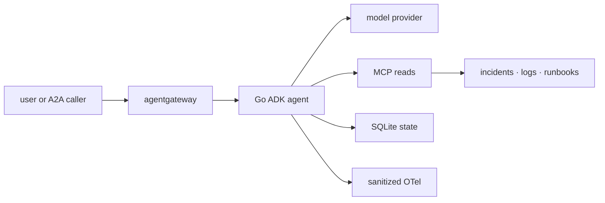

{}

- **You will:** Map the attack surface, run offline adversarial regressions, and separate enforced controls from residual risk.
- **You need:** The guardrail and least-privilege pages completed.
- **Time:** about 30 minutes, hands-on. {}

## What is the attack surface?

Every place untrusted input, authority, state, or dependency crosses a boundary is part of the attack surface.



**Diagram in words:** A user or A2A caller reaches the Go agent through an optional gateway. The agent sends requests to a model, reads through local or MCP tools, writes only through guarded SQLite actions, consumes untrusted incident data, and exports sanitized telemetry.

Threats include prompt injection in retrieved data, PII disclosure, credential leakage, path traversal, unsafe targets, replayed writes, unverified identity, tool-surface widening, denial of service, and dependency compromise.

## What does `mise run redteam` actually do?

It runs deterministic Go policy regressions under the race detector.

```bash
mise run redteam
```

The task covers injection hardening, recursive PII and credential redaction, prompt-boundary handling, and related refusal cases. Other packages pin traversal, approval, identity, replay, state recovery, and protocol allowlists.

This is offline adversarial regression, not live-model penetration testing.

## When does the red-team suite run in CI?

It belongs to the deterministic repository evidence and can run without a model, gateway, cluster, cloud resource, or account.

Hosted CI evidence is still commit-specific. A local green run proves the working tree you tested, not a future commit or a deployed service.

## How should live-model security testing be added?

Add it as a separately authorized, cost-bounded campaign against a non-production target.

Use fixed hostile prompts, explicit expected refusals, sanitized captures, request and token caps, and a teardown plan. Do not turn probabilistic live behavior into a silent merge gate or call an external model from the offline suite.

## How does the application reduce authority?

Authority is removed structurally wherever possible.

- The public MCP surface contains six reads and no writes.
- Workflow stages are read-only.
- Diagnosis cannot act; remediation cannot read raw logs or runbooks.
- The coordinator has no action tools.
- Writes require confirmation, verified identity, target validation, and atomic audit.
- Host listeners bind loopback; Kubernetes uses explicit NetworkPolicies and no public Service.
- The default model path is local and account-free.

Instruction text reinforces these boundaries but does not create them.

## What would a code executor change?

A code executor would turn generated text into direct process, filesystem, and possibly network authority.

The course implements no code-execution tool. If a future extension needs one, isolate it in an ephemeral sandbox with no credentials, no host mounts, closed egress, strict CPU/memory/time limits, an input/output allowlist, and disposable storage. Treat the sandbox escape boundary as a separate threat model.

## How are secrets protected?

Credentials remain outside source and are masked at every configuration-report boundary.

- `.env` is gitignored, user-readable only, and loaded only by model-backed tasks.
- `config.Secret` masks values in `config:check`.
- Kubernetes uses encrypted secret workflows or Workload Identity, never a committed cloud key.
- Logs, traces, eval artifacts, screenshots, and examples must contain no credential.
- Deterministic tests use non-secret markers.

A discovered real credential must be revoked or rotated before publication; deleting the text alone is insufficient.

## How is the supply chain pinned?

Each ecosystem has one explicit authority.

- Root `mise.toml` and `mise.lock` pin CLI tools.
- The three Go modules declare requirements in `go.mod` and exact resolution in `go.sum`.
- Container image references are digest-pinned at their use sites.
- Helm charts and Kubernetes API versions are pinned in platform configuration.
- Vendor browser assets record version and SHA-256.

Compatibility holds carry their reason next to the pin. An upgrade is a tested decision, not a search-and-replace of version prose.

## How are dependencies and infrastructure scanned?

Run the scoped checks before the complete security profile:

```bash
mise run check:vuln
mise run check:licenses
mise run check:infra
mise run secure
```

Go vulnerability checks analyze reachable module code. License inventory checks the locked dependency graphs. Trivy and gitleaks cover dependencies, configuration, secrets, images, and history according to the repository tasks.

Network-backed advisory databases can fail independently of source correctness. Report that boundary instead of claiming a scan passed when its database was unavailable.

## What do the scanners deliberately not fail on?

Scanners do not prove model behavior, authorization design, runtime isolation, or absence of unknown vulnerabilities.

The repository does not add finding-specific suppressions merely to make a gate green. Any accepted exception must have a narrow scope, documented rationale, expiry or review trigger, and compensating control.

## What remains out of scope?

The course does not claim public auth/TLS, multi-tenant isolation, high availability, distributed backup, a live-model red-team service, or production incident response.

The local cluster is a lab. The gateway and application controls demonstrate boundaries, while a production deployment still needs organization-specific identity, policy, data retention, capacity, recovery, and security review.

## What proves this page worked?

Run the deterministic security evidence:

```bash
mise run redteam
cd agents/go
go test -race ./tools ./compose ./a2aserver ./state
```

**You are done when:**

- Adversarial policy, traversal, approval, identity, allowlist, cancellation, and recovery tests pass.
- You can distinguish structural authority removal from instruction advice.
- You can name what the offline suite and scanners do not prove.
- No live model, cluster, or cloud resource was needed for this checkpoint.

Continue to [5. Gateway]() when the direct application boundary is secure enough to place behind centralized policy.
