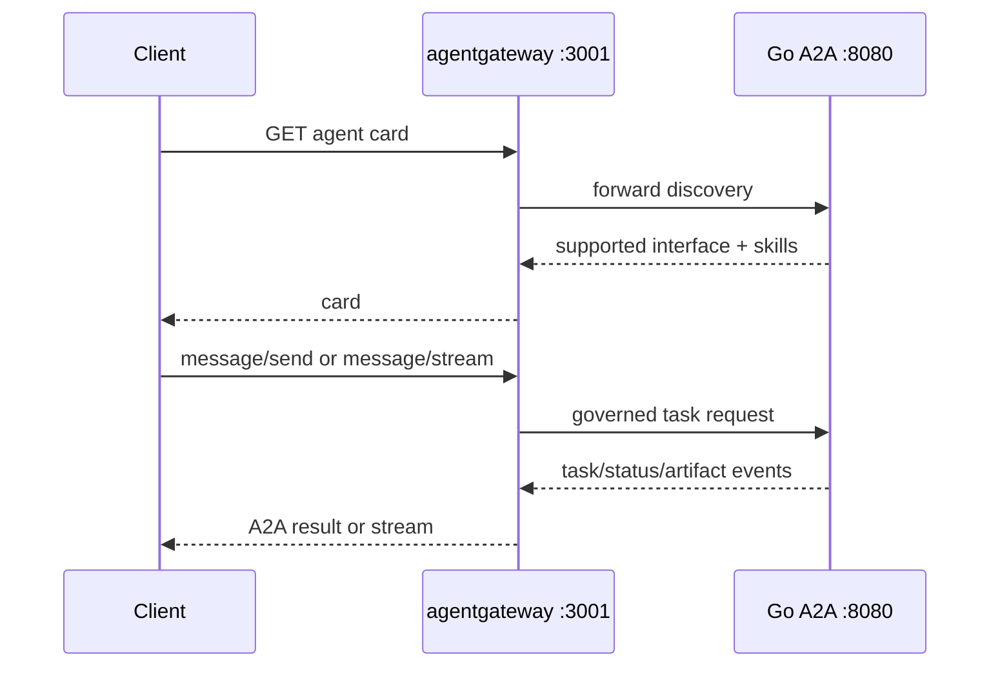

{}

- **You will:** Inspect A2A discovery and task flow through agentgateway, then prove routing and lifecycle with isolated smoke evidence.
- **You need:** The raw A2A server and host gateway prerequisites.
- **Time:** about 30 minutes, hands-on. {}

## How does the A2A request path differ from MCP?

A2A routes a complete agent task service, not a catalog of individual tools.

```bash
mise run smoke:host
```

The gateway listens on `:3001` and forwards card, JSON-RPC, and streaming requests to the Go A2A server on raw `:8080`. MCP uses `:3000` and `/mcp`; the protocols keep distinct listeners and policies.

## How does an A2A interaction work through the gateway?

The gateway preserves A2A methods and events while applying its route policy.



**Diagram in words:** A client reads the agent card through port 3001, then sends or streams a message through the same gateway. The gateway forwards the protocol to the Go service on port 8080 and returns task, status, and artifact events.

## How do you inspect the A2A contract?

The canonical host smoke reads the card, verifies CORS, and exercises a task against an isolated fake model:

```bash
mise run smoke:host
```

For an already running host stack, inspect discovery only:

```bash
xh GET http://127.0.0.1:3001/.well-known/agent-card.json
```

The card request itself makes no model call.

## What does the agent card declare through a gateway?

The backend card advertises the callable public interface configured by the Go server, not the internal bind wildcard.

Host development advertises the governed `localhost:3001` path when configured that way. Kubernetes advertises the temporary port-forward or in-cluster route defined by its deployment. A mismatch is a configuration failure because clients follow the card for subsequent work.

## How does the server preserve tasks?

The gateway is stateless with respect to A2A tasks; the Go backend persists task and session data.

A restart of agentgateway does not redefine a task. A restart of the backend recovers its SQLite stores and can answer task queries after startup preflight. The lab remains single-replica; a second writer is not implied by gateway availability.

## What bounds one A2A task?

Application and gateway limits serve different purposes.

- The gateway token bucket bounds request rate per instance.
- `AGENT_A2A_MAX_LLM_CALLS` bounds model calls per invocation.
- Model, tool, and drain timeouts bound waits.
- Session token budgets bound accumulated generation work.
- Cancellation reaches the Go runner context.

None of these is a distributed customer quota.

## How do I stream a response through the gateway?

Run the black-box A2A evaluation only when a configured model is intended. A2A is a flag on the one evaluation task rather than a task of its own:

```bash
mise run eval -- --transport a2a --output a2a-results.json
```

The harness consumes protocol events through the governed endpoint, excludes partial text from final-answer scoring, and writes the artifact named by `--output`. Without that override it would overwrite the REST `results.json` from the previous run.

For model-free routing proof, use `mise run smoke:host`, which supplies its own local fake model.

## How does a caller cancel an active task?

The caller sends the A2A cancellation method through the same listener.

agentgateway forwards it; the Go server cancels the task context and persists terminal state. Tests prove that cancellation reaches the runner, a canceled stream terminates, and action transactions remain atomic.

## What happens when a stream fails mid-answer?

Partial output is provisional. The client queries the durable task and uses its terminal state as authority.

The gateway and server expose sanitized error and trace evidence. The evaluation harness never upgrades a partial text frame into a completed answer, schema pass, or release verdict.

## What is in-process delegation?

In-process delegation stays inside the Go composition and shares policy, session, model, and resource lifecycle.

A2A adds a network trust boundary. The gateway may authenticate a caller and forward verified identity, but the application still validates the trusted header boundary before a write can name that actor.

## When is A2A worth its cost?

Use the governed A2A boundary for independently owned agents, durable protocol tasks, cross-language clients, or separate deployment and scaling needs.

Keep specialists in-process when they share release cadence and trust. The gateway should not turn every internal delegation into a network hop.

## When should an agent become a separate service?

Split when data authority, failure isolation, release ownership, or capacity requires it.

The new service then needs its own identity, authorization, compatibility, observability, load, recovery, and rollback evidence. An agent card is discovery metadata, not operational readiness proof.

## How would you write a minimal A2A client?

Use the pinned Go A2A SDK types and normalize all transport events into a local typed result.

`evals/client.go` is the black-box reference; `evals/turn_client_test.go` proves completed-event folding, tool-call and usage capture, and separate partial output without importing `agents/go`.

## What proves this page worked?

Run the isolated host path and offline A2A package tests:

```bash
mise run smoke:host
cd agents/go
go test ./a2aserver
```

**You are done when:**

- Card, CORS, task, stream, cancel, persistence, and drain evidence pass.
- The gateway is not mistaken for the task store.
- You can distinguish a per-instance rate limit from task, call, and token bounds.
- A model-backed evaluation remains explicit and writes its own artifact.

Continue to [5.4. Model Gateway]() when the gateway preserves the durable A2A contract instead of replacing it.
