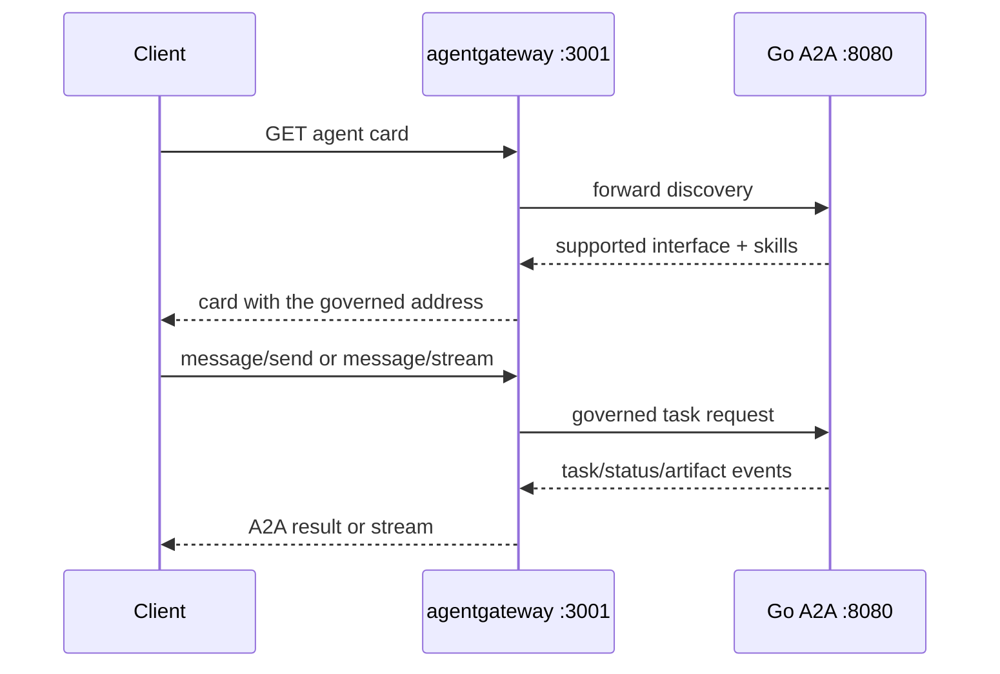

{}

- **You will:** Fetch the agent card through the gateway, find the address it rewrote, watch a browser origin be accepted and another silently refused, and say what the gateway does not hold.
- **You need:** The A2A server on `:8080` and the host gateway from [5.1. Gateway Setup]() running.
- **Time:** about 30 minutes, hands-on. {}

## The card decides whether your policy is on the path {#how-does-the-a2a-request-path-differ-from-mcp}

Ana's team ships the agent behind the gateway, and three weeks later a partner team's client is hammering the raw `:8080` port: no rate limit, no origin check, no policy of any kind. Nobody went around anything on purpose. The client did what clients do — it read the agent card and dialled the address the card gave it.

So the interesting question on this listener is not which capability a caller wants. It is what the caller is told about how to reach you again. Ask the gateway for the card:

```bash
curl -fsS http://localhost:3001/.well-known/agent-card.json \
  | jq '{name, url, interface: .supportedInterfaces[0].url}'
```

```text
{
  "name": "AgentOps Agent",
  "url": "http://localhost:8080/",
  "interface": "http://localhost:3001/"
}
```

Two addresses in one document, and the difference is the lesson. The `url` field is the backend describing itself: the Go server was started on `:8080` and has never heard of a gateway. The `supportedInterfaces` entry is what a client should actually dial, and agentgateway rewrote it to its own address on the way past — which is exactly what stops the partner team's client from ending up on the raw port. A mismatch here is a configuration failure rather than a cosmetic one.

That is also the shape of this whole listener. MCP routes a catalog of small tools, each one a decision; A2A routes one agent that keeps the work while it happens, so there is no list to prune here. Who may ask, from where, and what they are told about reaching you again is the entire policy surface.



**Diagram in words:** A client reads the agent card through port 3001, then sends or streams a message through the same gateway. The gateway forwards the protocol to the Go service on port 8080 and returns task, status, and artifact events.

The card request costs nothing and reveals no model. Discovery being free is the point of a card: another team's agent can find out what yours does, and how to reach it, before spending a token.

## The browser is a boundary, and the gateway holds it

The course ships a single-file A2A web client on `http://localhost:8001` (`mise run client:web`), and that origin is the only one the A2A route will admit. Start with the origin that is allowed, so you know what success looks like:

```bash
curl -sS -i -X OPTIONS http://localhost:3001/ \
  -H 'Origin: http://localhost:8001' \
  -H 'Access-Control-Request-Method: POST' \
  -H 'Access-Control-Request-Headers: content-type' | head -4
```

```text
HTTP/1.1 200 OK
access-control-allow-origin: http://localhost:8001
access-control-allow-methods: GET,POST,OPTIONS
access-control-allow-headers: content-type
```

Now change one header value and run it again. Predict the status line before you press enter — a `403`, a connection error, or something else:

```bash
curl -sS -i -X OPTIONS http://localhost:3001/ \
  -H 'Origin: http://evil.invalid' \
  -H 'Access-Control-Request-Method: POST' \
  -H 'Access-Control-Request-Headers: content-type' | head -4
```

```text
HTTP/1.1 200 OK
content-length: 0
date: Mon, 10 Aug 2026 20:24:34 GMT
```

Also a `200`, and that is the answer most people get wrong. CORS is not a server-side rejection; it is an instruction to the browser. The disallowed origin gets a perfectly ordinary response with **no** `Access-Control-Allow-Origin` header, and the browser is what refuses to hand the body to the page's JavaScript. Which is why testing only the allowed origin is worthless: a wildcard policy passes that test too, and fails this one. The smoke harness asserts both directions for exactly this reason.

**You can now tell a policy that is enforced from a policy that is merely advertised — on the one boundary where the difference is invisible from the server side.**

## The gateway forwards tasks; the agent owns them

An **A2A task** is protocol-visible work with its own id, a context id, a status, messages, artifacts, and a cancellation lifecycle. [2.4. Sessions]() took that apart on disk. What matters here is where it lives: the gateway is stateless with respect to tasks, and the Go backend persists both task and session data in SQLite.

Restart agentgateway and no task changes; restart the backend and it recovers its stores and can answer task queries after startup preflight. The lab stays single-replica, and gateway availability does not imply a second writer — that is a shared-database design decision, not a scaling flag.

Several different bounds apply to one task, and confusing them is the fastest way to build a limit that does not limit what you meant:

- The gateway's token bucket bounds request rate per gateway instance — 60 requests per 60 seconds on this listener.
- `AGENT_A2A_MAX_LLM_CALLS` bounds model calls within a single invocation.
- Model, tool, and drain timeouts bound how long anything waits.
- Session token budgets bound accumulated generation work across a conversation.
- Cancellation reaches the Go runner's context, and the server persists the terminal state.

None of those is a distributed customer quota, and none of them can be, because each is enforced by one process reading its own memory.

Cancellation and streaming both travel the same listener. A caller sends the A2A cancellation method, agentgateway forwards it, the Go server cancels the task context and writes the terminal state; the tests prove that cancellation reaches the runner, that a cancelled stream terminates, and that action transactions stay atomic across it. When a stream fails mid-answer, the rule is that partial output is provisional: the client re-reads the durable task and treats its terminal state as authority. The evaluation harness enforces the same rule mechanically — it never promotes a partial text frame into a completed answer.

To exercise the streaming path against a configured model, A2A is a flag on the one evaluation task rather than a task of its own:

```bash
mise run eval -- --transport a2a --output a2a-results.json
```

Be precise about what that measures, because the name invites a wrong reading. The harness starts its own agent process for each case and dials `http://127.0.0.1:` plus a port it allocated for itself; agentgateway is not on that path at all. What it exercises is the A2A protocol fold — task events, streaming frames, cancellation — not your policy. The `--output` override keeps the artifact off the REST `results.json` from the previous run. The command that does drive this listener end to end is `mise run smoke:host`, which supplies a local fake model and sends one real `message/send` through `:3001`.

## When a network hop is worth its cost

In-process delegation keeps a specialist inside the Go composition, sharing policy, session, model, and resource lifecycle. A2A adds a network trust boundary, and that costs something: a gateway may authenticate a caller and forward a verified identity, but the application still has to validate that trusted header before a write may name that actor.

Use the governed A2A boundary for independently owned agents, durable protocol tasks, cross-language clients, or genuinely separate deployment and scaling needs. Keep specialists in-process when they share a release cadence and a trust domain. The gateway should not turn every internal delegation into a network hop, and the fact that it _can_ is not a reason.

The moment to split is when data authority, failure isolation, release ownership, or capacity requires it — and the new service then needs its own identity, authorization, compatibility, observability, load, recovery, and rollback evidence. An agent card is discovery metadata, not operational readiness, and telling those two apart is what [0.2. Evidence]() is for. If you write a client for such a service, `evals/client.go` is the black-box reference: it uses the pinned Go A2A SDK types, normalizes every transport event into one typed result, and its tests prove completed-event folding, tool-call and usage capture, and separate partial output — without importing `agents/go` at all.

## Your turn: read the same card through two doors

- **Mode**: `inspect` — two read-only requests, nothing to revert.
- **Goal**: see exactly which field the gateway rewrites, and predict what breaks when a card advertises the wrong door.
- **Files to touch**: none.
- **Preflight**: both the A2A server and the host gateway are running, and `curl -fsS http://127.0.0.1:15021/healthz/ready` prints `ready`.
- **Steps**: fetch `/.well-known/agent-card.json` from `http://localhost:8080` and from `http://localhost:3001`, and diff the two documents field by field.
- **Gate that proves completion**: with `jq '{name, url, interfaces: [.supportedInterfaces[].url], skills: [.skills[].id]}'` the two cards agree on `name`, on `url`, and on the `incident-triage` and `remediation` skills, and every entry in `interfaces` moves from `http://localhost:8080/...` to `http://localhost:3001/...`. Then say, in one sentence, which policies a client would skip if it followed `url` instead.
- **Final state**: nothing changed. Keep both processes running for [5.4. Model Gateway]().

## What you can do now

- You fetched the agent card through `:3001` and can name the field the gateway rewrote and the field it left alone.
- You sent a preflight from an allowed and a disallowed origin, and can explain why both returned `200`.
- You can separate a per-instance rate limit from per-invocation call caps, timeouts, and session token budgets.
- `cd agents/go && go test ./a2aserver` passes on your machine, with no gateway and no model running.

An hour ago "put the agent behind a proxy" implied the clients would somehow know. You have now watched the gateway tell them, and watched a browser policy that only exists because the client agrees to honor it.

Continue to [5.4. Model Gateway]() when the gateway preserves the durable A2A contract instead of replacing it.
