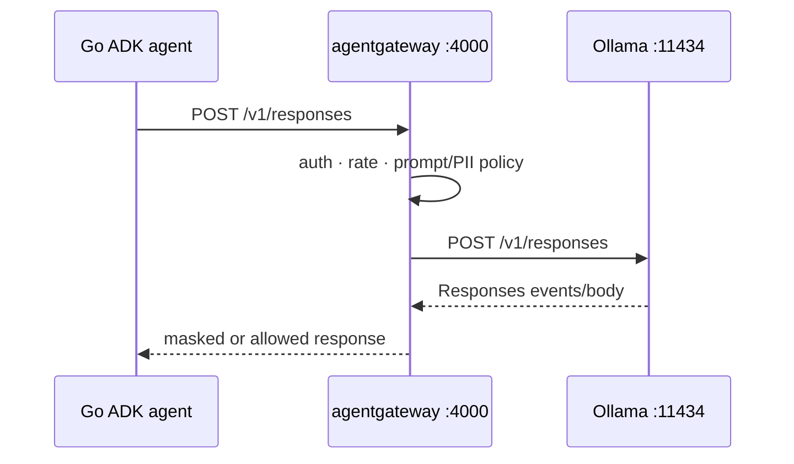

{}

- **You will:** Prove the `/v1/responses` contract, inspect local and Vertex backends, and understand timeout, retry, error, and fallback ownership.
- **You need:** Ollama, the host gateway, and the Go PII webhook/A2A process running for the guarded host route.
- **Time:** about 30 minutes, hands-on. {}

## What is the application contract?

The Go application keeps one ADK `model.LLM` interface and changes the OpenAI-compatible base URL.

```bash
# Direct Ollama
OPENAI_BASE_URL=http://127.0.0.1:11434/v1

# Through host agentgateway
OPENAI_BASE_URL=http://127.0.0.1:4000/v1
```

ADK Go's OpenAI adapter sends only `POST /v1/responses`. It has no chat-completions branch.



## How do you call the gateway directly?

Send the same Responses request the agent adapter emits:

```bash
curl -fsS http://127.0.0.1:4000/v1/responses \
  -H 'Content-Type: application/json' \
  -H 'Authorization: Bearer local-ollama' \
  -d '{"model":"qwen3:4b-instruct","input":"Reply with the word ready."}' \
  | jq -e '.output | length > 0'
```

The host route's second PII layer calls the Go webhook on the agent process and fails closed if it is configured but unavailable. Start the documented host processes before interpreting a failure as a model problem.

## What does "OpenAI-compatible" actually standardize?

It standardizes the request/response transport contract used by this adapter: base URL, bearer marker, model name, Responses payload, streaming events, function calls, and usage fields.

It does not make providers behaviorally identical. Tool selection, JSON fidelity, context limits, tokenization, latency, safety behavior, and error details still differ and require evaluation.

The course deliberately uses no extra provider-translation client in the application. agentgateway owns any data-plane conversion needed by its configured backend.

## How is local Qwen3 configured?

The host and k3d gateway profiles declare an AI route for `/v1/responses`, then forward to Ollama's Responses endpoint with the pinned model name.



**Diagram in words:** The Go agent sends a Responses request to agentgateway on port 4000. The gateway applies caller, rate, prompt, and PII policy, forwards the same route to Ollama, then masks or returns the provider response to the agent.

The executable authority is `infra/agentgateway/{host,k3d}/config.yaml`; the profile, not this prose, pins the backend shape.

## How does the gateway reach Vertex Gemini on GKE?

The GKE profile configures a Vertex AI backend and uses ambient Workload Identity Federation for backend authentication.

No cloud key is mounted. The gateway profile carries the project, region, model, and `backendAuth.gcp` settings rendered from approved infrastructure outputs. The compatibility-pinned model remains tied to the tested gateway conversion pair; do not move it because a newer model exists.

The application may also select ADK's native Gemini provider explicitly. That is a separate client path with the same two-method `model.LLM` interface, not a hidden fallback.

## Does one endpoint make every provider identical?

No. One endpoint stabilizes application wiring and policy placement, not inference semantics.

Every candidate still needs the same fixed evalsets, stable temperature configuration, model identity, source commit, transport capture, and cost evidence. A green transport probe proves reachability only.

## What happens when the provider fails?

The adapter returns a wrapped Go error with provider context; app-wide policy exports sanitized error evidence.

The agent does not invent a successful answer from an unavailable provider. Gateway failure, timeout, rate limit, and guard rejection remain distinguishable through status, structured logs, and traces without copying prompt or response content.

## Does the gateway retry or time out the upstream?

The application owns the configured model deadline and adapter retry count. The gateway adds rate and guard policy but no second retry loop on this edge.

`AGENT_MODEL_TIMEOUT_S` bounds each attempt. `AGENT_MAX_RETRIES` configures the SDK for transient failures. Repeated generation can spend latency and tokens, so the budget is explicit and tested.

## How does the agent fail over when the primary model is down?

`AGENT_MODEL_FALLBACK` may name a second model on the same provider and endpoint.

The `model.Fallback` wrapper engages only when the primary fails before yielding any response. It never switches after partial output or a function call, because replaying that request could duplicate visible text or tool work. If both fail, the fallback error keeps the primary context.

This is availability behavior, not provider portability. A fallback candidate needs its own quality and cost evidence.

## What proves this page worked?

Prove the application contract offline first:

```bash
cd agents/go
go test ./model
```

With the documented host services already running, execute the direct Responses probe above and then:

```bash
mise run smoke:host
```

**You are done when:**

- Model tests prove `/v1/responses`, explicit endpoints, timeouts, retries, and pre-output-only fallback.
- The direct gateway request returns non-empty Responses output.
- The host smoke passes through the configured gateway policy.
- You can separate transport reachability from model-quality evidence.

Continue to [5.5. Gateway Security]() when the Responses route is the only application-facing model contract.
