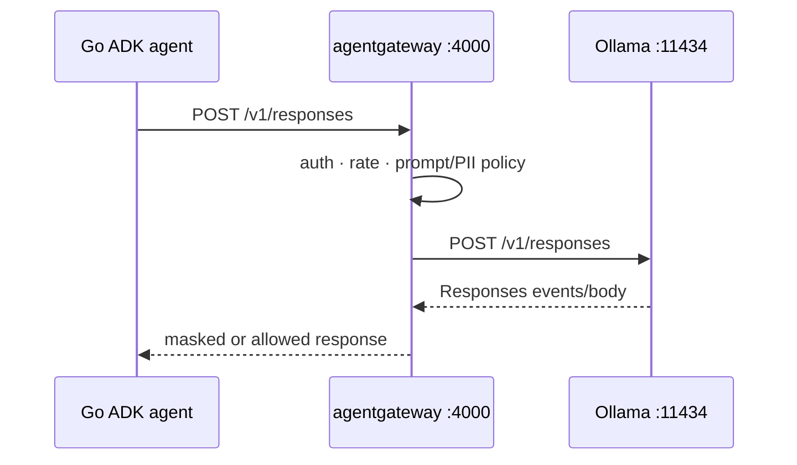

{}

- **You will:** Send one Responses request through the gateway, read what the gateway recorded about it, and then discover which of two settings actually chooses the model by routing a second alias yourself.
- **You need:** Ollama serving `qwen3:4b-instruct`, the host gateway running, and the A2A process up so the model route's PII webhook has somewhere to call.
- **Time:** about 30 minutes, hands-on. {}

## Two places name a model; only one of them wins

Moving the agent onto the gateway changed one line of its environment:

```bash
# Direct Ollama
OPENAI_BASE_URL=http://127.0.0.1:11434/v1

# Through host agentgateway
OPENAI_BASE_URL=http://127.0.0.1:4000/v1
```

No new client, no provider-translation layer, no branch in the agent. ADK takes a model instance rather than a name, so `model.Build` constructs the client from validated configuration and hands the value back; a base URL is the only thing that moves:



Send it the request the agent's adapter sends, and watch it work:

```bash
curl -sS http://localhost:4000/v1/responses \
  -H 'Content-Type: application/json' \
  -H 'Authorization: Bearer local-ollama' \
  -d '{"model":"qwen3:4b-instruct","input":"Reply with the word ready."}' \
  | jq -c '{status, model, output_tokens: .usage.output_tokens, total_tokens: .usage.total_tokens}'
```

```text
{"status":"completed","model":"qwen3:4b-instruct","output_tokens":64,"total_tokens":78}
```

A local model answered through a proxy, and the gateway wrote down what happened. Here is its access log line for that exact request, trimmed of the connection fields you already met in [5.1. Gateway Setup]():

```text
{"level":"info","time":"2026-08-10T20:49:32.259519Z","scope":"request","gateway":"default/default","listener":"llm","route":"default/llm","endpoint":"host.docker.internal:11434","http.method":"POST","http.path":"/v1/responses","http.status":200,"protocol":"llm","gen_ai.operation.name":"chat","gen_ai.provider.name":"openai","gen_ai.request.model":"qwen3:4b-instruct","gen_ai.response.model":"qwen3:4b-instruct","gen_ai.usage.input_tokens":14,"gen_ai.usage.output_tokens":64,"agw.ai.usage.cost.total":"0","duration":"473424ms"}
```

**A model on your own hardware just answered through a policy-enforcing proxy, and the proxy counted the tokens and priced the call at zero — no account, no key, no bill.**

That zero is not a placeholder: the host profile's model catalog declares zero input and output rates for a model you host yourself, which is honest accounting rather than a copied price. That `duration` is from a badly contended laptop and is not a benchmark; the point is which fields exist, not how slow this one was.

Now the interesting field: `gen_ai.request.model`. Two different files name a model on this path. The agent has `AGENT_MODEL=qwen3:4b-instruct`, and the gateway's `llm` route ends in a backend that also pins one:

```yaml
backends:
  - ai:
      name: ollama
      hostOverride: localhost:11434
      pathOverride: /v1/responses
      provider:
        openAI:
          model: qwen3:4b-instruct
```

They agree today, which is why nobody notices. Predict what happens when they disagree: does the request the caller sent win, does the backend's pin win, or does the gateway reject the mismatch? The exercise at the end of this page answers it with a `404` you can read, and the answer changes how you think about `AGENT_MODEL` for the rest of the course.

## What "OpenAI-compatible" standardizes, and what it does not

It standardizes the transport contract this adapter uses: the base URL, the bearer marker, the model name field, the Responses payload, streaming events, function calls, and usage fields. ADK Go's OpenAI adapter sends only `POST /v1/responses` — there is no chat-completions branch anywhere in it, which is why the route carries an explicit `routes: {/v1/responses: responses}` override. Without that line agentgateway assumes chat-completions and rejects the body as "missing field `messages`", and the response guard would then be inspecting a shape that never arrives.



**Diagram in words:** The Go agent sends a Responses request to agentgateway on port 4000. The gateway applies caller, rate, prompt, and PII policy, forwards the same route to Ollama, then masks or returns the provider response to the agent.

What one endpoint does _not_ do is make providers behave alike. Tool selection, JSON fidelity, context limits, tokenization, latency, safety behavior, and error detail all still differ, and no amount of shared wire format makes a 4B local model and a hosted frontier model interchangeable. One endpoint stabilizes application wiring and policy placement, not inference semantics: a green transport probe proves reachability, and quality is an observation you have to go and measure ([0.2. Evidence]()).

That is also why the GKE profile can swap the backend for Vertex AI without touching the agent. It configures a Vertex backend with the project, region, model, and `backendAuth.gcp` settings rendered from approved infrastructure outputs, and reaches Google with ambient Workload Identity Federation rather than a mounted key. The compatibility-pinned model stays tied to the tested gateway conversion pair; do not move it because a newer model exists. The application may alternatively select ADK's native Gemini provider, which is a separate client path behind the same interface — an explicit choice, never a hidden fallback.

## Deadline, retry, and fallback: who owns which {#how-does-the-agent-fail-over-when-the-primary-model-is-down}

Three failure behaviors live on this edge, and the split is deliberate: the application owns all three, and the gateway adds no second retry loop on top of them.

`AGENT_MODEL_TIMEOUT_S` bounds each attempt; `AGENT_MAX_RETRIES` configures the SDK for transient failures. Stacking a gateway retry on an application retry multiplies both latency and tokens, which is how a slow provider becomes a self-inflicted outage, so the model route deliberately carries rate and guard policy only.

`AGENT_MODEL_FALLBACK` may name a second model on the same provider and endpoint, and `model.Fallback` engages it only when the primary fails **before yielding any response**. Never after partial output, and never after a function call — replaying that request could duplicate visible text or repeat tool work, and a duplicate tool call in this domain means restarting a service twice. If both models fail, the error keeps the primary's context so the log still names what actually broke.

Read that as availability behavior, not portability. A fallback candidate is a second model with its own quality and cost profile, and shipping one you have never measured just means your outages produce different answers instead of no answers. When the provider does fail, the adapter returns a wrapped Go error with provider context and the application exports a sanitized error record: gateway failure, timeout, rate limit, and guard rejection stay distinguishable through status, structured logs, and traces, without copying prompt or response content anywhere. The agent does not invent a successful answer from an unavailable provider.

## Your turn: route a second model alias

Ana's team wants to try a smaller model for triage without touching the agent. Do it at the gateway — and find out who has really been choosing the model all along.

Predict before you run this: you will point the gateway's backend at `qwen3:1.7b`, which is not pulled on your machine, and then send a request that explicitly names `qwen3:4b-instruct`, which is. Does the request succeed, fail, or silently use the model you named?

- **Mode**: `temporary experiment`.
- **Goal**: prove which of the two model names on this path reaches Ollama, and watch the repository's own gate refuse the change.
- **Files to touch**: `infra/agentgateway/host/config.yaml` only.
- **Preflight**: `git diff --quiet -- infra/agentgateway/host/config.yaml` must succeed, and the plain Responses request at the top of this page must return `"status":"completed"`.
- **Steps**: in the `llm` route's backend, change `provider.openAI.model` to `qwen3:1.7b`, and add the same alias beside `qwen3:4b-instruct` under `config.modelCatalog[0].inline.providers.openai.models` with zero input and output rates. Run `infra/scripts/gateway-host.sh validate`, then `mise run gateway:host:stop` and `mise run gateway:host`, then repeat the Responses request from the top of this page unchanged.
- **Gate that proves completion**: `validate` prints `Configuration is valid!` — the real binary is happy — and the same request, sent without the `jq` filter and with `-w '\nHTTP %{http_code}\n'`, comes back as the failure below. Then `mise run check:infra` exits non-zero, because the shipped profile contract pins the model catalog to exactly one entry — the alias you added to it is what the gate sees.
- **Final state**: run `git restore -- infra/agentgateway/host/config.yaml`, restart the gateway, and confirm the Responses request returns `"status":"completed"` and `mise run check:infra` is green again.

The failure is the whole lesson, and it is unambiguous:

```text
{"error":{"message":"model 'qwen3:1.7b' not found","type":"not_found_error","param":null,"code":null}}
HTTP 404
```

Ollama was never asked for the model the caller named. The gateway substituted its own, and the access log agrees — `"gen_ai.request.model":"qwen3:1.7b"` on a request whose body said `qwen3:4b-instruct`. Once the agent talks to a model listener, `AGENT_MODEL` stops being the model selector and becomes a label the agent reports about itself; the routing decision has moved to a file the agent cannot read. That is the same trade as the tool allowlist in [5.2. MCP Gateway](), and it is worth knowing before an evaluation run tells you a model got worse overnight.

## What you can do now

- You sent a Responses request through `:4000` and read back the status, the model, and the token usage the gateway attributed to it.
- You made two files disagree about the model name and can say, from a `404` and a log field, which one Ollama actually received.
- `cd agents/go && go test ./model` passes offline, covering the single-method contract, explicit endpoints, timeouts, retries, and pre-output-only fallback.
- You can separate transport reachability from model-quality evidence, and name what the second one costs to obtain.

Behind a model listener, swapping models means editing the gateway rather than the agent — and a request naming the wrong model does not fail loudly at the boundary, it quietly becomes a different request. That silent substitution is the one to remember when a cost figure stops matching a model name.

Continue to [5.5. Gateway Security]() when the Responses route is the only application-facing model contract.
