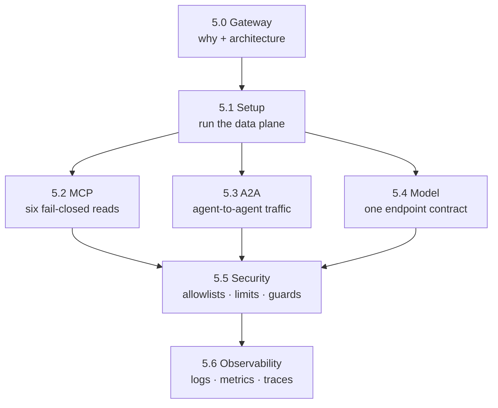

{}

- **You will:** See what the chapter governs, check that your machine can run it, and pick the page that owns each boundary.
- **You need:** Chapters 2-4 finished and Docker running. The one command below only reports; `mise run install:platform` supplies the tools every later page uses.
- **Time:** about 5 minutes, orientation. {}

## The agent works. Its traffic has no rules yet.

Ana's agent can read INC-002, rank the runbooks, and ask a human before it restarts anything. Every one of those abilities arrives over a connection the agent opens itself: a model endpoint it names in an environment variable, an MCP server it trusts to advertise honest tools, an A2A port any process on the machine can post to. Nothing rate-limits those connections, nothing logs them in one place, and nothing stops the next service your team writes from wiring itself to the same backends with a slightly different set of rules.

That is the gap this chapter closes. You put one open-source proxy — [agentgateway](https://agentgateway.dev/) — between the agent and all three of its outside worlds, and you move the traffic decisions into it: which tools exist, how fast a caller may push, which prompts are refused, what gets logged. The agent keeps the decisions a proxy cannot make, and by the end of 5.6 you can watch a single refused request appear in a log line, a counter, and nowhere else.

First, find out whether your machine is ready. This probes and starts nothing:

```bash
mise run doctor:gateway
```

```text
[doctor:gateway] $ ./scripts/doctor.sh gateway
gateway    ready
env        optional .env is absent
docker     ready
```

Three lines and no surprises is what you want. `gateway ready` means every tool the host path needs is on `PATH`; `docker ready` means the daemon answered and `docker compose` exists. On a fresh clone it fails instead, and the failure is useful: each line pairs a `missing:` tool with the `remedy:` that supplies it, which for `yq` is `mise run install:platform`. The doctor reports; it never installs. [5.1. Gateway Setup]() opens with that command.

## What each page owns

Read them in order. Each one takes a single boundary and ends with something you can see on your own screen.

- **[5.0. Gateway]()** _(concept)_: Why an extra hop is worth it, which port carries which protocol, and the three controls that must never leave the agent.
- **[5.1. Gateway Setup]()** _(hands-on)_: Start the whole stack on your laptop through a wrapper that keeps every listener on loopback, and read what it did to your machine.
- **[5.2. MCP Gateway]()** _(hands-on)_: Watch the gateway hand out six read tools, refuse a seventh, and fail closed when the tool server is gone.
- **[5.3. A2A Gateway]()** _(hands-on)_: Fetch the agent card through the gateway, see the address it rewrites, and find out which origins a browser may use.
- **[5.4. Model Gateway]()** _(hands-on)_: Discover that the gateway, not the agent, now chooses which model answers — then route a second alias yourself.
- **[5.5. Gateway Security]()** _(hands-on)_: Trip the prompt guard, turn on TLS and JWTs, and hand out a token that can see two tools instead of six.
- **[5.6. Gateway Observability]()** _(hands-on)_: Follow one rejected request through a log line, a counter, and a Prometheus query — and explain the trace that never appears.

## How the chapter fits together



**Diagram in words:** The conceptual opener feeds the setup page, which feeds the three protocol pages in any order; security and observability then cut across all three.

Security and observability are not a fourth plane. Their policies attach per listener, so the same rate limit vocabulary and the same log shape apply to MCP, A2A, and model traffic alike — which is exactly the payoff of putting one process in the path.

Three facts about the shape of the chapter, before you start. **It all runs on your laptop**: the host profile needs no Kubernetes cluster, no cloud account, and no provider key. **It needs Docker and a pulled Qwen3**, because the gateway ships as a digest-pinned container and the model listener forwards to your local Ollama. And **not all of it is required**: the JWT/TLS profile in 5.5 is opt-in, the Vertex Gemini path in 5.4 is an optional proprietary comparison, and every Kubernetes mention is a preview of [Chapter 6]().

{}

agentgateway was created by Solo.io and donated to the Linux Foundation; it is now an **[Agentic AI Foundation (AAIF)](https://aaif.io/projects/agentgateway/)** project. This chapter uses it as the connectivity and traffic-policy layer while keeping application approval and transactions in the Go ADK application. {}

## What this chapter proved

Once the platform tier is installed, one command stands the whole composition up against a deterministic fake model on temporary ports and tears it down again, so the chapter's central claim is checkable without spending a single model token. That command is `mise run smoke:host`, and [5.1. Gateway Setup]() runs it as its first real step. When you reach the end of 5.6, four things will be true:

- `mise run smoke:host` finishes green and leaves no container, process, or work directory behind.
- You can name the page that owns the MCP, A2A, and model boundaries, and the two that cut across all three.
- You have taken one tool away at the gateway, watched `mise run check:infra` refuse the half-change, and can name the file under `agents/go/` that has to agree before the tool is really gone.
- You can say why a control that decides whether a specific human approved a specific write cannot live at a proxy at all.

Continue to [5.0. Gateway]() once `mise run doctor:gateway` is green, because every page after it assumes the gateway can start.
