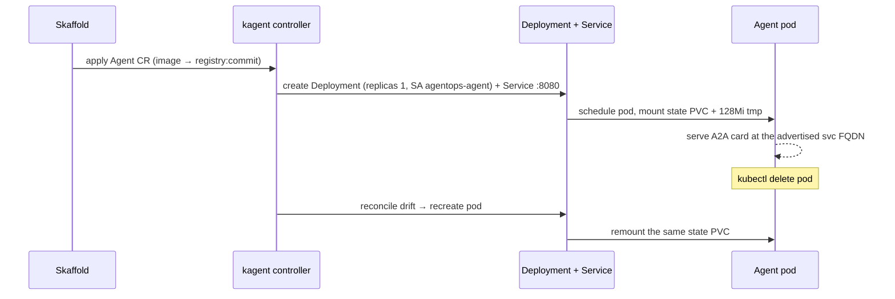
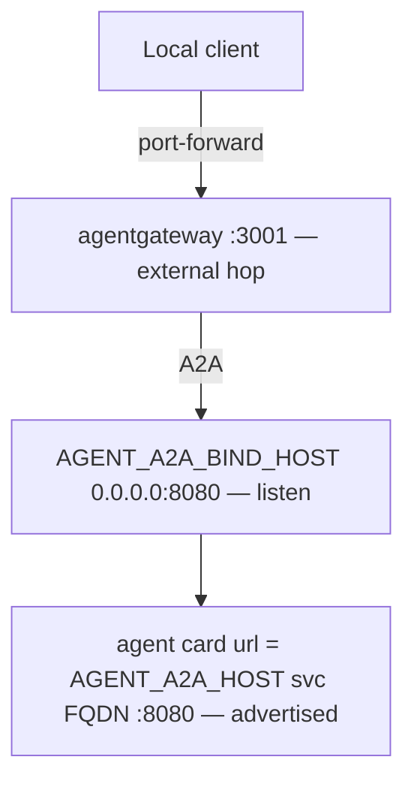

{}

- **You will:** Read the one file that declares the agent as a Kubernetes workload, then watch the controller rebuild the pod after you delete it.
- **You need:** The Skaffold loop from [6.2. Platform Install]() still running.
- **Time:** about 18 minutes, reference. {}

## Why declare a BYO Agent instead of a declarative kagent Agent?

This course uses `spec.type: BYO`. You ship the container image, and kagent only schedules it and fronts it on the cluster network. That choice decides who owns the agent's behavior, which makes it the most important decision on this page.

kagent supports two shapes of `Agent`. A **declarative** Agent hands kagent a model, a system prompt, and a tool list, and kagent composes and runs the loop for you inside its own runtime and container. A **BYO** ("bring your own") Agent inverts that: you ship the container image and own the agent contract, and kagent's job narrows to scheduling the workload and fronting it on the cluster network.

This course spent chapters 2 through 5 building a complete Google ADK application:

1. a persistent session/task server (Chapter 2.4),
1. guarded write actions (Chapter 3.1),
1. PII and injection guardrails (Chapter 4.5),
1. audit transactions,
1. OpenTelemetry spans (Chapter 7).

A declarative Agent would discard that and re-express a thinner agent in kagent's vocabulary. `spec.type: BYO` keeps the validated application intact — the exact image that ran on the host in Chapter 5 runs unchanged in the cluster, still serving its own A2A card, still driving its own ADK `Runner`. Deployment configuration narrows that image's authority by freezing guarded writes and ADK content-bearing traces. That is why Chapter 6.0 states plainly that kagent does not replace ADK.

The trade-off is explicit:

1. Choose BYO when you already have a working agent and want to preserve its runtime, framework, protocol surface, and lifecycle exactly — as this course does. You accept that kagent cannot introspect your prompt or tools.
1. Choose a declarative Agent when you want kagent to own composition and are starting from a model and a tool list, not a container. You gain declarative convenience and lose runtime control.

The required and optional paths make that ownership boundary concrete:

| Concern               | Required `agentops-agent` BYO path                                 | Optional `incident-reader` declarative path              |
| --------------------- | ------------------------------------------------------------------ | -------------------------------------------------------- |
| Agent loop            | Source-owned Google ADK Go application                             | Pinned kagent built-in Go runtime                        |
| Model wiring          | `OPENAI_BASE_URL` and `OPENAI_API_KEY` env                         | `ModelConfig/agentgateway`                               |
| Read-tool wiring      | `AGENT_MCP_URL` env with a Go-side six-tool filter                 | `RemoteMCPServer/agentops-tools` with six `toolNames`    |
| Write authority       | Guarded tools remain in code; shipped profiles freeze their writes | No write tools, approval flow, code execution, or policy |
| Session ownership     | Source-owned persistent session/task service                       | kagent session/task service keyed by `context_id`        |
| Platform contribution | Inventory, reconciliation, status, Service, and Deployment         | Composition plus the same platform lifecycle             |

## What does the BYO Agent declare?

[`infra/kagent/agent.yaml`](https://github.com/MLOps-Courses/agentops-open-course-go/blob/main/infra/kagent/agent.yaml) is one **custom resource** — an object type kagent added to the Kubernetes API — that carries the full workload shape:

```yaml
apiVersion: kagent.dev/v1alpha2
kind: Agent
metadata:
  name: agentops-agent
  namespace: agentops
spec:
  type: BYO
  byo:
    deployment:
      image: agentops-agent:dev
      imagePullPolicy: IfNotPresent
      replicas: 1
      serviceAccountName: agentops-agent
```

Under `spec.byo.deployment` the same manifest also declares:

1. the container `env` — the data-plane and A2A addressing contracts.
1. `resources` — the compute envelope.
1. `podSecurityContext` and `securityContext` — the hardening posture.
1. `volumeMounts`/`volumes` — the [state PVC]() and a small writable `/tmp`.

The sections below take each of those in turn. The logical `image: agentops-agent:dev` is a placeholder that Skaffold rewrites at deploy time — see the next section.

## How does the custom resource become a running Deployment and Service?

A custom resource is declared intent, not a running process; a controller reconciles it into built-in Kubernetes objects.

kagent watches `Agent` resources. For `type: BYO` it turns `spec.byo.deployment` into a `Deployment` plus a `Service` on the A2A port `8080`. That Deployment carries one replica, `serviceAccountName: agentops-agent`, `imagePullPolicy: IfNotPresent`, the hardened security contexts, the declared env, and the volume mounts.

You never author those objects. You author the `Agent`, and kagent keeps the derived objects converged to it.

Two rewrites happen before and during that reconcile:

1. Skaffold rewrites `.spec.byo.deployment.image`. Plain kustomize does not know that a custom resource contains an image field, so [`infra/skaffold.yaml`](https://github.com/MLOps-Courses/agentops-open-course-go/blob/main/infra/skaffold.yaml) declares a `resourceSelector` that points Skaffold at that exact path: `groupKind: Agent.kagent.dev`, `image: [.spec.byo.deployment.image]`. Skaffold then replaces `agentops-agent:dev` with the pushed registry reference tagged by the abbreviated Git commit (`tagPolicy.gitCommit.variant: AbbrevCommitSha`). Chapter 6.1 covers why a commit tag improves provenance but is still a mutable reference.
1. The overlay patches env values. The local overlay rewrites `env[0]` (`AGENT_MODEL`) to `qwen3:4b-instruct`; the GKE overlay leaves `gemini-3.5-flash`. Model backend is a data-plane change (Chapter 6.5).



That last loop is exactly the checkpoint at the end of this page: delete the pod, and kagent recreates it against the same claim. Because reconciliation converges the derived objects, do not hand-edit the generated `Deployment` — the controller will overwrite your change.

## Which environment variables preserve the data plane?

Moving to Kubernetes preserves the application code while intentionally narrowing its runtime authority. The `env` block repoints the data plane and enforces the platform safety boundary:

```yaml
- name: AGENT_MODEL_PROVIDER
  value: openai-compatible
- name: AGENT_MCP_URL
  value: http://agentgateway:3000/mcp
- name: OPENAI_BASE_URL
  value: http://agentgateway:4000/v1
- name: OPENAI_API_KEY
  value: agentgateway
- name: AGENT_WRITES_DISABLED
  value: "true"
- name: OTEL_EXPORTER_OTLP_ENDPOINT
  value: http://otel-collector:4318
- name: ADK_CAPTURE_MESSAGE_CONTENT_IN_SPANS
  value: "false"
- name: OTEL_TRACES_SAMPLER
  value: always_off
- name: AGENT_STATE_DIR
  value: /app/state
```

The decisive property is what is missing from that block: no upstream provider credential ever enters the agent pod. The gateway holds real upstream auth.

| Variable                               | Points at or sets                                 | Why it matters                                                                                                    |
| -------------------------------------- | ------------------------------------------------- | ----------------------------------------------------------------------------------------------------------------- |
| `AGENT_MODEL_PROVIDER`                 | the same provider the app selected in Chapter 2.2 | the application code is unchanged, regardless of which model sits behind the gateway                              |
| `AGENT_MCP_URL`                        | agentgateway `:3000`                              | the conversational composition registers one filtered remote MCP toolset instead of six local reads               |
| `OPENAI_BASE_URL`                      | agentgateway `:4000`                              | model traffic goes to the gateway, not straight to a provider                                                     |
| `OPENAI_API_KEY`                       | the gateway's own auth check                      | `agentgateway` is the non-secret demo marker the gateway enforces (Chapter 5.5 / 6.5), not a real credential      |
| `AGENT_WRITES_DISABLED`                | `true`                                            | guarded operational actions fail before approval because neither shipped Kubernetes gateway authenticates callers |
| `OTEL_EXPORTER_OTLP_ENDPOINT`          | the collector `:4318`                             | sanitized logs and content-free custom metrics can leave the pod for the in-cluster collector                     |
| `ADK_CAPTURE_MESSAGE_CONTENT_IN_SPANS` | `false`                                           | the pinned ADK's content-bearing model and tool spans remain disabled                                             |
| `OTEL_TRACES_SAMPLER`                  | `always_off`                                      | all in-process agent tracing stays off unless an isolated run changes both tracing controls                       |
| `AGENT_STATE_DIR`                      | the mounted state PVC                             | the one writable persistent path, because the pod's root filesystem is read-only                                  |

The local overlay uses `qwen3:4b-instruct` while the optional GKE overlay uses `gemini-3.5-flash` behind that same gateway endpoint.

Owned by [6.4. Platform Tools]() for the MCP route and [6.5. Platform Gateway]() for the gateway and the model backend.

## Why does the agent advertise a different A2A host than it binds?

Every network server has two distinct addresses: where it **listens** (the bind address) and where clients should **call** it (the advertised address). Conflating them silently breaks discovery, because a listen address like `0.0.0.0` is not a routable endpoint. The A2A block encodes both, plus the port kagent fronts:

```yaml
- name: AGENT_A2A_HOST
  value: agentops-agent.agentops.svc.cluster.local
- name: AGENT_A2A_BIND_HOST
  value: 0.0.0.0
- name: AGENT_A2A_PORT
  value: "8080"
```

`AGENT_A2A_BIND_HOST=0.0.0.0` is the listen address: the Go HTTP server binds all interfaces so the kubelet and gateway can reach the pod. The image sets the same bind and exposes `8080`, while the host default is loopback-only. `AGENT_A2A_HOST=agentops-agent.agentops.svc.cluster.local` is the advertised host: `agents/go/a2aserver/a2aserver.go` builds the card URL from it.

`config.Config` keeps `A2ABindHost` and `A2AHost` as distinct validated fields. The validator rejects a wildcard advertised host because it is not callable.

A third address completes the picture — external clients never call `8080` directly. They port-forward agentgateway `:3001` (Chapter 6.5), which fronts A2A; direct pod port `8080` is reserved for diagnosis.

Neither Kubernetes gateway authenticates that A2A caller. Treat the port-forwarded route as a single-user capability surface: task identifiers are not tenant credentials, and `AGENT_WRITES_DISABLED=true` freezes guarded operational actions independently of network reachability.



The pitfall: set `AGENT_A2A_HOST` to `0.0.0.0` or leave it at the loopback default in-cluster, and the card resolves to an uncallable address — clients fail card resolution even though the pod is healthy and serving.

## What is the ModelConfig for?

Not for the required agent. The BYO pod gets its model endpoint from the `env` block above, so `ModelConfig/agentgateway` changes nothing about how it runs.

The optional declarative specialist below references this object directly. This keeps the required path code-first while giving the model contract one real, bounded consumer.

{}

`ModelConfig/agentgateway` in [`infra/kagent/modelconfig.yaml`](https://github.com/MLOps-Courses/agentops-open-course-go/blob/main/infra/kagent/modelconfig.yaml) is kagent's declarative model contract — the object a declarative Agent or any other kagent-managed consumer would read to reach a model:

```yaml
spec:
  provider: OpenAI
  model: gemini-3.5-flash
  apiKeySecret: agentgateway-client
  apiKeySecretKey: OPENAI_API_KEY
  openAI:
    baseUrl: http://agentgateway.agentops.svc.cluster.local:4000/v1
    timeout: 120
```

Because the BYO agent brings its own `env` (the `OPENAI_BASE_URL`/`OPENAI_API_KEY` above), the ModelConfig does not inject the model into the BYO pod. The optional `incident-reader` does use it to reach agentgateway `:4000`. `apiKeySecret` references the `agentgateway-client` Secret, whose value is the non-secret SDK marker (Chapter 6.5). The local overlay patches `spec.model` to `qwen3:4b-instruct`; the GKE overlay keeps `gemini-3.5-flash` while preserving the same gateway `baseUrl`. {}

## How can you compare declarative ownership without replacing BYO?

The optional exercise proves the declarative path without replacing the required agent.

This is a **live-model Kubernetes exercise**, not an offline check. It calls the configured model and requires the local platform, gateway, MCP server, collector, and Ollama path from Chapters 6.2 and 6.5.

[`infra/kagent/exercises/incident-reader.yaml`](https://github.com/MLOps-Courses/agentops-open-course-go/blob/main/infra/kagent/exercises/incident-reader.yaml) declares one `runtime: go` specialist. It references `ModelConfig/agentgateway`, selects exactly the six read tools from `RemoteMCPServer/agentops-tools`, and declares no memory, Skills, HITL, sandbox, code execution, or write tool. The built-in runtime still uses kagent's intrinsic controller-backed session/task service; the exercise adds no memory or database configuration. Its three NetworkPolicies admit only controller A2A ingress, gateway model/MCP egress, and controller session/task egress.

Apply the opt-in bundle and wait for both controller conditions:

```bash
kubectl apply --filename infra/kagent/exercises/incident-reader.yaml
kubectl -n agentops wait \
  --for=condition=Accepted agent.kagent.dev/incident-reader --timeout=2m
kubectl -n agentops wait \
  --for=condition=Ready agent.kagent.dev/incident-reader --timeout=3m
```

Forward kagent's agent-as-MCP endpoint in one terminal:

```bash
kubectl -n kagent port-forward svc/kagent-controller 8083:8083
```

For observable client spans and metrics, forward the collector in another terminal. Skip this command if another process already owns local port `4318`.

```bash
kubectl -n agentops port-forward svc/otel-collector 4318:4318
```

The small Go client calls `list_agents`, refuses to invoke anything except the accepted and ready `agentops/incident-reader`, then calls `invoke_agent`. Run it from another terminal:

```bash
cd agents/go
result="$(
  OTEL_EXPORTER_OTLP_ENDPOINT=http://127.0.0.1:4318 \
    go run ./cmd/kagent-invoke \
    --task "Investigate INC-002 and cite log and runbook evidence."
)"
printf '%s\n' "${result}" | jq .
```

The JSON keeps model text separate from the opaque `context_id`. Pass that identifier back to continue the same kagent session:

```bash
context_id="$(jq -er .context_id <<<"${result}")"
OTEL_EXPORTER_OTLP_ENDPOINT=http://127.0.0.1:4318 \
  go run ./cmd/kagent-invoke \
  --context-id "${context_id}" \
  --task "Which runbook step should an operator verify first?"
```

The client records `agentops.kagent.list_agents` and `agentops.kagent.invoke_agent` spans plus the `agentops.kagent.client.calls` counter under `service.name=agentops-kagent-client`, labeled only by operation and outcome. Task text, response text, and `context_id` are absent from client telemetry.

The specialist itself cannot export OTLP. Its egress policy omits the collector because the pinned ADK `execute_tool` spans contain tool arguments and results even when `OTEL_INSTRUMENTATION_GENAI_CAPTURE_MESSAGE_CONTENT=false` elides model messages. This keeps the optional comparison within the course's content-private default; the safe Go client signals provide its observable evidence. kagent stores session/task history for the returned context while this Agent and control plane remain; the exercise proves neither backup/recovery nor context survival after deleting them.

Removal is a scoped **Kubernetes deletion**. Delete the same bundle; it removes the optional Agent and all three policies, while the required BYO Agent, its PVC, the shared ModelConfig, the shared RemoteMCPServer, and kagent control plane remain:

```bash
kubectl delete --filename infra/kagent/exercises/incident-reader.yaml
kubectl -n agentops get agent.kagent.dev/agentops-agent
```

## How is the pod hardened?

Suppose an attacker got code execution inside this pod. They would not be root. They could write only to `/app/state` and a 128 MiB `/tmp`, would hold no Kubernetes API token, and could reach nothing on the network except the gateway and the collector.

The BYO deployment declares a defense-in-depth posture and a bounded compute envelope so one workload cannot escalate privileges or starve neighbors:

- UID/GID/fsGroup 10001 and `runAsNonRoot`. `fsGroup` is what gives that non-root process write access to the mounted volume.
- RuntimeDefault seccomp — the container runtime's default filter on which system calls the process may make.
- no privilege escalation and all capabilities dropped.
- read-only root filesystem, a writable 1 Gi [RWO]() state PVC at `/app/state`, and a 128 MiB `/tmp` `emptyDir`.
- CPU/memory requests and limits.
- service-account token automount disabled — the `agentops-agent` ServiceAccount in [`serviceaccounts.yaml`](https://github.com/MLOps-Courses/agentops-open-course-go/blob/main/infra/k8s/base/serviceaccounts.yaml) sets `automountServiceAccountToken: false`, because the agent never calls the Kubernetes API.
- guarded operational writes disabled at startup because the shipped gateways provide no verified caller identity.
- ADK content capture false and the OTel trace sampler off, while sanitized logs and content-free custom metrics remain available.

The compute envelope is concrete, not decorative:

```yaml
resources:
  requests:
    cpu: 250m
    memory: 512Mi
  limits:
    cpu: "1"
    memory: 1536Mi
```

These numbers, plus the 128 MiB `/tmp` and the 1 Gi PVC, are what the namespace `ResourceQuota` and `LimitRange` are sized against. A `ResourceQuota` caps what a whole namespace may request; a `LimitRange` supplies defaults for pods that declare none.

Chapter 6.5 owns that math, including one surge pod per rolling deploy so Skaffold rollouts never deadlock. Do not re-derive it here; cross-link it.

A read-only root with an explicit writable state mount also constrains what a compromised process can persist. The default-deny egress rules (Chapters 6.5 and 4.6) constrain where it can send data.

The optional GKE gateway identity — the only one in the namespace, since the telemetry stores are file-backed and need no cloud account — obtains ambient cloud credentials through the metadata server, so [Workload Identity Federation]() — mapping a workload identity to cloud IAM without a static key — does not require an automounted Kubernetes API token.

## How does Kubernetes know the processes are actually ready?

Kubernetes calls an HTTP endpoint inside a container on a schedule. That [probe]() is run by the **kubelet** — the Kubernetes agent on each node.

The agent image exposes two application-level endpoints on both network servers:

- `/livez` proves the event loop can answer a trivial request.
- On MCP, `/healthz` opens the agent-published runtime database read-only and verifies integrity, required tables, the current audit version, and the exact non-partial unique idempotency index.
- On A2A, application startup owns first-boot initialization and additive runtime migration. `/healthz` then runs the same read-only database probe, verifies the writable state directory, and checks the persistent session/task store.

Health polling never creates or migrates state. On a fresh volume the A2A startup publishes the database atomically, then prepares it before serving; MCP readiness remains false for missing, legacy, or failed-migration state.

The asymmetry is worth making explicit: both workloads publish the same endpoints, but only one has them wired as kubelet probes.

| Workload               | Exposes `/livez`, `/healthz`? | Wired as k8s probe?                                     | What restarts it on failure                                       |
| ---------------------- | ----------------------------- | ------------------------------------------------------- | ----------------------------------------------------------------- |
| `agentops-agent` (A2A) | Yes                           | No — BYO `v1alpha2` exposes no probe fields             | Only kagent reconcile recreates the pod on drift                  |
| `agentops-mcp`         | Yes                           | Yes — `startupProbe`, `readinessProbe`, `livenessProbe` | The kubelet, via the wired probes (restart / drop from endpoints) |

The pinned kagent `v1alpha2` BYO deployment schema does **not** expose container probe or pod termination-grace fields. The course therefore does not pretend the controller-created A2A pod has probes it cannot declare. Open a direct checkpoint in one terminal:

```bash
kubectl -n agentops port-forward svc/agentops-agent 8080:8080
```

Leave the forward running. From another terminal, call both endpoints:

```bash
curl -fsS http://localhost:8080/livez
curl -fsS http://localhost:8080/healthz
```

Do not patch the generated Deployment behind the controller: reconciliation can overwrite that drift.

{}

The static MCP `Deployment` — not this BYO Agent — is where those endpoints are actually wired as `startupProbe`, `readinessProbe`, and `livenessProbe`; Chapter 6.4 owns that wiring and shared-PVC read coherence. The infrastructure gate asserts the rendered paths and that the 15-second pod grace period exceeds `AGENT_DRAIN_TIMEOUT_S=10`. Both Go HTTP servers use bounded graceful shutdown, so SIGTERM stops new work and gives in-flight requests time to finish before Kubernetes may send SIGKILL.

When kagent adds those BYO fields, wire the same endpoints through the `Agent` resource and remove this limitation. {}

## How do you verify the resource?

Inspect the live resource while Skaffold is running:

```bash
kubectl -n agentops get agents.kagent.dev
kubectl -n agentops get pods,pvc,svc
kubectl -n agentops describe agent.kagent.dev/agentops-agent
```

Expected: one ready agent pod, bound `agentops-agent-state`, and [ClusterIP]() `agentops-agent` on 8080.

## What proves this page worked?

Delete only the agent pod and watch kagent recreate it — the reconcile loop above, exercised for real. Confirm the replacement mounts the same PVC and the agent card is available through gateway port `3001`. This tests pod replacement, not zone/PV disaster recovery.

**You are done when:**

- `kubectl -n agentops get agents.kagent.dev` lists `agentops-agent` instead of returning nothing.
- `kubectl -n agentops get pods,pvc,svc` shows one ready agent pod, a bound `agentops-agent-state` claim, and ClusterIP `agentops-agent` on 8080.
- Deleting only the agent pod brings a replacement back, mounted on that same `agentops-agent-state` claim.
- The agent card still resolves through gateway port `3001` once the replacement pod is ready.
- `mise run check:infra` proves both rendered profiles keep guarded writes disabled, ADK message-content capture false, and the trace sampler off.
- You can say which address the pod binds (`0.0.0.0`) and which address its card advertises (`agentops-agent.agentops.svc.cluster.local`), and why they must differ.

Continue to [6.4. Platform Tools]() when the pod you deleted has come back on the same state claim.
