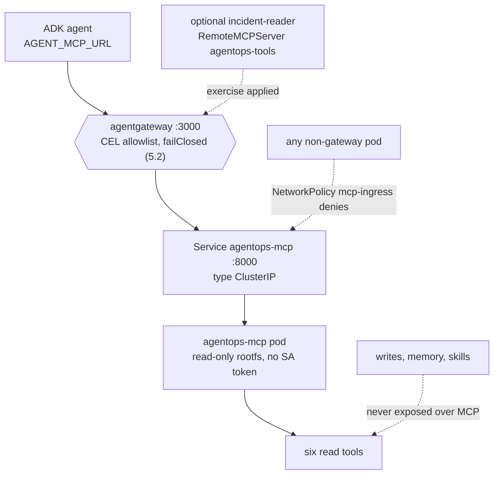
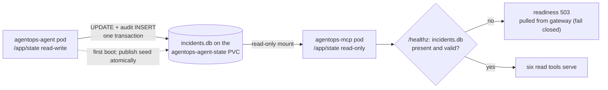

{}

- **You will:** See the six read-only tools become their own in-cluster service that only the gateway is allowed to call.
- **You need:** The Skaffold loop from [6.2. Platform Install]() still running.
- **Time:** about 16 minutes, reference. {}

## Which component serves the tools?

On your laptop the agent started the tool server itself, as a child process. In the cluster the tool server is its own pod, and the agent only knows its URL.

The code is unchanged. `infra/k8s/base/mcp.yaml` runs the same `agentops-agent:dev` image with a different entrypoint, so the tool code and the agent code ship as one artifact but run as two workloads:

```yaml
args: ["mcp"]
env:
  - name: MCP_HOST
    value: 0.0.0.0
  - name: MCP_PORT
    value: "8000"
  - name: MCP_TRANSPORT
    value: streamable-http
```

This is the in-cluster form of the streamable-HTTP transport [3.3. MCP]() already built. One line each:

1. `MCP_HOST=0.0.0.0` binds all interfaces.
1. `MCP_PORT=8000` matches the service.
1. `streamable-http` selects the current MCP HTTP transport used by the gateway and Kubernetes deployment.

The deployment also sets `AGENT_STATE_DIR=/app/state` and `AGENT_DATA_DIR=/app/data` — the runtime database mount and the immutable image seed — which the coherence question below depends on.

A single [ClusterIP]() service, `Service/agentops-mcp`, exposes port 8000 inside the namespace. No `LoadBalancer`, `NodePort`, or Ingress is created.

## Why run the tools as a separate in-cluster deployment?

Promoting the tools to their own Deployment buys four things the in-process form cannot.

The host form is zero-friction for a first run and nothing more. There, MCP runs as a [stdio child]() the agent spawns, which couples tool availability to launching a subprocess on every agent host and leaves nowhere to enforce policy.

Each of the four gains maps to a concrete property of `mcp.yaml`:

1. **Independent lifecycle and scaling.** The tool pod restarts, drains with a 15-second grace period around the Go server's 10-second drain window, and rolls without touching the agent. A wedged tool process is one pod, not the whole agent.
1. **A read-only state mount.** The tools mount the state claim `readOnly: true`, so the read service physically cannot write the database the agent owns.
1. **Network isolation.** A distinct pod is a distinct NetworkPolicy subject, so only agentgateway may dial port 8000.
1. **One shared MCP surface.** The same typed Go MCP server backs the ADK agent and any other MCP client. [3.3. MCP]() is the general reuse argument; the optional kagent specialist is the second client.

## Which six tools does the server expose?

Exactly six read capabilities cross the MCP boundary, and naming them is what turns "read-only" into a checkable claim rather than a slogan.

`mcpserver/transport.go` re-exposes four operational tools from `tools/read.go`:

1. `list_incidents` — incidents on the platform, most recent first.
1. `get_incident` — the full details of one incident by its id.
1. `get_service_status` — the current status of a service and its open incidents.
1. `search_service_logs` — deterministic sample logs for one service, newest matching lines first.

And two knowledge tools from `memory/knowledge.go`:

1. `get_runbook` — one runbook by its exact slug.
1. `search_runbooks` — the runbook knowledge base searched by free text.

The Go server registers the same typed tool declarations that the in-process composition uses, so names, input schemas, descriptions, and handlers have one owner. These six are the exact set the gateway allowlist re-lists in [5.2. MCP Gateway]().

What is deliberately absent matters as much as what is present. The state-changing actions `restart_service` and `resolve_incident`, the long-term memory tools, and the instruction-only skills all stay in the agent process. They depend on ADK confirmation context and audit identity that do not survive translation into stateless protocol messages ([4.5. Guardrails](), [5.2. MCP Gateway]()). The MCP surface is therefore idempotent by construction: a compromised or misbehaving client can read incident state but holds no verb that changes it.

## How do consumers reach the tools?

The required and optional clients use the governed gateway, but they own their wiring differently.

kagent registers the gateway route as a `RemoteMCPServer` in `infra/kagent/toolserver.yaml`:

```yaml
apiVersion: kagent.dev/v1alpha2
kind: RemoteMCPServer
metadata:
  name: agentops-tools
  namespace: agentops
spec:
  description: Read-only incident, service, log, and runbook tools through agentgateway.
  url: http://agentgateway.agentops.svc.cluster.local:3000/mcp
  protocol: STREAMABLE_HTTP
  timeout: 30s
```

The `url` points at `agentgateway…:3000/mcp`, not `agentops-mcp:8000`. A declarative kagent consumer therefore discovers tools _through_ the policy point — the CEL allowlist, rate limit, and fail-closed backend of [5.2. MCP Gateway]() — not around it.

The required BYO agent does **not** reference this `RemoteMCPServer` or the `ModelConfig`. It reaches the same route through `AGENT_MCP_URL=http://agentgateway:3000/mcp`, and its Go client filters the remote catalog back to the same six names. Its guarded writes, memory, and Skills stay in-process.

The opt-in `incident-reader` from [6.3. Platform Agents]() is the real `RemoteMCPServer` consumer. Its manifest references `agentops-tools` and repeats the exact six `toolNames`; applying it creates two consumers on one governed path without giving either a seventh tool. When the exercise is absent, the object is only the declared endpoint for that optional path and has no effect on BYO execution.

Owned by [6.3. Platform Agents]() for the variable and [3.3. MCP]() for the toolset swap.

## How is the raw MCP service isolated in the cluster?

Steering consumers through the gateway is only half the control; the other half is making the raw service unreachable by anything else. Three transport and network layers stack on the `agentops-mcp` pod, none of which is the tool allowlist:

1. **ClusterIP-only service.** `Service/agentops-mcp` is `type: ClusterIP`, so port 8000 exists only inside the cluster — there is no external address to dial.
1. **NetworkPolicy admitting only the gateway.** `infra/k8s/base/network-policies.yaml` selects the MCP pod and permits ingress on 8000 from agentgateway pods alone:

```yaml
apiVersion: networking.k8s.io/v1
kind: NetworkPolicy
metadata:
  name: mcp-ingress
  namespace: agentops
spec:
  podSelector:
    matchLabels:
      app.kubernetes.io/name: agentops-mcp
  policyTypes: [Ingress]
  ingress:
    - from:
        - podSelector:
            matchLabels:
              app.kubernetes.io/name: agentgateway
      ports:
        - { port: 8000, protocol: TCP }
```

1. **No ambient identity.** The `agentops-mcp` ServiceAccount sets `automountServiceAccountToken: false`, and the pod runs `runAsNonRoot` (UID/GID 10001), `readOnlyRootFilesystem: true`, all Linux capabilities dropped, and the RuntimeDefault seccomp profile. That is the same hardening [6.3. Platform Agents]() applies to every course workload that does not call the Kubernetes API.

The BYO agent's own egress policy has no rule to `agentops-mcp:8000`; it may reach only the gateway and the collector. So even the agent cannot skip the gateway and hit the raw tools — [6.5. Platform Gateway]() walks the full egress matrix. The picture is layered enforcement, where the blocked paths matter as much as the allowed one:



**Diagram in words:** The BYO agent always reaches the six reads through agentgateway. The optional specialist follows that route only while installed; every other pod and every write capability remains outside it.

## How does the transport reject spoofed Host headers?

Even a caller that reaches port 8000 must present an expected `Host` authority, which is the application-layer defense underneath the network policy. It closes **DNS rebinding**: a hostile page pointing a name it controls at an internal address.

`mcpserver.OptionsFromEnv` parses `MCP_ALLOWED_HOSTS`, and `Options.resolve` refuses a global `*` entry. The deployment supplies the short and fully qualified names of `agentgateway` and `agentops-mcp`, with and without a port wildcard.

A request presenting any other `Host` — a DNS-rebinding attempt, a stray probe — is answered `421 Misdirected Request`, the HTTP status for a request sent to the wrong server, before any tool runs. [5.2. MCP Gateway]() shows the same rejection observed from the gateway side.

{}

`mcpserver/transport.go` owns the parser and the fail-closed option validation. An unset value gets the source-owned secure defaults; an explicitly empty CSV or a global wildcard is rejected before the server starts.

The deployment supplies the exact authorities the gateway forwards, and nothing else:

```yaml
- name: MCP_ALLOWED_HOSTS
  value: agentgateway,agentgateway:*,agentgateway.agentops.svc.cluster.local,agentgateway.agentops.svc.cluster.local:*,agentops-mcp,agentops-mcp:*,agentops-mcp.agentops.svc.cluster.local,agentops-mcp.agentops.svc.cluster.local:*
```

Two properties make that env value load-bearing rather than decorative. It is a **full override, not an addition**, so a deployment can narrow the accepted authorities, and an empty override is a startup error. The list carries both short and namespace-qualified forms because either authority may reach the service. {}

## How do reads stay coherent with approved writes?

One disk, two mounts, opposite authority: the agent writes the incident database, and the tool server only reads it.

Both mount the same [RWO PVC](), `agentops-agent-state`, at `/app/state`. `fsGroup: 10001` sets the group owning its files to the non-root id both pods run as. The agent owns the writable mount; the MCP container mounts that claim read-only:

```yaml
volumeMounts:
  - name: state
    mountPath: /app/state
    readOnly: true
```

A confirmed restart or resolution updates the same SQLite database later MCP calls read, without ever giving the six-tool read service filesystem write authority. The sequence runs in three steps, in the order the diagram below draws them.

1. On a fresh volume the agent initializes `/app/state/incidents.db` from the immutable image seed at `/app/data/incidents.db`.
1. The MCP container mounts that published claim read-only, so it can neither change nor create the file.
1. The MCP `/healthz` probe opens the file read-only and stays `503` until it exists and passes an integrity check.

So the read replica fails closed instead of serving — or worse, creating — state. [6.3. Platform Agents]() covers the probe contract.



This is deliberately a single-node, single-replica SQLite design: an RWO claim binds to one node, and the read/write split is filesystem permissions, not a database protocol. A horizontal deployment needs a network database with a migration and concurrency plan, not a multi-writer filesystem assumption.

{}

`infra/scripts/check-state.sh` renders both overlays and asserts the shared claim name, fsGroup 10001, and the read-only MCP mount. {}

## How do you verify the in-cluster path?

Forward only the gateway — never the raw MCP service — so the check exercises the governed route:

```bash
kubectl -n agentops port-forward svc/agentgateway 3000:3000
```

Run the MCP list-tools script from [5.2. MCP Gateway]() against `http://127.0.0.1:3000/mcp` and confirm exactly the six read tools appear and no write action does. Then inspect both sides of the hop:

```bash
kubectl -n agentops logs deploy/agentgateway --tail=50
kubectl -n agentops logs deploy/agentops-mcp --tail=50
```

The gateway log records the routed `tools/call`; the MCP log records the read reaching the server. A request that never appears in the MCP log but returns an error at the gateway is a policy decision (allowlist, rate limit, or fail-closed backend), not a server fault.

## What proves this page worked?

Confirm six reads through `:3000`, no writes, and a fail-closed response when the backend is gone. Scale the MCP Deployment to zero, repeat the list-tools request, and confirm the gateway denies rather than returns an empty result:

```bash
kubectl -n agentops scale deploy/agentops-mcp --replicas=0
# repeat the list-tools request: the gateway must fail closed (500 / -32603), not return []
kubectl -n agentops scale deploy/agentops-mcp --replicas=1
```

Restore the single replica before continuing, and wait for readiness — the MCP `/healthz` stays `503` until it re-opens the agent-published database. This checkpoint tests the governed path and its fail-closed behavior, not zone or PV disaster recovery.

**You are done when:**

- The list-tools call through `http://127.0.0.1:3000/mcp` returns exactly the six read tools and no write action.
- The gateway log shows the routed `tools/call` and the MCP log shows the same read reaching the server.
- With `agentops-mcp` scaled to zero, the same request fails closed (500 / -32603) instead of returning `[]`.
- `agentops-mcp` is back at one replica and its `/healthz` reports ready again.

Continue to [6.5. Platform Gateway]() when the only way you can reach the six tools is through the gateway.
