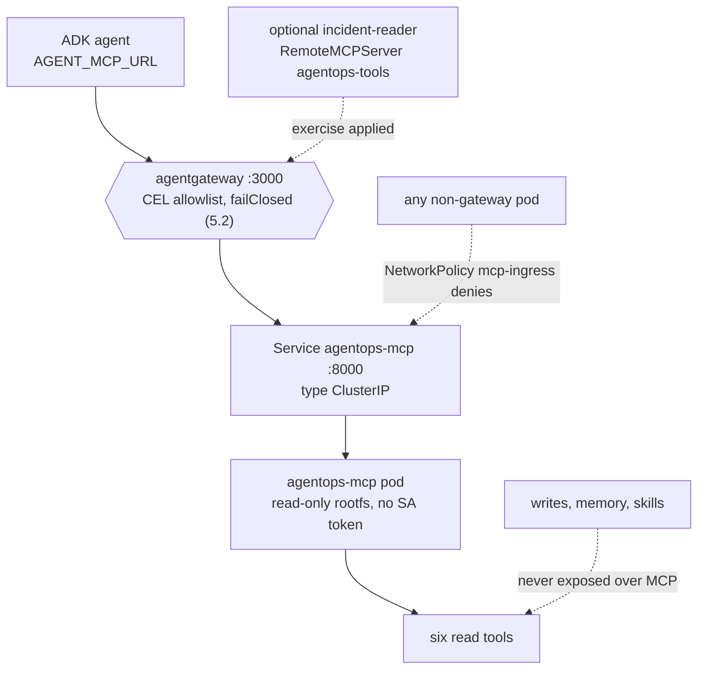
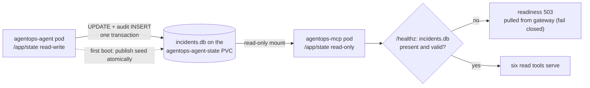

{}

- **You will:** See the six read-only tools become their own service, read the declaration that leaves the agent no route to it, and watch the gateway fail closed when the tool server disappears.
- **You need:** The Skaffold loop from [6.2. Platform Install]() still running.
- **Time:** about 18 minutes, reference. {}

## The agent can no longer reach its own tools {#which-component-serves-the-tools}

On your laptop the agent started the tool server itself, as a child process it owned. In the cluster the tool server is a separate pod — and the agent has no route to it at all. Read the agent's own egress rules out of the rendered overlay and count what is missing:

```bash
kubectl kustomize infra/k8s/overlays/local |
  yq 'select(.kind == "NetworkPolicy" and .metadata.name == "agent-egress") |
      .spec.egress[].to[] | .podSelector.matchLabels."app.kubernetes.io/name" // .ipBlock.cidr'
```

```text
agentgateway
otel-collector
0.0.0.0/0
```

Three destinations: the gateway, the collector, and a port-scoped exception for the co-hosted PII webhook. `agentops-mcp` is not on that list, and there is no fourth rule hiding elsewhere — a default-deny namespace means the absence _is_ the rule. **You have just read a permission that does not exist, which is the only way an absence is ever documented.** The agent reaches its tools through agentgateway or not at all.

The code did not change to make that true. `infra/k8s/base/mcp.yaml` runs the same `agentops-agent:dev` image with a different entrypoint argument, so the tool code and the agent code ship as one artifact and run as two workloads:

```yaml
args: ["mcp"]
env:
  - name: MCP_HOST
    value: 0.0.0.0
  - name: MCP_PORT
    value: "8000"
  - name: MCP_TRANSPORT
    value: streamable-http
```

`MCP_HOST=0.0.0.0` binds all interfaces, `MCP_PORT=8000` matches the Service, and `streamable-http` selects the same transport [3.3. MCP]() already built — this is its in-cluster form, not a new one. A single [ClusterIP]() Service exposes port 8000 inside the namespace, and no `LoadBalancer`, `NodePort`, or Ingress exists.

Promoting the tools out of the agent's process buys four things the in-process form cannot. The tool pod restarts, drains, and rolls without touching the agent, so a wedged tool process is one pod rather than the whole agent. It mounts the state volume `readOnly: true`, so the read service physically cannot write the database the agent owns. A distinct pod is a distinct NetworkPolicy subject, which is what makes the rule above expressible in the first place. And one shared MCP surface backs the ADK agent and any other MCP client, which is the reuse argument [3.3. MCP]() makes in general and the optional kagent specialist demonstrates in particular.

## Six verbs cross the boundary, and none of them changes anything

Naming the tools is what turns "read-only" from a slogan into a checkable claim. Four operational reads come from `agents/go/tools/read.go`: `list_incidents` for incidents on the platform, `get_incident` for one incident by id, `get_service_status` for a service and its open incidents, and `search_service_logs` for deterministic sample logs. Two knowledge reads come from `agents/go/memory/knowledge.go`: `get_runbook` by exact slug, and `search_runbooks` by free text.

That list is not a comment. `compose.MCPReadToolNames()` owns it, and `agents/go/mcpserver/mcpserver.go` compares what the server serves against it in both directions at startup — an extra tool is a widened surface the client would never call, and a missing one silently disappears the moment `AGENT_MCP_URL` is set, because the agent then stops binding its local equivalent. Both failures are invisible at runtime, and both fail here instead:

```bash
cd agents/go
go test ./mcpserver -run TestServerExposesExactlyTheAllowlistedReadTools -v -count=1
```

```text
=== RUN   TestServerExposesExactlyTheAllowlistedReadTools
=== PAUSE TestServerExposesExactlyTheAllowlistedReadTools
=== CONT  TestServerExposesExactlyTheAllowlistedReadTools
2026/08/10 23:10:56 INFO server connecting
2026/08/10 23:10:56 INFO server session connected session_id=""
2026/08/10 23:10:56 INFO client log level set level=""
2026/08/10 23:10:56 INFO server session disconnected session_id=""
2026/08/10 23:10:56 INFO server connecting
2026/08/10 23:10:56 INFO server session connected session_id=""
2026/08/10 23:10:56 INFO client log level set level=""
2026/08/10 23:10:56 INFO server session disconnected session_id=""
--- PASS: TestServerExposesExactlyTheAllowlistedReadTools (0.01s)
PASS
ok  	github.com/MLOps-Courses/agentops-open-course-go/agents/go/mcpserver	0.018s
```

Those `INFO` lines are not noise to skip past — they are the real MCP server logging, in-process. The test stands up the same streamable-HTTP surface the cluster deploys, connects a client to it, and asks for the tool list over the wire, then compares that list with the allowlist in both directions. One hundredth of a second, and no cluster.

What is deliberately absent matters as much. `restart_service` and `resolve_incident`, the long-term memory tools, and the instruction-only skills all stay inside the agent process, because they depend on ADK confirmation context and audit identity that do not survive translation into stateless protocol messages ([4.5. Guardrails]()). The MCP surface is therefore idempotent by construction: a compromised or misbehaving client can read incident state but holds no verb that changes it. These six are also the exact set the gateway allowlist re-lists in [5.2. MCP Gateway]() — two independent allowlists, checked against each other by `mise run check:infra`.

## The gateway is the only door, and it is locked from three sides

Steering consumers through the gateway is only half the control; the other half is making the raw service unreachable by anything else. Three layers stand between a would-be caller and port 8000, and none of them is the tool allowlist.

The first is addressing. The Service is `type: ClusterIP`, so port 8000 exists only inside the cluster and there is no external address to dial. The second is the `mcp-ingress` NetworkPolicy, which selects that pod and admits agentgateway alone:

```bash
kubectl kustomize infra/k8s/overlays/local |
  yq 'select(.kind == "NetworkPolicy" and .metadata.name == "mcp-ingress") | .spec.ingress'
```

```text
- from:
    - podSelector:
        matchLabels:
          app.kubernetes.io/name: agentgateway
  ports:
    - port: 8000
      protocol: TCP
```

The third sits above the network, because a caller that somehow reaches port 8000 must still present an expected `Host` authority. This closes **DNS rebinding**: a hostile page pointing a name it controls at an internal address. `mcpserver.OptionsFromEnv` parses `MCP_ALLOWED_HOSTS` and `Options.resolve` refuses a global `*` entry outright, so an empty or wildcard override is a startup error rather than an open door. The deployment supplies the short and fully qualified names of `agentgateway` and `agentops-mcp`, each with and without a port wildcard, and nothing else. Any other `Host` is answered `421 Misdirected Request` — the HTTP status for a request sent to the wrong server — before a tool runs. [5.2. MCP Gateway]() shows that same rejection from the gateway's side.

One more property of the pod is easy to file under the same heading and does not belong there. Its ServiceAccount sets `automountServiceAccountToken: false`, and it runs `runAsNonRoot` as UID/GID 10001 with a read-only root filesystem, all Linux capabilities dropped, and the RuntimeDefault seccomp profile — the same posture [6.3. Platform Agents]() applies to every workload that never calls the Kubernetes API. None of that stops anybody from reaching port 8000. It bounds what an attacker who already has code execution _inside_ this pod can do next: no Kubernetes credential to spend, no writable filesystem to stage in, and no root. Two different questions, two different controls, and confusing them is how a threat model ends up with four defences where it has three.

Consumers arrive through one route and wire it two ways. kagent registers the gateway route as a `RemoteMCPServer` in `infra/kagent/toolserver.yaml`, whose `url` is `agentgateway…:3000/mcp` rather than `agentops-mcp:8000`, so a declarative kagent consumer discovers tools _through_ the policy point — the CEL allowlist, rate limit, and fail-closed backend of [5.2. MCP Gateway]() — and not around it. The required BYO agent does not reference that object at all: it reaches the same route through `AGENT_MCP_URL` ([6.3. Platform Agents]()) and filters the remote catalog back to the same six names in Go.



**Diagram in words:** The BYO agent always reaches the six reads through agentgateway, and the optional specialist from [6.3. Platform Agents]() follows that same route only while installed. Every other pod is refused by `mcp-ingress`, and every write capability stays outside the MCP surface entirely.

## One disk, two mounts, opposite authority

Both pods mount the same [RWO volume](), `agentops-agent-state`, at `/app/state`, and `fsGroup: 10001` makes its files writable by the non-root id both run as. The agent owns the writable mount; the MCP container asks for the same claim read-only:

```yaml
volumeMounts:
  - name: state
    mountPath: /app/state
    readOnly: true
```

So a confirmed restart or resolution updates the very database later MCP calls read, without the six-tool read service ever holding filesystem write authority. The sequence has three steps and one deliberate failure mode. On a fresh volume the agent initializes `/app/state/incidents.db` from the immutable image seed at `/app/data/incidents.db`. The MCP container mounts that published claim read-only, so it can neither change the file nor create it. And the MCP `/healthz` probe opens it read-only and stays `503` until it exists and passes an integrity check — which means the read replica fails closed and is pulled from the gateway's backends rather than serving, or worse, creating, state of its own.



This is deliberately a single-node, single-replica SQLite design: an RWO claim binds to one node, and the read/write split is filesystem permissions rather than a database protocol. A horizontal deployment needs a network database with a migration and concurrency plan, not a multi-writer filesystem assumption. `infra/scripts/check-state.sh` renders both overlays and asserts the shared claim name, the fsGroup, and the read-only MCP mount, so that split cannot quietly become a second writer.

To watch the governed path work, forward only the gateway — never the raw MCP service — and run the list-tools script from [5.2. MCP Gateway]() against `http://127.0.0.1:3000/mcp`:

```bash
kubectl -n agentops port-forward svc/agentgateway 3000:3000
kubectl -n agentops logs deploy/agentgateway --tail=50
kubectl -n agentops logs deploy/agentops-mcp --tail=50
```

The gateway log records the routed `tools/call`; the MCP log records the read reaching the server. A request that never appears in the MCP log but returns an error at the gateway is a policy decision — allowlist, rate limit, or fail-closed backend — rather than a server fault, and knowing which log is silent is what tells the two apart.

One last question is worth answering with your hands, because the wrong answer is the dangerous one. Take the tool server away and repeat the list-tools handshake through the same forward — does the gateway return an empty tool list, or an error?

```bash
kubectl -n agentops scale deploy/agentops-mcp --replicas=0
```

The refusal below was captured somewhere everyone can reproduce it, because your cluster's exact transport error will not be mine: the host gateway from Chapter 5 runs the same `v1.4.1` image with the same `failureMode: failClosed` on the same MCP route, and only the backend address differs. Start it with `mise run gateway:host:start` while nothing is listening on `:8000`, then send the first request of the handshake:

```bash
curl -sS -i http://localhost:3000/mcp \
  -H 'Content-Type: application/json' -H 'Accept: application/json, text/event-stream' \
  -d '{"jsonrpc":"2.0","id":1,"method":"initialize","params":{"protocolVersion":"2025-06-18","capabilities":{},"clientInfo":{"name":"curl","version":"1"}}}'
```

```text
HTTP/1.1 500 Internal Server Error
content-type: application/json
content-length: 219
date: Mon, 10 Aug 2026 21:13:11 GMT

{"jsonrpc":"2.0","id":1,"error":{"code":-32603,"message":"failed to send message: http upstream error: http request failed: upstream call failed: SendRequest: connection error: Connection reset by peer (os error 104)"}}
```

Read where that failed. Not at the list-tools request — at `initialize`, the very first message of the handshake. No session id is ever issued, so there is no state in which a client can be handed an empty catalogue and told it has no tools. The transport detail at the end of the message describes your particular missing backend and will read differently in the cluster, where the Service has no endpoints at all; the `500` and the JSON-RPC error code are the parts that transfer.

An empty list would be the quiet catastrophe: a model told "you have no tools" answers from memory and sounds just as confident. The gateway instead fails closed, which the agent surfaces as a failure rather than as an unusually creative turn — the behavior [5.2. MCP Gateway]() configured and this deployment inherits. Stop the host gateway with `mise run gateway:host:stop`, then restore the cluster replica and wait for readiness — `/healthz` stays `503` until it re-opens the agent-published database:

```bash
kubectl -n agentops scale deploy/agentops-mcp --replicas=1
```

## What you can do now

- You can read the agent's egress rules and say, from the rendered YAML alone, why nothing declares a route from it to the tool server.
- The offline test names the six read tools and fails on a seventh, in either direction, without a cluster or a model.
- With the MCP backend gone, the gateway refused at `initialize` with a `500` and a JSON-RPC error, so no client is ever told it has no tools.
- You can name the three things that stop a non-gateway caller — the ClusterIP Service, `mcp-ingress`, and the `Host` allowlist — and say why the missing service-account token is not one of them.

An hour ago the tool server was a subprocess the agent trusted because it had started it. It is now a separate service with its own identity, its own failure mode, and one declared caller — and the cluster, not the render, is what enforces that last part.

Continue to [6.5. Platform Gateway]() once the only way you can reach the six tools is through the gateway.
