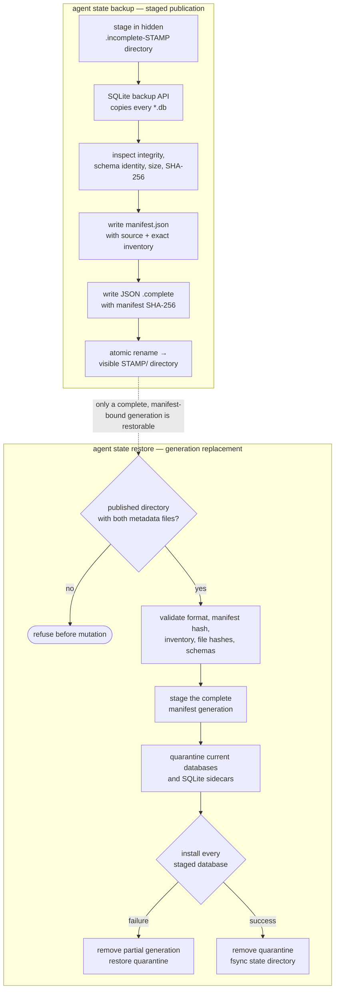

{}

- **You will:** Back up the platform state, prove it can be restored, and understand the safe local and optional cloud teardown paths.
- **You need:** The local workloads from [6.2. Platform Install]() still running.
- **Time:** about 45 minutes, hands-on. {}

The deployment loop is already running, so this page focuses on the operational proof that matters next: recovering its state safely.

## What state would you lose if the PVC died?

Everything the platform writes at runtime lives on one [PersistentVolumeClaim (PVC)]().

That volume is `agentops-agent-state`, mounted at `/app/state` (host equivalent: `agents/go/.state/`):

1. `runtime.db` — ADK sessions and A2A tasks from the persistent server (Ch. 2.4).
1. `incidents.db` — the writable dataset copy and append-only `audit_log` schema (Ch. 3.1). Authenticated host actions and explicit drill fixtures can populate it; shipped k3d/GKE A2A pods freeze guarded operational writes.

The seed dataset is safe in Git and in the image, so losing the volume loses no course data — it loses the evidence: every session and every audit row justifying an approved action. Without a backup, one PVC failure (or a hasty `skaffold delete`) erases that trail silently.

## How do you back up SQLite state safely?

Never `cp` a live SQLite file: a copy taken mid-transaction can be torn. Safe hot copies go through SQLite itself, which holds the page-level locks for you.

Both the backup and the restore enforce one shared contract. A snapshot only becomes restorable once it is complete and published, so an interrupted attempt can never masquerade as the newest good one:



**Diagram in words:** Backup copies and inspects every database, records an exact hashed manifest, binds the completion marker to that manifest, and publishes once. Restore validates the complete generation before touching state, quarantines the current generation, and either installs every declared database or recovers the byte-identical prior generation.

A multi-file restore cannot switch every SQLite file in one rename. The shared CLI therefore takes an exclusive process lock and fsyncs a three-phase journal before replacing anything. On the next backup, restore, or A2A startup, an interrupted uncommitted transaction reconstructs the exact old generation; a durable committed transaction validates and keeps the complete new generation. Missing or unexplained recovery evidence fails closed instead of guessing. Writers must still be stopped.

On the host, `mise run state:backup` runs [backup-state.sh](https://github.com/MLOps-Courses/agentops-open-course-go/blob/main/infra/scripts/backup-state.sh). That wrapper invokes the shared `agent state` CLI, which snapshots every state database with `VACUUM INTO` — an online-safe copy taken inside a read transaction, so a concurrent writer neither blocks it nor tears it. For each copy, `manifest.json` records the filename, byte size, SHA-256 digest, and SQLite schema identity. Its source block records build mode, version, timestamp, source identity, revision, tree digest, and dirty state from the same validated build authority. The JSON `.complete` file carries `format_version` and `manifest_sha256`, so changing either the manifest or one declared database makes the whole generation invalid. Publication is one atomic directory rename, and retention keeps the newest seven completed snapshots under the gitignored `.state-backups/`:

```bash
mise run state:backup
```

In Kubernetes, a **CronJob** — a workload the cluster runs on a schedule — does the same thing unattended. The `agentops-state-backup` CronJob in [state-backup.yaml](https://github.com/MLOps-Courses/agentops-open-course-go/blob/main/infra/k8s/base/state-backup.yaml) runs `agent state backup` from the course image — the same binary the agent itself is, under different arguments. Host and Kubernetes snapshots therefore have one format and are interchangeable; no copied program or additional image pin enters the supply chain. The CronJob writes completed timestamped snapshots from the `agentops-agent-state` PVC into a second `agentops-state-backups` PVC.

Be honest about the scope: this is single-node, lab-grade backup, not disaster recovery. The backup PVC sits in the same cluster on the same disk, there is no point-in-time recovery between nightly snapshots, and `skaffold delete` removes both PVCs together. Production would ship snapshots off-cluster to object storage and restore them on separate infrastructure.

## How do you run a restore drill?

A backup you have never restored is a hope, not a backup. `mise run state:drill` runs [backup-drill.sh](https://github.com/MLOps-Courses/agentops-open-course-go/blob/main/infra/scripts/backup-drill.sh), which makes that proof repeatable and offline. It runs against a throwaway temporary directory, never your real `agents/go/.state`, and needs no cluster or model:

```bash
mise run state:drill
```

The drill seeds throwaway session and incident state and appends a mock approved-action audit row. That fixture tests persistence and recovery; it does not prove A2A authentication, confirmation, or a live operational write. The drill then proves six adversarial properties.

1. A corrupt input publishes neither a completed snapshot nor leftover staging state.
1. A changed database hash is rejected before one byte of live state changes.
1. An injected second-file publication failure restores the complete previous generation.
1. A successful restore removes a live database absent from the manifest instead of silently mixing generations.
1. A future audit schema is rejected without mutating its input.
1. The valid manifest generation restores the original session and audit evidence.

Expected final line: `drill passed: versioned manifest, exact inventory, rollback, hashes, and schema compatibility`.

The Go state suite adds the process boundary the shell drill cannot fake safely: a child exits without cleanup after the first old-file replacement and again after the durable commit marker. The next state command must recover the old generation in the first case, preserve the new generation in the second, and serialize two concurrent restore processes.

To restore real host state, stop every writer first (the A2A server, the MCP server, any `agent console`/`agent web`), select one visible directory carrying both `manifest.json` and `.complete`, then point the wrapper at it. The shared CLI validates the completion marker, manifest hash, exact file inventory, database hashes, and supported schemas before quarantining current state. If any replacement fails, it removes the partial generation and restores every quarantined database and sidecar:

```bash
snapshot=""
for candidate in .state-backups/*; do
  [[ -f "${candidate}/manifest.json" && -f "${candidate}/.complete" ]] && snapshot="${candidate}"
done
test -n "${snapshot}"
mise run state:restore -- "${snapshot}"
```

The in-cluster drill uses stronger, typed evidence than a row count. `platform-backup seed` records a session, workflow task, memory note, and idempotent audit invocation as JSON. `platform-backup restore-drill` restores the selected snapshot and verifies all four identities plus the exact snapshot source identity.

The seed command writes controlled recovery evidence directly through a typed maintainer tool. It deliberately bypasses the A2A network path, so a green drill cannot be cited as proof that Kubernetes callers are authenticated or operational writes are enabled.

A stopped-workload restore Job still enters through the shared binary, never a direct file copy. A generic restore uses `args: ["state", "restore", "<snapshot>", "--state-dir", "/app/state"]`; this evidence drill uses `platform-backup restore-drill --snapshot=<snapshot> --state-dir=/app/state` to restore and verify in one typed command. Either snapshot selector must resolve to one published generation carrying both metadata files before the Job is applied.

The Platform workflow runs the repository-owned script against its disposable k3d deployment:

```bash
source_revision="$(
  go -C tools run ./cmd/source-identity \
    --root .. --mode release --field revision
)"
source_tree_digest="$(
  go -C tools run ./cmd/source-identity \
    --root .. --mode release --field tree-digest
)"
commit_timestamp="$(git show -s --format=%ct HEAD)"
export AGENT_BUILD_MODE=release
export AGENT_SOURCE_COMMIT="${source_revision}"
export AGENT_SOURCE_REVISION="${source_revision}"
export AGENT_SOURCE_TREE_DIGEST="${source_tree_digest}"
export AGENT_SOURCE_DIRTY=false
export OCI_CREATED="$(
  date --utc --date="@${commit_timestamp}" +%Y-%m-%dT%H:%M:%SZ
)"
export OCI_VERSION="$(tr -d '\n' <VERSION)"

work_parent="$(realpath -e -- "${TMPDIR:-/tmp}")"
work_dir="$(mktemp -d "${work_parent}/agentops-platform-backup.XXXXXX")"
docker_config="${work_dir}/docker"
chmod 700 "${work_dir}"
mkdir -m 700 "${docker_config}"
printf '%s\n' '{"auths":{}}' >"${docker_config}/config.json"
chmod 600 "${docker_config}/config.json"
cleanup() {
  primary_status=$?
  cleanup_status=0
  trap - EXIT
  if [[ -d "${work_dir}" && ! -L "${work_dir}" &&
    "$(dirname -- "${work_dir}")" == "${work_parent}" &&
    "$(basename -- "${work_dir}")" =~ ^agentops-platform-backup\.[A-Za-z0-9]{6}$ ]]; then
    rm -r -- "${work_dir:?}" || cleanup_status=1
  else
    echo "Refusing to clean invalid backup work directory ${work_dir}." >&2
    cleanup_status=1
  fi
  ((primary_status != 0)) && exit "${primary_status}"
  exit "${cleanup_status}"
}
trap cleanup EXIT

./infra/scripts/platform-backup-drill.sh \
  --context k3d-local \
  --work-dir "${work_dir}" \
  --source-revision "${source_revision}" \
  --reader-image \
  curlimages/curl:8.21.0@sha256:7c12af72ceb38b7432ab85e1a265cff6ae58e06f95539d539b654f2cfa64bb13 \
  --agent-card-url http://127.0.0.1:8080/.well-known/agent-card.json \
  --docker-config "${docker_config}" \
  --evidence-marker platform-backup-canary
```

{}

Run that command only on the disposable course cluster and exact clean source revision. The script validates every argument, context, private directory, running build identity, loopback URL, and explicit Docker authentication boundary before seeding evidence. It then creates uniquely named, ownership-labelled Jobs and a ConfigMap, captures all three original replica values, stops the agent and MCP workloads, restores the snapshot, returns every replica authority to its exact prior value, and deletes only those temporary resources. A digest absent from the supplied Docker store is pulled for label inspection and removed on every exit; a pre-existing digest is retained. {}

The script fails before cluster mutation if any static precondition or running workload identity disagrees. After mutation begins, its exit trap stops owned Jobs, restores the captured replica values, and exposes cleanup failures without replacing the primary error. A successful final line is `platform backup restore drill verified`; it is emitted only after cleanup succeeds.

## How do you tear down without losing data by accident?

`skaffold delete` removes the course workloads, including their PVCs and data, without deleting the shared cluster or its kagent control plane:

```bash
# Choose exactly one profile after reviewing the context.
(
  cd infra
  skaffold delete --filename skaffold.yaml --profile local
  # skaffold delete --filename skaffold.yaml --profile gke
)
```

The kagent controller and the cluster itself are shared, so answer the ownership question with commands instead of memory:

```bash
kubectl get agents.kagent.dev -A
kubectl get namespaces --show-labels
```

If the only `Agent` resources are the ones you deployed and the only non-built-in namespaces are `agentops` and `kagent`, this cluster carries nothing but this course: removing the controller and the cluster costs no one else anything. Anything else on the list belongs to another project — leave the controller installed and stop after `skaffold delete`.

If you would rather keep the cluster for a later session, `k3d cluster stop local` frees the memory and keeps every volume ([6.2. Platform Install]()). Delete it only when you are done with the lab entirely:

```bash
helmfile --file infra/helmfile.yaml destroy
k3d cluster delete local
```

For an approved GCP lab, capture every state-owned coordinate before teardown and keep every Kubernetes mutation on that exact context:

```bash
set -euo pipefail

: "${audit_dir:?reuse the protected audit directory created before apply}"
project_id="$(tofu -chdir=infra/gcp output -raw project_id)"
cluster_name="$(tofu -chdir=infra/gcp output -raw cluster_name)"
cluster_zone="$(tofu -chdir=infra/gcp output -raw cluster_zone)"
repository="$(tofu -chdir=infra/gcp output -raw artifact_registry_repository)"
expected_context="gke_${project_id}_${cluster_zone}_${cluster_name}"
test "$(kubectl config current-context)" = "${expected_context}"

./infra/scripts/gcp-lab-audit.sh \
  capture-pvs "${expected_context}" "${audit_dir}"

(
  cd infra
  SKAFFOLD_DEFAULT_REPO="${repository}" \
    skaffold delete \
    --filename skaffold.yaml \
    --profile gke \
    --kube-context "${expected_context}"
)
kubectl --context "${expected_context}" \
  wait --for=delete namespace/agentops --timeout=300s
helmfile \
  --file infra/helmfile.yaml \
  --kube-context "${expected_context}" \
  destroy
kubectl --context "${expected_context}" \
  delete namespace kagent --wait=true --timeout=300s
```

The dedicated cloud lab owns both namespaces. Capture their PVs before either deletion, then require every recorded PV name and CSI disk handle to disappear; CSI disks normally use `pvc-*` names, not the cluster prefix.

Those disks are the whole data inventory. The lab provisions no object storage: Tempo and Loki keep their blocks on PersistentVolumeClaims, so once the recorded handles are gone, nothing stateful is left behind. Then review and apply one saved destroy plan:

```bash
tofu -chdir=infra/gcp plan -destroy -out=destroy.tfplan
tofu -chdir=infra/gcp apply destroy.tfplan
test -z "$(tofu -chdir=infra/gcp state list)"
```

The [GCP substrate runbook](https://github.com/MLOps-Courses/agentops-open-course-go/blob/main/infra/gcp/README.md#how-do-you-prove-an-approved-lab-was-destroyed) owns the final cluster, registry, disk, network, and identity inventories. Every inventory must be empty. OpenTofu leaves APIs enabled intentionally because it cannot know who enabled them; an approved disposable lab snapshots the enabled set before apply and disables only its set difference after destroy.

{}

The four sections below plan a Google Kubernetes Engine deployment and stop at `tofu plan`. The course checkpoint is the local profile only, so you can skip them and lose nothing. {}

## What would the optional GKE lab create?

Nothing is created on this page. This is what the module would build if an approved apply ever ran.

**OpenTofu** is the open-source fork of Terraform. The module under `infra/gcp/` requires a project ID and creates:

- Required GCP APIs, VPC-native subnet/ranges, and a zonal GKE Standard cluster.
- A control plane on the **REGULAR** release channel, whose Kubernetes version Google selects and upgrades on its own cadence, with nodes set to auto-upgrade behind it.
- One Spot `e2-standard-2` node with a 30 GiB standard disk.
- GKE-specific CPU requests measured to fit the course and required GKE system pods on that two-core node, while preserving burst limits.
- Node upgrades with `max_surge = 0` and `max_unavailable = 1`, so a one-node lab rolls in place instead of paying for a second node.
- One zonal standard-disk StorageClass for the course's small persistent claims.
- Artifact Registry cleanup for tagged or untagged image versions older than 30 days, while preserving the five most recent versions.
- No object storage at all: Tempo and Loki write their blocks to persistent disks, so nothing in the lab needs a bucket.
- Separate node and agentgateway Google service accounts plus narrow IAM/WIF bindings.

Four terms in that list are GCP vocabulary:

- **zonal**: the cluster's control plane lives in one zone.
- **VPC-native**: pods take their IP addresses from the network's own ranges.
- **Spot**: discounted capacity Google can reclaim at any time.
- **release channel**: a Kubernetes version stream Google upgrades for you, on a cadence you choose rather than a version you choose; REGULAR moves multiple times per month.

It creates no Cloud NAT, Ingress, or public LoadBalancer. Nodes have public IPs to avoid NAT cost; workloads remain private ClusterIP services.

That Kubernetes version is the one thing in this course deliberately left unpinned. Everywhere else the repository names exact bytes — images by digest, tools by pinned version, the Google provider by `.terraform.lock.hcl` — so `infra/gcp/main.tf` sets no `min_master_version` on purpose, not by oversight. Pinning it would buy the appearance of reproducibility and none of the substance.

{}

The field cannot do what its name suggests. `min_master_version` is a minimum applied when the cluster is created, not a pin; the provider documentation says GKE "will auto-update the master to new versions, so this does not guarantee the current master version". A channel-enrolled control plane moves on the channel's cadence — REGULAR upgrades multiple times per month — whatever floor you wrote. A pin would state a version the cluster stops running almost immediately, and a comment that lies is worse than no comment, because a reader trusts it.

The value would also rot. GKE retires patch versions, and once one is removed you "can't create, upgrade, or downgrade your cluster's control plane to the removed patch version". A version tested and written down today becomes uncreatable within months. Nothing in this repository would notice: `mise run check:infra` stops at a mocked, credential-free plan that never asks Google which versions still exist. The failure would land months later on whoever ran an approved apply, not on the author who typed the pin.

The general rule is worth carrying past this module. A digest names immutable bytes that a registry keeps and that you can re-verify offline; a managed-service version names a state that a vendor retires on a schedule you do not control. Pin what you can hold, and track what someone else moves. The lab's reproducibility comes from the module source and the provider lock file; the Kubernetes version is Google's to choose, and the node pool follows it by design rather than drifting away from it.

The float is asserted, not assumed. `infra/gcp/tests/course_profile.tftest.hcl` fails if anyone adds a version floor, so reversing this decision means re-arguing it rather than doing it quietly. {}

## How do you plan without deploying?

A plan prints what an apply would create and changes nothing in the cloud.

From `infra/gcp/`, authenticate Application Default Credentials, create a gitignored `terraform.tfvars` from the example, and restrict the control plane to your public `/32`. Then:

```bash
tofu init
tofu validate
tofu plan -out=tfplan
```

Review every created/changed/destroyed resource, and read the monthly figure off the page that owns it — [7.3. Costs]() states the estimate, its date, and what it excludes. Planning is not permission to apply. This course task does not execute cloud commands.

## How would an approved GKE deployment proceed?

Only after explicit approval, first snapshot the project-level state that OpenTofu deliberately does not restore:

```bash
audit_dir="$(mktemp -d)"
project_id="<project-id>"
gcloud services list --enabled --project "${project_id}" \
  --format='value(config.name)' | sort -u >"${audit_dir}/services-before.txt"
gcloud iam service-accounts list --project "${project_id}" \
  --format='value(email)' | sort -u >"${audit_dir}/service-accounts-before.txt"
gcloud projects get-iam-policy "${project_id}" \
  --format=json >"${audit_dir}/project-iam-before.json"

tofu apply tfplan
gke_kube_dir="$(mktemp -d)"
export KUBECONFIG="${gke_kube_dir}/config"
tofu output -raw get_credentials_command
```

Run the printed `gcloud container clusters get-credentials ...` command while `KUBECONFIG` points at that isolated file, then return to the repository root:

```bash
cd ../..
mise run gke:deploy
```

The task requires one clean committed source revision, checks the exact context at each mutation, and uses temporary Artifact Registry credentials. It builds, renders, validates, and applies the workload bundle without changing the workstation's normal kubeconfig or Docker config. Its renderer reads the project, bucket, service-account coordinates, and kube-dns service IP from OpenTofu outputs. The DNS value lets Calico permit service-routed DNS without opening arbitrary port 53 traffic. Rendering fails if any placeholder remains.

Deployment does not authorize application writes. Enabling them requires a separate owner decision and an implemented caller identity substrate—issuer, audience, JWKS lifecycle, gateway subject transformation, and rotation/revocation operations—followed by authenticated action evidence on the exact deployed revision. Flipping the kill-switch alone is unsafe.

{}

- A backup is evidence only after a restore drill succeeds.
- Both shipped Kubernetes profiles keep guarded operational writes disabled until caller identity exists.
- Local teardown removes course data, while the optional GKE path stops at a reviewed plan. {}

## What proves this page worked?

Prove the local state can survive a restore drill, then leave GCP at a reviewed plan without deploying it.

**You are done when:**

- `mise run state:drill` ends with `drill passed: versioned manifest, exact inventory, rollback, hashes, and schema compatibility`.
- The in-cluster restore verifies the seeded session, task, memory note, audit invocation, and exact snapshot source identity.
- You do not mistake seeded recovery evidence for an authenticated Kubernetes write path.
- Nothing exists in GCP: you reviewed a `tofu plan` and ran no `tofu apply`.

Continue to [6.7. Promotion and Rollback]() when you have restored the local state from a backup at least once.
