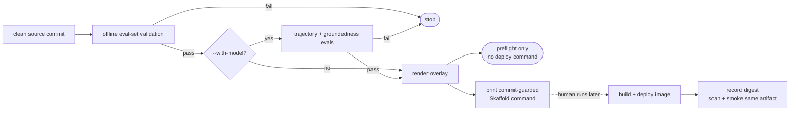

{}

- **You will:** Run a preflight that deploys nothing, break one evaluation case on purpose to watch it stop, and separate that evidence from the image built afterwards.
- **You need:** [4.4. Evaluations]() finished and `mise run install:platform` completed. No cluster required.
- **Time:** about 20 minutes, hands-on. {}

## A healthy process can still be a worse agent {#why-gate-a-rollout-on-evaluation}

Someone tightens a sentence in the agent's instruction — nothing dramatic, a clearer phrasing of when to consult a runbook. Every test passes. The image builds. The pod goes Ready in eleven seconds, both probes green, and the rollout is declared successful. Two days later Ana notices the agent has stopped citing runbooks for `INC-002` and has been answering from the incident summary alone.

Nothing was broken in the sense a probe understands. A readiness probe proves the server starts; it cannot prove the composition still calls the right tools, stays grounded, or follows the operating contract you evaluated. Those are release properties, so a build-and-deploy handoff needs behavior evidence before it, not a green pod after it.

`mise run promote` packages that reasoning into a preflight that builds nothing and applies nothing:

```bash
mise run promote
```

```text
[promote] $ ./scripts/promote.sh
Promotion preflight → overlay local

[1/3] Offline eval-set validation (eval:validate)...
[eval:validate] $ go run ./cmd/agentops-eval validate
{
  "evalsets": 3,
  "cases": 21,
  "calibration_cases": 12
}

[2/3] Skipping model-backed behavior gate (pass --with-model to run it).

[3/3] Rendering the local overlay...
The local overlay renders cleanly.

Offline preflight passed, but no promotion command was emitted because candidate
behavior was not evaluated. Re-run with --with-model when a model is configured.
```

Read the last paragraph again, because it is the design. Everything passed, and the script still refuses to print a deployment command. Offline validation proved that the committed evaluation cases and the seed dataset agree and that the manifests render; it has not measured how the candidate behaves. A tool that emitted a deploy command here would be teaching you that "the checks passed" and "safe to deploy" are the same sentence.



## Only measured behavior earns a printed command

Add the model and the middle step becomes real:

```bash
mise run promote -- --with-model
```

Step 2 runs the model-backed evaluation from the standalone Go harness, and its result records the source revision and dirty state, model identity, evalset digest, transport, deterministic scores, content-free usage, and the pass rate against the requested minimum and the required cases. A failing run stops there, and so does a source change made after the evidence was collected — the evidence is bound to one revision, not to a mood. Only a green model-backed run plus a clean render prints a source-guarded Skaffold command, and even then the script prints it rather than running it.

That flag calls a real model. The default course path uses local Ollama and costs nothing but time; a hosted endpoint spends tokens. Run it deliberately, and read what it produced rather than only its exit code — a pass rate is an observation about one run, which is the distinction [0.2. Evidence]() exists to keep sharp.

Select exactly one overlay, `local` by default or `gke`, and the printed command's image repository follows it: `registry.localhost:5050` for the local k3d registry, or `tofu output -raw artifact_registry_repository` from `infra/gcp` for GKE.

```bash
mise run promote -- gke --with-model
```

Unknown flags, unknown overlays, and a second overlay fail fast. The GKE path still prints a command only — it does not run `tofu apply`, create a cluster, or deploy anything.

## What a real rollback has to name

This preflight evaluates one clean source identity, and a source identity is not an artifact. The serving image contains the instruction from the evaluated Git revision, and Git is the prompt-version authority here: the runtime has no separate prompt registry and no mutable prompt URI. When you are choosing between two wordings, use `mise run eval:ab` with explicit sanitized artifacts from two Git-pinned revisions and read the comparison before picking one; [7.0. Reproducibility]() owns the isolated-worktree capture that makes those artifacts trustworthy.

Only after the build does an image digest exist. Source evaluation alone does not prove that artifact starts, is clean, or contains the code you evaluated — so for a real release, scan and smoke the exact immutable digest you will deploy, then record it beside its validated source tuple. If a release regresses, redeploy the previous known-good digest. That is what makes rollback a lookup instead of an archaeology project, and it is why [6.1. Containers]() insists on recording the digest rather than the tag. This lab stops at the explicit handoff rather than pretending to ship that provenance pipeline.

It also does not claim an automated canary, because it does not have one: the agent still runs a single replica for the three reasons [6.9. Scale Out]() names and demonstrates, there is no traffic-weighted stable and canary route, and no online scorer is present that could make a safe automatic rollback decision. A production progressive rollout needs a second agent instance, weighted routing, an online quality signal, and an automated rollback policy — each of which adds real operational state. Pre-deployment evidence still comes first even then, because sending live traffic to a candidate that already fails its reviewed floors is not a canary, it is an outage with a smaller blast radius.

## Your turn: prove a regression cannot reach promotion

Predict before you touch anything: you are about to point one evaluation case at an incident that does not exist in the seed. Does the preflight catch that offline, or does it need the model to notice?

- **Mode**: `temporary experiment`.
- **Goal**: make an invalid evaluation reference stop the preflight before it renders anything, then put it back.
- **Files to touch**: `evals/ops.evalset.json` only. No cluster, no image, and no model are involved.
- **Preflight**: run `mise run promote` and confirm all three steps pass and no command is emitted; require `git diff --quiet -- evals/ops.evalset.json` before editing.
- **Steps**: in the `incident-detail` case, change the expected `get_incident` argument from `INC-001` to the absent id `INC-042`, then run `mise run promote` again. Do not use `INC-999` for this: the eval set deliberately uses it as a negative case, and the validator knows it is supposed to be absent.
- **Gate that proves completion**: the run stops inside `[1/3]`, names the case and the unknown incident, and emits no deployment command. From the first step onward it reads:

```text
[1/3] Offline eval-set validation (eval:validate)...
[eval:validate] $ go run ./cmd/agentops-eval validate
agentops-eval: validate evalset domain ops.evalset.json: case "incident-detail" references unknown incident "INC-042"
exit status 1
[eval:validate] ERROR task failed
[promote] ERROR task failed
```

The answer to the prediction is that no model was needed. The validator cross-checks every case against the committed seed, so a case that can never pass is caught by reading two files — and the overlay was never rendered, because a preflight that continues past a known-bad input is just a slower way to deploy it.

- **Final state**: run `git restore -- evals/ops.evalset.json`, confirm the focused `git diff --quiet --` preflight passes again, and run `mise run promote` once more to see it green.

If a model is configured, finish with `mise run doctor:model` and `mise run promote -- --with-model`, then read the command it prints without executing it. Clean behavior evidence makes a build-and-deploy command _eligible_ for human review. It does not authorise a rollout, and it says nothing at all about the image that command will build.

## What you can do now

- `mise run promote` passes without a model and emits no deployment command, and you can say why that is the correct outcome.
- A single invalid evaluation reference stopped the preflight inside `[1/3]`, before any render, and named the case that caused it.
- The eval set is restored, `git diff` shows no drill residue, and the preflight is green again.
- You can name the handoff in order: evaluated source tuple, then build, scan, smoke, deploy, and record one immutable image digest.

An hour ago, a successful deploy was a pod going Ready. You can now say what a green rollout does not prove, and which artifact you would need on file to undo it in one command.

Continue to [7. Observability]() when "preflight passed" and "safe to deploy" no longer mean the same thing to you.
