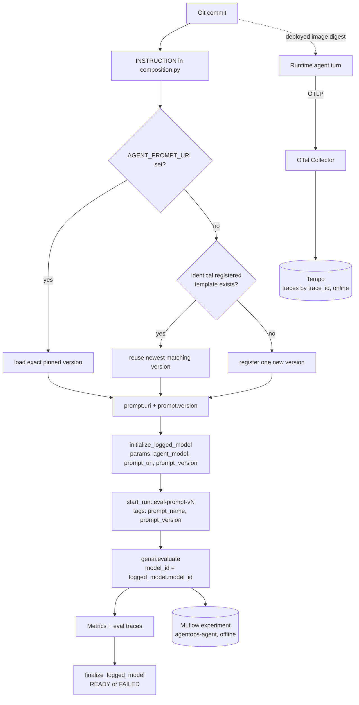
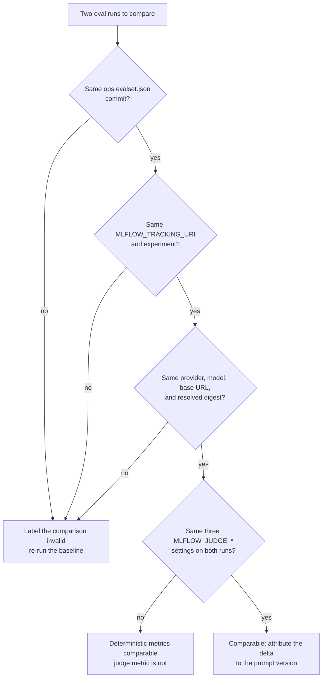

{}

- **You will:** Record everything that decides an agent's answer, so you can explain why two runs differ instead of guessing.
- **You need:** Ollama serving `qwen3:4b-instruct`, the evaluation chain installed (`mise run install:eval`), and the host observability stack up (`mise run observability:up`) for the runtime half of the closing exercise.
- **Time:** about 45 minutes, hands-on. {}

## What must be recorded to reproduce an agent run?

Deterministic software has one input worth versioning: the code. An agent has at least nine, and any one of them can change the answer without changing the commit. A colleague who says "it worked yesterday" is usually right — a different weight file, a mutated database row, or a re-registered prompt did the work. So an agent release is a tuple, not only a Git commit:

| Input                   | Course evidence                                                               |
| ----------------------- | ----------------------------------------------------------------------------- |
| Code                    | Git commit and clean/intentional diff                                         |
| Python/CLI dependencies | `uv.lock`, `mise.lock`, pinned image digests                                  |
| Container               | Skaffold abbreviated-commit image tag and registry digest                     |
| Model path              | Provider, model, base URL, gateway profile/backend, and local Ollama model ID |
| Prompt                  | Committed instruction and optional dev/eval MLflow prompt URI/version         |
| Data                    | committed seed/runbooks/skills/logs plus reset state                          |
| Tool contract           | typed source, MCP discovery, gateway allowlist                                |
| Runtime                 | local/GKE Kustomize overlay and Helm chart version                            |
| Evaluation              | dataset commit, scorer versions, run/model id, metrics/failures               |

A hosted model name does not freeze provider weights or service behavior. Likewise, `qwen3:4b-instruct` is a mutable Ollama tag rather than a content pin. Record the installed ID/digest and model metadata from `ollama list`/`ollama show` with evaluation evidence. Reproducibility means enough evidence to explain and compare the run, not byte-identical text forever.

The practical test is not "can I replay this token stream" — you cannot, with a sampling model. It is: **given this evidence, can I explain the difference between two runs, or prove there is none?** Everything below exists to make that question answerable.

## How do you select the MLflow destination?

Two environment variables decide where your evidence lands, and both of them are optional.

MLflow is an **offline** experiment tracker here. It is not part of the telemetry stack `mise run observability:up` brings up, it never receives a runtime span, and no collector points at it. It runs on demand, from the evaluation harness, and what it holds is deliberate evaluation evidence: prompt versions, runs and their logged models, the eval traces those runs record, and the assessments attached to them. Run the evaluation from `agents/python`:

```bash
mise run eval:mlflow
```

With nothing configured, that writes to a SQLite file next to the script — `agents/python/evals/mlflow.db` — and the script's last lines print the exact command that opens a UI over it, on `:5000` by default:

```bash
cd agents/python
uv run mlflow ui --backend-store-uri sqlite:///$PWD/evals/mlflow.db
```

To share evidence instead, point both variables at a tracking server you run yourself:

```bash
export MLFLOW_TRACKING_URI=http://127.0.0.1:5000
export MLFLOW_EXPERIMENT_NAME=agentops-agent
mise run eval:mlflow
```

{}

With `MLFLOW_TRACKING_URI` unset, the run still succeeds, prints metrics, and selects or registers a prompt version. It writes all of it to that local SQLite file, which your colleagues never see.

The script prints the authoritative tracking URI as its last line. Read it, every time:

```text
Tracking URI: http://127.0.0.1:5000
```

It suggests `mlflow ui --backend-store-uri ...` only when the URI is a local SQLite store, never for a remote HTTP server. If you see that suggestion and expected a shared server, you just wrote to the wrong store. {}

The script falls back to a local file store, in two lines:

```python
_TRACKING_URI = os.environ.get("MLFLOW_TRACKING_URI", f"sqlite:///{Path(__file__).parent / 'mlflow.db'}")
_EXPERIMENT = os.environ.get("MLFLOW_EXPERIMENT_NAME", "agentops-agent")
```

The prompt version counter in that file is independent of the server's, so a local `version 2` and a server `version 2` can be different text. This is a real failure mode, not a hypothetical: `mise run eval:mlflow` loads the root `.env`, so a commented-out `MLFLOW_TRACKING_URI` line is enough to split your evidence in two.

## How do a trace, a run, a prompt version, and a logged model link together?

The evaluation you just ran wrote its evidence under five MLflow names:

- An **experiment** is the folder every record lands in — here, `agentops-agent`.
- A **run** is one execution stored inside that folder.
- A **logged model** is the evaluated agent that scorer results attach to.
- A **prompt version** is one numbered copy of the instruction text.
- A **trace** is one recorded agent turn, broken into timed steps called spans — in this store, the turns the evaluation itself drove.

Two paths produce evidence, and the single most important thing to understand about them is that they no longer share a store:

- The **online** path produces runtime **traces**. The agent exports spans over OTLP, the collector forwards them, and Tempo stores them ([7.1. Tracing]()). It runs unattended, on real traffic, for as long as the agent is up.
- The **offline** path produces a **run**, a **logged model**, a **prompt version**, and its own eval traces. `mise run eval:mlflow` writes them directly through the MLflow client, on a fixed dataset, when a human asks it to.

That split is deliberate, and it is worth defending on its own terms. An experiment tracker is built for a bounded set of deliberate executions you compare against each other; a trace store is built for unbounded production traffic you query by identifier. Making one store do both jobs means every production turn competes for space with your evaluation history, and every evaluation run pollutes the population you sample for drift. Two stores, two lifetimes, two access policies.

What joins the two, then, is not a shared folder — it is the **release**:

1. Nothing in the runtime names MLflow. The agent imports OpenTelemetry only, and the collector's one trace exporter points at Tempo.
1. Nothing in the evaluation path emits OTLP, unless you deliberately set `OTEL_EXPORTER_OTLP_ENDPOINT` in that shell. With it unset, `setup_telemetry()` exports nothing, so eval turns never appear in Tempo alongside real ones.
1. The bridge is the tuple at the top of this page. A production trace is attributable to a prompt because you recorded which commit and image digest were deployed when it was captured, and because the offline run recorded which prompt version that same commit evaluated.

Point either path at a different destination and no cross-store join breaks, because there was never one to break. What you can still split is your own evaluation history, by writing two runs to two different MLflow stores — the last trap in the comparison section below. And what you can still lose is the release record itself, which is the thing this page asks you to keep. The whole lineage graph a release note needs looks like this:



**Diagram in words:** One Git commit fixes the `INSTRUCTION` text. The evaluation either loads a pinned prompt version, reuses an identical registered one, or registers a new one; that version becomes parameters on a logged model, which a named run evaluates into metrics before finalizing the model `READY` or `FAILED`. All of that lands in the offline MLflow experiment. Separately, the same commit is what got deployed, and the deployed agent's turns flow over OTLP through the collector into Tempo. The two destinations never touch; only the commit spans them.

The arrow that does _not_ exist is worth naming, and now the diagram shows why: no edge runs between Tempo and the MLflow experiment. A production trace carries no prompt version. The runtime uses the committed `INSTRUCTION`, so the Git commit of the deployed image is what attributes a production trace to a prompt — not the registry, and not a shared experiment id you could have quietly misconfigured.

## How does MLflow link prompt and model evidence?

One command produces the whole chain: `mise run eval:mlflow`.

It first selects the exact prompt that each fresh evaluation agent will load. A pinned run loads an immutable numeric `AGENT_PROMPT_URI`; an unpinned run reuses the newest registered version with identical committed text, searching older pages when needed, and registers only when no template matches. Mutable aliases are rejected because they could change during one long run. It then initializes a logged model, evaluates the full conversations, and marks the model `READY` or `FAILED`.

The evaluator sets `_TRACKING_URI` before it imports `agent.composition`. That module constructs the ADK discovery root immediately, and its fresh-agent factory later loads pinned prompts from the same store. The ordering also keeps `eval:mlflow`, `eval:cost`, `eval:ground`, and `eval:ab` children on `evals/mlflow.db` when no tracking URI is configured.

The selection and lineage fields in [`mlflow_eval.py`](https://github.com/MLOps-Courses/agentops-open-course/blob/main/agents/python/evals/mlflow_eval.py) are:

```python
def _evaluation_prompt() -> PromptVersion:
    if settings.prompt_uri:
        return mlflow.genai.load_prompt(_prompt_selection())
    if matching := _matching_registered_prompt(INSTRUCTION):
        return matching
    return mlflow.genai.register_prompt(
        name=_PROMPT_NAME,
        template=INSTRUCTION,
        commit_message="AgentOps Agent system instruction",
    )

prompt = _evaluation_prompt()
model_params = {
    "agent_model": settings.model,
    "agent_model_provider": settings.model_provider.value,
    "prompt_uri": prompt.uri,
    "prompt_version": str(prompt.version),
}
if model_digest := os.environ.get("EVAL_MODEL_DIGEST"):
    model_params["agent_model_digest"] = model_digest

logged_model = mlflow.initialize_logged_model(
    name="agentops-agent",
    experiment_id=experiment.experiment_id,
    model_type="agent",
    params=model_params,
)
```

`experiment_id` comes from `mlflow.set_experiment(_EXPERIMENT)` on the line above, which pins the logged model into the same experiment as the eval traces this run records. `model_type="agent"` tells the MLflow UI how to render it. The scheduled workflow resolves the Ollama digest into `EVAL_MODEL_DIGEST`; a manual topology should supply that value when it can resolve one.

The evaluation itself closes the loop by passing `model_id`, so every scorer result attaches to that logged model rather than floating in a run:

```python
cases = _load_cases()
observed = {}
with mlflow.start_run(run_name=f"eval-prompt-v{prompt.version}"):
    mlflow.set_tags({"prompt_name": prompt.name, "prompt_version": str(prompt.version)})
    predictor = mlflow.trace(_recording_predictor(observed), name="agentops_eval_case")
    with _without_mlflow_prediction_probe():
        result = mlflow.genai.evaluate(
            data=cases,
            predict_fn=predictor,
            scorers=_scorers(),
            model_id=logged_model.model_id,
        )
    _write_model_observations(
        observed,
        cases,
        resolved_prompt_uri=prompt.uri,
    )
```

The recorder preserves the exact outputs that MLflow scored, so the scheduled cost and grounding steps can evaluate the same answers without thirty duplicate conversations. The predictor creates its trace explicitly and disables MLflow's usual one-sample trace probe, because that probe would be a real extra model generation.

In the scheduled workflow, the capture is bound to the provider/model digest, prompt selection, normalized eval contract, and source revision. The workflow also fixes the Ollama serving window at 8,192 tokens and sampling temperature at zero, then records the context, temperature, model digest, and Ollama version in `model.json`. ADK's supported `GenerateContentConfig` forwards that temperature to the OpenAI-compatible request. This greedy setting lowers sampling variance; it cannot make model execution bit-reproducible.

The cost observation and baseline retain both files' provenance. Comparison fails closed when the prompt, eval contract, provider/model/digest, context window, Ollama version, or temperature changes. The recorded source revision identifies where the baseline came from but may differ on the candidate revision whose cost drift you are measuring. A local `eval:mlflow` run writes a capture too, but reuse fails closed unless `EVAL_MODEL_DIGEST` and `GITHUB_SHA` identify its model artifact and source revision.

The `try`/`except` around that block finalizes the logged model `FAILED` on any exception — including a deterministic metric falling below its threshold in `_required_metric_failures` — and `READY` only on a clean pass. That matters for reproducibility more than it looks: a logged model left in `READY` is a claim that its evidence was produced, not merely attempted. Never promote a model whose lineage ends in `FAILED`.

## How do I know which prompt produced this behavior?

By default every runtime uses the committed `INSTRUCTION` from [`composition.py`](https://github.com/MLOps-Courses/agentops-open-course/blob/main/agents/python/src/agent/composition.py) — the prompt is whatever Git says it is at that commit. In the host development/evaluation environment, you can compare behavior against a registered version by setting `AGENT_PROMPT_URI`:

```bash
export MLFLOW_TRACKING_URI=http://127.0.0.1:5000
export AGENT_PROMPT_URI=prompts:/agentops-agent-instruction/2
mise run eval:mlflow
```

A **prompt URI** is the registry address of one exact version: `prompts:/<name>/<version>`.

`_instruction()` then loads that exact version from the self-hosted MLflow prompt registry at startup, so traces and evaluations from that host process are attributable to one immutable prompt text. Configuration validation rejects a malformed URI at startup, and `mlflow` is imported lazily from the dev dependency group.

The production agent image intentionally installs no dev dependencies, so it does not support `AGENT_PROMPT_URI`; containers and Kubernetes use the committed instruction. This keeps the runtime image small and avoids an MLflow availability dependency on startup — the same reason MLflow sits outside the telemetry stack entirely. Promote or roll back production behavior by shipping the evaluated Git/image version, not by setting a registry URI in the deployment.

Version a prompt through the evaluation script rather than a separate registration step. MLflow's `register_prompt` always creates a version; the repository adds exact-template reuse around it. `_matching_registered_prompt()` reuses the newest identical template, paginates through older versions when the latest differs, and calls `register_prompt` only when no version matches.

The full workflow is four steps:

1. Edit `INSTRUCTION` in `composition.py` (for example, tighten an operating rule).
1. Run `mise run eval:mlflow`; it reuses an identical registered template or creates the next version for changed text, then evaluates it in a run named after the selected version.
1. Every run carries `prompt_name` and `prompt_version` tags, so in the MLflow UI you filter or sort the experiment by `tags.prompt_version` and compare v1 and v2 scorer results side by side.
1. Decide with evidence: keep the new version if the deterministic scorers hold and any judge evidence improves, otherwise roll back.

Exact-template reuse cuts both ways. Change whitespace and you get a new version that may behave identically. Change nothing and re-run, and you get a second run named `eval-prompt-v1` against the _same_ version. Revert to text from an older version and the helper reuses that historical version instead of creating a duplicate.

That second case is useful and confusing at once. It is the cheapest way to measure your own sampling noise, and it is also the most common cause of "why is there no v2?" Check the run name the script prints against the edit you thought you made.

The registry is whatever offline MLflow store `MLFLOW_TRACKING_URI` resolves to — the local SQLite file by default, or a tracking server you run yourself. There is no hosted prompt service in this course, and nothing in the deployed runtime reads the registry at all.

## How do you test a prior prompt version?

Point a host development/evaluation process at the prior registered version:

```bash
export MLFLOW_TRACKING_URI=http://127.0.0.1:5000
export AGENT_PROMPT_URI=prompts:/agentops-agent-instruction/1
mise run eval:mlflow
```

Use that comparison to decide which committed version to build. Production rollback means redeploying a previously recorded, known-good image digest and its matching source commit. Prompt evaluation supports commit selection; image scan and smoke evidence must cover the artifact built later. Alternatively, revert `INSTRUCTION`, re-evaluate, and release a corrected image. Leave `AGENT_PROMPT_URI` unset: a pinned host process depends on MLflow at startup, while the production path deliberately avoids that coupling.

Evolve the eval set with the prompt, not after it. A prompt change that adds behavior (say, a new escalation rule) needs cases that exercise it, or v1 and v2 will score identically while behaving differently.

Record the dataset commit next to the prompt version, as the closing checklist on this page asks. The dataset is `agents/python/evals/ops.evalset.json`, and comparing `eval-prompt-v1` with `eval-prompt-v2` is only valid on the same eval set commit. If the dataset changed in between, re-run the old prompt version against the new dataset before drawing a conclusion.

## How is data reset for comparison?

Reset the disposable runtime state before any comparison you intend to trust.

```bash
cd agents/python
mise run data:reset
```

That deletes runtime sessions/tasks and the writable incident copy, then the next run initializes from the committed seed. Record the seed Git commit and do not compare a fresh run with one whose mock actions changed service/incident state.

The reason is concrete. `restart_service`, `resolve_incident`, and `save_incident_note` write. Once a case resolves `INC-001`, a later run asking "what is the status of INC-001?" is answering a different question against a different database. It will score differently for a reason that has nothing to do with your prompt.

The separation is by design. `_DEFAULT_DATA_DIR` in [`config.py`](https://github.com/MLOps-Courses/agentops-open-course/blob/main/agents/python/src/agent/config.py) points at the committed, immutable dataset, while `_DEFAULT_STATE_DIR` points at a disposable `.state` directory. That is why `mise run data:reset` is a one-line `rm -rf .state`: nothing under Git ever needs restoring.

`mise run eval:mlflow` is stricter than a manual run and does not depend on you remembering the reset — see the next section.

## What is deterministic and what is not?

Two lists decide what you can pin and what you can only record.

Deterministic: types, validators, SQL seed, retrieval ranking, tool functions, policy callbacks, graph topology, scanner/test configuration, and exact expected trajectories.

Non-deterministic/external: model output, provider implementation, sampling, network timing, Spot scheduling, and live service availability. Pin/control what you can, record what you cannot, and use distributions/evaluations instead of promising replay identity.

{}

That split is not left to discipline in the evaluation path — `mlflow_eval.py` forces it where it can:

1. **State isolation.** `ask()` gives every case a disposable state directory, so a write in one case cannot leak into the next:

   ```python
   def ask(turns: list[str], eval_id: str) -> dict[str, Any]:
       """Run one conversation with an isolated user and disposable runtime state."""
       require_attributable_runtime()
       with _EVAL_STATE_LOCK, isolated_state(f"agentops-{_eval_user_id(eval_id)}-"):
           evaluation_agent = build_conversational_agent()
           return asyncio.run(_run_disposable(turns, eval_id, evaluation_agent))
   ```

   `_EVAL_STATE_LOCK` is what makes that safe: `settings.state_dir` is process-global mutable state, so two cases running concurrently would otherwise fight over it. `_run_disposable()` closes any materialized provider client on the same event loop that used it.

1. **Session isolation.** `_eval_user_id()` derives a stable per-case logical user (`eval-<slug>`), so memory written by `save_incident_note` in one case is invisible to another — and identical across re-runs of the same case.

1. **Judge determinism, as far as it goes.** The optional gateway judge in `_gateway_judge()` calls the model with `temperature=0` and `response_format={"type": "json_object"}`, and validates the reply against a strict `JudgeVerdict` model. That reduces sampling variance; it does not make an LLM judge deterministic. Treat judge output as evidence, not as a gate — which is exactly why only the five code-scorer metrics appear in `_DEFAULT_MIN_SCORES`.

1. **Scorer text tolerance.** `response_facts` checks polarity-aware domain terms and claims rather than exact prose, so an equivalent rewording passes. That is how a non-deterministic generator gets a deterministic pass/fail without pinning the wording. {}

What remains uncontrolled is the model itself: the same prompt, the same state, and the same seed can still produce a different trajectory. Run the eval twice before you attribute a metric change to your edit.

## Which comparisons are silently invalid?

Every failure mode below produces a _number_. None of them produce an error. That is what makes them expensive: you ship a prompt because v2 scored better, when what actually changed was the dataset.



{}

The concrete traps, in the order learners hit them:

1. **Different evalset commits.** `eval-prompt-v1` was scored on eleven cases, `eval-prompt-v2` on twelve. The mean metrics are over different denominators. Record the dataset commit next to the run; if it moved, re-run the old prompt against the new dataset.
1. **Leftover manual state.** Two interactive `adk run` comparisons can start from different `.state/` contents after an approved write. Reset before comparing those manual sessions. `mise run eval:mlflow` is different: `ask()` gives every case a fresh temporary state directory, so prior interactive state cannot invalidate that evaluation.
1. **An unchanged instruction.** You edited a docstring, not `INSTRUCTION`. The evaluation helper sees that the latest registered template is identical, reuses that version, and names the run `eval-prompt-v1` again. The run name is the tell.
1. **Judge on in one run, off in the other.** `_scorers()` appends `gateway_judge` only when all three `MLFLOW_JUDGE_*` variables are set. One run has a `gateway_judge/mean` metric and the other does not; the deterministic five still compare, the judge metric does not exist to compare.
1. **A re-pulled model tag.** `qwen3:4b-instruct` is mutable. An `ollama pull` between two runs can swap the weights under a stable name. The scheduled workflow resolves and supplies `EVAL_MODEL_DIGEST`, and `mlflow_eval.py` records it as `agent_model_digest`; for a manual topology, supply the digest yourself or treat the comparison as incomplete.
1. **Split stores.** One run went to the server, the other to `evals/mlflow.db` because a shell forgot `MLFLOW_TRACKING_URI`. You will notice this one only when the MLflow UI shows a single run where you expected two. {}

## How do you capture the release tuple in one pass?

The table at the top of this page is only useful if capturing it is cheap. Each row has a command that prints the evidence:

```bash
git rev-parse HEAD                        # Code
git status --porcelain                    # Code: must be empty, or the commit is a lie
ollama show qwen3:4b-instruct             # Model path: local weight digest and parameters
cd agents/python && mise run config:check # Model path, prompt, data: resolved settings, secrets masked
```

`mise run config:check` is the highest-value line. It constructs `Settings` exactly the way every runtime entrypoint does and prints every resolved field. So `model`, `openai_base_url`, `prompt_uri`, `data_dir`, and `state_dir` are captured as the process actually sees them — not as your `.env` suggests they might be.

Dependencies need no command: `uv.lock` and `mise.lock` are in the commit you just recorded.

{}

The two rows the rest of this page never verifies are Container and Runtime. Both are Kubernetes-side, and both are one command:

```bash
# Container: the digest actually running, not the tag Skaffold wrote
kubectl -n agentops get pods -l app.kubernetes.io/name=agentops-agent \
  -o jsonpath='{.items[*].status.containerStatuses[*].imageID}'

# Runtime: the fully rendered overlay that produced the cluster state
kubectl kustomize infra/k8s/overlays/local
```

`imageID` is the point. Skaffold's `tagPolicy` is `gitCommit` with `variant: AbbrevCommitSha` ([`infra/skaffold.yaml`](https://github.com/MLOps-Courses/agentops-open-course/blob/main/infra/skaffold.yaml)), so the tag already carries the commit — but a tag is a mutable pointer and `imageID` is the digest the kubelet pulled. Record the digest. `kubectl kustomize` is the same render `mise run check:infra` validates, so what you capture is what CI checks. The Helm side of the Runtime row is pinned in [`infra/helmfile.yaml`](https://github.com/MLOps-Courses/agentops-open-course/blob/main/infra/helmfile.yaml): kagent and its CRDs at chart version `0.9.12`. {}

{}

An agent run is a multi-input tuple — code, dependencies, container, model path, prompt, data, tool contract, runtime, and evaluation — not a Git commit; record every input or a run-to-run comparison is silently invalid. {}

## What proves this page worked?

Prove the lineage end to end, once:

1. Run `mise run data:reset`, then `mise run eval:mlflow` from `agents/python`, with `OTEL_EXPORTER_OTLP_ENDPOINT` unset in that shell so the evaluation stays offline. Read the printed tracking URI and note which store it names.
1. Open the MLflow UI on that store — the `Local UI:` line the script prints is the command for the SQLite default. Open the `eval-prompt-vN` run, read its `prompt_name`/`prompt_version` tags, follow them to the logged model, and confirm its `agent_model`, `prompt_uri`, and `prompt_version` params and its `READY` status.
1. Now start the observability stack (`mise run observability:up`) and launch the agent with tracing configured — set the OTLP environment from [7.1. Tracing]() (chiefly `OTEL_EXPORTER_OTLP_ENDPOINT=http://localhost:4318`; without it `setup_telemetry()` exports nothing), then run `mise run run` and send one ordinary turn. Find its trace in Grafana's Tempo view.
1. Write down what connects the two things you just opened. It is not a store: the run is in MLflow and the trace is in Tempo, and no process moves a record between them. It is the commit those two shells were run from. That is the join this chapter exists to protect, and it only holds because you recorded it.

Those steps produce most of the evidence. Copy this checklist and fill it in before you compare two runs:

1. Code commit: `git rev-parse HEAD`, with `git status --porcelain` empty.
1. `AGENT_MODEL_PROVIDER`: printed by `mise run config:check`.
1. `AGENT_MODEL`: printed by `mise run config:check`.
1. `OPENAI_BASE_URL`: printed by `mise run config:check`.
1. The Ollama model ID when local: from `ollama show qwen3:4b-instruct`.
1. The gateway profile, when the model call went through a gateway.
1. Prompt URI and version: `prompt_uri` from `mise run config:check`, or the run's `prompt_version` tag.
1. Dataset commit: the Git commit of `agents/python/evals/ops.evalset.json`.
1. Image tag and digest: the `imageID` from the `kubectl` command in the collapsible above.
1. MLflow run id and logged-model id: from the `eval-prompt-vN` run in the UI.

Reset state and use the same eval set; otherwise label the comparison invalid.

**You are done when:**

- An MLflow UI over the store the script named serves an experiment called `agentops-agent`.
- `mise run eval:mlflow` ended with a `Tracking URI:` line you read, and you can say which store it points at.
- The `eval-prompt-vN` run carries `prompt_name` and `prompt_version` tags, and its logged model is `READY`.
- One ordinary agent turn shows up as a trace in Tempo, and you can state — without hedging — why that trace is attributable to the prompt version in that run.
- Every line of the checklist above has a value written next to it.

Continue to [7.1. Tracing]() when one offline evaluation run and one runtime trace sit in two different stores and you can still name the release that ties them together.
