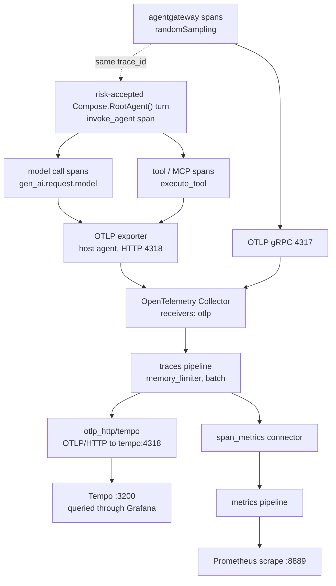

{}

- **You will:** Keep ADK traces off by default, explicitly accept their content risk for one synthetic host request, and inspect that trace in Grafana.
- **You need:** Docker running, `mise run observability:up` serving Tempo on `http://localhost:3200` and Grafana on `http://localhost:3002`, and Ollama serving `qwen3:4b-instruct`.
- **Time:** about 35 minutes, hands-on. {}

## Why trace an agent instead of logging the final answer?

One turn took far longer than it should have. Was it the model, a tool, or the gateway? A log line of the final answer cannot say.

A log line records that something happened; a trace records _how the work was structured in time_. Depending on the entrypoint, one request can cross:

- the A2A and model listeners in agentgateway
- workflow stages or in-process specialist transfers
- several model calls
- MCP discovery and invocation
- tool code
- runbook retrieval
- human confirmation
- session storage

Each is a separate process or library call with its own latency and failure surface. A flat log of the final answer tells you it was slow or wrong. It cannot tell you _which_ boundary burned the latency budget or returned the error, because it throws away the parent/child and start/end relationships that make that attributable.

Distributed tracing keeps exactly that structure. Every unit of work becomes a **span** with a start time, an end time, a status, and a parent, and every span in one request shares one **trace id**. The result is a tree you can read top-down: the turn, the model calls under it, the tool calls under those, the MCP round trip under a tool. When something is slow you open the widest bar; when something fails you open the span whose status flipped to `ERROR`.

That is why observability for agents starts with traces and treats logs and metrics as derived views. Those two pillars are owned by [7.2. Monitoring](); this page owns the trace.

## How do you open the trace UI?

Start the stack first, so the rest of this page has something to point at.

For host mode, bring up the observability stack:

```bash
mise run observability:up
```

Open Grafana at `http://localhost:3002`, go to **Explore**, and select the **Tempo** datasource. That is where you inspect a trace after one agent request. Tempo has no UI of its own — it stores spans and answers queries on `:3200`, and Grafana is the thing that renders them, which is also why the trace view sits next to the metric and log views instead of in a separate tab.

For Kubernetes, forward the ClusterIP service and point your own Grafana at it — the cluster overlays ship no Grafana:

```bash
kubectl -n agentops port-forward svc/tempo 3200:3200
```

Do not run both stacks on the same host ports.

The rest of this page explains what lands in that UI, starting with the smallest piece.

## What is inside one span?

A span is a timed, attributed node. After explicit risk acceptance, ADK emits spans through its configured OpenTelemetry provider.

1. **Identity and structure**: a `trace_id` shared by the whole request, a `span_id`, and a parent span id — the edges that build the tree. That same `trace_id` is what later joins a span to its log lines in Loki (see [7.2. Monitoring]()).
1. **Timing and status**: start and end timestamps (so duration is `end - start`). Successful spans leave the OpenTelemetry status `UNSET`; a failure sets it to `ERROR` and records an exception event.
1. **Semantic attributes** following the OpenTelemetry GenAI conventions. The agent-invocation span sets `gen_ai.operation.name` to `invoke_agent`; each model call sets `gen_ai.request.model` and token-usage attributes; and each tool call sets `gen_ai.operation.name` to `execute_tool` plus `gen_ai.tool.name`.

The collector adds only `gen_ai.operation.name` and `gen_ai.request.model` as bounded custom dimensions ([`otel-collector.yaml`](https://github.com/MLOps-Courses/agentops-open-course-go/blob/main/infra/observability/otel-collector.yaml)). The connector supplies `status_code` itself, so error-rate queries do not depend on an ADK-specific error attribute or instrumentation-scope name.

The shipped default records no ADK spans. When enabled for synthetic lab data, the pinned ADK's span inventory is content-bearing and version-specific.

The optional orchestration paths make trace shape part of the lesson. `mise run workflow` always crosses four model-backed stages, so its trace should expose `plan`, `investigate`, `evidence_review`, and `recommend` rather than one opaque “workflow” bar. `mise run coordinator` adds a specialist's agent span and the `transfer_to_agent` tool event only when its model delegates. That difference lets you attribute the latency cost of explicit review or specialist routing instead of guessing from the final answer.

The default agent's post-action rule is visible the same way. After an approved write, a complete trajectory should show fresh incident and service reads before `save_incident_note`. The write span and audit row prove the command ran; the later reads prove whether recovery happened. If they are absent, the trace exposes instruction non-compliance rather than letting an action response masquerade as success.

## How is ADK telemetry enabled?

Every `agent` entrypoint applies the privacy gate before dispatch, and agent runtime assembly reapplies it before either provider-ownership path constructs an ADK provider.



See [`telemetry/telemetry.go`](https://github.com/MLOps-Courses/agentops-open-course-go/blob/main/agents/go/telemetry/telemetry.go). Five things happen here:

1. Unset `ADK_CAPTURE_MESSAGE_CONTENT_IN_SPANS` becomes `false`.
1. False, unset, or malformed risk acceptance forces `OTEL_TRACES_SAMPLER=always_off`; malformed input also stops startup with a clear error.
1. Only the exact literal `true` preserves the operator's sampler and permits ADK spans.
1. The ADK launcher installs providers from the standard `OTEL_*` environment; the repository separately supplies its metric and sanitized log paths.
1. A single `slog` fan-out sends independently redacted, bounded records to the local console and, when configured, OTLP.

The function changes process environment globally and runs before metric, trace, or log providers are constructed. Reapplying it at runtime assembly is idempotent.

{}

ADK Go v2.2.0 serializes tool arguments and results on every `execute_tool` span and can record raw error text in exception events. Neither capture switch filters those fields, and the SDK exposes no stable mutable end-of-span filter. Use explicit `true` only with the repository's fictional seed data; never with real incidents, people, credentials, or provider bodies. {}

The same gate covers the `adk web` built-in trace view. Its in-memory processor receives no ADK spans by default, so a missing trace is the intended privacy state, not an exporter fault.

## How do you point a host agent at the collector?

This is a **live-model, content-bearing lab step**. Use only the immutable fictional course data, then opt in and point the agent at the collector:

```bash
export ADK_CAPTURE_MESSAGE_CONTENT_IN_SPANS=true
export OTEL_TRACES_SAMPLER=always_on
export OTEL_EXPORTER_OTLP_ENDPOINT=http://localhost:4318
export OTEL_EXPORTER_OTLP_PROTOCOL=http/protobuf
export OTEL_SERVICE_NAME=agentops-agent
```

Kubernetes supplies `http://otel-collector:4318` and resource attributes for namespace and environment instead. The collector accepts both OTLP protocols on two ports:

```yaml
receivers:
  otlp:
    protocols:
      grpc:
        endpoint: 0.0.0.0:4317
      http:
        endpoint: 0.0.0.0:4318
```

The risk-accepted host agent uses `http/protobuf`, so it talks to **4318**. agentgateway is a separate emitter written in Rust and speaks OTLP **gRPC**, so it targets **4317**.

| Emitter      | OTLP protocol   | Collector port |
| ------------ | --------------- | -------------- |
| Host agent   | `http/protobuf` | `4318`         |
| agentgateway | gRPC            | `4317`         |

Both reach the one collector; only the receiver port differs.

## How do the gateway and agent spans end up in one trace?

A risk-accepted request through the platform crosses at least two processes, agentgateway and the agent, and each may emit spans into **one** trace.

What joins them is **trace context propagation**: carrying one request's trace identity across a process boundary. The gateway starts (or continues) a trace and injects the `trace_id` and current `span_id` into the outbound request. The agent's SDK extracts them and makes its own spans children of the gateway's. Both sides then export to the same collector, which writes them to Tempo under that one shared `trace_id`.

When both emitters record, you read the gateway hop and the agent's model and tool spans as one tree instead of correlating two timelines by timestamp.

In Kubernetes the two sides even share telemetry infrastructure beyond traces: the in-cluster collector additionally scrapes agentgateway's Prometheus endpoint for its metrics ([`otel-collector-config.yaml`](https://github.com/MLOps-Courses/agentops-open-course-go/blob/main/infra/k8s/base/otel-collector-config.yaml)), so one collector is the join point for both pillars.

The host gateway has no `tracing:` block, so the opt-in exercise produces agent spans only. Kubernetes emits gateway spans, while its shipped agent keeps ADK spans off.

## Is any trace sampled before it reaches the collector?

Sampling decides which traces are kept. The repository forces the agent sampler to `always_off` unless `ADK_CAPTURE_MESSAGE_CONTENT_IN_SPANS` is exactly `true`; the lab command then chooses `always_on` explicitly. The Kubernetes agentgateway profile independently sets `randomSampling: true` ([`k3d/config.yaml`](https://github.com/MLOps-Courses/agentops-open-course-go/blob/main/infra/agentgateway/k3d/config.yaml)):

```yaml
tracing:
  otlpEndpoint: http://otel-collector.agentops.svc.cluster.local:4317
  randomSampling: true
```

The two emitters remain independent. With the shipped platform defaults, expect gateway spans and no ADK spans; only an explicit agent risk acceptance changes that boundary.

{}

The second place traces can be shed is the collector itself: the traces pipeline runs a `memory_limiter` (400 MiB soft cap, 100 MiB spike) ahead of a `batch` processor, so under memory pressure the limiter applies backpressure and can refuse batches rather than let the collector OOM. That is a deliberate stability trade — dropped telemetry over a dead collector — and it is why `ObservabilityCollectorDown` is a paging alert in 7.2. {}

## What does the collector do?

The collector is the one vendor-neutral choke point every emitter funnels into. Its traces pipeline is three steps and a fan-out:

```yaml
traces:
  receivers: [otlp]
  processors: [memory_limiter, batch]
  exporters: [otlp_http/tempo, span_metrics]
```

Read those three keys as three roles: a **receiver** takes telemetry in, a **processor** shapes it in flight, and an **exporter** sends it on. The traces pipeline receives OTLP (from both ports), bounds memory and batches spans, then sends each span to **two** places at once:

1. The `otlp_http/tempo` exporter, which forwards the spans to Tempo at `http://tempo:4318` and stores the full trace tree there. The `_http` suffix is load-bearing: Tempo's receiver is configured for OTLP over HTTP only, and the plain `otlp` exporter would speak gRPC at it and silently fail every export — the same class of mistake as pointing an `http/protobuf` client at `4317`.
1. The `span_metrics` **connector** — a pipeline element that feeds another pipeline instead of exiting the collector. It turns spans into request-count and duration metrics and re-injects them into the metrics pipeline, sliced by the three bounded dimensions above and exported to Prometheus on `:8889`.

So the same spans become both a browsable trace and RED metrics: Rate (requests per second), Errors (failed request ratio), and Duration (latency distribution), without the app emitting metrics itself. This page stops at "spans become metrics here"; the metrics side is owned by [7.2. Monitoring]().



**Diagram in words:** After explicit risk acceptance, one `invoke_agent` span contains model and tool spans; a gateway span can share its trace id. The agent exports over HTTP on `4318` and the gateway over gRPC on `4317`. The collector batches spans, writes them to Tempo, and feeds bounded span metrics to Prometheus.

Tempo has no notion of an experiment or a project: a trace is addressed by its `trace_id` and nothing else. There is no name to keep in sync between the runtime and anything downstream, and no header that can quietly route your spans somewhere you are not looking.

That simplicity also joins runtime and evaluation evidence without joining their content. Runtime traces and sanitized evaluation spans both land in Tempo, use separate stable span names, and share the Git revision as lineage. The evaluation harness forces its child agent's exporter off, so one captured case cannot be mistaken for production traffic.

## Why does the application never import a trace-backend SDK?

Because swapping the trace store is a platform decision, and the code should not have to move for it. The agent imports only OpenTelemetry; the one place that names Tempo is the collector exporter you just read.

{}

Because the backend choice is operational. Tempo is named in the collector exporter, not the agent, so changing an OTLP-compatible destination leaves instrumentation and span attributes intact. The same boundary keeps the runtime image limited to the agent; the standalone evaluation module exports through OTLP without becoming an agent dependency. {}

## Does disabling message capture eliminate privacy risk?

No. Structured logs and spans are defended differently, and that asymmetry is the sharpest thing to understand here.

The log bridge is actively defended. Before a record reaches the console or OTLP, independent handlers recursively redact personal-data and credential patterns in keys and values, cap every string at 2048 characters, and retain only sanitized error evidence. ADK's remaining standard-library log path passes through the same fail-closed writer. That machinery is documented in [7.2. Monitoring]().

**Spans get no such filter.** The shipped defense is stronger and simpler: ADK spans are non-recording by default.

Before you touch either variable, know that they route to two different stores, and the one whose name mentions spans is not the one that fills spans:

| Variable                                             | Repository meaning                                                                 | Durable destination                     |
| ---------------------------------------------------- | ---------------------------------------------------------------------------------- | --------------------------------------- |
| `ADK_CAPTURE_MESSAGE_CONTENT_IN_SPANS`               | Exact `true` accepts known content-bearing ADK spans; anything else shuts them off | the trace store (Tempo `:3200`)         |
| `OTEL_TRACES_SAMPLER`                                | Forced to `always_off` until that risk is accepted                                 | controls whether ADK spans are recorded |
| `OTEL_INSTRUMENTATION_GENAI_CAPTURE_MESSAGE_CONTENT` | Enables GenAI model-message log events                                             | the log store (Loki, via the collector) |

The pinned Go ADK does not read the first variable. The repository deliberately owns it as the explicit risk-acceptance gate and applies it before ADK constructs a provider.

After risk acceptance, the trace can contain:

- serialized tool arguments in `gcp.vertex.agent.tool_call_args`
- serialized tool results in `gcp.vertex.agent.tool_response`
- raw error text in exception events and span status descriptions
- session, model, tool, timing, token, and future instrumentation attributes

The PII callbacks in [4.5. Guardrails]() do not make those spans safe: raw session ingestion and framework error capture occur outside that boundary.

Keep the gate false for normal use. The opt-in exercise is valid only because every incident, service, log line, and runbook in the repository is fictional.

## What proves this page worked?

Four checks against the stack you started at the top of the page:

1. Start the agent with the shipped false gate and confirm Tempo receives no ADK span, even if `OTEL_TRACES_SAMPLER=always_on` was already exported.
1. Set the gate to the exact literal `true`, restart the agent, and issue one read-only request against fictional seed data.
1. Find its trace in Grafana and identify the agent, model, tool, and MCP spans as one tree.
1. Inspect one `execute_tool` span and explain why its serialized arguments or response make this an accepted lab risk, not a production-safe trace.

{}

Unset the acceptance variable, or set it back to `false`, before leaving the exercise. Restart the agent and confirm no new ADK trace appears. {}

**You are done when:**

- Default startup forces `OTEL_TRACES_SAMPLER=always_off` and records no ADK spans.
- Exact `ADK_CAPTURE_MESSAGE_CONTENT_IN_SPANS=true` plus `always_on` produces one synthetic trace tree in Grafana.
- You can identify the content-bearing tool and error fields that make this opt-in unsuitable for real data.
- The gate is false again, and a restarted agent produces no new ADK spans.

Continue to [7.2. Monitoring]() after restoring the default, when you can explain both the trace tree and its privacy boundary.
