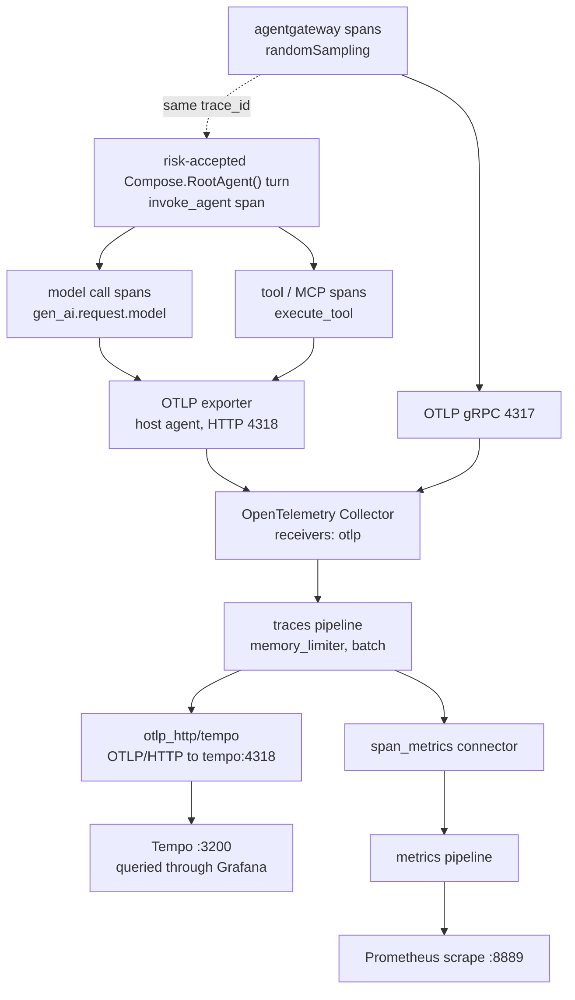

{}

- **You will:** Keep ADK traces off by default, explicitly accept their content risk for one synthetic host request, and read that turn as a tree in Grafana.
- **You need:** Docker running, `mise run observability:up` serving Tempo on `http://localhost:3200` and Grafana on `http://localhost:3002`, and Ollama serving `qwen3:4b-instruct`.
- **Time:** about 35 minutes, hands-on. {}

## A log line cannot tell you where the time went

One turn took far longer than it should have. Was it the model, a tool, or the gateway? A log line of the final answer cannot say.

A log line records that something happened; a trace records _how the work was structured in time_. Distributed tracing keeps that structure: every unit of work becomes a **span** with a start time, an end time, a status, and a parent, and every span in one request shares one **trace id**. The result is a tree you read top-down — the turn, the model calls under it, the tool calls under those, the MCP round trip under a tool. When something is slow you open the widest bar; when something fails you open the span whose status flipped to `ERROR`.

Here is one real turn, pulled straight out of Tempo by trace id and reduced to span name, whole seconds, and status:

```bash
curl -s "http://localhost:3200/api/traces/<trace id>" | jq -r '
  .batches[].scopeSpans[].spans[]
  | [.name, (((.endTimeUnixNano|tonumber) - (.startTimeUnixNano|tonumber))/1000000000|floor), (.status.code//0)]
  | @tsv'
```

```text
invoke_agent agentops_agent	895	0
generate_content qwen3:4b-instruct	122	0
execute_tool get_service_status	0	0
generate_content qwen3:4b-instruct	773	STATUS_CODE_ERROR
```

The API returns a flat list, so the parent/child edges are in the payload rather than in that output; Grafana draws them for you. A `0` in the last column is OpenTelemetry's `UNSET` — success, not silence.

That is one question — "what is the status of the checkout service?" — asked on a CPU-only laptop and abandoned after fifteen minutes. Durations are rounded to whole seconds, and yours will be far smaller. Read the shape rather than the numbers: the tool call, which is the part everyone blames first, took under a second. The two model calls took the entire quarter of an hour between them, and the second one never returned an answer, so its span carries `STATUS_CODE_ERROR`. A flat log of the final answer would have said "the model provider is unavailable" and left you guessing about all four boxes. The tree tells you which box to open.

Read that shape once more, because everything else on this page exists to produce it. Depending on the entrypoint, one request can cross the A2A and model listeners in agentgateway, workflow stages or in-process specialist transfers, several model calls, MCP discovery and invocation, tool code, runbook retrieval, human confirmation, and session storage. Each is a separate process or library call with its own latency and failure surface, and a flat log throws away the parent/child and start/end relationships that make any of it attributable.

A span carries three things worth naming. **Identity and structure**: a `trace_id` shared by the whole request, a `span_id`, and a parent span id — the edges that build the tree, and the same `trace_id` that later joins a span to its log lines in Loki. **Timing and status**: start and end timestamps, so duration is `end - start`; a successful span leaves the OpenTelemetry status `UNSET`, and a failure sets it to `ERROR` and records an exception event. **Semantic attributes** following the OpenTelemetry GenAI conventions: the agent-invocation span sets `gen_ai.operation.name` to `invoke_agent`, each model call sets `gen_ai.request.model` and token-usage attributes, and each tool call sets `gen_ai.operation.name` to `execute_tool` plus `gen_ai.tool.name`.

The optional orchestration paths make trace shape part of the lesson. `mise run workflow` always crosses four model-backed stages, so its trace exposes `plan`, `investigate`, `evidence_review`, and `recommend` rather than one opaque "workflow" bar. `mise run coordinator` adds a specialist's agent span and the `transfer_to_agent` tool event only when its model delegates. That difference lets you attribute the cost of explicit review or specialist routing instead of guessing from the final answer. The default agent's post-action rule is visible the same way: after an approved write, a complete trajectory shows fresh incident and service reads before `save_incident_note`. The write span and the audit row prove the command ran; the later reads prove whether recovery happened. Their absence is instruction non-compliance, exposed rather than hidden behind a confident sentence.

## The switch that keeps ADK spans off by default

You will not find that tree in Tempo yet, and the reason is a deliberate one. Every `agent` entrypoint applies a privacy rule before dispatch, and runtime assembly reapplies it before either provider-ownership path constructs an ADK provider:



Read what that function does to the environment before anything else reads it. Anything other than the exact literal `true` in `ADK_CAPTURE_MESSAGE_CONTENT_IN_SPANS` — unset, `false`, or a typo — pins the switch to `false` _and_ pins `OTEL_TRACES_SAMPLER` to `always_off`, overriding whatever sampler the operator exported. A typo additionally returns an error, after the switch has already been pinned shut, so a misspelled risk acceptance stops startup instead of silently opening it. The unrelated GenAI switch is pinned to `false` only when nobody chose a value, because it controls log-event bodies, and both durable log paths sanitize those. Because it sets process environment globally and runs before any provider is constructed, calling it a second time when the runtime assembles providers is deliberate rather than redundant: direct assembly cannot bypass the rule.

The same rule covers `adk web`'s built-in trace view, whose in-memory processor therefore receives no ADK spans by default. A missing trace before you opt in is the intended privacy state, not an exporter fault.

{}

ADK Go v2.2.0 serializes tool arguments and results on every `execute_tool` span and can record raw error text in exception events. Neither capture switch filters those fields, and the SDK exposes no stable mutable end-of-span filter. Use explicit `true` only with this repository's fictional seed data; never with real incidents, people, credentials, or provider bodies. {}

The asymmetry behind that warning is the sharpest thing on this page. Structured logs are _actively_ defended: before a record reaches the console or OTLP, independent handlers recursively redact personal-data and credential patterns in keys and values, cap every string at 2048 characters, and keep only sanitized error evidence. **Spans get no such filter.** Their defense is stronger and simpler — they are non-recording by default. Turning them on is therefore a risk decision, not a verbosity setting.

Three variables sit near that decision, and the one whose name mentions spans is not the one that fills spans:

| Variable                                             | Repository meaning                                                                 | Durable destination                     |
| ---------------------------------------------------- | ---------------------------------------------------------------------------------- | --------------------------------------- |
| `ADK_CAPTURE_MESSAGE_CONTENT_IN_SPANS`               | Exact `true` accepts known content-bearing ADK spans; anything else shuts them off | the trace store (Tempo `:3200`)         |
| `OTEL_TRACES_SAMPLER`                                | Forced to `always_off` until that risk is accepted                                 | controls whether ADK spans are recorded |
| `OTEL_INSTRUMENTATION_GENAI_CAPTURE_MESSAGE_CONTENT` | Enables GenAI model-message log events                                             | the log store (Loki, via the collector) |

The pinned Go ADK does not read the first variable at all. This repository deliberately owns it as the explicit risk-acceptance switch and applies it before ADK constructs a provider. Once accepted, a trace can contain serialized tool arguments in `gcp.vertex.agent.tool_call_args`, serialized tool results in `gcp.vertex.agent.tool_response`, raw error text in exception events and span status descriptions, and every session, model, tool, timing, and token attribute future instrumentation adds. The PII callbacks in [4.5. Guardrails]() do not make those spans safe, because raw session ingestion and framework error capture happen outside that boundary.

## What the collector does with a span

Accept the risk for one synthetic request and point the agent at the collector. This is a **live-model, content-bearing lab step**, valid only because every incident, service, log line, and runbook in this repository is fictional:

```bash
export ADK_CAPTURE_MESSAGE_CONTENT_IN_SPANS=true
export OTEL_TRACES_SAMPLER=always_on
export OTEL_EXPORTER_OTLP_ENDPOINT=http://localhost:4318
export OTEL_EXPORTER_OTLP_PROTOCOL=http/protobuf
export OTEL_SERVICE_NAME=agentops-agent
```

Then open Grafana at `http://localhost:3002`, go to **Explore**, and select the **Tempo** datasource. Tempo has no UI of its own — it stores spans and answers queries on `:3200`, and Grafana renders them, which is also why the trace view sits next to the metric and log views instead of in its own tab. In Kubernetes, forward the ClusterIP instead with `kubectl -n agentops port-forward svc/tempo 3200:3200`, and do not run both stacks on the same host ports.

Two emitters reach one collector on two different ports, and mixing them up produces silence rather than an error:

| Emitter      | OTLP protocol   | Collector port |
| ------------ | --------------- | -------------- |
| Host agent   | `http/protobuf` | `4318`         |
| agentgateway | gRPC            | `4317`         |

When both record, they land in **one** trace. What joins them is **trace context propagation**: the gateway starts or continues a trace and injects the `trace_id` and current `span_id` into the outbound request; the agent's SDK extracts them and makes its own spans children of the gateway's. You then read the gateway hop and the agent's model and tool spans as one tree instead of correlating two timelines by timestamp. The host gateway ships no `tracing:` block, so this opt-in produces agent spans only; Kubernetes emits gateway spans while its shipped agent keeps ADK spans off, and the in-cluster collector additionally scrapes agentgateway's Prometheus endpoint so one collector joins both pillars.

Inside the collector, the traces pipeline is three steps and a fan-out:

```yaml
traces:
  receivers: [otlp]
  processors: [memory_limiter, batch]
  exporters: [otlp_http/tempo, span_metrics]
```

Read those three keys as three roles: a **receiver** takes telemetry in, a **processor** shapes it in flight, and an **exporter** sends it on. Every span goes to two places at once. The `otlp_http/tempo` exporter forwards it to Tempo at `http://tempo:4318`, where the full tree is stored — and the `_http` suffix is load-bearing, because Tempo's receiver speaks OTLP over HTTP only and the plain `otlp` exporter would speak gRPC at it and silently fail every export. The `span_metrics` **connector** feeds another pipeline instead of exiting the collector: it turns spans into request-count and duration metrics, sliced by `gen_ai.operation.name`, `gen_ai.request.model`, and the `status_code` it supplies itself, and re-injects them into the metrics pipeline for Prometheus on `:8889`.

So the same spans become both a browsable trace and RED metrics — Rate, Errors, Duration — without the application emitting a single metric. This page stops at "spans become metrics here"; [7.2. Monitoring]() owns the metrics side.

**With those five variables exported, your own agent is feeding a real collector. One turn now becomes two things at once: a tree you can open and a counter you can alert on — and you wrote no instrumentation code to get either.**



**Diagram in words:** After explicit risk acceptance, one `invoke_agent` span contains model and tool spans; a gateway span can share its trace id. The agent exports over HTTP on `4318` and the gateway over gRPC on `4317`. The collector batches spans, writes them to Tempo, and feeds bounded span metrics to Prometheus.

Sampling decides which traces are kept, and this repository forces the agent sampler to `always_off` until that switch is exactly `true`; the Kubernetes agentgateway profile independently sets `randomSampling: true`. The two emitters stay independent, so with shipped platform defaults you should expect gateway spans and no ADK spans.

{}

The collector itself is the other place traces are shed: the traces pipeline runs a `memory_limiter` (400 MiB soft cap, 100 MiB spike) ahead of the `batch` processor, so under memory pressure the limiter applies backpressure and refuses batches rather than letting the collector OOM. That is a deliberate trade — dropped telemetry over a dead collector — and it is why `ObservabilityCollectorDown` pages in [7.2b. Alerting]().

The application never imports a trace-backend SDK, which is what makes that swap an operational decision instead of a code change. The agent imports only OpenTelemetry; the one place that names Tempo is the collector exporter above. The same separation keeps the runtime image limited to the agent, while the standalone evaluation module exports through OTLP without becoming an agent dependency. {}

Tempo has no notion of an experiment or a project: a trace is addressed by its `trace_id` and nothing else. There is no name to keep in sync between the runtime and anything downstream, and no header that can quietly route your spans somewhere you are not looking. That simplicity also lets runtime and evaluation evidence share one store without sharing content — both land in Tempo under separate stable span names and the same Git revision as lineage, and the evaluation harness forces its child agent's exporter off so one captured case cannot be mistaken for production traffic.

## Your turn: accept the risk for exactly one request

Predict before you run this: you have already exported `OTEL_TRACES_SAMPLER=always_on`. Start the agent with the shipped default in place — does that sampler win?

- **Mode**: `inspect` — the drill changes only environment variables in one shell, and ends by putting them back.
- **Goal**: watch the shipped default beat the sampler, then produce one synthetic trace tree and find the field in it that makes this a lab-only setting.
- **Files to touch**: none. No tracked file and no `.env` entry changes; every variable is exported in the shell you are sitting in.
- **Preflight**: confirm the stack is up with `curl -fsS http://localhost:3200/ready`. Then take back only the risk acceptance, leaving the sampler and the three exporter variables exactly as you set them: run `unset ADK_CAPTURE_MESSAGE_CONTENT_IN_SPANS`, and confirm `env | grep ADK_CAPTURE_MESSAGE_CONTENT_IN_SPANS` now prints nothing while `echo $OTEL_TRACES_SAMPLER` still prints `always_on`.
- **Steps**: start the agent in that shell and send one read-only question; look for its trace in Grafana. Then `export ADK_CAPTURE_MESSAGE_CONTENT_IN_SPANS=true`, restart the agent, ask the same question, and open the new trace.
- **Gate that proves completion**: the first run leaves Tempo with no ADK span even though `always_on` is exported in that very shell; the second produces one tree in which you can point at the agent, model, and tool spans, and read a serialized argument or response off an `execute_tool` span.
- **Final state**: run `unset ADK_CAPTURE_MESSAGE_CONTENT_IN_SPANS OTEL_TRACES_SAMPLER`, restart the agent, ask one more question, and confirm no new ADK trace appears.

That last step is not housekeeping. The field you just read off the `execute_tool` span was a fictional incident; on a real system it would be whatever a tool returned about a real person, written to a store with its own retention and access rules. The default is off because that is the only setting that is safe without a conversation. Why the course separates a setting like this from the checks that prove behavior is spelled out once in [0.2. Evidence]().

## What you can do now

- You read one turn as a tree and can say which span burned the time and which one failed.
- You can explain why default startup forces `OTEL_TRACES_SAMPLER=always_off` no matter what the operator exported.
- You produced one synthetic trace under explicit risk acceptance and can name the content-bearing fields that make it unsuitable for real data.
- The switch is false again, and a restarted agent records no new ADK spans.

A slow turn used to be an anecdote you retold in standup. You can open one now, point at the exact hop that spent the time, and say out loud what you had to accept in order to see that much.

Continue to [7.2. Monitoring](), where those same spans become the metrics that tell you whether the last thousand turns were healthy.
