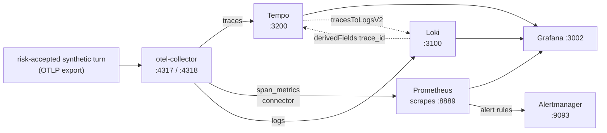

{}

- **You will:** Watch synthetic traffic appear as metrics, sanitized logs, and alerts; temporarily accept ADK trace risk only for the correlation drill.
- **You need:** [7.1. Tracing]() finished and the host Compose stack running; the k6 half also needs the documented local services.
- **Time:** about 60 minutes, hands-on. {}

## Which dashboard is shipped?

Open `http://localhost:3002/d/agentops-overview` and watch the **Agent request rate** panel while you send a turn.

The agent's three RED panels require the same **content-bearing synthetic-lab opt-in** as Chapter 7.1. Export these before starting or restarting the agent, use only fictional course data, and restore `false` at the end:

```bash
export ADK_CAPTURE_MESSAGE_CONTENT_IN_SPANS=true
export OTEL_TRACES_SAMPLER=always_on
```

Check both host services before interpreting an empty dashboard:

```bash
curl -fsS http://localhost:9090/-/ready
curl -fsS http://localhost:3002/api/health | jq
```

The host Compose profile provisions `AgentOps overview` at that address with six metric panels and one logs panel:

```promql
sum(rate(agentops_calls_total[5m]))
histogram_quantile(0.95, sum by (le) (rate(agentops_duration_seconds_bucket[5m])))
sum(rate(agentops_calls_total{status_code="STATUS_CODE_ERROR"}[5m]))
  / clamp_min(sum(rate(agentops_calls_total[5m])), 1)
sum(rate(agentgateway_requests_total[5m]))
histogram_quantile(0.95, sum by (le) (rate(agentgateway_request_duration_seconds_bucket[5m])))
sum(rate(agentgateway_guardrail_checks_total{action="Reject"}[5m]))
```

These are request rate, p95 latency, error ratio, gateway rate/latency, and guardrail rejection rate. The `Agent logs` panel below them queries Loki for `agentops-agent` log lines, optionally filtered by the `trace id` textbox variable.

{}

A graph with no data is a telemetry problem to investigate, not zero traffic by definition. {}

## How are agent metrics produced?

The three agent RED panels derive rate, errors, and duration from risk-accepted ADK spans. With the safe default, those panels are intentionally empty; gateway metrics and native agent metrics still work.

The OTel `span_metrics` connector turns spans into request count and duration histograms under namespace `agentops`. It retains only bounded dimensions:

```yaml
connectors:
  span_metrics:
    namespace: agentops
    dimensions:
      - name: gen_ai.operation.name
      - name: gen_ai.request.model
```

The connector supplies `status_code` as a default dimension. The error-ratio panels and alerts therefore select `STATUS_CODE_ERROR` without depending on an ADK-specific error attribute.

The scraper and UI differ by deployment profile. Use the canonical host/local/GKE matrix in [7. Observability]() before choosing a dashboard or external scraper; this page follows the host Compose path.

## Where do my agent logs go?

To Loki, through the same collector that produced the metrics above.

After ADK configures its providers, the application installs exactly one OTel `LoggingHandler` on the `agent` logger when `OTEL_EXPORTER_OTLP_ENDPOINT` or `OTEL_EXPORTER_OTLP_LOGS_ENDPOINT` is configured. A trace-only endpoint, no endpoint, or `OTEL_SDK_DISABLED=true` installs none. Both collector profiles forward the resulting logs pipeline to Grafana Loki, which ingests native OTLP at `/otlp/v1/logs`:

```yaml
logs:
  receivers: [otlp]
  processors: [memory_limiter, batch]
  exporters: [otlp_http/loki]
```

Loki runs pinned in single-binary mode with filesystem storage and 7-day retention, matching Prometheus: as a Compose service on the host ([`infra/observability/loki.yaml`](https://github.com/MLOps-Courses/agentops-open-course-go/blob/main/infra/observability/loki.yaml)) and as a PVC-backed Deployment in Kubernetes ([`infra/k8s/base/loki.yaml`](https://github.com/MLOps-Courses/agentops-open-course-go/blob/main/infra/k8s/base/loki.yaml)). Grafana provisions the `Loki` datasource next to Prometheus; the Kubernetes overlay exposes only the `loki:3100` ClusterIP, mirroring the external-scraper stance for metrics.

Content capture stays off by default, so ADK does not intentionally duplicate prompts or model responses into log records. Before OTLP export, the handler filters a copy of each record:

1. It locally redacts concrete PII and obvious credential/token patterns.
1. It caps every exported string and body at 2048 characters.
1. It removes exception messages, tracebacks, and stack bodies, and retains only `exception.type`.

Console and OTLP handlers independently sanitize and bound their own record copies. This is defense in depth, not a reason to log secrets.

## How do I jump from a trace to its logs?

During the explicit synthetic trace exercise, you click from a span to its logs and back. Both directions are provisioned.

Log records emitted inside a span keep their trace context, and Loki stores `trace_id` as **structured metadata** — per-line fields kept next to the log text — on every OTLP-ingested line. That single id is the thread through all three pillars: one turn's OTLP export fans out at the collector, and `trace_id` reconnects the pieces at query time.

Grafana's provisioned datasources turn that shared id into two links ([`grafana/datasources.yaml`](https://github.com/MLOps-Courses/agentops-open-course-go/blob/main/infra/observability/grafana/datasources.yaml)):

- The **Tempo** datasource carries `tracesToLogsV2` pointing at Loki. Open a span, click through, and you get that trace's log lines.
- The **Loki** datasource carries a `derivedFields` entry that matches the `trace_id` field and links to Tempo. Open a log line, click the `TraceID` link, and you land on the trace it came from.

Two details in that configuration are worth reading, because both encode a real failure the naive version has. The trace-to-logs window is widened five minutes either side of the span, since a log record is written before the span that contains it is exported — a zero-width window would find nothing. And the Loki link matches on the `trace_id` field rather than on a pattern in the log text, so it survives any change to the agent's log formatting.

None of this resolves unless the identifiers are actually on the record, and that is the one part the application still owns. A record emitted through the OpenTelemetry logging bridge carries the active span's trace and span ids because the bridge reads them from the same context the span came from. A line written outside any span, or through a path that loses that context, arrives in Loki with no ids on it — and then both links go dead while every individual store keeps looking perfectly healthy.



**Diagram in words:** One risk-accepted synthetic turn supplies spans to Tempo, sanitized logs to Loki, and connector-derived metrics to Prometheus. Grafana reads all three, and the dotted links connect the trace and its logs by trace id.

To correlate one agent turn:

1. Send one request, open Grafana Explore on the **Tempo** datasource, and open its trace.
1. From a span, follow the logs link into Loki — or copy the trace id into the `trace id` variable on `http://localhost:3002/d/agentops-overview` and read the `Agent logs` panel.
1. From any of those log lines, follow the `TraceID` link back to the trace. You should land where you started; that round trip is the proof the correlation is wired, not just configured.
1. Alternatively, query Loki from Grafana Explore or its HTTP API:

```logql
{service_name="agentops-agent"} | trace_id="<trace id from the Tempo view>"
```

```bash
curl -fsS -G 'http://localhost:3100/loki/api/v1/query_range' \
  --data-urlencode 'query={service_name="agentops-agent"}' | jq '.data.result | length'
```

In Kubernetes, forward the ClusterIPs first with `kubectl -n agentops port-forward svc/loki 3100:3100` and `kubectl -n agentops port-forward svc/tempo 3200:3200`. The overlay ships no Grafana, so it ships neither link: query the forwarded APIs directly, or point an externally operated Grafana at both and re-create the two datasource entries there.

## Why avoid session or prompt labels?

Never label a metric with a user id, a session id, or a prompt.

Prometheus labels form an in-memory/index **cardinality** dimension: cardinality is the number of distinct label-value combinations the store must index. User ids, session ids, incident ids, prompts, or trace ids can make the store expensive and leak sensitive information. Keep correlation ids in traces/logs and metrics dimensions bounded to known model/operation/error values.

## When should the platform page a human?

Page only on sustained, user-visible symptoms; everything else is a `ticket`-severity signal reviewed during working hours.

The shipped rules encode that split:

- `page` for error-budget burn against a 99% span-success [SLO]() and for a dark telemetry pipeline.
- `ticket` for latency, missing token counters, guardrail spikes, and schema failures.

An **error budget** is the share of requests an SLO allows to fail — here, 1% of spans. The SLO alert requires both the 5m and 1h error ratios to exceed 14.4 times the 1% budget, plus at least three failures in 5m. One flaky request cannot page; three sustained failures can:

```yaml
- alert: AgentErrorBudgetBurn
  expr: |-
    agentops:calls:error_ratio_rate5m > (14.4 * 0.010)
      and agentops:calls:error_ratio_rate1h > (14.4 * 0.010)
      and sum(increase(agentops_calls_total{status_code="STATUS_CODE_ERROR"}[5m])) >= 3
  for: 2m
```

{}

A burn rate is how fast you are spending an error budget relative to the SLO window. A burn rate of `14.4` against a 30-day 1% error budget means that, at the current error ratio, you would exhaust the whole month's budget in about two days — fast enough to warrant a page. The multiwindow `and` makes the fast 5m and slow 1h ratios agree; the separate three-failure guard handles sparse traffic. {}

On sparse lab traffic, drive at least three failed spans to exercise the page. Production should tune the absolute failure guard and burn windows from observed traffic rather than copying the lab threshold blindly.

## What alerts ship with the course?

[`infra/observability/prometheus-rules.yml`](https://github.com/MLOps-Courses/agentops-open-course-go/blob/main/infra/observability/prometheus-rules.yml) defines two recording rules (`agentops:calls:error_ratio_rate5m`/`rate1h`) and six alerts, each grounded in a metric the stack verifiably exports.

A **recording rule** precomputes a query and stores its result as a new metric series, so alerts can read one cheap value instead of recomputing a ratio.

Each row below carries the metric behind the rule, the `for:` window it waits before firing, and the response section to open when it does:

| Alert                            | Severity | Metric                                             | Fires on                                                                 | Window | Respond                                                                                                 |
| -------------------------------- | -------- | -------------------------------------------------- | ------------------------------------------------------------------------ | ------ | ------------------------------------------------------------------------------------------------------- |
| `AgentErrorBudgetBurn`           | page     | `agentops_calls_total`                             | multiwindow burn plus ≥3 failures in 5m                                  | 2m     | [error budget](#how-do-i-respond-when-agenterrorbudgetburn-fires)                                       |
| `ObservabilityCollectorDown`     | page     | `up{job="otel-collector"}`                         | `up{job="otel-collector"} == 0` — traces, metrics, and logs are all dark | 2m     | [collector down](#how-do-i-respond-when-observabilitycollectordown-or-agenttokentelemetrymissing-fires) |
| `AgentTurnLatencyP95High`        | ticket   | `agentops_duration_seconds_bucket`                 | p95 turn latency above 15s; tune to your hardware                        | 5m     | [latency](#how-do-i-respond-when-agentturnlatencyp95high-fires)                                         |
| `AgentTokenTelemetryMissing`     | ticket   | `agentops_tokens_token_total`                      | spans flowing but no token counter increase                              | 10m    | [collector down](#how-do-i-respond-when-observabilitycollectordown-or-agenttokentelemetrymissing-fires) |
| `AgentInjectionNeutralizedSpike` | ticket   | `agentops_guardrails_injections_neutralized_total` | more than 3 neutralized injections in 15m                                | 2m     | [guardrail / schema](#how-do-i-respond-when-a-guardrail-or-triage-schema-alert-fires)                   |
| `AgentTriageSchemaFailures`      | ticket   | `agentops_triage_report_schema_failures_total`     | any triage-schema failure in 15m                                         | 2m     | [guardrail / schema](#how-do-i-respond-when-a-guardrail-or-triage-schema-alert-fires)                   |

One spelling quirk in that Metric column: the collector's Prometheus exporter appends the `token` unit suffix, which is why the token counter reads `agentops_tokens_token_total`.

The host Compose stack loads the rules into Prometheus (`http://localhost:9090/alerts`) and routes fired alerts to a pinned Alertmanager at `http://localhost:9093`. That Alertmanager's webhook points at a documented placeholder ([`infra/observability/alertmanager.yml`](https://github.com/MLOps-Courses/agentops-open-course-go/blob/main/infra/observability/alertmanager.yml)); replace the URL to integrate a real channel.

The local Kubernetes overlay runs the identical rules in an in-cluster Prometheus/Alertmanager pair ([`infra/k8s/overlays/local`](https://github.com/MLOps-Courses/agentops-open-course-go/tree/main/infra/k8s/overlays/local)) whose Alertmanager receiver has deliberately no integration: default-deny egress keeps notifications cluster-internal, and network policies allow only Prometheus to reach it. There is no external paging service anywhere.

{}

Note one Prometheus counter subtlety when triggering alerts deliberately: `increase()` needs at least two samples of a series inside its window, so the very first guardrail or schema event after startup may not register — send a few. {}

## How do I respond when AgentErrorBudgetBurn fires?

1. **Symptom**: agent turns fail or return errors; the dashboard error-ratio panel rises with the alert.
1. **Diagnose**: `curl -fsS http://127.0.0.1:4000/v1/models` through the gateway and `ollama ps` on the host; in Kubernetes, `kubectl -n agentops get pods` and the agentgateway logs.
1. **Likely cause**: the model provider is down (stopped Ollama, missing `qwen3:4b-instruct` pull, wrong `OLLAMA_HOST` binding) or a gateway route/policy rejects the upstream.
1. **Fix**: restart `ollama serve` with the documented `OLLAMA_HOST`, re-pull the model, or revert the gateway config change; confirm the error ratio decays and the alert resolves in Alertmanager.

## How do I respond when AgentTurnLatencyP95High fires?

1. **Symptom**: turns complete but slowly; p95 stays above 15s.
1. **Diagnose**: open the slowest recent trace in Grafana's Tempo view and read which span dominates; check `ollama ps` for model load state and host CPU pressure.
1. **Likely cause**: model cold starts/reloads, CPU contention with other workloads, or oversized contexts from long sessions.
1. **Fix**: keep the model warm, free host resources or pick a smaller pinned model, and trim session growth; if your hardware is simply slower, raise the threshold in the rules file instead of deleting the alert.

## How do I respond when ObservabilityCollectorDown or AgentTokenTelemetryMissing fires?

1. **Symptom**: dashboards flatten while the agent still answers — the pipeline, not the agent, is broken.
1. **Diagnose**: `docker compose -f infra/observability/compose.yaml ps otel-collector` (host) or `kubectl -n agentops get pods -l app.kubernetes.io/name=otel-collector`; then `curl -fsS http://localhost:8889/metrics | grep agentops_tokens` after a port-forward to see whether the counter is exported at all.
1. **Likely cause**: collector crash or memory-limit kill, a port conflict with the other profile (do not run host Compose and the forwarded in-cluster stack together), or an agent started without `OTEL_EXPORTER_OTLP_ENDPOINT` so spans arrive from one process and metrics from none.
1. **Fix**: restart the collector, resolve the port clash, and relaunch the agent with the documented OTLP environment; telemetry gaps for the outage window are permanent, which is exactly why this pages.

## How do I respond when a guardrail or triage-schema alert fires?

1. **Symptom**: `AgentInjectionNeutralizedSpike` or `AgentTriageSchemaFailures` shows up as a ticket; user traffic may look normal.
1. **Diagnose**: filter Loki for the recent turns (`{service_name="agentops-agent"}`), follow the `TraceID` link on a matching line into Tempo, and inspect which tool output carried injection markers or which report failed validation.
1. **Likely cause**: for injections, adversarial content in the data the tools read (or someone running the red-team suite); for schema failures, model or prompt drift after a model swap.
1. **Fix**: for injections, confirm the neutralization worked and clean or quarantine the offending source records; for schema failures, re-run the offline tests and evaluation gates and restore the pinned model/prompt combination before trusting new reports.

## How do you query the stores directly?

When a panel disagrees with what you expect, read the raw endpoint instead of the dashboard. These are lookup commands, not first-pass reading: come back to them when a graph and a trace tell you different stories.

{}

```bash
curl -fsS 'http://localhost:9090/api/v1/query?query=sum(rate(agentops_calls_total%5B5m%5D))' \
  | jq '.data.result'
curl -fsS http://localhost:15020/metrics | head
```

Those Prometheus queries apply to the host Compose profile. In the local Kubernetes overlay, open each forward in its own terminal:

```bash
kubectl -n agentops port-forward svc/prometheus 9090:9090
```

```bash
kubectl -n agentops port-forward svc/alertmanager 9093:9093
```

```bash
kubectl -n agentops port-forward svc/otel-collector 8889:8889
```

Leave the collector forward running, then inspect its raw endpoint from a fourth terminal:

```bash
curl -fsS http://localhost:8889/metrics | head
```

The GKE overlay ships no scraper: an operator points an existing Prometheus-compatible one at the `otel-collector:8889` ClusterIP. {}

## How much load can the platform take?

This section and the next two are the page's second half: a longer, separate exercise that measures the same path under load.

**k6** is a load-testing tool. It drives scripted HTTP traffic and fails the run when a stated latency budget is breached. It counts concurrency in **VUs** — virtual users, one simulated client each.

The repository ships Grafana k6 scenarios under [`load/`](https://github.com/MLOps-Courses/agentops-open-course-go/tree/main/load) — k6 is AGPL-3.0 open source, consistent with the rest of the stack. Each script isolates one layer of the host quickstart:

1. [`load/health.js`](https://github.com/MLOps-Courses/agentops-open-course-go/blob/main/load/health.js): raw `/healthz` on MCP `:8000` and A2A `:8080`, plus a low-rate hop through agentgateway `:3001` — the latency floor and the pure proxy overhead.
1. [`load/mcp-read.js`](https://github.com/MLOps-Courses/agentops-open-course-go/blob/main/load/mcp-read.js): the MCP streamable HTTP handshake and a `tools/call list_incidents` loop through the gateway `:3000` — gateway plus the Go MCP server and SQLite, with no model call.
1. [`load/a2a-send.js`](https://github.com/MLOps-Courses/agentops-open-course-go/blob/main/load/a2a-send.js): a bounded A2A `message/send` conversation through `:3001` — a full agent turn, model included, deliberately capped at 1 VU and 3 iterations. It requires a completed, non-empty result with no structured ADK error; HTTP 200 alone is not success.
1. [`tools/internal/fakemodel/server.go`](https://github.com/MLOps-Courses/agentops-open-course-go/blob/main/tools/internal/fakemodel/server.go): a deterministic Responses-compatible server on Ollama's host port, so the same A2A turn measures the platform without inference.

First run the isolated `mise run smoke:host` composition check.

The scripts then need the manual host stack up, each server in its own terminal: `mise run mcp:http`, `mise run a2a`, `mise run gateway:host`, and Ollama serving `qwen3:4b-instruct`. With those running, use a pinned k6 from the mise registry — no permanent install:

```bash
mise x k6@2.1.0 -- k6 run load/health.js
mise x k6@2.1.0 -- k6 run load/mcp-read.js
mise x k6@2.1.0 -- k6 run load/a2a-send.js # spends real model time — keep 1 VU
```

Now hold that last request constant and replace only inference:

1. Stop Ollama so `:11434` is free.
1. Run `mise run model:fake`.
1. Keep `AGENT_A2A_STREAMING=false`.
1. Restart A2A with `AGENT_MODEL_PROVIDER=openai-compatible` plus `OPENAI_BASE_URL=http://127.0.0.1:4000/v1`.
1. Run the same script again: `mise x k6@2.1.0 -- k6 run load/a2a-send.js`.

You get the same turn with inference taken out of it. The fake returns a valid, fixed chat completion with token usage and no tool call. Both host and k3d gateway profiles already target the host's `:11434`, so no route or test script changes between samples.

This mode is for platform latency and concurrency, not answer-quality evaluation; restore Ollama before any evaluation exercise.

The A2A checks validate protocol state as well as transport status. A direct `Message` must contain text. A `Task` must reach `completed`, contain text in its status message or artifacts, and carry no `metadata.adk_error_code`. A failed task wrapped in a successful JSON-RPC response therefore fails the sample instead of producing a false latency result.

The first honest answer is that the shipped gateway policies cap throughput on purpose: 120 MCP, 60 A2A, and 30 model requests per minute per gateway instance. The default rates stay under those budgets, and `mcp-read.js` counts every HTTP 429 in an `mcp_rate_limited` metric whose threshold is zero. A breach means you measured your own rate limiter, not the platform.

For a real capacity probe, raise `maxTokens` in the gateway config, or point `MCP_URL` at the raw `:8000/mcp` server to take the gateway out of the path. In the local Kubernetes overlay, run the identical scripts against the port-forwarded agentgateway and raw services and watch pod CPU limits in parallel.

{}

A load test aimed at a shared or third-party endpoint is a denial-of-service attempt, not a lab. {}

## What is a latency budget?

A latency budget is a pass/fail number agreed on before the test: this path answers within X ms at percentile Y.

Deciding afterwards that a dashboard looked fine is not a budget. k6 encodes budgets as `thresholds`, so a breach fails the run with a non-zero exit code, exactly like a failing unit test. From `load/mcp-read.js`:

```javascript
thresholds: {
  // Latency budget — a starting point for localhost, tune to your hardware.
  http_req_failed: ['rate<0.01'],
  'http_req_duration{op:tools_call}': ['p(95)<250'],
  mcp_rate_limited: ['count==0'], // any 429 means the gateway budget, not the platform, was measured
},
```

The shipped starting points are:

1. p95 under 50 ms for raw health.
1. 100 ms for the gateway hop.
1. 250 ms for the MCP read.
1. 15 s for a full A2A turn.

That last one matches `AgentTurnLatencyP95High`, so the load test and the alert rules cannot disagree. Read the percentiles from the end-of-run summary (`http_req_duration ... p(95)=...`): averages hide tail latency, and the tail is what a user waiting on an agent turn actually feels. On slower hardware, tune a breached budget deliberately instead of deleting it — the same instruction the alert rule carries.

## Where does the time actually go?

Compare the p95 numbers those runs printed: each layer costs the difference between its own number and the layer below it.

{}

Subtract the layered measurements to place the bottleneck with evidence instead of guesses:

1. Raw `/healthz` is the floor: process, loopback, and HTTP parsing — typically around a millisecond locally.
1. The gateway hop minus the raw A2A number is pure agentgateway proxy overhead — also millisecond-class.
1. The MCP `tools/call` p95 minus the floor is Go MCP protocol handling plus the SQLite read — tens of milliseconds.
1. The A2A `message/send` p95 is all of the above plus the model — multiple seconds per turn on a local Qwen3-4B.

The fake-model A2A run is the control: subtract its p95 from the Ollama A2A p95 to measure inference rather than assuming it. On a typical local Qwen3-4B path, that gap is orders of magnitude larger than the gateway/MCP layers, so pushing many VUs through the real model mostly saturates inference (or your token bill). Record your two measured p95 values; the course provides the method and budgets, not a hardware-independent result. Load-test the fake-backed platform path with rate; sample the real model path at 1 VU. {}

To correlate a budget breach, start `mise run observability:up` before the run. The dashboard's gateway panels (`agentgateway_request_duration_seconds`) show the hop the gateway sees; the agent panels (`agentops_duration_seconds`) show time inside the process. A flat-fast gateway with a slow agent places the problem behind the proxy.

Then open the slowest turn in Grafana's Tempo view and read which span dominates. Follow that span's logs link into Loki for errors or rate-limit rejections. It is the same three-pillar walk as any alert response above, and it is now three clicks rather than three copied identifiers.

## Your turn: how do you add an alert rule and its runbook?

Required drill — the [Chapter 7 checkpoint]() asks for its result. Close the loop from a firing alert to a documented response.

- **Mode**: `keep`.
- **Goal**: add one new Prometheus alert rule tied to an observable outcome (e.g. sustained tool-error rate or p95 latency breach), and write the runbook an on-call engineer would open when it fires.
- **Files to touch**: `infra/observability/prometheus-rules.yml`, a new `infra/observability/tests/<alert-name>.yml` rule test, and a new `infra/observability/runbooks/<alert-name>.md` operator runbook.
- **Preflight**: choose a new alert/runbook name, require both new paths to be absent with `test ! -e`, and require `git diff --quiet -- infra/observability/prometheus-rules.yml`.
- **Gate that proves completion**: `promtool check rules infra/observability/prometheus-rules.yml` and `promtool test rules infra/observability/tests/<alert-name>.yml` both pass. The rule test supplies a fixed input series and proves the alert is inactive, pending for its declared window, firing with the exact runbook annotation, then resolved.
- **Final state**: keep only the rule, deterministic rule test, and operator runbook; `git status --short` shows no generated Prometheus data. Driving the condition on the host stack is optional runtime evidence and must be stopped when the observation is complete.

Keep this operator response outside `agents/data/runbooks/`. That directory is the fictional service's immutable retrieval corpus; adding the agent platform's own on-call instructions there would silently cross a trust and domain boundary.

{}

Risk-accepted synthetic spans become RED metrics, while sanitized records reach Loki. Keep tracing off for real data and page only on sustained user-visible symptoms. {}

## What proves this page worked?

Work through these against the host Compose stack, in order:

1. Generate allowed, rejected, and failed requests.
1. Verify all six metric panels receive data, and compare the Prometheus result with the trace count.
1. Confirm labels contain no raw prompts, users, sessions, or trace ids.
1. Correlate one turn across all three pillars: its Tempo trace, the request-rate increase in Prometheus, and its Loki log lines — reached by following the span's logs link, then coming back through the log line's `TraceID` link.
1. Fire one alert deliberately: stop Ollama, send a few requests, and watch `AgentErrorBudgetBurn` move from pending to firing at `http://localhost:9090/alerts` and appear in Alertmanager at `http://localhost:9093`; restart Ollama and watch it resolve.
1. On the other profiles: in the local Kubernetes overlay, repeat against the forwarded `svc/prometheus` and `svc/alertmanager`; on GKE, stop at verifying the bounded metrics on `:8889` and the forwarded Loki API unless you already operate a scraper.
1. Tear down with `docker compose -f infra/observability/compose.yaml down`, which preserves the named volumes; adding `-v` deletes the stored metrics and logs.
1. Set `ADK_CAPTURE_MESSAGE_CONTENT_IN_SPANS=false`, restart the agent, and confirm no new ADK span appears.

**You are done when:**

- All six metric panels on `http://localhost:3002/d/agentops-overview` show data after you send traffic.
- One span in the Tempo view opens that turn's lines in Loki, and one of those lines opens the trace again.
- No label on any panel carries a raw prompt, user, session, or trace id.
- `AgentErrorBudgetBurn` reached firing at `http://localhost:9090/alerts`, appeared in Alertmanager at `http://localhost:9093`, and resolved after you restarted Ollama.
- You have run at least one k6 script and read its `p(95)` line, so you know whether the shipped budget held on your hardware.
- Your own rule from the required drill passed `promtool check rules`, moved to `firing` when you drove its condition, and resolved when you cleared it.
- The ADK trace risk gate is false again, so subsequent agent turns are non-recording.

Continue to [7.3. Costs]() when one trace id gets you from a metric spike to the log lines that explain it.
