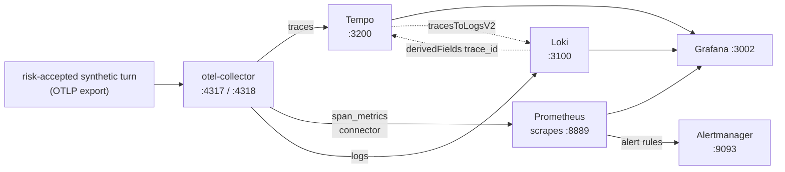

{}

- **You will:** Watch traffic appear as metrics and sanitized logs, follow one trace id across all three stores, measure the platform under k6 load, and add your own panel to the shipped dashboard.
- **You need:** [7.1. Tracing]() finished and the host Compose stack running; the k6 half also needs the documented host services.
- **Time:** about 50 minutes, hands-on. {}

## An empty graph is not zero traffic

Open `http://localhost:3002/d/agentops-overview` and look at **Agent request rate**. It is flat. Two explanations fit that picture equally well: nobody is using the agent, or the telemetry path is broken and everybody is. A dashboard cannot tell you which, and that ambiguity is how outages get missed for an hour.

So do not read the graph first. Ask Prometheus what series exist at all:

```bash
curl -fsS 'http://localhost:9090/api/v1/query?query=agentops_calls_total' \
  | jq -c '.data.result[] | [.metric.span_name, .metric.status_code, .value[1]]'
```

```text
["observability-check","STATUS_CODE_UNSET","1"]
["invoke_agent agentops_agent","STATUS_CODE_UNSET","3"]
["generate_content qwen3:4b-instruct","STATUS_CODE_ERROR","2"]
["execute_tool get_service_status","STATUS_CODE_UNSET","1"]
["generate_content qwen3:4b-instruct","STATUS_CODE_UNSET","2"]
```

Three turns, four model calls of which two failed, one tool call, and the synthetic span `mise run observability:up` pushed through to prove the path works. Nothing in the agent emits any of that. The collector's `span_metrics` connector manufactures it from the spans you enabled on the previous page — which is also why those three agent panels stay empty until you accept the ADK trace risk again:

```bash
export ADK_CAPTURE_MESSAGE_CONTENT_IN_SPANS=true
export OTEL_TRACES_SAMPLER=always_on
```

Fictional course data only. The remaining hands-on pages in this chapter read spans too, so leave it accepted until [7.7. Incident Response]() closes it in its teardown. The gateway panels and the agent's own native counters keep working either way.

The shipped `AgentOps overview` dashboard has six metric panels and one logs panel, and each expression is worth reading once, because you are about to write a seventh:

```promql
sum(rate(agentops_calls_total[5m]))
histogram_quantile(0.95, sum by (le) (rate(agentops_duration_seconds_bucket[5m])))
sum(rate(agentops_calls_total{status_code="STATUS_CODE_ERROR"}[5m]))
  / clamp_min(sum(rate(agentops_calls_total[5m])), 1)
sum(rate(agentgateway_requests_total[5m]))
histogram_quantile(0.95, sum by (le) (rate(agentgateway_request_duration_seconds_bucket[5m])))
sum(rate(agentgateway_guardrail_checks_total{action="Reject"}[5m]))
```

Rate, p95 latency, error ratio, then the gateway's own rate, latency, and guardrail rejections. The `Agent logs` panel below them queries Loki for `agentops-agent` lines, filtered by an optional `trace id` textbox.

### The connector, and why its labels are so boring {#why-avoid-session-or-prompt-labels}

Its configuration is short, and the interesting part is what it refuses to carry — here with the histogram-bucket block trimmed away:

```yaml
connectors:
  span_metrics:
    namespace: agentops
    dimensions:
      - name: gen_ai.operation.name
      - name: gen_ai.request.model
```

Two custom dimensions, plus `status_code`, `span_name`, and `span_kind` which the connector supplies itself. Here is one complete series as Prometheus stores it:

```json
{
  "__name__": "agentops_calls_total",
  "exported_job": "agentops-agent",
  "gen_ai_operation_name": "generate_content",
  "gen_ai_request_model": "qwen3:4b-instruct",
  "instance": "otel-collector:8889",
  "job": "otel-collector",
  "otel_scope_name": "spanmetricsconnector",
  "service_name": "agentops-agent",
  "span_kind": "SPAN_KIND_INTERNAL",
  "span_name": "generate_content qwen3:4b-instruct",
  "status_code": "STATUS_CODE_ERROR"
}
```

Every one of those values comes from a small, known set. That is deliberate, and it is the single rule that keeps a metrics store alive: **never label a metric with a user id, a session id, an incident id, a prompt, or a trace id.** Each distinct combination of label values is one more time series to index and hold in memory — that count is called **cardinality** — so a session-id label turns one series into one per conversation forever, and a prompt label writes user text into a store that has no redaction and no erasure story. Correlation identifiers belong in traces and logs, which are addressed by id rather than aggregated by it.

Because `status_code` is the connector's own dimension, the error-ratio panel and every alert that reads it work without depending on an ADK-specific error attribute or instrumentation-scope name — an important detail the first time you swap frameworks.

The scraper and UI differ by deployment profile; use the canonical host/local/GKE matrix in [7. Observability]() before picking a dashboard or an external scraper. This page follows the host Compose path.

## Sanitized logs, and the id that joins them to a trace

Metrics say _something is failing_. Logs say _what the failure was_. Here is the record the agent writes when a model call fails, exactly as it reaches the console:

```text
time=2026-08-10T22:11:41.337+02:00 level=ERROR msg="Model request failed" error_type=*fmt.wrapError trace_id=7488083813448af2ab00db9c0649e1ee span_id=711feda7b2b8c2fa
```

Read what is _not_ there. No provider response body, no endpoint URL, no stack: the handler in `agents/go/policy/guardrails.go` logs the error's Go type and nothing else, because a provider error can carry a credential, a URL, or a customer's request back to you. What _is_ there is a `trace_id` and a `span_id`, stamped because the record was written inside a recorded span — and that id is the thread through all three stores.

The same record, redacted independently a second time, goes to Loki when an OTLP endpoint is configured. After ADK builds its providers, the application installs exactly one OTel logging handler on the `agent` logger when `OTEL_EXPORTER_OTLP_ENDPOINT` or `OTEL_EXPORTER_OTLP_LOGS_ENDPOINT` is set; a trace-only endpoint, no endpoint, or `OTEL_SDK_DISABLED=true` installs none. Before export it redacts concrete PII and obvious credential and token patterns, caps every string and body at 2048 characters, and removes exception messages, tracebacks, and stack bodies while retaining `exception.type`. Console and OTLP handlers sanitize their own independent copies of each record — defense in depth, not permission to log secrets.

Ask Loki what it received:

```bash
curl -fsS -G 'http://localhost:3100/loki/api/v1/query_range' \
  --data-urlencode 'query={service_name="agentops-agent"}' \
  | jq -r '.data.result[].values[][1]'
```

```text
serving A2A
```

One line, from an agent that has done little but start up. Its stream labels carry `service_name`, `service_version`, and — because the resource is built once for every signal — `agentops_source_identity` and `agentops_build_mode`, so a log line names the build that wrote it without you correlating anything. Loki runs pinned in single-binary mode with filesystem storage and 7-day retention, matching Prometheus: a Compose service on the host and a PVC-backed Deployment in Kubernetes, where only the `loki:3100` ClusterIP is exposed.

Grafana turns the shared `trace_id` into two provisioned links, and both encode a failure the naive version has:

- The **Tempo** datasource carries `tracesToLogsV2` pointing at Loki, with the window widened five minutes either side of the span. A zero-width window finds nothing, because a log record is written _before_ the span that contains it is exported.
- The **Loki** datasource carries a `derivedFields` entry matching the `trace_id` field rather than a pattern in the log text, so the link survives any change to the agent's log formatting.

Neither link resolves unless the identifiers are actually on the record, and that part the application still owns. A line written outside any span, or through a path that loses the context, arrives in Loki with no ids on it — and then both links go dead while every individual store keeps looking perfectly healthy. That is why the correlation walk is worth doing once by hand: send a request, open its trace on the **Tempo** datasource, follow a span's logs link into Loki, and follow that line's `TraceID` link back. Landing where you started is the proof the wiring works. The equivalent query, if you would rather type it:

```logql
{service_name="agentops-agent"} | trace_id="<trace id from the Tempo view>"
```

In Kubernetes, forward the ClusterIPs first with `kubectl -n agentops port-forward svc/loki 3100:3100` and `kubectl -n agentops port-forward svc/tempo 3200:3200`. That overlay ships no Grafana, so it ships neither link: query the forwarded APIs directly, or point an externally operated Grafana at both and re-create the two datasource entries there.



**Diagram in words:** One risk-accepted synthetic turn supplies spans to Tempo, sanitized logs to Loki, and connector-derived metrics to Prometheus. Grafana reads all three, and the dotted links connect the trace and its logs by trace id.

**You can now tell an empty panel from a dead pipeline in one query, and you have read an error record that leaks neither an endpoint nor a credential while still carrying the id that finds its trace. That is the pair a dashboard alone will never give you.**

## Where the time actually goes under load

Knowing the agent is healthy is not knowing how much it can take. **k6** drives scripted HTTP traffic and fails the run when a stated latency budget is breached; it counts concurrency in **VUs**, one simulated client each. Three scripts live under `load/`, each isolating one layer of the host quickstart. `load/health.js` hits raw `/healthz` on MCP `:8000` and A2A `:8080` plus a low-rate hop through agentgateway `:3001`. `load/mcp-read.js` runs an MCP `tools/call` loop through the gateway `:3000`, exercising the Go MCP server and SQLite with no model call. `load/a2a-send.js` sends a bounded A2A conversation through `:3001` — a full turn, model included, capped at 1 VU and 3 iterations.

The scripts drive fixed ports, so start the servers those ports belong to. Two of the three tasks live in the agent module and the third at the root, which is the one detail that catches people out:

```bash
cd agents/go && mise run mcp:http   # MCP on :8000
cd agents/go && mise run a2a        # A2A on :8080
mise run gateway:host               # agentgateway on :3000/:3001/:4000, from the repository root
```

Each blocks, so give each its own terminal, with Ollama serving `qwen3:4b-instruct` in a fourth. Do not reach for `mise run smoke:host` here: it allocates its own ephemeral ports and starts a private copy of the whole stack, so it exercises the code path and says nothing about the fixed-port servers these scripts target. Then, from the repository root:

```bash
mise x k6@2.1.0 -- k6 run load/health.js
mise x k6@2.1.0 -- k6 run load/mcp-read.js
mise x k6@2.1.0 -- k6 run load/a2a-send.js # spends real model time — keep 1 VU
```

`mise run load:health`, `mise run load:mcp`, and `mise run load:a2a` wrap exactly those three commands; the long form is spelled out once so you can see what a task runs. k6 is AGPL-3.0, and is deliberately absent from `[tools]` so nothing permanent gets installed.

Here is what `load:health` printed on a laptop: thirty seconds against the three servers you just started, threshold block complete, results block cut to the check total and the three latency lines.

```text
  █ THRESHOLDS

    http_req_duration{op:gateway_health}
    ✓ 'p(95)<100' p(95)=10.4ms

    http_req_duration{op:raw_health}
    ✓ 'p(95)<50' p(95)=7.13ms

    http_req_failed
    ✓ 'rate<0.01' rate=0.00%

  █ TOTAL RESULTS

    checks_succeeded...: 100.00% 617 out of 617

    HTTP
    http_req_duration..............: avg=3.78ms min=1.21ms med=3.5ms  max=11.2ms  p(90)=6.29ms  p(95)=7.24ms
      { op:gateway_health }........: avg=7.56ms min=4.52ms med=6.7ms  max=11.2ms  p(90)=9.99ms  p(95)=10.4ms
      { op:raw_health }............: avg=3.68ms min=1.21ms med=3.43ms max=10.18ms p(90)=6.07ms  p(95)=7.13ms
```

Three ticks, and one number that already pays for the run: the gateway hop's p95 is 10.4 ms against a raw p95 of 7.13 ms, so agentgateway costs about three milliseconds per request here. Subtract one layer from the next and the difference is attributed. That technique keeps working all the way up to the model.

A **latency budget** is a pass/fail number agreed _before_ the test — this path answers within X ms at percentile Y. Deciding afterwards that a dashboard looked fine is not a budget. k6 encodes budgets as `thresholds`, so a breach fails the run with a non-zero exit code, exactly like a failing unit test:

```javascript
thresholds: {
  // Latency budget — a starting point for localhost, tune to your hardware.
  http_req_failed: ['rate<0.01'],
  'http_req_duration{op:tools_call}': ['p(95)<250'],
  mcp_rate_limited: ['count==0'], // any 429 means the gateway budget, not the platform, was measured
},
```

The shipped starting points are p95 under 50 ms for raw health, 100 ms for the gateway hop, 250 ms for the MCP read, and 15 s for a full A2A turn. That last number is not a coincidence: it matches the `AgentTurnLatencyP95High` alert threshold in [7.2b. Alerting](), so the load test and the alert rules cannot disagree about what "too slow" means. Read the `p(95)` line from the end-of-run summary rather than the average — averages hide the tail, and the tail is what a user waiting on an agent turn actually feels. On slower hardware, tune a breached budget deliberately instead of deleting it.

Two shipped behaviors will bite you if you skip them. The gateway policies cap throughput on purpose — 120 MCP, 60 A2A, and 30 model requests per minute per instance — and `mcp-read.js` counts every HTTP 429 in an `mcp_rate_limited` metric whose threshold is zero, so a breach means you measured your own rate limiter. And the A2A checks validate protocol state, not just transport: a `Task` must reach `completed`, carry text in its status message or artifacts, and have no `metadata.adk_error_code`, so a failed task wrapped in a successful JSON-RPC response fails the sample instead of producing a false latency result.

{}

A load test aimed at a shared or third-party endpoint is a denial-of-service attempt, not a lab. {}

{}

You already did the first subtraction. The rest of the ladder works identically: raw `/healthz` is the floor — process, loopback, HTTP parsing — the MCP `tools/call` p95 minus that floor is Go protocol handling plus the SQLite read, in the tens of milliseconds, and the A2A `message/send` p95 is all of it plus the model, which is seconds.

To measure inference instead of assuming it, hold the request constant and replace only the model. Stop Ollama so `:11434` is free, run `mise run model:fake`, keep `AGENT_A2A_STREAMING=false`, restart A2A with `AGENT_MODEL_PROVIDER=openai-compatible` and `OPENAI_BASE_URL=http://127.0.0.1:4000/v1`, and run the same script again:

```bash
mise x k6@2.1.0 -- k6 run load/a2a-send.js
```

Both host and k3d gateway profiles already target the host's `:11434`, so no route or script changes between samples. Subtract the fake-model p95 from the Ollama p95 and you have measured inference. On a local Qwen3-4B that gap is orders of magnitude larger than the gateway and MCP layers, so pushing many VUs through the real model mostly saturates inference. Load-test the fake-backed platform path with rate; sample the real model path at 1 VU; restore Ollama before any evaluation exercise. {}

With `mise run observability:up` running during a load run, the dashboard splits the blame for you: the gateway panels (`agentgateway_request_duration_seconds`) show the hop the gateway sees, and the agent panels (`agentops_duration_seconds`) show time inside the process. A flat-fast gateway with a slow agent puts the problem behind the proxy — then open the slowest turn in Tempo and read which span dominates, exactly as on the previous page.

## Your turn: write one PromQL panel

Six panels answer six questions. The seventh is yours: the shipped dashboard graphs no tokens at all, even though `agentops_tokens_token_total` is being scraped the whole time.

Predict before you build it: the counter carries a `direction` label with values `input` and `output`. If you graph `rate(agentops_tokens_token_total[5m])` without aggregating, how many lines appear — and what happens to them when you restart the agent?

- **Mode**: `temporary experiment`.
- **Goal**: add one working token-throughput panel to the shipped dashboard, driven by a query you wrote and verified against the API first.
- **Files to touch**: only `infra/observability/grafana/dashboards/agentops.json`. No rule file, no collector config.
- **Preflight**: from the repository root, require a clean start with `git diff --quiet -- infra/observability/grafana/dashboards/agentops.json`, and confirm the series exists with `curl -fsS 'http://localhost:9090/api/v1/query?query=agentops_tokens_token_total' | jq '.data.result | length'` returning a non-zero count. If it returns `0`, send one agent turn first.
- **Steps**: build the expression in Grafana's Explore view against the Prometheus datasource until it plots — `sum by (direction) (rate(agentops_tokens_token_total[5m]))` is one defensible answer. Then copy the existing `Agent request rate` panel object in the dashboard JSON, give it a new `id` and title, paste your expression into its target, and restart Grafana with `docker compose -f infra/observability/compose.yaml restart grafana`.
- **Gate that proves completion**: your panel appears on `http://localhost:3002/d/agentops-overview` and plots a line for each direction after you send a turn, and its label set contains no session id, user id, or prompt.
- **Final state**: run `git restore -- infra/observability/grafana/dashboards/agentops.json` and restart Grafana once more, or keep the panel deliberately and say in one sentence which question it answers that the other six do not.

That last clause is the real exercise. A panel nobody can name a question for is a panel that will be ignored during the incident it was built for.

## What you can do now

- You can tell an empty panel from a dead pipeline by asking Prometheus which series exist instead of reading the graph.
- You can explain why every dimension on `agentops_calls_total` is bounded, and what a session-id label would cost you.
- You can name both provisioned links that make the Tempo → Loki → Tempo walk work, and you have seen the failure case on this page: a Loki line with no ids on it, while all three stores still look perfectly healthy.
- You ran at least one k6 script, read its `p(95)` line, and know whether the shipped budget holds on your hardware.

Nothing about the dashboard changed while you read this page. What changed is that you no longer trust a flat line, you know which query settles the question, and you have a seventh panel on it that answers a question you chose.

Continue to [7.2b. Alerting](), where these same series decide whether anyone gets woken up.
