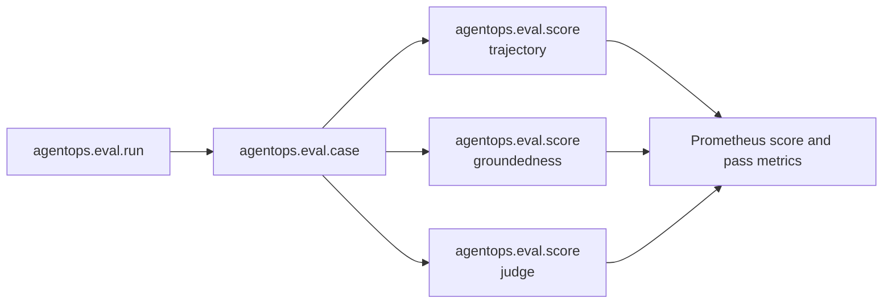

{}

- **You will:** Trace a verdict to one evaluation case, understand the sanitized assessment boundary, and promote a recurring review finding into a regression case.
- **You need:** [4.4. Evaluations]() finished; the observability stack only for optional runtime visibility.
- **Time:** about 22 minutes, hands-on. {}

## What feedback does the course actually record?

The Go evaluation harness records deterministic scores and optional calibrated model verdicts as evaluation evidence. Validate the evidence contract offline:

```bash
cd evals
mise run eval:validate
mise run test
```

Each score belongs to one run, case, and sample. The run identity includes the source tuple, platform, model, evalset digest, and transport, so a reviewer can tell exactly what produced the verdict.

The course does not ship a public thumbs-up endpoint, reviewer database, or automatic online scorer. Do not imply that user feedback is being collected.

## Why must a verdict reference a run and case?

“The agent was unsafe” is not actionable without the candidate, input set, sample, and scorer that produced the claim.

The minimum useful key is:

```text
run id + source identity + tree digest + platform + evalset digest + transport + case id + sample + score name
```

That key separates two stochastic samples, two transports, and two revisions without storing the prompt or answer in a metric label.

## How are assessments represented in OpenTelemetry?

The harness emits a hierarchy:



**Diagram in words:** One evaluation run contains case spans; each case contains named score spans. The same outcomes become bounded Prometheus metrics for comparison in Grafana.

Tempo preserves the run/case/score relationship. Prometheus supports aggregate comparison. Grafana presents both without introducing a second experiment store.

## What is safe to attach to a verdict?

Stable evidence attributes carry identifiers and outcomes only:

- Run id, source revision and dirty flag, model name, evalset id, and transport.
- Case id and repeat sample number.
- Score name, numeric value, and pass state.
- Token and model-call counts.

They exclude prompts, answers, references, tool arguments, tool results, judge rationales, endpoint URLs, credentials, provider errors, and reviewer notes.

This minimization keeps metric cardinality bounded and makes the release artifact suitable for automated qualification.

## Where does the calibrated judge fit?

The judge is another scorer, not a human and not an authority. Its verdict becomes an `agentops.eval.score` span like any other score, and the deterministic scores stay above it.

Calibration writes a sanitized artifact containing the source identity, typed judge provider, name, and digest, the calibration digest, matches, total, agreement, and per-case match fields. It reports agreement and exits zero; deciding what agreement your risk requires is a human judgement, not a field in the file.

Rationales help diagnose a local run but never cross the release-evidence serialization boundary.

## How does a human review become durable evidence?

A reviewer should not paste sensitive production content into telemetry. Reduce the finding into a sanitized, representative eval case using immutable course-domain vocabulary.

Then run:

```bash
cd evals
mise run eval:validate
mise run test
```

After offline validation, a model-backed run produces a new case score tied to the candidate source identity. The durable artifact is the versioned case plus the source-scoped result, not an unstructured note detached from the behavior.

If the finding cannot be sanitized without losing its meaning, keep it in the authorized incident system and do not copy it into this public course repository.

## Can you append a human note to an ended trace?

Not with the shipped harness. OpenTelemetry spans are emitted evidence, not a reviewer database, and the repository has no command that appends a human assessment to an existing Tempo trace.

A future feedback service would need its own authenticated write API, sanitized schema, span-link strategy, retention, access control, deduplication, and audit owner. None of those controls is implemented here.

The honest current workflow is case promotion and a new evaluation run.

## How long does evidence live?

Local JSON artifacts remain until the operator deletes them. Evaluation traces and metrics follow the configured Tempo and Prometheus retention. Hosted workflow artifacts are transient handoffs under the organization retention limit.

Durable release evidence belongs on the immutable release and in OCI attestations after owner-gated publication. A local file or dashboard view is not release publication proof.

Do not copy raw traces into long-lived attachments merely to extend retention; that defeats the content-minimization boundary.

## Does the A2A application collect feedback automatically?

No. A2A serves messages, tasks, streaming updates, cancellation, and task history. It has no feedback route and stores no thumbs-up, thumbs-down, or free-text review.

Runtime telemetry also keeps message content capture disabled by default. A later reviewer cannot reconstruct answer correctness from metadata-only traces.

Chapter [7.5. Online Evaluation]() treats automated runtime scoring as a design exercise and leaves it switched off.

## How should recurring feedback change the course?

Use this loop:

1. Confirm the finding against authorized evidence.
1. Remove customer, credential, and incident-specific details.
1. Add the smallest representative case to the correct evalset.
1. Validate the case and scorer offline.
1. Reproduce the failure on the current candidate.
1. Fix the underlying instruction, tool, policy, or model boundary.
1. Rerun the same case and the full set.

One anecdote may justify investigation. Repeated or high-severity findings justify a regression case; neither justifies silently changing a threshold.

## What proves this page worked?

Inspect the sanitized contract and validate it:

```bash
cd evals
mise run eval:validate
go test ./... -run 'Evidence|Artifact|Calibration' -count=1
```

**You are done when:**

- The evidence and artifact tests pass without a model or collector.
- You can trace a score to one run, case, sample, source tuple, platform, and evalset digest.
- You can name content that must never enter evidence attributes or release artifacts.
- You can explain why the current human-review workflow creates a sanitized case and new run instead of mutating an ended trace.
- You do not claim that the A2A application, Tempo, or Grafana collects human feedback automatically.

Continue to [7.6. Governance]() when a review finding can become a minimal, sanitized, repeatable regression case.
