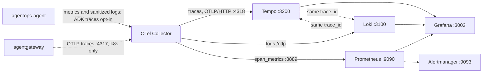

{}

- **You will:** Bring up the telemetry stack the rest of the chapter reads from, and learn which page owns which signal.
- **You need:** Chapter 5 finished and Docker running. Only [7.6. Governance]() also needs the Chapter 6 cluster.
- **Time:** about 20 minutes the first time, because six container images have to download; about 6 once they are cached. Kind: orientation. {}

## The agent answered. Now what?

Ana's agent produced a paragraph about INC-002 and a restart recommendation. It looked right. Six hours later someone asks the three questions nobody can answer from a paragraph: how long did that turn take and where did the time go, what did it cost, and who approved the restart that followed.

Every chapter so far made the agent do more. This one makes the agent _answerable_ — for one turn, for a fleet of turns, and for the night it breaks. The nine pages below each own one signal, and they all read from a single Docker Compose stack you are about to start.

## Start the stack before you read further

Two commands, from the repository root. The first only probes; the second brings up Tempo, Loki, the OpenTelemetry Collector, Prometheus, Alertmanager, and Grafana, then refuses to return until each one answers:

```bash
mise run doctor:gateway    # Docker, Compose, and the other container prerequisites
mise run observability:up  # the six services, brought up and readiness-checked
```

Here is the tail of a successful run, in full, from the first cached start on this machine:

```text
Tempo ready: http://127.0.0.1:3200/ready
Loki ready: http://127.0.0.1:3100/ready
Prometheus ready: http://127.0.0.1:9090/-/ready
Alertmanager ready: http://127.0.0.1:9093/-/ready
Grafana ready: http://127.0.0.1:3002/api/health
OpenTelemetry Collector ready: OTLP/HTTP accepted an empty valid batch
trace path verified: agent -> collector -> Tempo (19dd7b0b800344905610d6ca043dc69e)
agentops-observability-alertmanager-1 hardened: non-root, read-only, no-new-privileges, bounded
agentops-observability-grafana-1 hardened: non-root, read-only, no-new-privileges, bounded
agentops-observability-loki-1 hardened: non-root, read-only, no-new-privileges, bounded
agentops-observability-otel-collector-1 hardened: non-root, read-only, no-new-privileges, bounded
agentops-observability-prometheus-1 hardened: non-root, read-only, no-new-privileges, bounded
agentops-observability-tempo-1 hardened: non-root, read-only, no-new-privileges, bounded
observability exposure remains loopback-only
```

Six readiness probes, then the three claims that make this more than "the containers started." The `trace path verified` line pushed a synthetic span through the real agent path and read it back out of Tempo by that exact id, so a collector that accepts telemetry and quietly drops it fails startup instead of failing you at 02:00. The six `hardened` lines — one per container, alphabetical — assert non-root, read-only root filesystem, dropped capabilities, and bounded memory and process counts. The last line proves every published port is bound to loopback, which is why you can leave this running on a laptop in a café.

Open Grafana at `http://localhost:3002` and leave that tab open for the rest of the chapter. It asks for no login, and Prometheus, Loki, and Tempo are already provisioned as datasources.

**You just stood up a complete open-source telemetry plane — traces, metrics, logs, dashboards, and alert routing — on your own machine, with no SaaS account and no vendor agent.**

One default surprises people: ADK traces stay off until [7.1. Tracing]() has you accept their content risk on purpose. An empty trace view before that page is the shipped privacy state, not a broken exporter.

## Which signal answers which question

Traces, metrics, logs, assessments, and audit rows each answer a different operational question. Open the page that owns the one you actually need:

| When you ask...                            | Signal to read                            | Where it lives                      | Page                                                                                                     |
| ------------------------------------------ | ----------------------------------------- | ----------------------------------- | -------------------------------------------------------------------------------------------------------- |
| Can I rebuild this exact release?          | code/image/model/instruction/data lineage | Git, registry, sanitized artifacts  | [7.0. Reproducibility]() _(hands-on)_          |
| What happened inside one turn?             | risk-accepted ADK or gateway trace        | Tempo `:3200`, read in Grafana      | [7.1. Tracing]() _(hands-on)_                          |
| Is the service healthy right now?          | RED metrics, sanitized logs, dashboards   | Prometheus `:9090`, Grafana `:3002` | [7.2. Monitoring]() _(hands-on)_                    |
| When should this wake someone up?          | SLO burn, shipped alert rules             | Prometheus rules, Alertmanager      | [7.2b. Alerting]() _(hands-on)_                      |
| What did the work cost?                    | token counters plus stated assumptions    | Prometheus, trace attributes        | [7.3. Costs]() _(hands-on)_                              |
| Was this answer any good?                  | sanitized deterministic or judge verdict  | JSON artifact and optional OTLP     | [7.4. Feedback]() _(hands-on)_                        |
| Are answers drifting at scale?             | sampled trace scoring (design only)       | a Tempo sample                      | [7.5. Online Evaluation]() _(concept)_       |
| Who approved this write, and what changed? | append-only audit row                     | SQLite audit table                  | [7.6. Governance]() _(hands-on, needs the cluster)_ |
| The agent itself broke — now what?         | detect → triage → mitigate → review       | every signal above, joined          | [7.7. Incident Response]() _(hands-on)_      |

Each page is also explicit about where the shipped stack stops: no fake dollar panel, no automatic live judge, no external paging, no cryptographically immutable audit store.

## Where each signal physically lives

One collector receives everything the agent and gateway emit, then fans that single stream out to three stores. Prometheus scrapes the collector and feeds both the dashboard and the alerts:



**Diagram in words:** The agent pushes metrics and sanitized logs to the collector on `:4318`; ADK spans use that path only after explicit risk acceptance. Kubernetes gateway traces enter on `:4317`. The collector routes available spans to Tempo, logs to Loki, and metrics to Prometheus. Grafana reads all three, and Prometheus feeds Alertmanager.

Three names in that diagram carry weight later. **OTLP** is the OpenTelemetry wire protocol that carries traces, metrics, and logs off the agent ([0.8. Glossary]()). **`span_metrics`** is the collector connector that turns spans into request-count and duration metrics without the application emitting a single metric itself. **`trace_id`** is the identifier a log record carries when it was written inside a recorded span, and it is what lets Grafana jump from a span to its log lines.

Every later page assumes you know which port belongs to which piece:

| Component                  | Port                       | What it is for                                                                                  |
| -------------------------- | -------------------------- | ----------------------------------------------------------------------------------------------- |
| OpenTelemetry Collector    | `:4317` gRPC, `:4318` HTTP | receives gateway traces, agent metrics/logs, and explicitly risk-accepted ADK traces            |
| Tempo                      | `:4318` in, `:3200` query  | stores the traces and answers the queries Grafana reads one turn through                        |
| Loki                       | `:3100/otlp`               | stores the logs                                                                                 |
| Collector metrics endpoint | `:8889`                    | exposes `span_metrics` and native metrics for Prometheus                                        |
| Prometheus                 | `:9090`                    | stores those metrics and evaluates the alert rules                                              |
| Alertmanager               | `:9093`                    | receives the alerts Prometheus fires                                                            |
| Grafana                    | `:3002`                    | dashboards and Explore over Prometheus, Loki, and Tempo, host profile only                      |
| agentgateway metrics       | `:15020`                   | the gateway's own metrics, scraped by Prometheus on the host and by the collector in Kubernetes |

Which scraper pulls those metrics, and whether you get a Grafana at all, depends on the deployment profile you are running.

{}

This table is the canonical deployment-profile split; sibling pages link back instead of restating it. Both collector profiles expose span-derived metrics at `:8889`. The Kubernetes collector also scrapes agentgateway `:15020`, so its `:8889` endpoint includes gateway metrics.

| Profile           | Config                             | Scraper + alert rules                                                        | Grafana      | How you reach it                                |
| ----------------- | ---------------------------------- | ---------------------------------------------------------------------------- | ------------ | ----------------------------------------------- |
| Host Compose      | `infra/observability/compose.yaml` | Prometheus scrapes collector `:8889`, Tempo `:3200`, gateway `:15020`        | yes, `:3002` | `localhost` ports                               |
| Local k8s overlay | `infra/k8s/overlays/local`         | own Prometheus + Alertmanager, same rules, scrape only `otel-collector:8889` | no           | `kubectl port-forward`                          |
| GKE overlay       | `infra/k8s/overlays/gke`           | none shipped; `:8889` stays a ClusterIP                                      | no           | point your own scraper at `otel-collector:8889` |

{}

## What this chapter proved

Only the first three lines are true the moment you finish this page. The fourth is what the other nine pages are for, and you should be able to say it out loud by the end of [7.7. Incident Response]().

- `mise run observability:up` finished green, which means a real span crossed the agent path into Tempo and came back out by id.
- Grafana at `http://localhost:3002` opens without a login and lists Prometheus, Loki, and Tempo as datasources.
- For a trace, a metric, a log line, an assessment, and an audit row, you can name the page that owns it — and for the three that live behind a port, the port as well. The other two are files.
- Given a symptom, you can walk metric → trace → log → audit row without stopping to ask which tool holds which half of the answer.

You began this chapter able to build an agent and unable to say anything about one that is already running. You can now stand up its whole telemetry plane in two commands, and name the store that answers each operational question: Tempo for one turn, Prometheus for the fleet, Loki for the sentence that explains a failure, and a SQLite table for who approved what.

Continue to [7.0. Reproducibility]() when the stack is up and Grafana is open in a tab you are not going to close.
