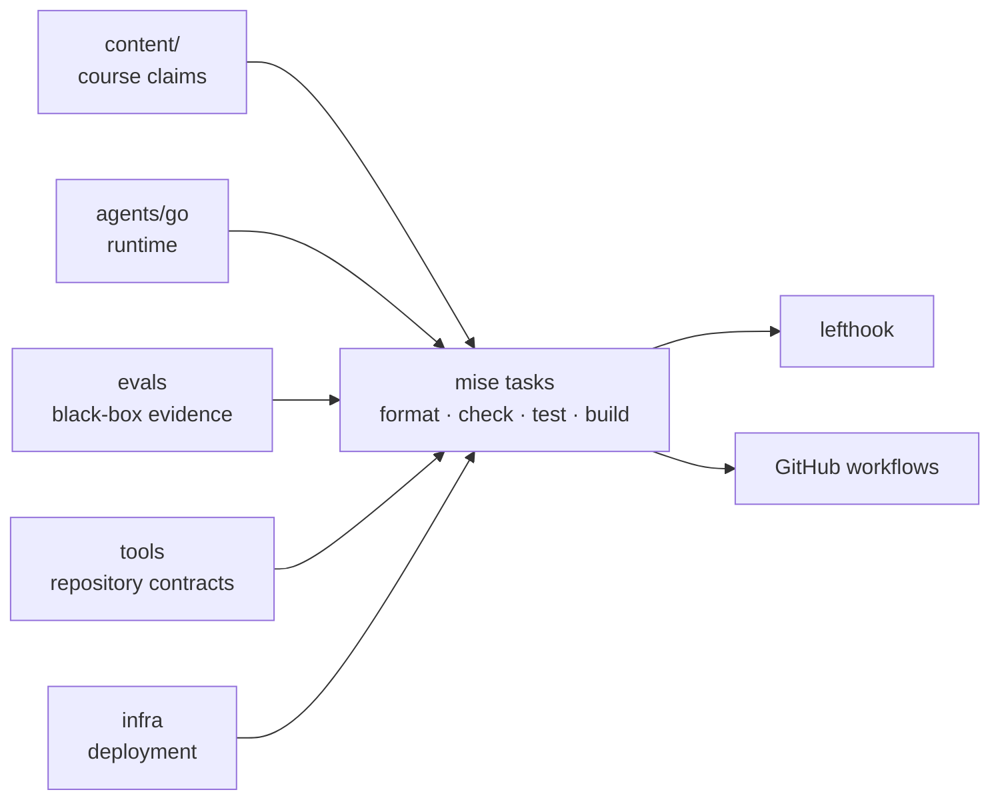
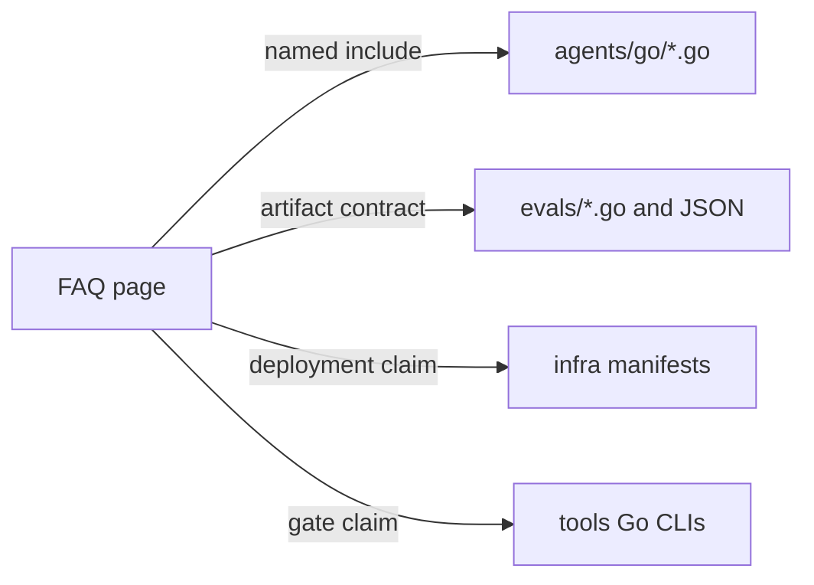

{}

- **You will:** Map a course claim to its exact Go, evaluation, tooling, or infrastructure owner.
- **You need:** A clone of the repository; nothing running.
- **Time:** about 12 minutes, reference. {}

## What is inside the repository?

One repository contains the course and every executable boundary it teaches.

```text
agentops-open-course-go/
├── content/       # 76 FAQ pages built by Hugo
├── agents/
│   ├── go/        # ADK Go reference agent and offline tests
│   └── data/      # immutable SQLite, log, runbook, and runtime-skill seed
├── evals/         # standalone black-box Go evaluation module
├── tools/         # repository conventions, freshness, release, and accessibility CLIs
├── clients/web/   # dependency-free A2A browser client
├── load/          # k6 protocol and latency checks
├── skills/        # portable Agent Skills for other projects
└── infra/         # gateway, Kubernetes, kagent, telemetry, and optional GCP plan
```

The root Hugo module exists only for the Hextra theme. The agent, evaluation harness, and repository tooling are separate Go modules with separate locks and import boundaries.

`skills/` contains portable instructions for developers. `agents/data/skills/` contains reviewed runtime instructions the agent can load. They have different consumers and trust boundaries.

## Why keep the course, agent, evaluation, and infrastructure together?

One source revision can change prose, behavior, evidence, and deployment wiring atomically.

A teaching repository benefits from that coupling: a learner can follow one claim into the exact source, test, eval case, or manifest that owns it. The cost is a larger clone and coordinated gates, which is acceptable while these surfaces form one course release.

The shared vocabulary is `mise run install`, `format`, `check`, `test`, `scan`, and `build`. Module tasks stay local, while root aggregates provide one entrypoint for hooks and CI.



**Diagram in words:** Course content, the Go agent, standalone evaluation module, repository tools, and infrastructure feed the same mise task vocabulary. Lefthook and GitHub workflows call those tasks instead of redefining them.

## What lives under agents and evals?

`agents/go` is the shipped application. Its packages separate configuration, composition, domain types, data/state, policy, model adapters, protocols, telemetry, resilience, and the CLI.

| Concern                   | Source owner                                                        |
| ------------------------- | ------------------------------------------------------------------- |
| typed configuration       | `agents/go/config`                                                  |
| ADK compositions          | `agents/go/compose`                                                 |
| model boundary            | `agents/go/model`                                                   |
| reads and guarded writes  | `agents/go/tools`, `agents/go/data`, `agents/go/state`              |
| memory and retrieval      | `agents/go/memory`                                                  |
| app-wide policy           | `agents/go/policy`                                                  |
| ADK REST, A2A, and MCP    | `agents/go/cmd/agent`, `agents/go/a2aserver`, `agents/go/mcpserver` |
| traces, metrics, and logs | `agents/go/telemetry`                                               |

`evals` deliberately cannot import any of those packages. It observes ADK REST or A2A events, folds both transports into one typed `Turn`, scores captured evidence, writes sanitized verdict artifacts, and optionally exports `agentops.eval.*` signals. An import-graph test keeps that black-box boundary mechanical.

## Why keep immutable data outside the agent module?

Committed seed and mutable state have different lifecycles.

`agents/data` is the immutable domain input: schema, seed rows, runbooks, logs, and runtime skills. Host processes copy state into `agents/go/.state`; Kubernetes writers use the shared state claim while MCP mounts it read-only.

The evaluation harness reads domain vocabulary from `agents/data`, never from agent packages. That keeps expected values independent from the implementation being judged.

## What lives under infra?

Infrastructure is organized by executable owner rather than by chapter prose.

| Path                                      | Role                                                               |
| ----------------------------------------- | ------------------------------------------------------------------ |
| `infra/agentgateway/{host,k3d,gke}`       | loopback, local-cluster, and optional cloud data-plane profiles    |
| `infra/k8s/base` + `overlays/{local,gke}` | shared Kubernetes resources plus environment-specific patches      |
| `infra/kagent`                            | BYO Agent, governed remote MCP, and model configuration            |
| `infra/observability`                     | OTel Collector, Tempo, Loki, Prometheus, Alertmanager, and Grafana |
| `infra/gcp`                               | plan-first OpenTofu module for the owner-gated GKE lab             |
| `infra/scripts`                           | host gateway, relay, backup, and platform verification boundaries  |

The local and GKE overlays share an application contract. They differ only where the environment truly differs: registry, model backend, storage, cloud identity, and egress.

## How do you jump from a page to its source?

Source includes are resolved by Hugo from named regions such as `--8<-- [start:get-runbook]` and `--8<-- [end:get-runbook]`.

An include names a repository-root path and region. For example, the Memory page sets `path` to `agents/go/memory/knowledge.go`, `region` to `get-runbook`, and `lang` to `go`; the shortcode then stands alone and emits its own highlighted block.

The shortcode extracts the exact source at build time. A missing file, duplicate region, or missing end marker fails the strict docs build. Infrastructure and evaluation excerpts use the same mechanism through Hugo asset mounts.



**Diagram in words:** A FAQ page points to named Go regions, evaluation sources and artifacts, infrastructure manifests, or repository-tool commands. The build or gate fails when a referenced owner no longer exists.

## Should you read README.md or AGENTS.md?

Read both for different jobs.

- `README.md` is the human entrypoint: outcomes, architecture, setup, and the shortest runnable path.
- `AGENTS.md` is the coding-agent contract: invariants, owners, safety boundaries, pinned compatibility, and exact gates.

`SUPPORT.md` defines stable software surfaces and compatibility ceilings. `CONTRIBUTING.md` maps local changes to the same gates CI runs.

## Where are the community and security policies?

Root community files make reporting and authority explicit:

- `CONTRIBUTING.md` owns contribution setup and proof.
- `GOVERNANCE.md` owns project decisions and maintainership.
- `SECURITY.md` routes vulnerability reports privately.
- `ACCESSIBILITY.md` owns keyboard, contrast, diagram, and barrier-reporting expectations.
- `CODE_OF_CONDUCT.md` owns participation standards.
- `SUPPORT.md` owns compatibility and support boundaries.
- `CITATION.cff` owns citation metadata.

Issue and pull-request templates under `.github/` collect reproducible evidence without replacing these policies.

## What proves this page worked?

List the three Go modules and the source-backed documentation regions:

```bash
go env GOMOD
for module in agents/go evals tools; do (cd "${module}" && go env GOMOD); done
rg -- '--8<-- \[start:' agents/go agents/data infra evals tools
```

**You are done when:**

- You can name the owner of an agent behavior, eval verdict, repository gate, and deployment claim.
- You can explain why `evals` is separate from and cannot import `agents/go`.
- You opened one named region and found the exact excerpt a page renders.
- You know which root document to read for human setup, coding-agent rules, support, and contribution proof.

Return to [8. Community]() when you can locate a claim before searching by keyword.
