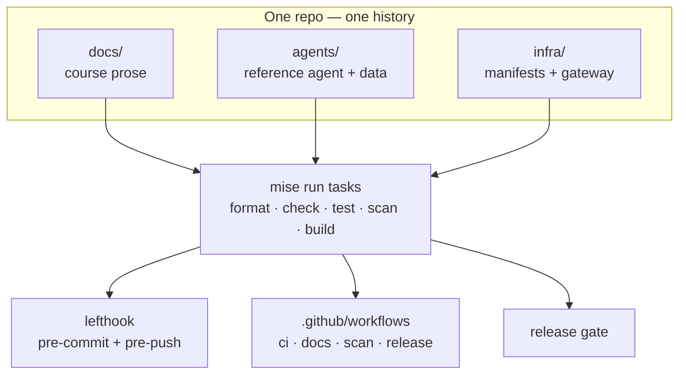
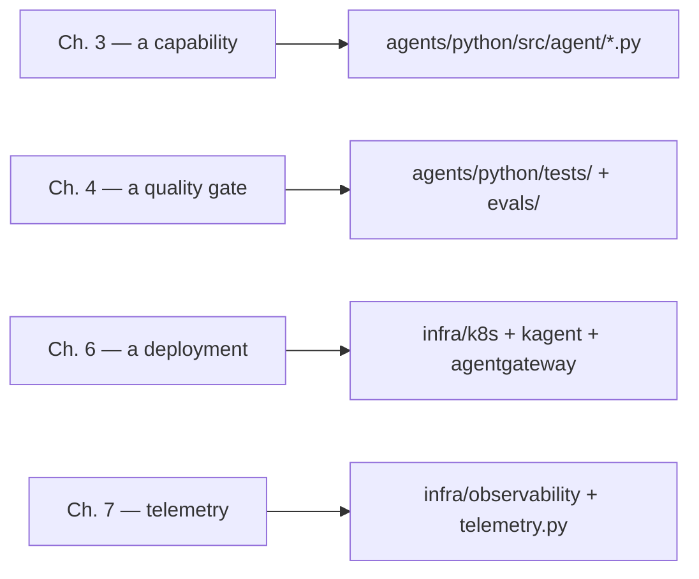

{}

- **You will:** Find your way around the repository: which directory holds the course, the agent, and the deployment, and which file to open when a page says "the source".
- **You need:** A clone of the repository — nothing running.
- **Time:** about 14 minutes, reference.
{}

## What is inside the repository?

Everything the course produces lives in one repository, [`MLOps-Courses/agentops-open-course`](https://github.com/MLOps-Courses/agentops-open-course). Six directories carry it:

```text
agentops-open-course/
├── docs/                # ← THE COURSE (this site): CC BY 4.0 prose + license text
├── agents/              # ← THE REFERENCE AGENT
│   ├── python/          # ADK Python project (uv, ruff, ty, pytest) — MIT
│   └── data/            # immutable seed: incidents.db, sql/, runbooks/, skills/, logs/ (MIT)
├── clients/             # minimal offline A2A web client — its own MIT LICENSE
│   └── web/             # dependency-free browser client for the AgentOps Agent
├── load/                # k6 load tests + documented latency budgets — its own MIT LICENSE
├── skills/              # installable Agent Skills: the course's patterns, without the course
└── infra/               # ← THE INFRASTRUCTURE: agentgateway, k8s, kagent, MLflow, OTel, OpenTofu (MIT)
```

`docs/`, `agents/`, and `infra/` are the three **payloads**: the self-contained bodies of work this repository ships. `clients/` and `load/` are the A2A clients and load tests that exercise them.

Those three usually live in three separate repositories. A course that teaches an agent's whole lifecycle keeps them in one place, so a reader can jump from a sentence to the exact file that backs it. Everything else at the root is the tooling that binds them; `ls` at the root is a faster inventory than any list a page could keep current.

`skills/` is the one directory that leaves with you. Each subdirectory is a tool-agnostic [Agent Skill](https://agents.md/) — resilience, guardrails, token budgets, telemetry, evaluation, least privilege, incident response, plus an index skill that routes between them — installable into your own projects with the `skills` CLI, each pointing back at the reference implementation here rather than restating the course. Do not confuse it with `agents/data/skills/`, which are runtime skills the agent itself loads ([3.2. Skills]()).

`docs/` mirrors the sibling [MLOps Coding Course](https://mlops-coding-course.fmind.dev/): one folder per phase, `N.M` section pages, and an `index.md` per folder, all written as FAQ Markdown. The generated static site (`site/`) is a build artifact, not committed.

The dual-license split — CC BY 4.0 prose, MIT code — is the subject of [8.1. License]().

## Why keep the course, the agent, and the infra together?

One clone gives you the prose, the code it documents, and the manifests that deploy it.

A **monorepo** — one repository holding several projects that ship together — is a trade-off, not a default. It buys one clone, one version history, and one set of tasks:

- When [Chapter 3]() teaches a tool, the exact tool lives in `agents/`.
- When [Chapter 6]() deploys the agent, the exact manifests live in `infra/`.
- A change that touches prose, code, and a manifest at once lands as one reviewable commit.

The cost is coupling and scale: every clone carries all three payloads, and at large team size a single history becomes a contention point. A teaching repository is exactly the case where the benefit dominates. The whole value is that the prose, the code, and the deployment stay provably in lockstep, so nothing in the course points at a snippet you cannot open and run.

What actually holds the three payloads together is a shared task vocabulary. Every payload is driven by the same `mise run` verbs: `format`, `check`, `test`, `scan`, `build`. `lefthook.yml`, the [`.github/workflows`](), and the [release gate]() all delegate to those same verbs instead of re-implementing them. That is why a green pre-commit hook and a green CI run mean the same thing: they call the identical task.



`lefthook.yml` makes the binding literal: `pre-commit` runs two formatters, ten path-scoped checks, and `mise run secure:staged`; `pre-push` runs `mise run check:core` before `mise run test`. Add a payload or gate in `mise.toml`, then route its scoped hook entry once.

## What lives under infra?

`infra/` is not a single deployment. It is a set of profiles the course adds one at a time, each owning one concern, so an overlay change never rewrites a base.

The subtree maps directly to the platform chapters:

| Path                                      | Role                                                                          | Chapter                                          |
| ----------------------------------------- | ----------------------------------------------------------------------------- | ------------------------------------------------ |
| `agentgateway/{host,k3d,gke}/`            | the three data-plane profiles (host loopback, in-cluster, GKE)                | [5. Gateway]()             |
| `k8s/base/` + `k8s/overlays/{local,gke}/` | one shared Kubernetes base, two Kustomize overlays                            | [6. Platform]()           |
| `kagent/`                                 | the BYO Agent, gateway `ModelConfig`, and governed `RemoteMCPServer`          | [6. Platform]()           |
| `mlflow/`                                 | the locked non-root self-hosted MLflow server image                           | [7. Observability]() |
| `observability/`                          | host Compose plus in-cluster OTel, Prometheus, and Grafana resources          | [7. Observability]() |
| `gcp/`                                    | a plan-first OpenTofu module for the optional GKE lab                         | [6. Platform]()           |
| `scripts/`                                | the host gateway wrapper, state backup/restore drills, and the loopback relay | 5–7                                              |

The `base` versus `overlays` split is the idea that matters most. The same image and manifests run on k3d and on the GKE lab, and only the overlay changes: model identity, resource sizing, and cloud wiring. So "local-to-cloud" is one contract, not two deployments.

Host and cluster observability deliberately reuse the same ports, which is why you must not run host Compose while the in-cluster stack is port-forwarded.

## Why split the agent into python and data?

The reference agent — the DevOps "AgentOps Agent" — is implemented as a Python project, split from the data it reads:

- `agents/python` is a **self-contained project**, with its own `mise.toml` and the standard task vocabulary (`install`, `format`, `check`, `test`).
- `agents/data` is **separate**: immutable SQLite/Markdown/log/skill seed input. The runtime copies SQLite into writable state; Kubernetes agent and MCP processes share one PVC so approved writes and later reads stay coherent. Rebuild the seed with `cd agents/data && mise run build`.

That is the **seed/state boundary** the whole course leans on: committed input, disposable runtime copy. The committed dataset is reproducible, runtime state is disposable, and no exercise can dirty the input.

Course pages show short executable excerpts; the complete Python and infrastructure sources remain canonical.

## Why is the agent package a flat set of single-purpose modules?

Inside `agents/python/src/agent/` there is almost no package hierarchy to navigate: each top-level module owns one concern.

Each module docstring names the chapter that teaches it. That is the repository's "flat over deep, one owner per concern" principle made concrete: to find where a behavior lives you read a filename, not a tree.

| Concern                               | Modules                                                                                 |
| ------------------------------------- | --------------------------------------------------------------------------------------- |
| Typed configuration                   | `config.py`, `config_check.py`                                                          |
| Domain types and data access          | `domain.py`, `models.py`, `data.py`, `state.py`, `report.py`                            |
| Read and knowledge tools              | `tools.py`, `memory.py`, `retrieval.py`, `skills.py`                                    |
| Guarded writes and safety             | `actions.py`, `governance.py`, `guardrails.py`, `pii.py`, `resilience.py`, `circuit.py` |
| Conversation and cross-session memory | `longterm.py`, `compaction.py`                                                          |
| Agent composition                     | `composition.py`, `model.py`, `workflow.py`, `delegation.py`                            |
| Protocol surfaces                     | `mcp_server.py`, `mcp_client.py`, `server.py`                                           |
| Operations                            | `budget.py`, `telemetry.py`                                                             |

{}

The lone exception is the tiny `structured_report/` subpackage: an ADK-discovery adapter that re-exports `triage_report_agent` and builds its governed `App`, so the report eval gets its own policy-protected entrypoint ([3.0. Packaging]()).
{}

The payoff is reviewability: a guardrail change touches `guardrails.py` and its test, never a shared `utils`; a new read tool is one function in `tools.py`, not an edit across layers.

The full module-to-chapter map is tabulated in the [3. Capabilities index](), and [8.7. Capstone]() reuses it as the change surface. So when you build your own domain you edit the same flat boundaries rather than inventing new ones.

## How do you jump from a course page to the code it describes?

The repository's core promise is that nothing points at a snippet you cannot open. Three mechanics hold it up:

- **Python excerpts are pulled from the real source at build time.** A standalone `pymdownx.snippets` line of the form `--8<-- "agents/python/src/agent/memory.py:get-runbook"` inlines the exact `get-runbook` region from `memory.py`. That is the line behind the excerpt in [3.4. Memory](). A block typed out by hand carries no such link and can drift, so in Chapters 2 and 3 `scripts/check_conventions.py docs` requires every `python` block to be an include or to open with a `# simplified` comment that says it is not the source.
- **Rename or delete a region and the site build fails.** An include names its region, so the page and the source cannot silently diverge; a declared hand-written block is only as current as its last read.
- **Manifests and commands are quoted, then linked.** When a page quotes a manifest or a command, it matches `infra/`, and it links to the source file so you can read the surrounding context.

The FAQ format contract, the snippet-mirroring, and the docs CI that enforce all of this are the subject of [8.4. Documentation]().

That gives a reliable path from any chapter to its owning tree:



So to answer "where does this actually happen?", read the chapter number:

- A capability lives in a flat `agent/` module, and its proof lives in `agents/python/tests/` and `evals/`.
- A deployment concern lives in an `infra/` manifest.
- Telemetry spans both `infra/observability/` and `telemetry.py`.

## README.md or AGENTS.md — which do I read?

Both exist on purpose, for two different audiences:

- **[`README.md`](https://github.com/MLOps-Courses/agentops-open-course/blob/main/README.md)** is for **humans**: the pitch, the feature list, the layout, and the install commands.
- **[`AGENTS.md`](https://github.com/MLOps-Courses/agentops-open-course/blob/main/AGENTS.md)** is for **AI coding agents**: the same repository described as machine-actionable rules — the layout, the `mise run` commands, the conventions, the pinned contracts, and the definition of done.

The repository practises what it teaches. Compatible assistants read one shared file, and maintainers review their changes through the same `mise run` gates as human contributions — the binding from the diagram above, applied to authorship as well as to code.

## Where are the contributor and security policies?

GitHub surfaces the repository's community files automatically:

- [`CONTRIBUTING.md`](https://github.com/MLOps-Courses/agentops-open-course/blob/main/CONTRIBUTING.md) gives contributors one setup path and the exact local quality gate; [8.5. Contributions]() walks it through.
- [`GOVERNANCE.md`](https://github.com/MLOps-Courses/agentops-open-course/blob/main/GOVERNANCE.md) names the current maintainer, decision model, meaning of review, and path to maintainership.
- [`ACCESSIBILITY.md`](https://github.com/MLOps-Courses/agentops-open-course/blob/main/ACCESSIBILITY.md) defines keyboard, contrast, diagram-alternative, and barrier-reporting expectations.
- [`CODE_OF_CONDUCT.md`](https://github.com/MLOps-Courses/agentops-open-course/blob/main/CODE_OF_CONDUCT.md) defines participation and enforcement standards.
- [`SECURITY.md`](https://github.com/MLOps-Courses/agentops-open-course/blob/main/SECURITY.md) routes vulnerabilities away from public issues.
- [`SUPPORT.md`](https://github.com/MLOps-Courses/agentops-open-course/blob/main/SUPPORT.md) states which surfaces are a stable contract and which may change in any release, plus where to ask a question that is not a bug.
- [`CITATION.cff`](https://github.com/MLOps-Courses/agentops-open-course/blob/main/CITATION.cff) lets GitHub and reference managers generate a citation for the course.
- `.github/ISSUE_TEMPLATE/` and `.github/PULL_REQUEST_TEMPLATE.md` ask for reproducible evidence and the same `mise run` validation used by CI; see [8.3. Templates]().

## What is the AGENTS.md standard?

[`AGENTS.md`](https://agents.md/) is a plain-Markdown file at the repository root that gives AI coding agents the instructions and context they need to work in a project. It is to agents what `README.md` is to humans: a predictable, agent-first entry point that any tool can look for and read.

It is a vendor-neutral repository convention adopted by multiple coding tools, not an AAIF protocol. This course teaches the convention in [1.5. Workspace]() and uses it as a worked example; who governs it is owned by [8.6. AAIF]().

The rest of this chapter walks through the other things that turn a repository into a shareable, sustainable project:

- its [license]()
- its [releases]()
- reusable [templates]()
- its [documentation pipeline]()
- the [contribution]() workflow
- the [AAIF]() it supports

## What proves this page worked?

You now have a map. Check it against the package it describes:

```bash
ls agents/python/src/agent/
```

**You are done when:**

- The listing shows the modules mapped in the table above, plus `__init__.py` and the `structured_report/` subpackage.
- You can name the top-level directory that owns a given claim — a tool, a manifest, a trace — without opening the page that taught it.
- You opened one file a course snippet points at, such as `agents/python/src/agent/memory.py`, and found the `get-runbook` region markers inside it.
- You can say in one sentence why `docs/`, `agents/`, and `infra/` share one history instead of living in three repositories.

Return to [8. Community]() and pick your next maintenance question when you can point at the directory that owns a claim before you look for the page that made it.
