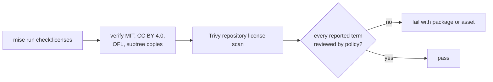

{}

- **You will:** Identify which license covers code, prose, and fonts, then run the repository license gate.
- **You need:** The maintainer tools installed for a full scan; reading the grants needs nothing beyond the clone.
- **Time:** about 14 minutes, reference. {}

## What is an open-source license, briefly?

A license is the permission that turns visible source into reusable source.

Without an explicit grant, copyright law reserves copying, modification, and redistribution to the author. A repository can be public while its contents remain unusable by others.

Licenses also carry obligations. The practical question is therefore not only “may I use this?” but “which notice or terms must travel with my copy?”

## What license is this course under?

The repository has three deliberately separate grants:

| Material                       | License                                                   |
| ------------------------------ | --------------------------------------------------------- |
| software, manifests, skills    | [MIT](https://opensource.org/license/mit)                 |
| course prose and diagrams      | [CC BY 4.0](https://creativecommons.org/licenses/by/4.0/) |
| bundled Inter and Outfit fonts | [SIL Open Font License 1.1](https://openfontlicense.org/) |

The root `LICENSE` is the MIT software grant. `static/LICENSE.txt` carries the course-content grant. `static/assets/fmind/OFL-1.1.txt` carries the font notices and terms.

## Why use separate code and content licenses?

Software and teaching material are reused differently.

MIT is a short permissive software license: keep its copyright and permission notice when copying substantial portions. CC BY 4.0 is designed for creative work: reuse and adaptation are allowed when attribution, a license link, and change indication travel with the work.

Using one license for both would make one audience interpret terms written for the other.

## What can you do with the code and course?

You may use, copy, modify, merge, publish, distribute, sublicense, and sell software covered by MIT, subject to its notice requirement and warranty disclaimer.

You may share and adapt the CC BY 4.0 course, including commercially, when you provide appropriate credit, link the license, indicate changes, and add no restriction that prevents others from exercising the same grant.

These summaries are an engineering guide, not legal advice. Read the license text before redistributing a derivative.

## Which license covers included source excerpts?

An excerpt keeps the license of the source file it came from.

The surrounding explanation is course content under CC BY 4.0; an included Go function or manifest remains MIT-licensed software. Named Hugo includes make that provenance visible because the page points to the exact repository source.

## How should you attribute a derivative?

Keep the MIT notice beside copied software and add a visible course attribution for adapted prose.

A practical content attribution names the course and author, links the source, links CC BY 4.0, and says what changed. Do not imply endorsement by the original author.

## Why does each reusable subtree carry a LICENSE file?

A grant must travel with the files a recipient receives.

`agents/LICENSE`, `clients/LICENSE`, `infra/LICENSE`, and `load/LICENSE` are byte-identical copies of the root MIT license. A user can copy any distributable subtree without accidentally leaving its permission notice behind.

The license gate compares every copy byte for byte, so they cannot drift independently.

## How does the repository prevent license drift?

One repository gate checks notices and dependency metadata:

```bash
mise run check:licenses
```

`scripts/check-licenses.sh` first requires the root MIT grant, course-content grant, font license and copyrights, and the four identical subtree copies. It then delegates dependency and vendored-asset inventory to the repository Trivy policy.

The delegated `trivy-repository.sh` inventory covers the three Go modules explicitly: `agents/go/go.mod`, `evals/go.mod`, and `tools/go.mod`. A dependency review is incomplete if it checks only the production module and omits evaluation or repository tooling.



**Diagram in words:** The license task verifies the repository's own grants and identical subtree copies, then scans Go modules, container manifests, and vendored assets with Trivy. An unreviewed license fails with its owning package or asset.

`mise run check:licenses:core` currently calls the same policy. The alias keeps the learner and maintainer task vocabulary stable without maintaining weaker duplicate logic.

{}

Metadata can be missing, malformed, or overly broad. Review a new dependency's upstream license and provenance before accepting a policy change. {}

## How do image and repository scans complement each other?

The repository scan sees module locks, manifests, and vendored assets before an image exists.

Image scans see the packages actually present in the built artifact. CI and release workflows apply the same `trivy.yaml` policy to the exact image candidate, so a dependency omitted from source metadata cannot silently bypass the artifact check.

Neither proves that a later registry digest or public release exists. Publication remains an owner-gated action.

## What license should your own agent use?

Choose from the ownership and distribution intent of your project, not from the language or framework.

For an open-source derivative, preserve notices for copied MIT software and select a compatible license for original code. For private or employer-owned work, follow the rights holder's policy. Never copy the course's license header into a project whose owner chose different terms.

## How do you cite this course?

Use `CITATION.cff` as the repository's structured citation authority.

GitHub and reference managers can render it into common formats. A citation complements but does not replace the attribution obligations in CC BY 4.0 or the notice obligation in MIT.

## What proves this page worked?

Run the notice and dependency policy from the repository root:

```bash
mise run check:licenses
```

**You are done when:**

- You can select the grant for a Go file, a course paragraph, and a bundled font.
- You know which notices must travel with a copied subtree or adapted page.
- The license task verifies repository files and the Trivy policy without warnings.
- You describe the scan as evidence requiring review, never as a legal opinion.

Continue to [8.2. Releases]() when you can keep grants attached to the artifact a release distributes.
