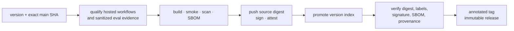

{}

- **You will:** Follow a version from repository metadata through exact-commit qualification, image evidence, and an immutable release.
- **You need:** A clone and maintainer tools; you will not tag or publish this repository.
- **Time:** about 16 minutes, reference. {}

## What is a release?

A release is one immutable source revision plus artifacts and evidence derived from that same revision.

Here that means a `v`-prefixed Git tag, matching version metadata and changelog entry, a GitHub release, and a container image addressed by digest. The image carries an SBOM, keyless signature, and provenance attestation.

A version identifies the reviewed bytes and contracts. It cannot freeze an external model service or prove that a future provider response will be identical.

## How is the project versioned?

The project uses [Semantic Versioning](https://semver.org/) for supported software contracts.

1. **MAJOR** marks incompatible changes after 1.0.
1. **MINOR** adds backward-compatible capabilities and carries deliberate pre-1.0 breaking changes with migration notes.
1. **PATCH** fixes compatible defects or clarifies behavior.

`VERSION` is the language-neutral version authority. `CITATION.cff` and the newest dated `CHANGELOG.md` section must agree with it. The native conventions command checks that relationship:

```bash
mise run check:release-metadata
```

Course prose can improve between releases, but owner-approved publication must preserve or redirect released URLs.

## How is the changelog maintained?

`CHANGELOG.md` follows Keep a Changelog.

Add user-visible changes under `Unreleased`. During an intentional release, move reviewed entries under one dated version matching `VERSION`. Do not derive product claims mechanically from commit subjects.

The repository has no generated-changelog task. If one is introduced later, curated entries remain authoritative.

## What must pass before publication?

Start from a clean candidate and run the complete local evidence gate:

```bash
mise run install:maintainer
mise run format
mise run check
mise run test
mise run scan
mise run build:docs
test -z "$(git status --porcelain)"
```

Behavior changes also require model-backed evaluation against an explicitly recorded model. `eval-results.json` must match the candidate commit and representative evalset digest, meet its own minimum pass rate, and pass every required case. Judge-backed qualification additionally needs a matching, green calibration artifact.

Local success is not hosted proof. CI, Docs, Scan, Eval, and Platform workflows must complete for the exact candidate SHA before the protected release workflow can publish it.

## How would a maintainer publish a release?

Publication belongs to an authorized maintainer and remains outside this page's hands-on work.

The workflow accepts a `v`-prefixed version, full protected-`main` SHA, and reviewed freshness handoff. Its default token is read-only; later jobs request only their specific package, attestation, tag, or release authority.

Freshness evidence is either `issue:<number>` for a reviewed issue closed within `120 days` with every checklist box checked, or `waiver:<reviewed reason>` for an explicitly reviewed exception. An unstructured URL or stale discussion is not qualification evidence.



The maintainer:

1. Chooses the SemVer change from the stable-contract diff.
1. Updates `VERSION`, citation metadata, changelog, and affected locks.
1. Runs local gates and model-backed evidence where required.
1. Merges the reviewed candidate and waits for exact-SHA hosted workflows.
1. Dispatches Release with that same SHA and freshness evidence.
1. Reviews the protected environment before any registry, tag, or release mutation.

Merging to `main` alone publishes nothing.

## What does the release workflow publish?

The protected workflow turns one qualified commit into a verifiable artifact chain.

1. It proves the requested SHA is current protected `main` and gathers exact-SHA CI, Docs, Scan, Eval, Platform, freshness, and sanitized evaluation evidence.
1. It builds the agent image without registry write authority, runs its non-root smoke, scans it, and generates an SPDX SBOM.
1. It pushes the exact source-tagged digest, signs it keylessly, attaches the SBOM, and records provenance.
1. It promotes that source digest to the version index only after every publication job succeeds.
1. It verifies tag resolution, OCI labels, signature, SBOM attestation, and provenance from a read-only job.
1. It creates the annotated tag and immutable GitHub release with durable qualification evidence.

GitHub Actions handoffs are transient and retained for at most **7 days**. Durable evidence belongs on the immutable GitHub release and the attested OCI image.



**Diagram in words:** An exact protected-main revision must qualify before a read-only image preflight. Protected jobs publish, sign, attest, and promote the source digest. A separate verifier checks every identity before the annotated tag and immutable release are created.

## How does Dependabot propose dependency updates?

`.github/dependabot.yml` proposes the ecosystems it can observe directly, including GitHub Actions, Go modules, and Dockerfile bases.

It cannot see every mise tool pin, Helm chart, embedded Kubernetes image digest, or compatibility ceiling. Freshness reporting and the coordinated-pin review cover those surfaces.

An automated proposal is not authority to merge. Review source compatibility and run the owning gates.

## How does a maintainer validate a dependency update?

Upgrade one dependency family at a time and keep the proof boundary explicit.

1. Refresh the owning lock and inspect the exact diff.
1. Run that module's format, check, test, and build tasks.
1. Run root `format`, `check`, `test`, and `scan` after each coherent group.
1. For ADK, model, protocol, or gateway changes, run focused runtime tests and model-backed evaluations.
1. For platform images or charts, render both overlays and exercise the disposable k3d path before release qualification.

Rollback means reverting the dependency group, restoring its locks, and re-running the same gates. A deployed image rolls back to a previously verified digest.

## Which pinned components must move together?

Some upstream contracts have multiple owners and cannot be upgraded file by file.

- The Go toolchain must agree across mise, all Go modules, and the agent Docker build stage.
- ADK and its upstream-owned OpenAI, GenAI, and OpenTelemetry compatibility families must compile and pass the agent race suite together.
- agentgateway's tool pin, container digest, profiles, routes, and smoke tests move as one unit.
- kagent chart pins and `v1alpha2` resources move together.
- Tempo, Loki, Collector, Prometheus, Alertmanager, and Grafana host and cluster images must not drift silently.
- Hugo and the Hextra module move with the strict site build and rendered accessibility gates.

`SUPPORT.md` records the current ADK-owned ceilings and their validators. A newer transitive version is not supported merely because its module resolves.

## Why use v-prefixed tags?

The `v` prefix distinguishes release versions from other Git refs and is understood by common release tooling.

Consistency matters more than the character itself: tag, `VERSION`, changelog heading, citation release, image label, and release title must identify the same candidate.

Repository rules reject tag updates and deletion but do not restrict tag creation because the protected workflow creates the first tag only after qualification. Maintainer administration retains a documented break-glass bypass for recovery; using it is exceptional evidence that requires review, not a normal release path.

## What proves this page worked?

Run the native metadata check without creating or publishing anything:

```bash
mise run check:release-metadata
```

**You are done when:**

- Version authority, citation metadata, and the newest dated changelog entry agree.
- You can distinguish local gates, exact-SHA hosted qualification, and publication proof.
- You can name the image evidence: digest, scan, SBOM, signature, and provenance.
- You know why an ADK-owned dependency ceiling must move only with its compile and race-test validator.

Return to [8. Community]() when a release means one candidate and one coherent evidence chain.
