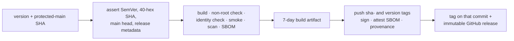

{}

- **You will:** Follow one commit from version metadata through a preflighted image to a signed, attested, immutable release.
- **You need:** A clone and the maintainer tools; you will not tag or publish this repository.
- **Time:** about 14 minutes, reference. {}

## A version is a name for bytes, not for a moment

A user reports that "v1.2.0 hangs on startup". You check out the tag, cannot reproduce it, and spend an afternoon discovering that the image they ran was rebuilt from a branch that briefly had the same tag pointing at it. Nothing was malicious; the tag was simply a movable label, and the artifact and the source were never bound to each other.

A release is the fix for that: one immutable source revision, every artifact built from exactly that revision, and the records that say how. Here it means a `v`-prefixed Git tag on a specific commit, version metadata and a changelog entry that agree with it, a GitHub release carrying those records, and a container image addressed by digest with an SBOM, a keyless signature, and a provenance attestation attached.

The agreement between metadata files is checkable before anything is published:

```bash
mise run check:release-metadata
```

```text
release metadata: v0.7.0 (2026-08-06) is consistent
```

`VERSION` is the language-neutral authority; `CITATION.cff` and the newest dated `CHANGELOG.md` section must match it. Versions follow [Semantic Versioning](https://semver.org/) for supported software contracts: MAJOR for incompatible changes after 1.0, MINOR for backward-compatible capabilities and for deliberate pre-1.0 breaks with migration notes, PATCH for compatible fixes and clarifications.

`CHANGELOG.md` follows Keep a Changelog: user-visible changes accumulate under `Unreleased`, and a release moves reviewed entries under one dated heading. Nothing derives those entries from commit subjects, because a commit subject describes a diff and a changelog entry describes a consequence.

**In one command you just confirmed that three files which drift apart in most repositories — the version authority, the citation metadata, and the changelog heading — currently name the same candidate.**

What a version cannot do is freeze an external model service. It names the reviewed bytes and the contracts they implement, and that is all it can honestly claim.

## The dispatch takes a version and a SHA, and holds no permissions

Everything about the release workflow's authority is settled above its first job, in the block quoted here:



Two required string inputs and nothing else: the `v`-prefixed version that must already be recorded in the metadata you just checked, and the full commit SHA to build. There is no tag input, because a tag is exactly the movable label this design refuses to trust. The `permissions: {}` line is the other half — the workflow starts with no token authority at all, and each job requests only the scopes it needs.

The build job's first step enforces the rest by hand: the SHA must be forty hex characters, the version must match a strict SemVer pattern, the dispatch must come from `main`, and `main`'s current head must be the SHA requested. So a release can only ever name the protected bytes, never a side branch that happened to be checked out.

## Your turn: ask for a version this repository does not have

Predict before you run it. The checker reads `VERSION`, `CITATION.cff`, and `CHANGELOG.md`; hand it a tag none of them mention, and does it warn, invent the tag, or refuse?

- **Mode**: `inspect` — nothing is written, so there is nothing to revert.
- **Goal**: watch the same check the release workflow runs at the requested revision refuse a version the source does not carry.
- **Files to touch**: none. `VERSION`, `CITATION.cff`, and `CHANGELOG.md` stay exactly as they are.
- **Preflight**: `mise run check:release-metadata` prints the consistent line above and exits 0.
- **Steps**: run `tools/bin/conventions release-metadata v9.9.9` from the repository root, then run it again with the version the previous command reported.
- **Gate that proves completion**: the first run exits non-zero with `release metadata: tag v9.9.9 does not match source version v0.7.0` — naming both the tag you asked for and the version `VERSION` actually holds — and the second run prints the consistent line and exits 0.
- **Final state**: no files changed; `git status --short` is unchanged from before you started.

That is the same command the build job runs against the dispatched commit, which is why a wrong version fails in twenty seconds rather than after an image has been pushed.

## What the two jobs actually do

`build` holds `contents: read` and no registry authority whatsoever. It re-runs the metadata check at the requested revision, resolves a source-identity tree digest, and builds the image with that identity compiled in.

Then it attacks its own artifact. It asserts the image runs as a non-root user; it runs the binary's `version` subcommand and compares the reported revision, tree digest, version, build timestamp, and `dirty == false` against the inputs; and it runs a `config:check` smoke inside a read-only root with tmpfs mounts, with no shell involved, because the image is distroless. Finally it scans the image and generates an SPDX SBOM.

The handoff between jobs is a build artifact retained for **7 days**, and it is deliberately not the archive. Actions artifacts expire; the durable copies are the ones attached to the release and to the digest.

`publish` runs in a protected `release` environment with the narrow write scopes. It loads the tar the build job produced rather than rebuilding, so the pushed bytes are the smoked bytes, and tags that one manifest twice: `sha-<commit>` as the permanent source address and the version as the human one. It then signs the digest keylessly with cosign, attaches the SBOM as an attestation, creates signed SLSA build provenance pushed to the registry, and only then creates the tag and the release. The notes are the curated changelog section for that version, read out verbatim, and `--target` pins the tag to the qualified commit so it cannot name bytes other than the ones just signed.



**Diagram in words:** A dispatch supplies a version and a protected-main commit SHA. The build job asserts those inputs and the release metadata, then builds, checks, smokes, scans, and SBOMs the image without registry authority, passing a short-lived artifact forward. The protected publish job pushes both tags for one manifest, signs and attests it, and creates the tag and the immutable GitHub release last.

Publication itself belongs to an authorized maintainer, and merging to `main` publishes nothing. The maintainer picks the SemVer change from the diff of stable contracts, updates `VERSION`, citation metadata, changelog, and affected locks, and runs the local checks the change requires. Then comes the reviewed merge, the wait for the hosted workflows on that exact SHA, and only then the Release dispatch with the same SHA.

A behavior change carries one more requirement. It needs a model-backed evaluation run whose `results.json` names the candidate commit and the evalset digest, clears the minimum pass rate the command asked for, and passes every required case — with a current judge-calibration artifact beside it, reporting agreement rather than granting a pass.

## Pins that have to move together

Some upstream contracts have more than one owner in this tree, so upgrading them file by file produces a build that compiles and a runtime that lies. The Go toolchain must agree across mise, all Go modules, and the agent Docker build stage. ADK owns a family of client and telemetry versions that must compile and pass the race suite as a set, and those constraints are written into the manifest rather than into someone's memory:

```bash
rg -o 'owner=\S+ constraint=\S+' agents/go/go.mod | sort -u
```

```text
owner=google.golang.org/adk/v2@v2.2.0 constraint=v0.20.0
owner=google.golang.org/adk/v2@v2.2.0 constraint=v1.44.0
owner=google.golang.org/adk/v2@v2.2.0 constraint=v1.66.0
owner=google.golang.org/adk/v2@v2.2.0 constraint=v3.49.0
```

Four held dependencies, one owner, and each hold comment also names the validator that has to pass before a newer version is safe to take. A transitive version is not supported merely because the module graph resolves it.

The same rule applies elsewhere. The gateway's tool pin, container digest, profiles, routes, and smoke tests move as one unit, and kagent chart pins move with their `v1alpha2` resources. The Tempo, Loki, Collector, Prometheus, Alertmanager, and Grafana images must not drift apart between host and cluster. Hugo moves with the Hextra module, the strict site build, and the rendered accessibility checks. `SUPPORT.md` records the current ceilings and the validator for each.

Dependabot proposes updates for the ecosystems it can observe directly — GitHub Actions, Go modules, and Dockerfile bases — and cannot see a mise tool pin, a Helm chart, or an embedded image digest. Treat a proposal as a suggestion: refresh one dependency family's lock, read the diff, run that module's tasks, then the root `format`, `check`, `test`, and `scan` after each coherent group. Rollback means reverting the group, restoring its locks, and re-running the same commands; a deployed image rolls back to a previously verified digest.

## What you can do now

- You confirmed that version authority, citation metadata, and the newest dated changelog entry agree, without creating anything.
- You asked the same checker for a version the repository does not carry, and watched it name both versions instead of guessing.
- You can explain why the workflow accepts a commit SHA and refuses a tag, and why it starts with no permissions.
- You can name what a released **OCI image** carries: a digest, a scan, an SBOM, a keyless signature, and provenance.

A version is traceable from `VERSION` to a signed digest, and you can say at which step the tag stops being able to move. That step is the only one a consumer can rely on.

Return to [8. Community](), or to [8.7. Capstone]() if you have not finished the one page this chapter actually requires.
