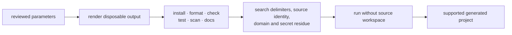

{}

- **You will:** Decide between forking once and maintaining a generator, then bound exactly what a derivative is allowed to change.
- **You need:** Nothing beyond a terminal.
- **Time:** about 12 minutes, concept. {}

## The second agent is where this decision starts costing money

Your capstone agent works. Three weeks later a neighbouring team wants the same thing for their queue, and someone says the sensible-sounding words: "let's make it a template." It is the correct instinct at the wrong time. A generator is a second product with its own release cadence, its own parameter surface, its own migration path for the repositories it already produced, and its own bugs that only appear in outputs you cannot see. For one derivative, that burden dwarfs the cost of a careful fork.

So the rule is unglamorous and holds up well: **fork once, and build a generator only when several independent agents genuinely need the same maintained structure.**

Forking means keeping the history, replacing one domain seam at a time, and keeping every check green throughout — which is precisely the [8.7. Capstone]() path. Maintaining a generator means exposing reviewed parameters, testing several outputs, versioning template migrations, and supporting the repositories other people generated from it last quarter. Pick the second one deliberately, with an owner's name attached, or do not pick it.

What this repository does ship is smaller and more reusable than a generator: structured intake. `.github/ISSUE_TEMPLATE/` routes bugs, features, documentation changes, and recurring freshness review through required fields and labels, `config.yml` disables blank public issues and points security reports at a private contact, and `.github/PULL_REQUEST_TEMPLATE.md` asks for What, Why, How, and a Test Plan. Copy the shape rather than the wording: collect reproducible commands, expected behavior, affected surface, source revision, and removed secrets before a review begins.

## What legitimately differs between two derivatives

Identity and deployment coordinates differ; contracts do not. The parameter surface falls into four groups:

- **Identity**: module path, executable name, ADK application name, display name, audit actor, and OTel service name.
- **Model**: provider, model id, and OpenAI-compatible base URL.
- **Domain**: the read tools, guarded writes, runtime skills, and seed the derivative owns, plus the A2A advertised address and request bounds.
- **Deployment**: OCI image name, Kubernetes namespace, registry, and any optional cloud coordinates.

That list sounds large until you ask the repository where one of those values actually lives:

```bash
rg -l 'agentops-agent' agents/ | sort
```

```text
agents/data/sql/schema.sql
agents/go/cmd/agent/main_test.go
agents/go/config/config_test.go
agents/go/config/env.example.tmpl
agents/go/mcpserver/mcpserver.go
agents/go/memory/helper_test.go
agents/go/platformdrill/drill.go
agents/go/policy/policy.go
agents/go/state/state.go
agents/go/telemetry/telemetry.go
agents/go/tools/tools.go
```

Eleven files under `agents/`, and their spread is the useful part: one application name reaches the audit schema, the MCP server identity, the policy actor, the state directory, the telemetry service name, and the tool layer, plus the tests that pin each of those. A generator that rewrites five of those eleven produces a project that boots and lies about who performed a write. Write the map first:

| Parameter                   | Current owners                                                            |
| --------------------------- | ------------------------------------------------------------------------- |
| Go module and binary        | `agents/go/go.mod`, `agents/go/cmd/agent`                                 |
| ADK and audit identity      | `agents/go/compose`, `agents/go/telemetry`, `agents/go/tools`             |
| model provider and endpoint | `.env.example`, `agents/go/config`, `agents/go/model`                     |
| A2A address and call cap    | `agents/go/config`, `agents/go/a2aserver`                                 |
| domain and runtime skills   | `agents/data`, `agents/go/domain`, `agents/go/tools`, `agents/go/memory`  |
| evaluation expectations     | `evals/*.evalset.json`, `evals/judge-calibration.json`, `evals/mise.toml` |
| OCI and Kubernetes identity | `mise.toml`, `infra/skaffold.yaml`, `infra/k8s`                           |
| optional cloud coordinates  | `infra/gcp`, the rendered GKE overlay                                     |

A generator should rewrite exactly its declared cells, and fail loudly when the source layout grows an identity copy nobody declared.

**You now have the thing every template project skips: a written, checkable answer to "what does this parameter touch?" derived from the repository rather than from memory.**

## Some things are not parameters, and one of them will tempt you

Git owns the instruction version. A mutable prompt-registry parameter looks like flexibility and is actually a way to change an agent's behavior without a diff, a review, or a revision anyone can name — so a derivative gets a different instruction by editing the file, not by pointing at a registry.

Nothing that identifies a machine or a person is a parameter either, and the reason is easiest to see with the worst case. Template one developer's `.env` and every repository the generator produces ships that person's API key; rotating it later breaks all of them at once, and the key was in git history the whole time. So copy `.env.example`, never `.env`, keep the non-secret local marker and the Workload Identity Federation pattern intact, and leave runtime databases, traces, evaluation results, cloud keys, and existing workload identities out of the parameter list entirely.

These stay fixed across every derivative, because changing one changes what the project can honestly claim:

- Separate Go modules, with the evaluation harness unable to import the agent it grades.
- Typed configuration and enums, with external input parsed into trusted types at the edge.
- Immutable seed on one side, writable runtime state on the other, never mixed in one file.
- Six governed remote reads, in-process confirmed writes, an idempotent audit, and a write kill switch.
- Telemetry with content capture off by default and two layers of in-process PII defence always on.
- A non-root distroless image with health checks, resource bounds, and a network policy.
- One root `mise` vocabulary that local terminals, hooks, and CI all call.
- Source-backed includes, plus the strict page frame, link, and accessibility checks around them.

One nuance about coverage. The Go suite enforces an 80% per-package line-coverage floor, and a generator may reproduce that mechanism. It must not copy this repository's number into a project whose owner never chose it — an inherited floor that nobody agreed to is the first thing a team disables, and then they have no floor at all.

## Prove a generated project without its parent

The failure mode of every generator is the same: outputs that only work on the machine that has the source workspace beside them. So validate in disposable directories, with no access to the template repository, for at least two materially different parameter sets.



**Diagram in words:** Reviewed parameters render into a disposable checkout. The output must pass every local check, contain no unresolved delimiter and no residue of the source project's identity, domain, or secrets, and still work with the template repository absent, before anyone calls it supported.

Concretely, for each parameter set:

1. Render it, and confirm no template delimiter survived.
1. Run `mise run install`, `format`, `check`, `test`, `scan`, and `build:docs` from a clean checkout, with every Go module resolving from its committed locks.
1. Grep for source identity, the reference domain's incident ids, service names, runbook slugs, personal paths, and credentials.
1. Confirm the derivative ships a complete replacement seed with matching eval assets rather than an empty `agents/data`.

For a fork, this page is much shorter: copy only the contribution forms you intend to maintain and go finish the capstone. For a generator, write the parameter and owner table first, run two different outputs through that complete list, and treat publication as blocked until update and migration behavior are tested too.

## What you can do now

- You chose fork or generator, and can state the maintenance cost you accepted with that choice.
- You saw how far one identity string reaches through the agent module, and can name every owner it touches.
- You can list what is never a parameter: credentials, runtime state, personal paths, and the instruction version.
- You can describe the acceptance run that shows a generated project works with its parent repository absent.

"Let us make it a template" has a price you can now quote in files — the eleven one name touches here — and you can say out loud which cells a generator is allowed to rewrite.

Return to [8. Community]() when reuse no longer means copying identity and state that nobody owns.
