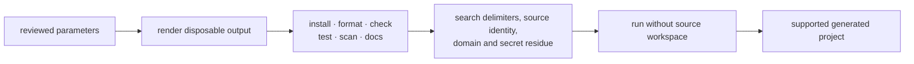

{}

- **You will:** Reuse small contribution templates and decide whether your agent needs a fork or a maintained project generator.
- **You need:** Nothing beyond a terminal.
- **Time:** about 12 minutes, concept. {}

## Which reusable templates does this repository ship?

The repository ships structured GitHub intake templates, not a public project generator.

`.github/ISSUE_TEMPLATE/` routes bugs, features, documentation changes, and recurring freshness review through required fields and labels. `.github/PULL_REQUEST_TEMPLATE.md` asks for What, Why, How, and the exact local proof.

The reusable principle is the shape: collect reproducible commands, expected behavior, affected surface, source revision, and removed secrets before review begins. Security reports remain private and blank public issues stay disabled.

## Should you template or fork the reference agent?

Fork once unless several independent agents need the same maintained structure.

1. **Fork once:** keep history, replace one domain boundary at a time, and keep gates green. This is the capstone path.
1. **Maintain a generator:** expose reviewed parameters, test several outputs, version template migrations, and support generated repositories over time.

A generator is another product. For one derivative, its update and support burden costs more than a careful fork.

## What should be parameterized?

Parameterize identity and deployment coordinates that legitimately differ between derivatives.

- Go module path, executable name, ADK application name, display name, audit actor, and OTel service name.
- Model provider, model id, and OpenAI-compatible base URL.
- The read tools, guarded writes, runtime skills, and domain seed owned by the derivative.
- A2A advertised address and request bounds.
- OCI image name, Kubernetes namespace, registry, and optional cloud coordinates.

Git owns the instruction version. Do not introduce a mutable prompt-registry parameter.

Never template a credential, personal path, runtime database, trace, evaluation result, cloud key, or existing workload identity. Copy `.env.example`, never `.env`; keep the non-secret local marker and Workload Identity Federation pattern.

## Where does each parameter live today?

The source owners form a bounded parameter map:

| Parameter                   | Current owners                                                            |
| --------------------------- | ------------------------------------------------------------------------- |
| Go module and binary        | `agents/go/go.mod`, `agents/go/cmd/agent`                                 |
| ADK and audit identity      | `agents/go/compose`, `agents/go/telemetry`, `agents/go/tools`             |
| model provider and endpoint | `.env.example`, `agents/go/config`, `agents/go/model`                     |
| A2A address and call cap    | `agents/go/config`, `agents/go/a2aserver`                                 |
| domain and runtime skills   | `agents/data`, `agents/go/domain`, `agents/go/tools`, `agents/go/memory`  |
| evaluation expectations     | `evals/*.evalset.json`, `evals/judge-calibration.json`, `evals/mise.toml` |
| OCI and Kubernetes identity | `mise.toml`, `infra/skaffold.yaml`, `infra/k8s`                           |
| optional cloud coordinates  | `infra/gcp`, rendered GKE overlay                                         |

A generator should rewrite exactly its declared cells and fail if the source layout introduces an unowned identity copy.

## What should remain invariant?

Keep the correctness and operational boundaries fixed:

1. Separate Go modules and the evaluation import boundary.
1. Typed configuration, enums, and parse-at-boundary validation.
1. Immutable seed versus writable runtime state.
1. Six remote reads, in-process confirmed writes, idempotent audit, and write kill switch.
1. Privacy-off-by-default telemetry and two-layer PII defense.
1. Non-root distroless image, health checks, resource bounds, and network policy.
1. The root mise vocabulary shared by hooks and CI.
1. Source-backed Hugo includes, strict page frame, links, and accessibility checks.

The current Go suite enforces behavior and an 80% per-package line-coverage floor. A generator may reproduce the mechanism, but it must not copy this repository's percentage into a project whose owner never chose it.

## Which generator should you use?

This repository intentionally chooses none.

Select a maintained open-source generator only after deciding whether outputs need future template updates or create-once scaffolding. Pin its version, review its license and supply chain, and keep it outside the generated runtime.

The design and tests matter more than the generator engine.

## How do you validate a generated project?

Validate outputs in disposable directories and without access to the source workspace.

For at least two materially different parameter sets:

1. Render the project and verify no template delimiter remains.
1. Run `mise run install`, `format`, `check`, `test`, `scan`, and `build:docs` from a clean checkout.
1. Confirm all Go modules resolve from their committed locks.
1. Search for source identity, domain incident ids, service names, runbook slugs, personal paths, and credentials.
1. Verify the derivative supplies a complete replacement seed and matching eval assets rather than deleting `agents/data`.

**Diagram in words:** Reviewed parameters render into a disposable checkout. The output must pass all local gates, contain no unresolved or source-specific residue, and work without the template repository before it is supported.

## What proves this page worked?

For a fork, copy only the contribution forms you will maintain and continue to the capstone.

For a generator, write the parameter/owner table and prove two different outputs through the complete gate. Publication waits until update and migration behavior are tested too.

**You are done when:**

- You chose fork or generator and can name the maintenance cost you accepted.
- Every parameter has one source owner and no credential-bearing default.
- Generator outputs retain the Go, evaluation, state, privacy, and documentation invariants.
- Two generated checkouts pass independently and contain their own coherent domain seed and eval assets.

Return to [8. Community]() when reuse no longer means copying unowned identity and state.
