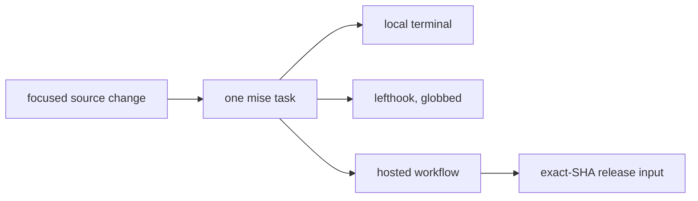

{}

- **You will:** Run the same task a hook and a hosted workflow run, break one assertion, and watch both runs report it identically.
- **You need:** A clean clone with the contributor tools installed.
- **Time:** about 15 minutes, hands-on. {}

## "Tests pass" is three different claims wearing one sentence

A reviewer asks whether it works. The contributor says tests pass. What actually happened could be any of three things: a hook ran a subset of checks on the staged files, a full local run compiled and tested three Go modules on one machine, or a hosted workflow ran the same commands on a clean runner with no local cache. Those are different amounts of assurance, and merging on the wrong one is how a repository ends up with a green history and a broken `main`.

The defence here is boring and effective: there is **one definition of every check**, and everything calls it. `mise.toml` owns the root aggregates, each Go module owns its focused tasks, and both lefthook and the GitHub workflows delegate to that same vocabulary instead of restating it. So the three claims above differ in scope and environment — never in logic.

Run the test surface yourself and you can watch all three modules answer through one root task:

```bash
mise run test
```

```text
[test:go] DONE 1815 tests, 1 skipped in 3.117s
[test:go] agents/go meets the 80% per-package coverage floor
[test:evals] DONE 395 tests in 7.726s
[test:evals] evals meets the 80% per-package coverage floor
[test:tools] DONE 296 tests in 17.968s
```

That is the module summary lines, trimmed of each package's individual result. Two modules enforce an 80% per-package line-coverage floor. `tools` deliberately sits outside it, because repository tooling that mostly shells out to other programs would be measuring its own harness. The floor is per package rather than per module on purpose: a module total lets a large well-tested package pay for a small untested one, which is exactly the package you care about.

The hooks call the same tasks with narrower globs. Pre-commit formats staged Markdown, configuration, and Go, then runs only the checks whose glob matched — `check:go` for `agents/go/**`, `check:docs` for content and layout changes, `check:data` for the seed, `check:links` for Markdown — and finishes with a staged secret scan. Pre-push drops the globs entirely: `check:core` and then `test`, so nothing reaches a remote unchecked. Hooks are fast feedback, not a substitute for the full local run.

## The complete local run, and where it stops

```bash
mise run install:maintainer
mise run format
mise run check
mise run test
mise run scan
mise run build:docs
```

Those six commands compile and test the Go agent, the standalone evaluation harness, and the repository tools; validate course structure, links, includes, accessibility contracts, security, licences, and infrastructure renders; and build the strict Hugo site. Scanner databases and dependency resolution may reach the network. Nothing else does.

What that run cannot tell you is worth stating as plainly as what it can. No live model answered a question. No cluster scheduled a Pod. No cloud project was touched, and nothing was published.

**When these six pass, a reviewer can reproduce every deterministic claim in your change from one source revision — which is the whole job of a contribution check.**

A green run here is a statement about deterministic source behavior on your machine, and [0.2. Evidence]() is the page that keeps that separation honest for the rest of the course.

## Your turn: break one assertion and watch the same failure twice

Predict before you edit anything: you are about to make one test expect the wrong string. Will the focused package run and the root aggregate report two different failures, or the same one twice?

- **Mode**: `temporary experiment`.
- **Goal**: watch one broken assertion produce the same failure through the focused module task and through the root aggregate that lefthook and CI both call.
- **Files to touch**: only `agents/go/tools/read_test.go`, restored at the end.
- **Preflight**: `git diff --quiet -- agents/go/tools/read_test.go` must exit 0, and `cd agents/go && go test ./tools` must pass.
- **Steps**: in the `well formed but unknown` case, change the expected `INC-999` inside `want` to `INC-998`, run `cd agents/go && go test ./tools`, then run `mise run test` from the repository root.
- **Gate that proves completion**: the focused run fails on `TestGetIncidentReturnsTheFullRecordOrSaysWhyNot/well_formed_but_unknown`, quoting both the string the tool returned and the one you asked for, and `mise run test` exits non-zero with the same package red — the root task pre-push runs, so a push would stop here too.
- **Final state**: run `git restore -- agents/go/tools/read_test.go`, then confirm `cd agents/go && go test ./tools` is green and `git status --short` reports nothing for that file.

The red looks like this, with the line number wherever that assertion sits when you try it:

```text
--- FAIL: TestGetIncidentReturnsTheFullRecordOrSaysWhyNot (0.04s)
    --- FAIL: TestGetIncidentReturnsTheFullRecordOrSaysWhyNot/well_formed_but_unknown (0.00s)
        read_test.go:208: Error = "No incident found with id \"INC-999\".", want "No incident found with id \"INC-998\"."
FAIL
FAIL	github.com/MLOps-Courses/agentops-open-course-go/agents/go/tools	0.397s
```

Two lines of failure name the subtest, the file, the value the tool produced, and the value you claimed. That is the shape you want from a contribution check: not "something is wrong", but a sentence a reviewer can act on without running anything.

## What hosted workflows add on top



**Diagram in words:** A source change reaches one mise task definition. The local terminal, the globbed lefthook hooks, and the hosted workflows all invoke that same task rather than their own variant, and a release later consumes successful hosted runs for one exact revision.

Six workflows split the same contracts by responsibility. **CI** starts with `mise run install:validation`, the narrow profile that prepares deterministic validation with no model or platform services. It then runs the learner doctor, format, check, test, the account-free host smoke, the deterministic red-team suite, and the offline evalset validation, with separate jobs for browser accessibility and for repeating the critical offline regressions without retries. **Scan** covers repository and image security reporting and the scheduled freshness review. **Platform** exercises the disposable cluster path on a schedule or on demand. **Eval** runs model-backed behavioral runs by explicit dispatch only. **Portability qualification** and **Release** are dispatch-only too, and Release consumes results rather than re-running a weaker private approximation.

Two of those never block a merge, on purpose. `mise run eval:validate` is offline — it parses and cross-checks every committed evaluation asset against the seed — so it belongs in CI. `mise run eval` and `mise run eval:judge-calibration` start the Go agent and call a configured model, so they are dispatch-triggered instead. Every other evaluation surface is a flag on that same run — the A2A transport, the workflow and report evalsets, groundedness, and schema checks — and `evals/README.md` documents them.

Likewise, k3d creation, host observability, model downloads, and GKE planning run only where they materially exercise the affected surface, and a GKE apply or destroy needs explicit approval because it mutates billable resources.

The coverage floor, by contrast, _does_ block a merge: a contribution that adds untested code fails `mise run test` instead of quietly nudging an average down. Clear it with tests that assert behavior. A test that merely executes a function clears the floor and shows nothing, which is the one way to satisfy this requirement while defeating it.

## Taking one focused change through

Start from a single observable problem and the smallest owner that can solve it. Read `README.md`, `AGENTS.md`, `CONTRIBUTING.md`, and the relevant support contract, and inspect the current source and tests before editing — never translate an upstream API from memory, because the signature you remember is usually the one from the release before the version `go.mod` pins. Keep unrelated working-tree changes intact, and keep generated state, model outputs, credentials, absolute workstation paths, and publication changes out of the patch.

A documentation-only fix carries five habits. Preserve the front matter, explicit slug, glance block, and closing checkpoint, and never add a shadowing `url`. Update a named include region when the excerpt moved, rather than retyping source into Markdown. Keep every command executable from the directory the page states, labelling model, cluster, cloud, cost, and destructive steps. Run the formatting, conventions, link, freshness, skills, Hugo, and accessibility checks. Then read the rendered page with keyboard and diagram alternatives in mind — [8.4. Documentation]() owns that loop in detail.

Then write the change up so it can be checked rather than trusted. Keep each commit coherent and describe behavior, not implementation trivia, using a Conventional Commits subject. A pull request explains What changed, Why the existing behavior was insufficient, How the change preserves contracts, and which exact commands you ran — with the local runs separated from the hosted, model-backed, deployed, and published ones that were never executed.

Two routes stay off the public tracker. Vulnerabilities follow the private route in `SECURITY.md`, and conduct matters follow `CODE_OF_CONDUCT.md`; accessibility barriers follow `ACCESSIBILITY.md`, while ordinary reproducible bugs and documentation gaps use the structured issue forms. A public issue is world-readable and indexed within minutes, which is why exploit details, credentials, personal data, and private infrastructure go through the private route instead — there, a fix can land before the description does.

## What you can do now

- You ran the repository test surface and can name the two modules under the 80% floor and the one deliberately outside it.
- You broke one assertion and watched the focused package run and the root aggregate name the same subtest.
- You can say which checks a hook ran, which ones the complete local run ran, and what neither of them touched.
- You can name the dispatch-only workflows and explain why model-backed evaluation never blocks a merge.

"Tests pass" now has three possible sources and you can say which one produced it, reproduce the red from one file edit, and write the two lines of a pull request that let a reviewer skip trusting you entirely.

Return to [8. Community]() when a reviewer can reproduce both your change and the runs behind it without asking you a question.
