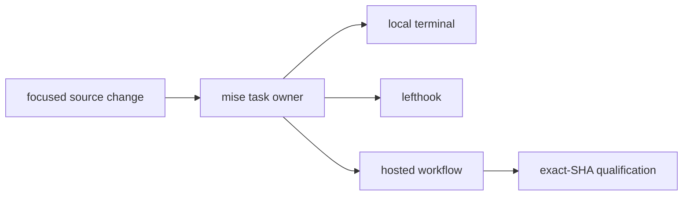

{}

- **You will:** Map a focused change to the same mise tasks used by hooks and hosted workflows.
- **You need:** A clean clone and the contributor tools installed.
- **Time:** about 14 minutes, reference. {}

## How should you start a contribution?

Start from one observable problem and the smallest owner that can solve it.

Read `README.md`, `AGENTS.md`, `CONTRIBUTING.md`, and the relevant support contract. Inspect current source and tests before editing; never translate an upstream API from memory.

Keep unrelated working-tree changes intact. Do not add generated state, model outputs, credentials, absolute workstation paths, or publication changes to a focused patch.

## Why do hooks, CI, and releases run the same tasks?

One task definition prevents three subtly different meanings of “green.”

`mise.toml` defines root aggregates. Each Go module owns its focused tasks, while lefthook and workflows delegate to the root vocabulary. A local gate and its hosted counterpart therefore execute the same repository logic, even though hosted infrastructure remains separate evidence.



**Diagram in words:** One source change reaches a repository mise task. Local runs, hooks, and hosted workflows call that task. A release later consumes successful hosted runs for one exact revision.

## What do local hooks run?

Pre-commit delegates formatting, scoped checks, and staged secret scanning. Pre-push runs the repository test boundary.

Hooks are fast feedback, not a substitute for the complete handoff gate. Run the tasks yourself before asking for review so failures are visible in context.

Never weaken a task, add a skip, or suppress a finding merely to pass the hook. Fix the owning source or report the genuine blocker.

## What does the complete local gate run?

The contributor handoff is:

```bash
mise run install:maintainer
mise run format
mise run check
mise run test
mise run scan
mise run build:docs
```

Those commands compile and test the Go agent, standalone eval harness, and repository tools; validate course structure, links, includes, accessibility contracts, security, licenses, and infrastructure; and render the strict Hugo site.

No live model, cluster, cloud project, or publication belongs to this deterministic gate. Scanner databases and dependency resolution may use the network.

## What does CI run?

Hosted workflows split the same contracts by responsibility and preserve exact-revision evidence.

The CI workflow starts with `mise run install:validation`, the narrow profile that prepares deterministic validation without model or platform services.

- CI runs deterministic source, module, and test gates.
- Docs renders the site and exercises rendered accessibility and links.
- Scan covers repository and image security evidence.
- Eval runs model-backed behavioral evidence on schedule or explicit dispatch.
- Platform exercises the disposable cluster path and backup proof.
- Release consumes those independent results for the same SHA; it does not rerun a weaker private approximation.

A green local run is necessary but cannot prove hosted services, container runtime, model behavior, or publication state.

## What is deliberately not a merge gate?

Model-backed evaluation and infrastructure mutation remain explicit.

`cd evals && mise run eval:validate` is offline and belongs to CI. `mise run eval` and `mise run eval:judge-calibration` start the Go agent and call a configured model, so they are scheduled or operator-triggered evidence rather than merge gates. Every other evaluation surface — the A2A transport, the workflow and report evalsets, groundedness, streaming, and the container runtime — is a flag on that same run, documented in `evals/README.md`.

Likewise, k3d creation, host observability, model downloads, GKE planning, and cloud changes run only when they materially prove the affected boundary. GKE apply or destroy requires explicit approval because it mutates billable resources.

The Go suite enforces an 80% line-coverage floor per package, so a contribution that adds untested code fails `mise run test` instead of nudging an average. Clear it with tests that assert behavior; a test that merely executes a function clears the floor and proves nothing.

## How should commits and pull requests be written?

Keep each commit coherent and describe behavior, not implementation trivia.

Use a Conventional Commits subject when a commit is requested. A pull request should explain What changed, Why the existing behavior was insufficient, How the change preserves contracts, and which exact commands proved it.

Separate local proof from hosted, model-backed, runtime, deployed, and publication proof. “Tests pass” must never imply one of those unexecuted boundaries.

## Where do security or conduct reports go?

Use the private route in `SECURITY.md` for vulnerabilities and `CODE_OF_CONDUCT.md` for conduct matters.

Do not place exploit details, credentials, personal data, or private infrastructure in a public issue. Accessibility barriers follow `ACCESSIBILITY.md`; ordinary reproducible bugs and documentation gaps use the structured issue forms.

## How would you take a documentation fix through the gate?

Change the named page and its exact source owner together.

For a documentation-only fix:

1. Preserve YAML front matter, the explicit non-home slug, the FAQ H2 questions, opening glance, and closing proof frame; never add a shadowing `url`.
1. Update a named include region when the source excerpt changed; do not retype the source in Markdown.
1. Keep commands executable from the stated directory and label model, cluster, cloud, cost, and destructive boundaries.
1. Run dprint, native conventions, link, freshness, skills, Hugo, and rendered accessibility checks.
1. Inspect the final rendered page with keyboard and diagram alternatives in mind.

The authoritative course tree is `content/`, and the repository conventions live in the Go `tools` module.

## What proves this page worked?

Run the complete local handoff for your scoped diff and inspect what remains unproved:

```bash
mise run format
mise run check
mise run test
mise run scan
mise run build:docs
git diff --check
git status --short
```

**You are done when:**

- Every changed behavior has an owning deterministic test or exact documentation proof.
- All local gates pass without warnings, suppressions, or unrelated edits.
- Your handoff separates local evidence from any model, cluster, hosted, deployed, or published evidence not run.
- No secret, generated state, prompt/response body, or private path entered the diff.

Return to [8. Community]() when the reviewer can reproduce both the change and its proof from one source revision.
