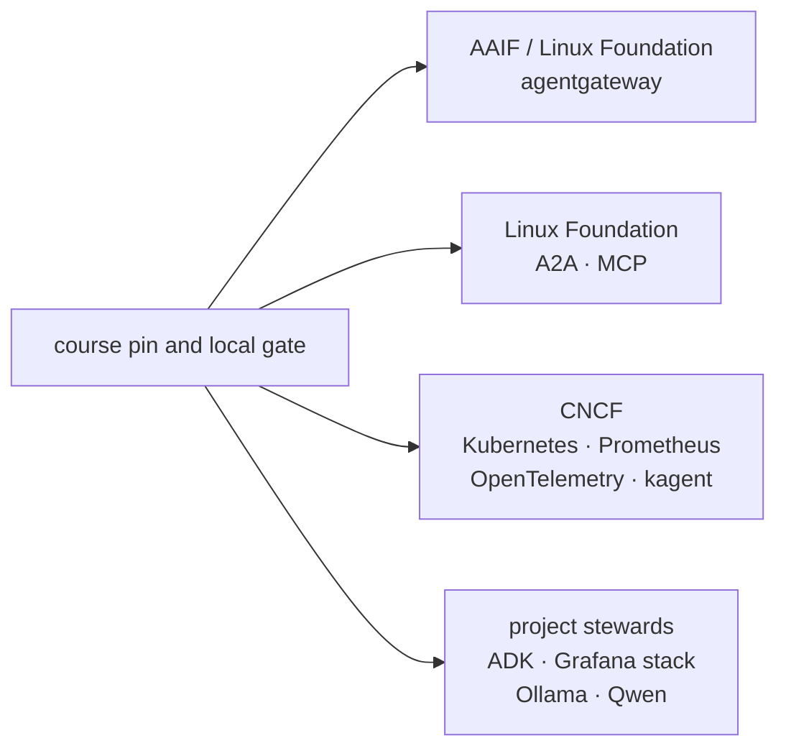

{}

- **You will:** Map each open contract in the course to its steward and route a sanitized upstream issue to the narrowest owner.
- **You need:** Nothing running; use the current project pages before filing an issue.
- **Time:** about 12 minutes, reference. {}

## Why does neutral governance matter for an agent stack?

An agent crosses contracts maintained by different communities, so no one vendor should silently own every boundary.

Open governance gives projects public contribution rules, security routes, and decision processes. It does not promise API stability, compatibility with this repository, maintenance speed, or a particular license.

The locks and local gates remain the compatibility authority even when an upstream project has a neutral home.

## What is the AAIF?

The Agentic AI Foundation is a Linux Foundation home for open agentic-AI projects and collaboration.

In this stack, agentgateway is an AAIF-hosted project. Its gateway role spans MCP, A2A, model, API, policy, and observability traffic. The repository still pins one exact release and validates its concrete routes; foundation membership does not replace those tests.

## Which open contracts appear in the course?

Four protocol families keep the implementation replaceable:

- MCP connects agents to read-only tools and data.
- A2A exposes agent discovery, messages, tasks, streaming, and cancellation.
- OpenAI-compatible Responses connects the local Go model adapter to Ollama or agentgateway.
- OTLP carries traces, metrics, and logs to the collector.

OCI and Kubernetes contracts package and deploy the same application. Each boundary is open; each repository use is pinned and tested.

## Where does AGENTS.md fit?

`AGENTS.md` is a vendor-neutral repository instruction convention, not a runtime protocol.

It governs how coding agents edit this repository. The deployed AgentOps Agent never reads it, no network service speaks it, and it does not replace MCP or A2A. This repository dogfoods the convention by keeping operational rules, owners, and proof boundaries in the root file.

## Which governance body stewards each part of the stack?

Use current project pages as authority because stewardship and maturity can move.

| Home                       | Course components or contracts                                  |
| -------------------------- | --------------------------------------------------------------- |
| Agentic AI Foundation / LF | agentgateway                                                    |
| Linux Foundation           | A2A and MCP protocol projects                                   |
| CNCF                       | Kubernetes, Prometheus, OpenTelemetry, and Sandbox-stage kagent |
| Google                     | ADK Go and the optional Gemini/Vertex integration               |
| Grafana Labs               | Grafana, Tempo, and Loki                                        |
| project/vendor communities | Ollama runtime and Qwen open weights                            |

**Diagram in words:** The course pins and validates components from four governance groups: AAIF/Linux Foundation for agentgateway, Linux Foundation protocol projects for A2A and MCP, CNCF for cloud-native runtime and telemetry, and individual project stewards for ADK, the Grafana stack, Ollama, and Qwen.

Governance answers who changes a project. A lock and compatibility test answer whether this repository supports the change.

## How does the course stay provider-portable?

The Go model boundary has two methods while the transport-specific adapter stays behind it.

The default OpenAI-compatible path uses the Responses API. Moving from direct Ollama to agentgateway changes `OPENAI_BASE_URL`, while `AGENT_MODEL_PROVIDER` and typed model construction keep the application boundary explicit. Native Gemini is a separate optional provider path.

Provider portability standardizes calls, not behavior. A provider/model pair becomes release evidence only after the black-box evalset, required cases, cost bounds, and applicable judge calibration pass for a recorded source revision and model identity.

## How can you contribute upstream responsibly?

First reduce the problem to one owning boundary.

1. Reproduce it against the repository pin and the upstream-supported version when practical.
1. Remove credentials, personal data, prompts, responses, runtime databases, and private infrastructure.
1. Supply the smallest protocol payload or configuration that still fails.
1. Follow the upstream security policy for anything exploitable.
1. Link a temporary repository workaround only when it helps others reproduce the gap.

Do not send the whole course checkout when one wire request and version tuple proves the issue.

## Which tracker owns a failing boundary?

Route by the side that violates its contract:

| Failure boundary                         | Owning project to inspect first             |
| ---------------------------------------- | ------------------------------------------- |
| listener, route, policy, gateway metrics | agentgateway                                |
| MCP message or Go SDK behavior           | MCP specification or MCP Go SDK             |
| A2A message, task, stream, cancellation  | A2A specification or A2A Go SDK             |
| ADK runner, callbacks, launcher, model   | Google ADK Go                               |
| kagent CRD or controller                 | kagent                                      |
| Kubernetes API or NetworkPolicy          | Kubernetes                                  |
| OTLP SDK, Collector, exporter            | OpenTelemetry project owning that component |
| Tempo, Loki, or Grafana query/UI         | the corresponding Grafana Labs project      |

The repository issue tracker owns integration mistakes and course claims. An upstream tracker owns a minimal bug in its own contract.

## Which pages own neighbouring concerns?

- [0.3. Ecosystem]() maps runtime ownership.
- [0.4. Providers]() separates required OSS and optional proprietary paths.
- [5.4. Model Gateway]() owns Responses routing and provider movement.
- [8.0. Repository]() owns repository instructions and source layout.
- [8.5. Contributions]() owns changes to this course.

## What proves this page worked?

Route these two hypothetical failures without changing code:

1. `kubectl apply` rejects a `v1alpha2` field in a kagent resource.
1. The Go OTLP exporter reports a protocol error before a span reaches the collector.

For each, name the narrow project, exact pinned version source, sanitized reproduction, and local workaround boundary.

**You are done when:**

- You distinguish foundation stewardship, software license, maturity, and repository compatibility.
- You route MCP, A2A, gateway, kagent, ADK, and telemetry failures to their narrow owner.
- You use `AGENTS.md` for repository work and never describe it as a runtime protocol.
- You know that a provider swap needs recorded evaluation evidence, not only a successful HTTP response.

Continue to [8.7. Capstone]() when you can route a failure without sending unrelated course state upstream.
