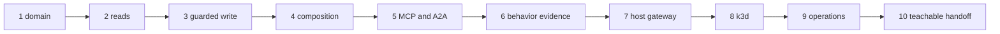

{}

- **You will:** Replace the reference domain one boundary at a time and prove the result from a clean clone.
- **You need:** Chapters 1–7 complete and deterministic repository gates passing.
- **Time:** about 60 minutes to design and measure; implementation is open-ended, hands-on. {}

## What is the capstone goal?

Build one domain-specific agent platform from the completed Go reference.

Replace the fictional incident domain with a bounded problem you understand while retaining the useful open contracts: typed Go boundaries, local Qwen3/Ollama, MCP reads, A2A serving, guarded writes, OpenTelemetry evidence, private deployment, and black-box evaluation.

A developer-support pivot shows the slice:

1. Replace incident seed rows with sanitized support tickets.
1. Add a typed `get_ticket` read with provenance.
1. Publish it through the six-read MCP policy or deliberately replace one existing read.
1. Add an eval case whose required trajectory names `get_ticket`.

That one capability crosses data, trusted types, tools, protocol policy, evaluation, and documentation. Deliver vertical slices like this instead of renaming the whole tree first.

## What is your starting state?

Record a clean deterministic baseline before changing the domain:

```bash
mise run install
mise run doctor
mise run format:core
mise run check:core
mise run test
git status --short
```

Every command must pass and the status must contain no unexplained change. `mise run test` also enforces the 80% per-package coverage floor in `agents/go` and `evals`, so record the measured percentages as baseline evidence and the floor as the gate they cleared.

Then build and run one direct local read:

```bash
mise run doctor:model
cd agents/go
mise run build
mise run web
```

Open the documented ADK web port, ask one read-only question, record the source revision, model identity, tool trajectory, and result, then stop the process. This is model-backed baseline evidence, separate from the offline gate.

## Which design decisions must you write down?

Keep a one-page design brief with explicit answers:

| Decision           | Question                                                                          |
| ------------------ | --------------------------------------------------------------------------------- |
| user and outcome   | Who makes which bounded decision with the result?                                 |
| deterministic core | Which rules must remain typed software rather than model judgment?                |
| data authority     | Which input is immutable, mutable, sensitive, or excluded from model context?     |
| write authority    | Which actions change state, who confirms them, and what audit proves it?          |
| model path         | Why is the local default sufficient, and which eval justifies another model?      |
| tool boundary      | Which reads cross MCP and which writes remain in-process?                         |
| agent boundary     | Does another agent or workflow have a measurable ownership benefit?               |
| failure policy     | Which deadlines, retries, budgets, circuit breakers, and fail-closed cases apply? |
| evidence           | Which test, eval score, trace, metric, and audit row prove each claim?            |

Prefer the smallest platform that satisfies those answers. Another database, broker, vector store, framework, or cloud service needs a measured constraint, not enthusiasm.

## Which files will you normally change?

Use existing owners instead of creating an unbounded utilities layer.

| Boundary                  | Typical owners                                                       |
| ------------------------- | -------------------------------------------------------------------- |
| immutable domain input    | `agents/data/sql`, `runbooks`, `logs`, and runtime `skills`          |
| trusted types and storage | `agents/go/domain`, `agents/go/data`, `agents/go/state`              |
| reads and retrieval       | `agents/go/tools`, `agents/go/memory`, `agents/go/compose`           |
| confirmed writes          | `agents/go/tools`, `agents/go/policy`, audit schema and tests        |
| composition and model     | `agents/go/compose`, `agents/go/model`, `agents/go/config`           |
| protocol surfaces         | `agents/go/mcpserver`, `agents/go/a2aserver`, gateway profiles       |
| behavior evidence         | package tests, `evals`, and `load`                                   |
| delivery and telemetry    | `infra/k8s`, `infra/kagent`, `infra/observability`                   |
| learner/operator contract | `README.md`, `AGENTS.md`, `SUPPORT.md`, and relevant `content` pages |

Do not rename protocol or task contracts merely to make the project appear new.

## What is the dataset contract you must replace?

`agents/data` is immutable seed, not runtime state.

`sql/schema.sql` owns tables and audit triggers; `sql/seed.sql` owns deterministic rows; `incidents.db` is rebuilt from them; runbooks, logs, and runtime skills must agree with those rows.

From the data directory:

```bash
mise run build
mise run check
```

The gate proves the committed database matches its SQL source and that service, runbook, and log references resolve. Runtime processes copy the seed into their state directory; they never mutate the committed database.

Your derivative may replace tables and identifiers, but it must retain a deterministic rebuild, typed validation, schema-version handling, and the seed/state separation.

The portability seam is source-owned. `agents/go/domain/vocabulary.go` exposes `Reference` as one `Vocabulary` with `Incidents`, `Services`, `Runbooks`, and `DependencyEdges`; `domain/pivot_test.go` supplies the deliberately unrelated pivot fixture used by the test suite. In a derivative design, call those two sides `Reference` and `Pivot`, and keep any dataset-rewrite helper such as `AdaptDataset` in bounded migration or test tooling rather than the production request path.

## How do you port the Go test suite?

Measure domain coupling before planning the port:

```bash
cd agents/go
rg -l -e 'INC-[0-9]' -e '\b(checkout|payments|inventory|api-gateway|search)\b' \
  --glob '*_test.go'
```

Review each hit. Some literals are domain fixtures; others are deliberate examples proving protocol, redaction, trajectory, or policy behavior.

Port in dependency order:

1. Stabilize schema, seed, runbooks, logs, and runtime skills.
1. Replace domain enums, identifiers, validation, and storage rows.
1. Update read and write tools plus their failure and idempotency tests.
1. Update composition, protocol fixtures, and policy expectations.
1. Update all three evalsets, cost cases, judge calibration examples, and grounded entities.
1. Re-run package race tests after each slice and root gates after each coherent milestone.

Do not delete tests to make a domain replacement pass. Preserve the behavior a test owns or replace it with an equally explicit domain contract.

## How do you prove coupling before milestone one?

Run a temporary red/green experiment on exactly one seed identifier.

1. Require a clean diff for `agents/data/sql/seed.sql` and `agents/data/incidents.db`.
1. Rename one incident id in the SQL and rebuild the database.
1. Run the affected Go package tests and `mise run check:data`; record which boundaries fail.
1. Restore both files, rebuild, and rerun the same tests and data gate.

Use `git restore` only on those two experiment targets after inspecting them. The final diff must contain no drill residue.

The result is a coupling map, not a target of zero literals.

## Which milestones should you deliver?

Deliver ten ordered outcomes:

1. **Bound the domain.** Replacement seed, types, validators, package tests, and eval assets agree.
1. **Implement evidence-backed reads.** One typed read returns provenance and rejects invalid identifiers.
1. **Implement one guarded write.** No-confirmation fails; confirmed state and audit commit atomically; replay is idempotent.
1. **Compose the agent.** Local Ollama answers the domain question through a bounded tool trajectory.
1. **Expose open boundaries.** MCP lists only intended reads and the A2A card advertises the correct private service.
1. **Prove behavior.** Deterministic scorers and adversarial cases pass against an explicitly recorded model.
1. **Govern the host path.** The loopback gateway smoke passes MCP, A2A, Responses, metrics, and PII policy.
1. **Deliver on k3d.** Workloads become Ready, persist state, and expose no public application service.
1. **Close operations.** One request produces a correlated trace, useful metric, sanitized eval verdict, and approved-action audit row.
1. **Make it teachable.** A clean-clone reviewer can install, succeed, diagnose, and clean up without private knowledge.



**Diagram in words:** The capstone proceeds from domain and typed reads through one guarded write and composition, then protocols and behavioral evaluation, then host governance, local Kubernetes, operations evidence, and finally a clean-clone teaching handoff.

Return to deterministic gates after every milestone; add model, gateway, cluster, and telemetry proof only where that milestone requires it.

## Which contracts should remain stable?

Preserve these unless the user outcome requires an explicit migration:

- The account-free OpenAI-compatible Qwen3/Ollama path.
- The documented port map and loopback/private exposure defaults.
- Immutable seed and writable state separation.
- Confirmed, validated, atomic and audited writes with a kill switch.
- Six governed remote reads or an explicitly reviewed replacement surface.
- Content capture off and deterministic in-process redaction always on.
- A standalone eval module that cannot import the agent.
- Deterministic offline gates that need no model, cluster, cloud, or paid service.

If one changes, document incompatibility, migration, rollback, new tests, and learner impact.

## Which gates prove each layer?

Use the minimum owning evidence, then state what remains unproved.

| Layer              | Minimum proof                                                                       |
| ------------------ | ----------------------------------------------------------------------------------- |
| deterministic repo | root `format`, `check`, `test`, `scan`, and strict docs build                       |
| Go agent           | module check plus `gotestsum --format testname -- -race ./...`                      |
| eval assets        | `cd evals && mise run eval:validate`                                                |
| model behavior     | model-backed eval artifact bound to source, model, evalset, and transport identity  |
| host data plane    | `doctor:gateway` and `smoke:host`                                                   |
| Kubernetes         | both renders plus disposable local deployment, readiness, state, and network checks |
| observability      | one correlated trace/log path and useful metrics                                    |
| optional cloud     | reviewed `tofu plan`; apply/destroy only with explicit approval                     |

A screenshot can support a claim but does not replace command, test, trace, or digest evidence.

## What evidence should your final submission contain?

Keep one concise handoff:

1. User outcome, non-goals, architecture, trust, and approval boundaries.
1. Starting and final source revisions.
1. Deterministic gate results, the coverage floor they cleared, and the measured percentages marked as evidence rather than as a quality claim.
1. Sanitized evaluation result with model, source, evalset digest, minimum pass rate, and required cases.
1. One trace identifier, metric query, and approved-action audit identity without prompt or response content.
1. Gateway policies, image digest, Kubernetes readiness/private-service proof, and cleanup.
1. Known failures, residual risks, unsupported platforms, and absent production controls.

Never submit `.env`, credentials, raw prompts, raw answers, tool bodies, private logs, runtime databases, or generated key material.

## How do you make offline evidence independently verifiable?

After tracked work is committed and the tree is clean, create the sanitized completion manifest:

```bash
mise run course:evidence
```

The native Go tool reruns deterministic learner gates and records the exact Git revision plus SHA-256 digests of the three module sums, seed database, and representative evalset. It records no environment values, command output, model content, credentials, runtime state, or telemetry.

A reviewer at the exact revision runs:

```bash
mise run course:evidence:verify -- /path/to/course-completion.json
```

Verification rejects a changed revision, dirty tree, artifact digest, or gate inventory and reruns the deterministic gates. It is local reproducibility evidence, not identity, hosted-CI, model, gateway, cluster, or publication proof.

## What completed derivative should a maintainer commission?

Commission a separate worked derivative only when its maintenance owner and bounded domain are approved.

A useful example would replace the incident seed with sanitized repository/CI support fixtures, expose read-only failure and ownership tools, retain one approval-gated rerun action, and preserve the model, policy, gateway, evaluation, telemetry, and cleanup contracts.

Do not link an empty repository or imply external runtime evidence exists before it is built and reviewed.

## How is the capstone assessed?

Score evidence and bounded outcomes, not tool count.

| Area                         | Weight | Full-credit evidence                                          |
| ---------------------------- | -----: | ------------------------------------------------------------- |
| problem and architecture     |     10 | bounded outcome, non-goals, simple ownership                  |
| account-free path            |     10 | complete required path without account or usage fee           |
| data and tools               |     15 | types, provenance, least privilege, seed/state split          |
| authority and privacy        |     15 | confirmed atomic write, audit, redaction, secret hygiene      |
| deterministic quality        |     15 | race tests, adversarial regressions, honest measured coverage |
| evaluation                   |     10 | trajectories, grounding, schema/cost, exact model lineage     |
| gateway and interoperability |     10 | MCP, A2A, Responses, fail-closed policy                       |
| platform and operations      |     10 | reproducible private k3d delivery and telemetry               |
| documentation and cleanup    |      5 | clean-clone path, diagnosis, limits, teardown                 |

No row awards points for the coverage percentage itself. Clearing the 80% floor is the entry price, and the credit goes to tests that would actually fail if the behavior regressed.

## How do you clean up safely?

Stop only resources you own:

```bash
mise run gateway:host:stop
mise run observability:down
cd agents/go
mise run data:reset
```

For the disposable local platform, confirm the exact context before a profile delete:

```bash
test "$(kubectl config current-context)" = k3d-local
cd infra
skaffold delete --filename skaffold.yaml --profile local
```

Do not delete shared clusters, persistent claims, cloud resources, or retained evidence without reviewing ownership. An optional GCP plan creates nothing; an approved apply needs a separately reviewed destroy and cost record.

## What proves this page worked?

Ask another person to use a clean authorized clone and only the documented commands. A from-scratch clone you run yourself is useful but weaker because you already know the intended meaning.

The final deterministic handoff is:

```bash
mise run install:maintainer
mise run format
mise run check
mise run test
mise run scan
mise run build:docs
git status --short
```

**You are done when:**

- Every claimed milestone has its owning deterministic or runtime proof.
- The coupling drill went red, was restored narrowly, and left no residue.
- The derivative seed, Go tests, all eval assets, and docs agree on one domain.
- A clean clone verifies the completion manifest and reproduces the bounded path.
- Model, gateway, cluster, telemetry, and publication evidence are reported separately from offline proof.

Continue to [8.0. Repository]() when you plan to maintain the derivative, or return to [the course home]().
