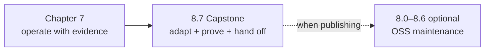

{}

- **You will:** Go straight to the capstone, and learn which appendix page to open only if you later publish what you built.
- **You need:** Chapters 1–7 finished with the learner checks passing.
- **Time:** about 5 minutes, orientation. {}

## The course ends where your domain begins

Chapter 7 closed with the reversal the whole course was building toward: the agent became the incident, and you were the one holding the trace, the metric, the audit row, and the kill switch. There is nothing left to add to Northwind Retail. The work now is to throw the story away and keep the machine.

That is the capstone, and it is the only required page in this chapter. Everything the reference does for a fictional inventory outage, your derivative should do for a problem you were already losing time to.

The swap is bigger than the seed, so measure it before you plan it:

```bash
cd evals
mise run eval:validate
```

```text
{
  "evalsets": 3,
  "cases": 21,
  "calibration_cases": 12
}
```

Twenty-one behavioral cases and twelve calibration examples currently assert things about incidents, services, and runbooks that stop being true the moment you change the seed. That is before the Go suite, the runbooks, the logs, and the gateway policies get a vote. The capstone is the page that turns that from a nasty surprise into an ordered plan.

Write two lines down now, somewhere you will still have them next week: the bounded problem your derivative solves, and the one person who acts on its answer. The capstone's design brief starts from those two lines, and every milestone after it narrows them.

One page in this chapter sits outside the walk entirely. [8.8. From Python]() _(reference)_ is a lookup for readers arriving from LangGraph or the Python course: every concept you brought with you gets an address in this repository. Open it the first time a Go construct in the reference looks unfamiliar; nothing in the required path depends on it.

Then open [8.7. Capstone](). It records your baseline, maps how tightly the reference is wired to its own domain, walks ten milestones each carrying the one command or test that backs it, and ends with a manifest a reviewer can verify from a clean clone.

## Everything else here is an appendix you may skip

Pages 8.0 through 8.6 are optional maintenance references for open-source projects. Nothing in the capstone depends on them, and reading them first is the most common way learners stall three pages short of finishing. Open one when a publishing question actually arrives — and only that one.



**Diagram in words:** Chapter 7's operating work feeds directly into the 8.7 capstone, where you adapt the reference, prove it, and hand it off. Only if you then decide to publish does the optional 8.0–8.6 maintenance appendix become relevant, shown as a dashed side path rather than a next step.

| Appendix page                                                                           | Open it when you need to…                                                      |
| --------------------------------------------------------------------------------------- | ------------------------------------------------------------------------------ |
| [8.0. Repository]() _(reference)_      | Find the exact file that owns a claim, a check, or a deployed behavior.        |
| [8.1. License]() _(reference)_            | Reuse or redistribute prose and code with the right grant attached.            |
| [8.2. Releases]() _(reference)_          | Turn one reviewed commit into a signed, attested, immutable release.           |
| [8.3. Templates]() _(concept)_          | Decide between forking once and maintaining a project generator.               |
| [8.4. Documentation]() _(hands-on)_ | Keep prose, quoted source, and rendered routes from drifting apart.            |
| [8.5. Contributions]() _(hands-on)_ | Take someone else's change through the same checks your hooks run.             |
| [8.6. AAIF]() _(reference)_                  | Route an upstream failure to the narrow project that owns the broken contract. |

## What this chapter proved

- You know the required path continues to the capstone and stops there; the appendix is a lookup, not a syllabus.
- You measured how much committed evaluation surface a domain swap moves: twenty-one cases and twelve calibration examples across three evalsets.
- You wrote down the bounded problem and the person who acts on its answer, which is where the capstone brief begins.

This chapter is one project with seven pages you may never need, rather than seven maintenance pages with a project attached.

Continue to [8.7. Capstone]() as soon as those two lines are written down.
