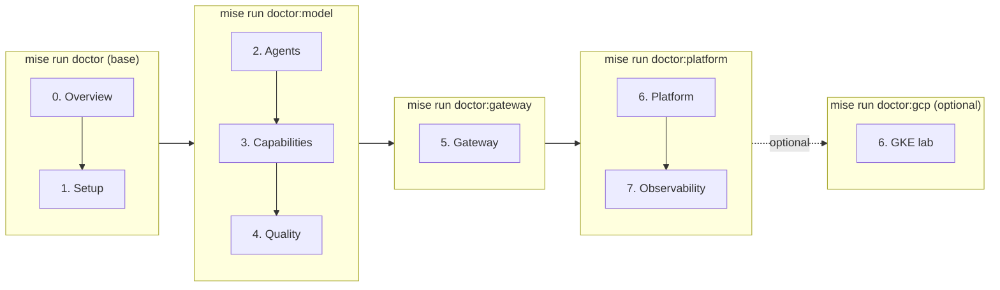

# 0.0. Course

!!! abstract "In one glance"

    - **You will:** Pick the learning path you will follow, then clone the repository and get the offline test suite passing.
    - **You need:** `mise --version` succeeding; if it fails, do 1.0. System first, then come back.
    - **Time:** about 25 minutes, orientation.

## What will this course teach you?

This course teaches the engineering discipline around an AI agent, not only the model call. You are not expected to recognize the names in the list below yet: each gets its own chapter, and [0.7. Glossary](./0.7.%20Glossary.md) defines the course's key terms one line at a time.

You will inspect, run, and extend one completed **AgentOps Agent** through the AgentOps lifecycle — the loop from building an agent to observing it in production:

- Design an agentic loop and choose where deterministic code is better.
- Add typed tools, least-privilege Agent Skills, MCP, retrieval, workflows, and A2A.
- Enforce tests, behavioral evaluations, PII redaction, human approval, and append-only auditing.
- Put agentgateway in front of model, tool, and agent traffic.
- Package the application once and run it on local k3d or an optional GKE lab with kagent.
- Export telemetry through OpenTelemetry to self-hosted MLflow, Prometheus, and Grafana.

The result is production-shaped: it uses real boundaries and operational tools, while every action and dataset remains deliberately local and fictional. `main` is the finished reference, not an empty scaffold. The final capstone asks you to preserve its platform contracts while replacing the example domain with your own.

Start the clone now, so the downloads run while you read the rest of the page. **mise** is the tool this course runs everything through: it pins the exact version of every CLI and exposes the commands as `mise run <task>`.

```bash
git clone https://github.com/MLOps-Courses/agentops-open-course.git
cd agentops-open-course
mise install
mise run install
```

`mise install` fetches the pinned toolchain; `mise run install` installs the docs, agent, MLflow, and git-hook dependencies. Both can take several minutes on a first run. The checkpoint at the end of this page adds the two commands that verify the result.

## Who is this course for?

This course is written for four kinds of reader:

- **Software engineers** who can write Python and want more than a chatbot tutorial.
- **AI and ML engineers** who need repeatable evaluation, security, and delivery practices.
- **Platform and SRE teams** who will operate agent workloads and their data plane.
- **Technical leaders** who need to evaluate where agent autonomy creates value or risk.

You do not need prior ADK, Kubernetes, MCP, A2A, or GCP experience. You should be comfortable with Git, a terminal, and basic Python.

## What reference will you use?

The AgentOps Agent helps an on-call engineer investigate incidents for a fictional service. It can inspect an immutable SQLite seed, search logs and Markdown runbooks, load scoped instructions from Agent Skills, and propose or execute mock remediation.

State-changing tools require human approval. A write updates a disposable runtime database and appends an audit record in one transaction. The committed seed is never modified, so `mise run data:reset` (from `agents/python`) always returns the lab to a known state.

## Which learning path should you use?

Take the Required OSS path unless you already know you want another one. It runs the model on your own machine through **Ollama**, a local model server.

| Path                  | Requires a model?    | Requires cloud? | Purpose                                                                                                             |
| --------------------- | -------------------- | --------------- | ------------------------------------------------------------------------------------------------------------------- |
| Offline engineering   | No                   | No              | Install, inspect data, run static checks, and execute the deterministic test suite.                                 |
| **Required OSS path** | Qwen3 through Ollama | No              | Complete the agent, gateway, local platform, and observability outcomes account-free. **← take this one if unsure** |
| Optional provider     | Gemini               | Optional        | Compare ADK's native provider adapter after the local path works.                                                   |
| Optional cloud lab    | Gemini on Vertex AI  | Yes             | Practise GKE, Workload Identity Federation, GCS artifacts, and immutable delivery.                                  |

The required path uses the Apache-2.0 open-weight Qwen3 model. It needs no account, no mandatory SaaS, and no usage fee; it does use your machine's compute, storage, and electricity. Chapter 2 connects directly to Ollama. Chapter 5 changes only the OpenAI-compatible base URL to route the same model through agentgateway.

## Which prerequisite tier does each chapter need?

Each chapter admits exactly the tools it needs. A matching **`doctor` profile** — the `mise` task that checks one tier's tools — verifies that tier before you start. The ladder is additive: a passing higher tier implies the lower ones. Run the profile for the tier you are entering, not everything at once.



Chapter 8 needs only the offline base tier. The optional GKE lab is the one path that adds `doctor:gcp` on top of the platform tier.

## How long should the course take?

That depends on which course you take. Reading the pages and clearing each chapter's checkpoint is roughly **12 to 19 focused hours**. Running every command on every page is closer to **29 hours** — that is what the per-page **Time** lines add up to, and the right-hand column below.

| Stage                           | Read + checkpoints | Every command on every page |
| ------------------------------- | ------------------ | --------------------------- |
| Overview and setup              | 1-2 hours          | 4.5 hours                   |
| Agent and capabilities          | 4-6 hours          | 5 hours                     |
| Quality and gateway             | 3-4 hours          | 7.5 hours                   |
| Platform and observability      | 3-5 hours          | 9 hours                     |
| Community and capstone planning | 1-2 hours          | 3 hours                     |

Neither column is a target. Take the left one if you want the ideas and the evidence, the right one if you want every boundary in your own hands.

Installation, image pulls, local model speed, and prior Kubernetes experience can change that substantially. A complete capstone implementation is intentionally open-ended and usually adds several focused sessions. The optional GKE lab adds provisioning time and should be completed separately.

## How much does it cost?

The course content and code are free to use under their respective licenses. The offline and local Qwen3 paths have no model API fee, but they use your own compute and electricity.

Gemini and GCP usage can be billed. Check the current [GKE pricing](https://cloud.google.com/kubernetes-engine/pricing) and the OpenTofu plan before creating anything.

??? note "Deeper: what the optional GKE lab costs"

    The optional GKE configuration targets a small, zonal, single-Spot-node lab and no public load balancer. The commonly stated **under USD 20 per month** target is conditional: it assumes your billing account still has the monthly GKE free-tier credit for one zonal cluster, light model/storage/network usage, and prompt teardown. Without that credit, the GKE management fee alone is USD 0.10 per cluster-hour.

!!! danger "A lab is not a production topology"

    One Spot node is interruptible and not highly available. The cloud chapter teaches identity, packaging, routing, persistence, and teardown. It does not claim to satisfy a production SLO.

## Is the whole stack open source?

Every required piece is; the optional integrations are not.

The required software stack is open source: Google ADK, agentgateway, kagent, MLflow, OpenTelemetry, Prometheus, Grafana, Ollama, the Apache-2.0 open-weight Qwen3 model, and this repository.

??? note "Deeper: which parts are proprietary, and what 'open-source course' claims"

    Gemini, Vertex AI, GKE, and GitHub hosting are proprietary services. They are optional integrations and are named as such. "Open-source course" means the course implementation is inspectable, modifiable, and self-hostable; it does not relabel a hosted model or cloud as open source.

## How should you work through each page?

Every page is organized around practical questions. Four conventions hold everywhere:

- Run commands from the repository root unless a block says otherwise.
- Critical Python excerpts are included directly from source and checked during the site build.
- Complete each checkpoint before enabling the next prerequisite tier.
- For infrastructure chapters, verify the result and run the scoped teardown when you finish.

## What proves this page worked?

Clone the repository and run the model-free test gate. This assumes `mise` is already installed; if `mise --version` fails, do [1.0. System](../1. Setup/1.0. System.md) first, then return here.

```bash
git clone https://github.com/MLOps-Courses/agentops-open-course.git
cd agentops-open-course
mise install
mise run install
mise run doctor
mise run test
```

If you already ran the first four lines earlier on this page, start at `mise run doctor`.

If `mise run doctor` names a missing tool, see the [tool-not-found entry in 0.6. Troubleshooting](./0.6.%20Troubleshooting.md#why-does-mise-run-install-or-a-task-fail-with-tool-not-found). If `mise run test` fails the coverage gate, see the [coverage-gate entry](./0.6.%20Troubleshooting.md#why-does-mise-run-test-fail-the-coverage-gate-after-my-edit) on the same page.

You are ready for Chapter 1 when the base doctor passes and pytest reports that the enforced 95% branch-coverage threshold was reached. This stage does not require Ollama, a container engine, Kubernetes, GCP, or credentials.

**You are done when:**

- `mise run doctor` reports the base tier as passing.
- `mise run test` passes and pytest reports that the enforced 95% branch-coverage threshold was reached.
- You can name which of the four learning paths you are taking, and what it requires.

Continue to [0.1. Agents](./0.1.%20Agents.md) when `mise run test` has passed on your own machine.
