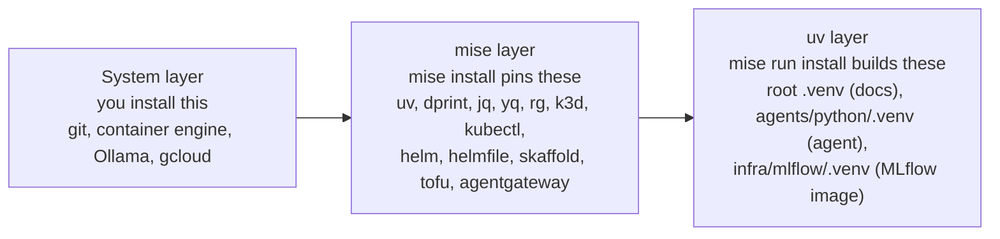

# 1.0. System

!!! abstract "In one glance"

    - **You will:** Install mise, clone the repository, build both Python environments, and get `mise run doctor` passing.
    - **You need:** A Unix-like shell (Linux, macOS, or WSL2) with git and an internet connection.
    - **Time:** about 35 minutes, hands-on.

## What do you need before starting?

You need very little to start: a shell, git, and an internet connection. Everything heavy waits for the chapter that needs it.

- A Unix-like shell on Linux, macOS, or WSL2.
- Git and a working internet connection for the initial clone and dependency/model downloads.
- A container engine only when you reach the gateway wrapper in Chapter 5.
- Disk and memory scale with how far you go. Reading the course, building the docs, and running the deterministic Python tests need very little. Roughly 12 GB of free memory and 20 GB of free disk covers the full local Kubernetes, model, image, and observability path running at once. Treat that as a working estimate for the Chapter 6 and 7 end state you grow into, not a measured floor.
- Basic Python, Git, and terminal familiarity.

Clear the base checkpoint at the end of this page before deciding whether your machine should run the full stack. Add memory and disk only as later chapters actually pull models, images, and a cluster.

## How do you install mise safely?

Install **mise** first: it is the task runner behind every `mise run` command in this course, and it pins each CLI to one exact version. Any course term you do not recognize has a one-line definition in [0.7. Glossary](../0.%20Overview/0.7.%20Glossary.md).

Choose a supported installer from the [mise installation guide](https://mise.jdx.dev/installing-mise.html), then activate it for your shell. The upstream script path is concise but should still be inspected before execution:

```bash
curl -fsSL https://mise.run | less
curl -fsSL https://mise.run | sh
```

For Bash:

```bash
echo 'eval "$(~/.local/bin/mise activate bash)"' >> ~/.bashrc
exec bash
mise --version
```

Use the matching activation command for Zsh or Fish. A package-manager installation is equally valid. Activation matters: without it your shell resolves whatever `kubectl` or `uv` sits earlier on `PATH` instead of the pinned one. Confirm `mise --version` responds before continuing.

## Which operating systems are supported?

Linux is the validated reference environment. macOS and WSL2 are best-effort development environments that use the same shell task vocabulary, with these practical differences:

- On macOS, run an open-source Linux VM/container runtime such as Podman machine or Colima before using Docker-compatible commands.
- On WSL2, keep the repository inside the Linux filesystem for better file-system performance.
- Native Windows PowerShell commands are not maintained by this course.
- `qwen3:4b-instruct` performance varies widely between CPU, Apple Silicon, and Linux GPU setups; no accelerator is required for tests.

If a platform-specific command fails, include `uname -a`, `mise doctor`, the relevant staged doctor output, and the failing command in a documentation issue. Do not infer full platform support from installation success alone.

## Why does the course use mise?

Two learners on slightly different `kubectl` or `uv` builds hit divergent, hard-to-reproduce errors. Reproducibility fails at the toolchain boundary long before it fails in your code.

[mise](https://mise.jdx.dev/) removes that variable by pinning every CLI to one exact version and exposing a single task vocabulary that developers, git hooks (`lefthook.yml`), and CI all call. **lefthook** is the tool behind those hooks: it runs `mise run` tasks before each commit and push.

Nothing runs a floating "latest": the root `mise.toml` `[tools]` table pins every CLI — `uv`, `dprint`, `kubectl`, `helm`, `agentgateway`, and the rest — to a single exact version, never a range. `mise.toml` is the authoritative list; read it there rather than trusting a version repeated in prose.

mise does not install system services. Git, a container engine, Ollama, and `gcloud` are yours to provide; mise manages the pinned CLIs on top, and `uv` (itself pinned by mise) manages the Python environments on top of that. Keeping those three layers distinct explains every check the doctor later runs:



One consequence is worth knowing now: mise will not quietly install a pinned tool that is missing. A task that needs an absent tool fails loudly, and you fix it with an explicit `mise install`.

??? note "Deeper: why does mise refuse to auto-install a missing tool?"

    By default mise will install a missing pinned tool on the fly the first time a task needs it. That convenience hides drift: a hook or CI job would silently repair itself instead of telling you the environment is incomplete. The root `mise.toml` disables it deliberately:

    ```toml
    [settings.task]
    run_auto_install = false # fail fast in hooks instead of silently installing a missing tool
    ```

    So a task that needs an absent tool fails loudly, and you fix it with an explicit `mise install`. This is the same philosophy as the doctor below: a check you cannot pass tells you to finish setup before you start, rather than papering over a gap you will trip on later.

## How do you install the repository toolchain?

Clone the repository, then let mise install the pinned CLIs.

```bash
git clone https://github.com/MLOps-Courses/agentops-open-course.git
cd agentops-open-course
mise install
```

`mise install` reads `mise.toml` and installs the exact CLI versions declared there — nothing more. It does not create the Python environments or install the git hooks; that is the next step. Because auto-install is disabled, running this now is what guarantees later tasks and hooks find every pinned tool instead of failing mid-run.

## How do you install project dependencies?

`mise install` gave you the CLIs. This second command builds what the project itself needs:

```bash
mise run install
```

This is the CLI-to-project step: it builds the locked Python environments and installs the git hooks. It downloads dependencies but does not call a model, start a container or cluster, or create any cloud resource. The next section names exactly what it runs and leaves on disk.

## What does `mise run install` create on disk?

`[tasks.install]` in the root `mise.toml` is five ordered commands, each doing one thing:

1. `uv sync --locked` builds the repo-root `.venv` from the locked lockfile: **Zensical**, the static-site generator that renders this course, and the docs/authoring tooling.
1. `uv sync --directory infra/mlflow --locked` builds `infra/mlflow/.venv` for the self-hosted MLflow server used later in observability.
1. `./scripts/install-helm-diff.sh` installs the Helm `diff` plugin pinned to `3.15.10`, verifying a per-platform SHA-256 checksum before install because that legacy plugin ships no Helm 4 verification metadata.
1. `lefthook install` wires the pre-commit and pre-push hooks into `.git/hooks` so local commits run the same `mise run` tasks as CI.
1. `cd agents/python && mise run install` runs `uv sync --locked` inside the agent subproject, building `agents/python/.venv`.

The result is a two-project layout with two independent Python environments — the root `.venv` for the docs and `agents/python/.venv` for the reference agent — plus a third `infra/mlflow/.venv` used only by the MLflow image.

This is why `scripts/doctor.sh` asserts both `.venv/bin/python` and `agents/python/.venv/bin/python` are executable, and tells you to `run mise run install` if either is missing. The short version: `mise install` gives you the CLIs, `mise run install` gives you the environments.

## Which prerequisite tier should you install?

Run `mise run doctor` now. The other four profiles belong to later chapters, so validate only the tier you are about to use:

```bash
mise run doctor           # base docs/Python path
mise run doctor:model     # adds Ollama and qwen3:4b-instruct
mise run doctor:gateway   # adds the container-backed host gateway
mise run doctor:platform  # adds k3d/kubectl/Helm/Skaffold
mise run doctor:gcp       # optional GCP CLI and ADC path
```

These are independent diagnostics, not one monolithic health check. Reading the course and running the Python tests never require Kubernetes or cloud tooling.

The base doctor deliberately requires only a small set — `git`, `uv`, `dprint`, and the two venvs — so the entry gate is something a first-hour learner can actually pass. A health check you cannot clear before you begin only discourages starting.

Pair the base doctor with `mise run check:core`. That gate validates the course, data, Python, shell, workflow, link, and license contracts without invoking Docker, a model, a cluster, or cloud resources, and the checkpoint at the end of this page runs it.

Two things are for later chapters, not for now:

- The complete maintainer gate, `mise run check`, additionally renders and validates all infrastructure and is required from Chapter 5 onward.
- Run both `doctor:model` and `doctor:gateway` for the complete Chapter 5 host path; add `doctor:platform` or `doctor:gcp` only when those chapters require them.

## What does each doctor profile actually check?

`scripts/doctor.sh` is more than a `command -v` sweep. Every profile runs the same three-stage core, then layers on probes for exactly the external services that tier uses.

Two profiles cover everything this chapter asks of you:

- **base** requires `git`, `uv`, and `dprint`, both venvs, and reports whether an optional `.env` file of local environment variables is present. That is the whole check: no Docker, no model.
- **model** adds `curl`, `jq`, and `ollama`, then probes `http://127.0.0.1:11434/api/tags` and asserts a model name starts with `qwen3:4b-instruct` with `jq -e`, so a running Ollama that has not pulled the model still fails.

Every failure exits non-zero with a one-line remedy, so the doctor doubles as the setup runbook.

??? note "Deeper: the full control flow, and what the gateway, platform, and gcp tiers add"

    ```mermaid
    flowchart TD
        start["mise run doctor:PROFILE"] --> req{"every required<br/>command on PATH?"}
        req -->|no| fail1["print 'missing: NAME'<br/>exit 1: Install the missing prerequisites<br/>for the PROFILE learning path"]
        req -->|yes| venv{"both .venv/bin/python and<br/>agents/python/.venv/bin/python<br/>executable?"}
        venv -->|no| fail2["exit 1: run mise run install"]
        venv -->|yes| ready["print 'PROFILE ready'"]
        ready --> env["report whether optional .env is present"]
        env --> probe["run profile-specific probes"]
        probe --> model["model: GET /api/tags advertises qwen3:4b-instruct"]
        probe --> gw["gateway/platform/gcp: docker info + docker compose version"]
        probe --> plat["platform/gcp: helm-diff 3.15.10 plugin + print kubectl context"]
        probe --> gcp["gcp: active gcloud project + working ADC token"]
    ```

    Concretely, per profile:

    - **gateway** adds `curl`, `docker`, `jq`, and `yq`, checks the gateway wrapper is executable, and requires both `docker info` (daemon reachable) and `docker compose version`.
    - **platform** adds `k3d`, `kubectl`, `helm`, `helmfile`, `skaffold`, `kustomize`, `kubeconform`, `kube-linter`, `rg`, and `agentgateway`, requires the Helm `diff` plugin at exactly `3.15.10`, and prints the current `kubectl` context (flagging anything other than `k3d-local`) without creating a cluster.
    - **gcp** adds `tofu`, `tflint`, and `gcloud` on top of platform, and requires both an active `gcloud` project and a working Application Default Credentials token via `gcloud auth application-default print-access-token`.

## What usually goes wrong on a first install?

The most common first-hour failures are environment, not code:

- **mise installed but not activated.** Your shell keeps resolving an older `kubectl`/`uv` from `PATH`, so tasks either use the wrong binary or fail. Confirm activation with `mise current`; if it is empty, the `mise activate` line is missing from your shell rc or you have not restarted the shell.
- **Confusing `mise install` with `mise run install`.** The first installs the pinned CLIs; the second builds the two venvs and installs the hooks. Run a doctor after only `mise install` and it exits with `run mise run install` because `.venv/bin/python` and `agents/python/.venv/bin/python` do not exist yet.
- **Confusing `mise doctor` with `mise run doctor`.** `mise doctor` is mise's own health check of your mise installation. `mise run doctor` is this repository's task, and it runs `scripts/doctor.sh base` against the course prerequisites. The checkpoint below runs both, because they answer different questions.
- **Running a task from the wrong directory.** The root project and `agents/python` are separate projects with separate `mise.toml` task sets. `mise run install` inside `agents/python` syncs only the agent venv, not the docs venv — run the top-level `mise run install` from the repository root to build both.
- **Expecting a hook to self-heal a missing tool.** With `run_auto_install = false`, a commit whose hook needs an absent pinned tool fails instead of quietly installing it. Run `mise install` to restore the toolchain, then retry.

## What proves this page worked?

```bash
mise doctor            # mise's own health check, not the course doctor
mise current           # mise's own list of the tool versions now active
mise run doctor        # the course doctor: scripts/doctor.sh base
mise run check:core    # the offline course gate
mise run build         # build the static site with Zensical
```

A passing `mise run doctor` prints two lines:

```text
base       ready
env        optional .env is absent
```

Both lines are a pass. If you later create a `.env`, the second line reads `env        .env available to explicit live/config tasks` instead.

Continue when mise reports a healthy installation, the base doctor and core gate pass, and Zensical builds the site without warnings. If any command fails, fix the local toolchain before adding a model, containers, or provider credentials.

**You are done when:**

- `mise current` lists pinned tool versions instead of printing nothing.
- `mise run doctor` prints `base       ready` followed by an `env` line.
- `mise run check:core` finishes with no failing sub-task.
- `mise run build` completes and leaves a `site/` directory.

Continue to [1.1. Python](./1.1.%20Python.md) when `mise run doctor` prints `base       ready` on your own machine.
