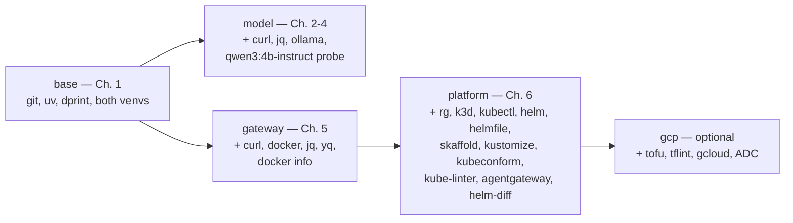

# 1. Setup

!!! abstract "In one glance"

    - **You will:** Prepare the smallest local environment needed for the first agent conversation in Chapter 2.
    - **You need:** A terminal and an internet connection; everything else is installed here.
    - **Time:** about 8 minutes, orientation.

## Which pages do you need now?

Follow four pages now, then defer the infrastructure-specific pages until the course needs them:

- **1.0. System:** clone the repository and install the staged learner toolchain.
- **1.1. Python:** inspect the locked Python project and prove it offline.
- **1.4. Providers:** install Ollama, pull local Qwen3, and pass `doctor:model`.
- **1.5. Workspace:** learn the repository contract and run the core gates.

Skip **1.2. Containers** until Chapter 5 and **1.3. Kubernetes** until Chapter 6. Chapter 2 owns the first live conversation, after this setup is green.

## What will you set up in this chapter?

You install one staged CLI toolchain, two locked Python environments, and the local model used by Chapters 2-4. Docker, Kubernetes, and a cloud account wait until later chapters. Plan about two hours for the four required pages, much of it spent waiting on downloads.

The agent uses one complete development/evaluation venv for simplicity. It includes MLflow client/evaluation libraries and ADK's local-evaluator dependency, while the separate MLflow server environment and platform/cloud CLIs wait for `mise run install:platform`. The runtime image stays lean by installing with `--no-dev`.

When a command in this chapter fails, match the symptom in [0.6. Troubleshooting](../0. Overview/0.6. Troubleshooting.md) or re-run the `doctor` for your tier. New to a term along the way? The [0.7. Glossary](../0. Overview/0.7. Glossary.md) defines every course term and links each back to where it is introduced.

The six pages, in order:

- **[1.0. System](./1.0. System.md)** _(hands-on)_: supported systems, hardware, network needs, and the pinned mise toolchain.
- **[1.1. Python](./1.1. Python.md)** _(hands-on)_: the pinned Python and uv environment, runtime dependencies, and the model-free quality checkpoint.
- **[1.2. Containers](./1.2. Containers.md)** _(hands-on)_: the Docker-compatible runtime the Chapter 5 gateway wrapper needs, and the later agent-image boundary — skip until Chapter 5.
- **[1.3. Kubernetes](./1.3. Kubernetes.md)** _(reference)_: the Chapter 6 platform tools, validated without creating a cluster yet — skip until Chapter 6.
- **[1.4. Providers](./1.4. Providers.md)** _(hands-on)_: local Qwen3 through Ollama by default, or optional native Gemini, configured without leaking credentials.
- **[1.5. Workspace](./1.5. Workspace.md)** _(hands-on)_: the repository, editor-neutral workflow, `AGENTS.md` guidance, git hooks, and your first full validation gate.

## Why are the prerequisites staged instead of installed up front?

An agent platform pulls in heavy, stateful dependencies — a running model server, a container engine, a Kubernetes cluster, a cloud project. Installing and starting all of them before the first lesson wastes time and money and makes failures hard to localize.

Staging keeps the base learning path account-free and free of containers, clusters, and cloud resources. You can finish Chapter 1 and read or build the whole course without Docker, a GPU, a provider key, or k3d.

??? note "Deeper: how the ladder is defined and pinned"

    `scripts/doctor.sh` defines small, scoped profiles, so you pay for a dependency only at the boundary it validates. `mise.toml` still pins every tool for reproducibility, and `run_auto_install = false` makes a missing tool fail fast rather than silently installing it.

## Which tier does each chapter actually require?

`scripts/doctor.sh` takes a profile argument and checks the exact tools that path uses. A **profile** is a scoped prerequisite check, not proof that every other profile passes. Run the doctors named by the chapter you are entering:



- **`mise run doctor` (base):** `git`, `uv`, `dprint`, and both the `.venv` and `agents/python/.venv` Python environments; it also reports whether an optional `.env` is present.
- **`mise run doctor:model` (Chapters 2-4):** the base plus `curl`, `jq`, `ollama`, and a live probe that `qwen3:4b-instruct` is served on the local Ollama endpoint.
- **`mise run doctor:gateway` (Chapter 5):** the base plus `curl`, `docker`, `jq`, `yq`, a `docker info` daemon check, and `docker compose version`.
- **`mise run doctor:platform` (Chapter 6):** the gateway set plus the pinned Kubernetes tools and a `kubectl` context report.
- **`mise run doctor:gcp` (optional lab):** the platform set plus `tofu`, `tflint`, `gcloud`, an active project, and Application Default Credentials — the local Google Cloud login that client libraries pick up automatically.

??? note "Deeper: every tool the platform profile checks"

    Spelled out, the tools it adds to the gateway set are `rg`, `k3d`, `kubectl`, `helm`, `helmfile`, `skaffold`, `kustomize`, `kubeconform`, `kube-linter`, `agentgateway`, and the `helm-diff 3.15.10` plugin. See [`scripts/doctor.sh`](https://github.com/MLOps-Courses/agentops-open-course/blob/main/scripts/doctor.sh).

`mise run check:core` is the model-, container-, cluster-, and cloud-free learner gate you will use. It excludes the separate MLflow server and platform checks. Its `pip-audit` step may use the network for advisory data, so only the test and `eval:validate` suites are accurately called offline. The full `mise run check` is the maintainer gate and needs the later toolchain.

??? note "Deeper: what each of those two gates runs"

    The base learning path's quality gate is `mise run check:core`. It validates the learner-facing docs, data, agent, scripts, skills, and repository conventions without the MLflow or platform toolchains. The full `mise run check` adds maintainer-owned checks for every shipped surface. That distinction has a consequence: contributing a commit exercises the full gate, while a learner who only reads and runs the agent stays on `check:core`.

## What is deliberately not part of this chapter?

Setup installs and probes local Qwen3, but it does not ask the agent a question. Each heavier runtime action arrives at the chapter that teaches it:

- the first local Qwen3 conversation in Chapter 2;
- the Docker-backed gateway in Chapter 5;
- k3d and kagent in Chapter 6;
- the optional GKE lab only if you explicitly choose it.

Even then, `mise run doctor:gcp` and every cloud task stop short of creating a billable resource; the GKE path halts at `tofu plan` unless you later approve it.

## What proves this chapter worked?

You are ready for Chapter 2 when the core environment and local model checks pass. These commands do not start a container or cluster, create cloud resources, or send a prompt:

```bash
mise run doctor         # base prerequisites and learner environments
mise run doctor:model   # Ollama serves qwen3:4b-instruct
mise run format:core    # early source formatting
mise run check:core     # model/container/cluster/cloud-free validation
mise run test           # the Python agent's offline suite
mise run build          # the static site renders from docs/
```

When they are green, [2.1. First Agent](../2.%20Agents/2.1.%20First%20Agent.md) runs the AgentOps Agent on local Qwen3.

**You are done when:**

- `mise run doctor` prints `base       ready`, followed by an `env` line; both `.env available to explicit live/config tasks` and `optional .env is absent` are passes.
- `mise run doctor:model` confirms `qwen3:4b-instruct` is served locally.
- `mise run format:core`, `mise run check:core`, `mise run test`, and `mise run build` each finish without reporting an error.
- You can say which pages you skipped and what brings you back: 1.2. Containers at Chapter 5, 1.3. Kubernetes at Chapter 6.

Continue to [1.0. System](./1.0.%20System.md) when you are ready to install the learner toolchain.
