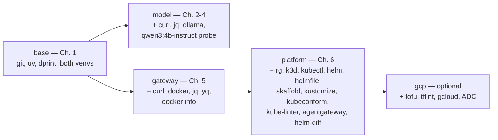

# 1. Setup

!!! abstract "In one glance"

    - **You will:** See what the whole Setup chapter installs, and pick the shortest route to a running agent on your machine.
    - **You need:** A terminal and an internet connection; everything else is installed here.
    - **Time:** about 8 minutes, orientation.

## What is the shortest path to a running agent?

If you only want the local Qwen3 agent talking, this is the whole sequence. It clones the repository, builds the environment, proves it offline, then adds the local model:

```bash
git clone https://github.com/MLOps-Courses/agentops-open-course.git
cd agentops-open-course
mise install         # materialize the pinned CLI toolchain from mise.toml
mise run install     # create the Python virtualenvs and install deps
mise run doctor      # base prerequisites and both venvs present
mise run test        # the Python agent's offline suite (no model needed)

# Local Qwen3 model path (Linux; macOS/Windows use the app installer from ollama.com/download)
curl -fsSL https://ollama.com/install.sh -o /tmp/ollama-install.sh
sh /tmp/ollama-install.sh                        # read the script before you run it
ollama pull qwen3:4b-instruct
mise run doctor:model                            # probes that qwen3:4b-instruct is served

cd agents/python
mise run run                                     # interactive agent on local Qwen3
```

_Local path — skip [1.2. Containers](./1.2. Containers.md) and [1.3. Kubernetes](./1.3. Kubernetes.md) until Chapter 5/6._

## What will you set up in this chapter?

That block is the required path; the rest of this chapter explains each step and what it proves.

You install one toolchain now. Everything heavy — a model, Docker, Kubernetes, a cloud account — waits until the chapter that needs it. Plan about two hours for the four required pages (1.0, 1.1, 1.4, and 1.5), much of it spent waiting on downloads.

When a command in this chapter fails, match the symptom in [0.6. Troubleshooting](../0. Overview/0.6. Troubleshooting.md) or re-run the `doctor` for your tier. New to a term along the way? The [0.7. Glossary](../0. Overview/0.7. Glossary.md) defines every course term and links each back to where it is introduced.

The six pages, in order:

- **[1.0. System](./1.0. System.md)** _(hands-on)_: supported systems, hardware, network needs, and the pinned mise toolchain.
- **[1.1. Python](./1.1. Python.md)** _(hands-on)_: the pinned Python and uv environment, runtime dependencies, and the offline quality checkpoint.
- **[1.2. Containers](./1.2. Containers.md)** _(hands-on)_: the Docker-compatible runtime the Chapter 5 gateway wrapper needs, and the later agent-image boundary — skip until Chapter 5.
- **[1.3. Kubernetes](./1.3. Kubernetes.md)** _(reference)_: the Chapter 6 platform tools, validated without creating a cluster yet — skip until Chapter 6.
- **[1.4. Providers](./1.4. Providers.md)** _(hands-on)_: local Qwen3 through Ollama by default, or optional native Gemini, configured without leaking credentials.
- **[1.5. Workspace](./1.5. Workspace.md)** _(hands-on)_: the repository, editor-neutral workflow, `AGENTS.md` guidance, git hooks, and your first full validation gate.

## Why are the prerequisites staged instead of installed up front?

An agent platform pulls in heavy, stateful dependencies — a running model server, a container engine, a Kubernetes cluster, a cloud project. Installing and starting all of them before the first lesson wastes time and money and makes failures hard to localize.

Staging keeps the base learning path account-free and offline: you can finish Chapter 1 and read or build the whole course without Docker, a GPU, a provider key, or a k3d cluster.

??? note "Deeper: how the ladder is defined and pinned"

    `scripts/doctor.sh` instead defines a small ladder of profiles, each a superset of the last, so you pay for a dependency only at the boundary it validates. `mise.toml` still pins every tool for reproducibility, and `run_auto_install = false` makes a missing tool fail fast in hooks rather than silently installing it.

## Which tier does each chapter actually require?

`scripts/doctor.sh` takes a profile argument and checks the exact tools that stage uses. A **profile** is one tier of prerequisites: each profile is a superset of the one before it. Run the doctor for the chapter you are on:



- **`mise run doctor` (base):** `git`, `uv`, `dprint`, and both the `.venv` and `agents/python/.venv` Python environments; it also reports whether an optional `.env` is present.
- **`mise run doctor:model` (Chapters 2-4):** the base plus `curl`, `jq`, `ollama`, and a live probe that `qwen3:4b-instruct` is served on the local Ollama endpoint.
- **`mise run doctor:gateway` (Chapter 5):** the base plus `curl`, `docker`, `jq`, `yq`, a `docker info` daemon check, and `docker compose version`.
- **`mise run doctor:platform` (Chapter 6):** the gateway set plus the pinned Kubernetes tools and a `kubectl` context report.
- **`mise run doctor:gcp` (optional lab):** the platform set plus `tofu`, `tflint`, `gcloud`, an active project, and Application Default Credentials — the local Google Cloud login that client libraries pick up automatically.

??? note "Deeper: every tool the platform profile checks"

    Spelled out, the tools it adds to the gateway set are `rg`, `k3d`, `kubectl`, `helm`, `helmfile`, `skaffold`, `kustomize`, `kubeconform`, `kube-linter`, `agentgateway`, and the `helm-diff 3.15.10` plugin. See [`scripts/doctor.sh`](https://github.com/MLOps-Courses/agentops-open-course/blob/main/scripts/doctor.sh).

`mise run check:core` is the offline gate you will use. The full `mise run check` adds `check:infra`, which needs the container and Kubernetes tooling from Chapters 5 and 6.

??? note "Deeper: what each of those two gates runs"

    The base learning path's quality gate is `mise run check:core`, which fans out to ten offline sub-tasks (`check:data`, `check:docs`, `check:format`, `check:licenses`, `check:links`, `check:python`, `check:release-metadata`, `check:shell`, `check:skills`, `check:workflows`) and needs no container engine. The full `mise run check` adds only `check:infra` (`scripts/check-infra.sh`), the one part that renders both Kubernetes overlays and touches Docker. That distinction has a consequence: lefthook's pre-commit hook runs the full `mise run check`, so contributing a commit exercises `check:infra`, while a learner who only reads and runs the agent stays on `check:core`.

## What is deliberately not part of this chapter?

Nothing model-, container-, cluster-, or cloud-backed is required to finish Setup. Each of those arrives later, at the chapter that first needs it:

- local Qwen3 through Ollama in Chapters 2-4;
- the Docker runtime in Chapter 5;
- k3d and kagent in Chapter 6;
- the optional GKE lab only if you explicitly choose it.

Even then, `mise run doctor:gcp` and every cloud task stop short of creating a billable resource; the GKE path halts at `tofu plan` unless you later approve it.

## What proves this chapter worked?

You are ready for Chapter 2 when four base-tier commands pass, none of which calls a model, starts a container, or touches a cluster:

```bash
mise run doctor      # base prerequisites and both venvs present
mise run check:core  # offline course validation (ten sub-tasks)
mise run test        # the Python agent's offline suite
mise run build       # the static site renders from docs/
```

When they are green, [Chapter 2](../2. Agents/) runs the AgentOps Agent on local Qwen3 — the point at which `mise run doctor:model` becomes your gate.

**You are done when:**

- `mise run doctor` prints `base       ready`, followed by an `env` line; both `.env available to explicit live/config tasks` and `optional .env is absent` are passes.
- `mise run check:core`, `mise run test`, and `mise run build` each finish without reporting an error.
- You can say which pages you skipped and what brings you back: 1.2. Containers at Chapter 5, 1.3. Kubernetes at Chapter 6.

Continue to [1.0. System](./1.0.%20System.md) when you have picked your path: the local-model route only, or the full container and cluster route.
